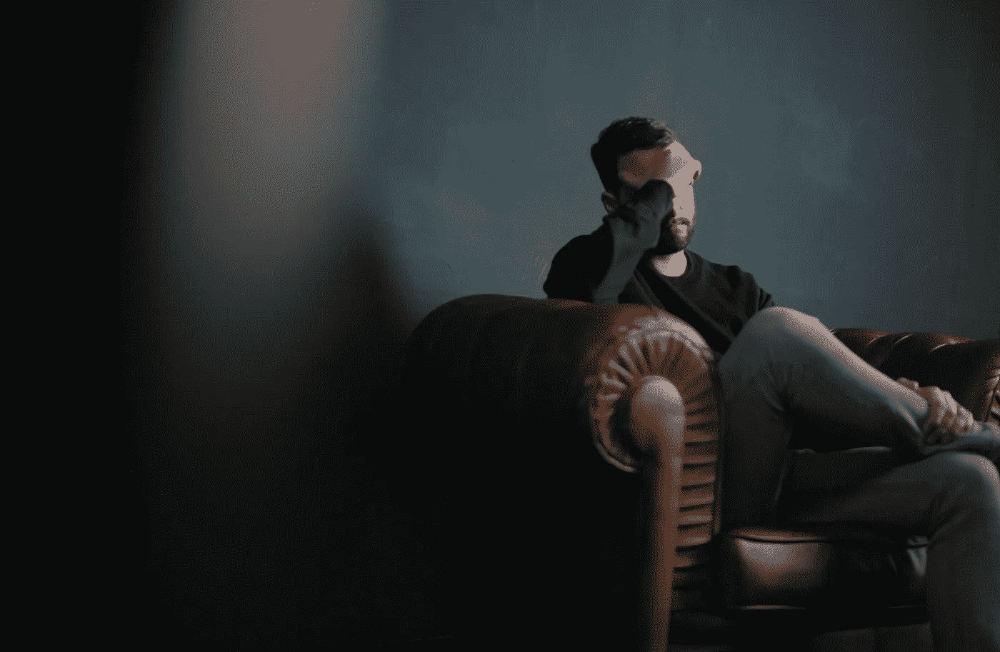

# 以太坊联合创始人泰勒·格林在数字药剂上花了 360 万美元

> 原文：<https://levelup.gitconnected.com/ethereum-co-founder-taylor-gerring-spent-3-6-million-on-digital-potion-a93153454624>

你不能编造，卖家免费收到了。

尼克·舒利亚欣在 [Unsplash](https://unsplash.com/s/photos/worried-face?utm_source=unsplash&utm_medium=referral&utm_content=creditCopyText) 上的照片

即将推出的新技术被称为 NFT，是不可替代令牌的简称，把人们搞糊涂了。

去年，出售这些数字图像赚钱不费吹灰之力。在 2022 年失去这一切甚至更简单。

在 NFT 歇斯底里期间，如果你的投资不能达到最初投资的 10 倍，你会非常不方便。

赚钱很容易。

类似于 2000 年的互联网泡沫，数字资产开始流行。但这一次，比赛场地完全不同。

这一夜之间，数字艺术收藏家追逐影响力，并在社交媒体上向其他人发出信号，表明他们拥有最令人向往的资产。

人们在网上购买图片，你可以点击右键保存。

这些照片卖到了令人厌恶的价格，甚至你经验丰富的加密货币投资者也陷入了疯狂。

人们以虚高的价格购买 NFT，就像购买五彩纸屑一样。

然后市场彻底崩溃，让人们怀疑非功能性食物是否只是一时的流行。

根据 Dune Analytics 的数据，受欢迎的 NFT 市场 [Opensea](https://opensea.io/) 的家禽交易量为 2021 年市场高点的 5.7%。

我们用红色圈出。

来源— [沙丘分析](https://dune.com/rchen8/opensea)

Vitalik Buterin 创建了以太坊区块链，最终将 NFTs 商业化，但他不是唯一创建以太坊的人。

他向 7 个人和几个董事会成员寻求帮助，这些人被认为是以太坊的创始人。

拥有多个联合创始人是一个让 Vitalik Buterin 后悔的决定。他公开提到，联合创始人和创始董事会成员是在匆忙中被召集到一起的。

> 维塔利克·布特林:
> 
> “在小团体中，人们很难紧密协调。你无法确保所有人都在同一架飞机上。”

其他七位联合创始人都不再从事以太坊项目了。

从 2014 年[到 2015 年](https://www.crunchbase.com/person/taylor-gerring)，泰勒·格灵是以太坊基金会的董事会技术总监，所以他没有看到以太坊的推出。

报道称，创始团队的每个成员都得到了分配给[的 29.3 万以太币](https://www.youtube.com/watch?v=njdt0u4pzpQ)，而著名的是，区块链 [Cardano](https://cardano.org/) 的创始人 [Charles Hoskinson](https://en.wikipedia.org/wiki/Charles_Hoskinson) 将他的以太币送给了他的秘书。

> 查尔斯·霍金森:
> 
> "我从未持有任何以太，因为我从未想过以太坊会如此成功."

在写这篇文章的时候，送给他秘书的礼物现在价值 3 . 86 亿美元。

与 2000 年的互联网股票不同，数字资产收藏者现在通过收集最受欢迎的非网络股票来追逐社会影响力。

腰包最鼓的人正在为这种数字表演支付一笔令人厌恶的费用。

目前还不知道处于格林位置的以太坊董事会成员收到了多少钱。

尽管如此，他轻率地购买了一种名为[巨型变异血清](https://opensea.io/assets/ethereum/0x22c36bfdcef207f9c0cc941936eff94d4246d14a/69)的数字药剂，可以让你创建一个罕见的变异猿的数字图像，这可能意味着他有一些多余的 ETH。

在购买时，888 以太坊的拍卖是 NFT 有史以来最多的一次。

来源— [DappRadar](https://dappradar.com/)

更荒谬的是，出售它的人通过空投免费获得了 Mega 血清。

他们收到空投，因为他们拥有一个名为无聊猿游艇俱乐部项目的 NFT。

[无聊猿游艇俱乐部](https://opensea.io/collection/boredapeyachtclub)收集了 10，000 个独特的无聊猿 NFT——生活在以太坊区块链上的独特的数字收藏品。

拥有一个 BAYC 是你的会员卡，并授予进入会员专用的好处。

以下是拥有一辆 BAYC 会给你带来的一些好处。

*   **您的 NFT 的完全商业权利，允许您围绕该品牌创建业务。**
*   BAYC 的持有者被空投了价值几十万美元的猿币
*   **参加引人注目的聚会和活动。**
*   **免费商品**

每位 BAYC 车主都收到了 10，094 枚代币，价值在 8 万至 20 万美元之间。BAYC 将超过 8 亿美元的资产分配给任何持有他们的 NFT 的本地代币 Ape Coin 的人。

## 并非所有人都信服。

比尔·盖茨是数字资产的强烈反对者，他公开表示非数字资产是一个“更大的傻瓜”理论。

当被问及 NFTs 时，他引用了“更大的傻瓜理论”，该理论的前提是你只需要找到一个更大的傻瓜来购买你定价过高的资产。

他还提到，数字资产不像公司那样创造产出，并批评了 BAYC。

> 比尔·盖茨:
> 
> “昂贵的猴子数字图像
> 
> 是的，这将极大地改善世界，”
> 
> 指无聊的猿 NFTs。

# 最后

我本可以在 1.2 以太坊购买 BAYC 你现在能买到的最低价格是 [80 以太坊 107000 美元](https://opensea.io/collection/boredapeyachtclub)

可以说是我一生中最大的财务失误。

以下是我错过的事情。

*   NFT 不仅仅是图像。这些合同是项目背后的人可以随时增加价值的——空投、购物、访问、活动。
*   通过这些好处，它们对人们具有现实世界的价值，而不仅仅是一张照片。
*   NFTs 不能被某人复制或右键单击并保存。
*   社区聚集在 NFT 周围，支持像他们的运动队这样的项目；BAYC 有最强大的社区。

泰勒·格林购买的 Mega 血清是否会在未来几年为他带来任何价值还有待观察。

有一件事是肯定的，那就是非物质财富不会匆匆离开我们。

> 如果你想在 Web3 上阅读更多我的观点，可以考虑成为会员。你的会员费直接支持你读的作家。如果你用我的链接 [*注册，我会赚一小笔佣金，点击这里*](https://medium.com/@jayden_levitt/membership) *。*

*本文仅供参考；不应将其视为财务、税务或法律建议。在做出任何重大财务决定之前，请咨询财务专家。*