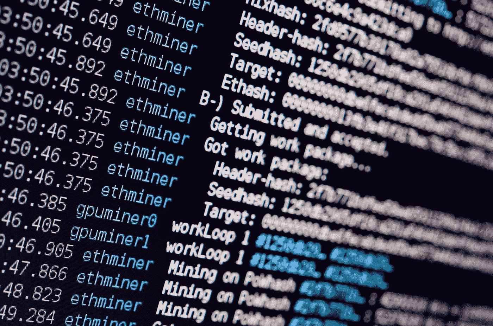
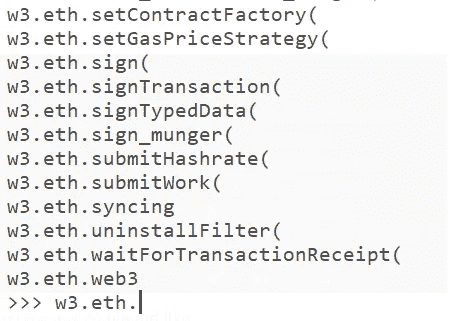
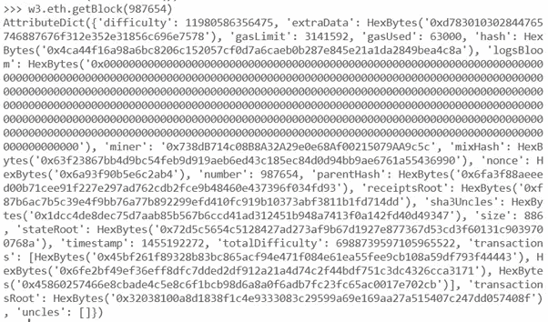
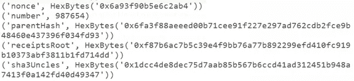

# 以太坊—使用 Python web3 库和 eth 序列化以太坊

> 原文：<https://levelup.gitconnected.com/ethereum-playing-with-python-web3-library-and-eth-serialization-ethereum-676efc8b1346>

## 以太坊节点系列 III —如何使用 Python 和 web3.py 连接到以太坊网络

在这篇文章中，我们将学习如何在你的 Ubuntu 机器上安装 Python，安装 web3 库并连接到以太坊网络。本文假设您已经具备以下条件:

*   运行在 Ubuntu 上的以太坊节点。查看这篇文章，我解释了如何在 Ubuntu AWS 上部署以太坊节点
*   您已经知道了一些使用 Etehreum 网络的命令。查看这篇文章，在那里我谈到了一些[命令来探索以太坊块](/exploring-the-ethereum-block-9fa3a68e42d8)
*   你知道什么是🦄就是！😇

Python 是一种很好的编程语言，可以用来研究区块链和其他技术，如机器学习、人工智能和数据分析。将它作为一种非常容易阅读和理解的通用编程语言放在您的工具包中是一件好事。此外，Python 中有许多 Fintech 应用程序，如果你在这个行业，这非常重要！不，与其他 Python 相反，Python 代码不咬人！这是一种可读性很强的语言，同样，开发区块链应用程序和利用它的 web3 库也很简单。



## 什么是 Web2 和 Web3？

Web2 基本上是我们大多数人现在使用的互联网。集中式互联网通常由大数据中心和大型云提供商托管和控制。Web2 通常由服务器、Web 服务器、集中式 HTTP APIs 和数据库组成。

另一方面，Web3 是去中心化的互联网。越来越多的开发者选择在 Web3 上开发他们的应用程序(以太坊是 Web3 最大的推动者之一),因为它是无权限的，没有人可以阻止或拒绝访问 Web3，它有内置的支付功能(像 ETH 一样),而且因为以太坊是[pip3 install pycryptodome pysha3](/smart-contracts-can-we-just-get-straight-to-the-point-4c904d97630#8)，RSA，DSA 和其他很酷的加密技术:</p><pre class=)

[然后我们安装 Web3 库。Web3 是一个 JavaScript 库，它与以太网区块链交互。它也被称为下一代万维网，它提供了一个分散的网络，允许我们使用 HTTP 和 IPC 连接与其他以太坊节点进行交互。它还支持发送交易、检索用户帐户以及与智能合同进行交互。让我们安装它。](/smart-contracts-can-we-just-get-straight-to-the-point-4c904d97630#8)，RSA，DSA 和其他很酷的加密技术:</p><pre class=)

```
pip3 install web3sudo pip3 install pyethash
```

[我们还需要 pyethash 用于 ethash 算法。这将允许我们生成工作证明](/smart-contracts-can-we-just-get-straight-to-the-point-4c904d97630#8)，RSA，DSA 和其他很酷的加密技术:</p><pre class=)

[现在我们有了所有需要安装的东西，让我们进入以太坊节点路径。以太坊/并运行 python。这里我假设你已经有了一个以太坊节点。如果没有，跳到文章开头。按如下方式键入命令:](/smart-contracts-can-we-just-get-straight-to-the-point-4c904d97630#8)，RSA，DSA 和其他很酷的加密技术:</p><pre class=)

```
cd .ethereum/
```

[然后，键入](/smart-contracts-can-we-just-get-straight-to-the-point-4c904d97630#8)，RSA，DSA 和其他很酷的加密技术:</p><pre class=)

```
python3
```

[欢迎来到 Python3 控制台！让我们导入一些我们需要的工具，从 Web3 的 IPC 提供程序开始。每次退出 Python3，您都必须重复接下来的两个命令。**注意:要完成这项工作，您需要使用之前看到的 geth 命令并行运行以太坊节点。**](/smart-contracts-can-we-just-get-straight-to-the-point-4c904d97630#8)，RSA，DSA 和其他很酷的加密技术:</p><pre class=)

```
from web3 import IPCProvider, Web3
```

[IPC 提供程序将允许您的节点通过 IPC 连接进行连接。以太坊 Geth 也允许 HTTP 和 WebSocket 连接，但是 IPC 应该更安全。](/smart-contracts-can-we-just-get-straight-to-the-point-4c904d97630#8)，RSA，DSA 和其他很酷的加密技术:</p><pre class=)

[一旦这样做了，我们需要确保它的工作，我们可以获取数据。让我们用下面的命令调用一个对象 w3(你可以称它为任何东西)。类型:](/smart-contracts-can-we-just-get-straight-to-the-point-4c904d97630#8)，RSA，DSA 和其他很酷的加密技术:</p><pre class=)

```
w3 = Web3(IPCProvider())
```

[现在，如果你输入，例如， *w3.eth* 。并按 tab 键两次，您将获得命令列表。请注意，这最后两个命令可能需要几秒钟才能生效。](/smart-contracts-can-we-just-get-straight-to-the-point-4c904d97630#8)，RSA，DSA 和其他很酷的加密技术:</p><pre class=)

[](/smart-contracts-can-we-just-get-straight-to-the-point-4c904d97630#8)，RSA，DSA 和其他很酷的加密技术:</p><pre class=)

[几秒钟后(有时您可能需要等待一分钟让它连接上)，您也应该能够键入任何命令，如](/smart-contracts-can-we-just-get-straight-to-the-point-4c904d97630#8)，RSA，DSA 和其他很酷的加密技术:</p><pre class=)

```
w3.eth.getBlock(987654)
```

[得到我们之前看到的相同的块，但是是原始格式:](/smart-contracts-can-we-just-get-straight-to-the-point-4c904d97630#8)，RSA，DSA 和其他很酷的加密技术:</p><pre class=)

[](/smart-contracts-can-we-just-get-straight-to-the-point-4c904d97630#8)，RSA，DSA 和其他很酷的加密技术:</p><pre class=)

[这与我们在之前看到的](/smart-contracts-can-we-just-get-straight-to-the-point-4c904d97630#8)，RSA，DSA 和其他很酷的加密技术:</p><pre class=)[完全相同，但是可读性稍差一些。这是原始的狗数据。酷吧？🚀🏴‍☠️🚀](/exploring-the-ethereum-block-9fa3a68e42d8)

现实情况是，这些原始数据并不容易阅读，但是如果我们要找一个特定的数据，我们可以要求:

在这里，您可以看到一些示例，其中，如果您正在寻找块的难度、随机数或挖掘器，您可以分别键入以下命令:

```
w3.eth.getBlock(987654)[“difficulty”]w3.eth.getBlock(987654)[“nonce”]w3.eth.getBlock(987654)[“miner”]
```

提高 raw 块可读性的另一个方法是将每个值分隔在不同的行中。

我们可以通过以下方式实现这一目标:

```
myBlock = w3.eth.getBlock(987654)print(*myBlock.items(), sep=’\n’)
```

现在更明白了！🤟🏻💖



我在这里只展示了一部分，因为你已经看到了剩下的部分。🦄

我希望你喜欢它！下一篇文章，我们继续玩 python，用 Python 脚本计算以太坊难度！敬请关注！

**🚀关注我，也请查看我的🧱区块链课程:**

**🐶** [**有史以来第一次 Dogecoin 课程**](https://www.udemy.com/course/-dogecoin-course-the-first-complete-dogecoin-course/?referralCode=9416B1408224CE309DD8)

**👨‍🎓** [**Fintech、云和网络安全课程**](https://www.udemy.com/course/fintech-technologies-cloud-and-cybersecurity/?referralCode=F1D4EA005A2881735A36)

**📖**[](https://www.amazon.com/dp/B091CYTX37/ref=sr_1_1?dchild=1&keywords=unblockchain&qid=1617186443&s=digital-text&sr=1-1)**[**完整的 NFTs 教程**](https://www.udemy.com/course/the-complete-nft-course-learn-everything-about-nfts/?referralCode=AAEE908D13D0E2276B19)**

****👨‍🎓** [**Unblockchain 课程**](https://www.udemy.com/course/blockchain-deep-dive-from-bitcoin-to-ethereum-to-crypto/?referralCode=B8463EE382E6D313304B) **—脑洞大开的区块链课程****