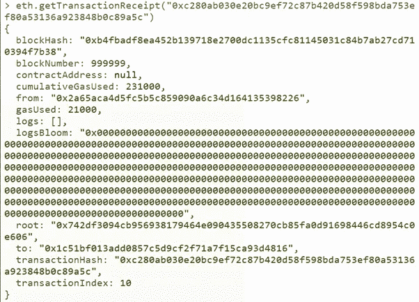
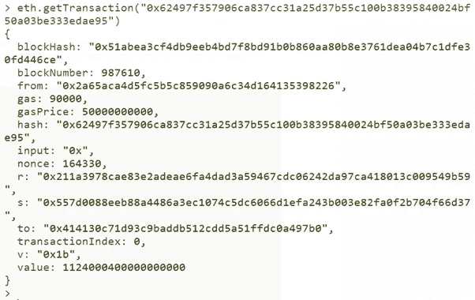
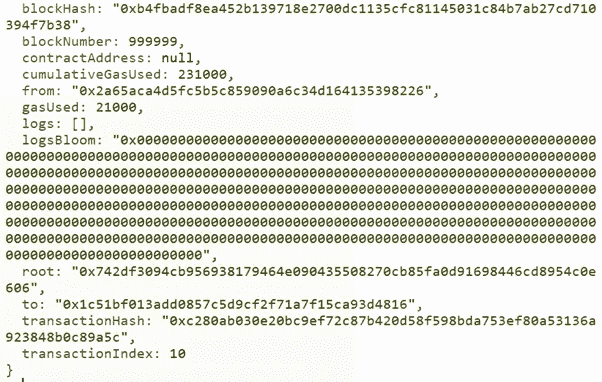

# 以太坊交易收据、日志和交易详情

> 原文：<https://levelup.gitconnected.com/ethereum-transactions-receipts-logs-and-transaction-details-e3d799eaf913>

## 以太坊节点系列 V —如何获得以太坊交易收据、日志 bloom 和交易细节

在本文中，我将假设您阅读了我在 Geth 以太坊节点上的其他文章，并且您已经有一台运行以太坊 Geth 的 Ubuntu 机器。如果没有，请回到我的其他文章，找到如何部署和连接以太坊节点:

*   运行在 Ubuntu 上的以太坊节点。查看这篇文章，我解释了如何在 Ubuntu AWS 上部署以太坊节点
*   您已经知道了一些使用 Etehreum 网络的命令。查看这篇文章，在那里我谈到了一些[命令来探索以太坊块](/exploring-the-ethereum-block-9fa3a68e42d8)
*   另外，请养一只小狗🐶🤩

让我们回顾一下 Geth 上的一些附加功能，从交易收据开始。


假设您在安装了 geth 的 Ubuntu 机器上，通过键入以下命令打开 Geth 控制台:

```
geth attach
```

哦，别忘了，要做到这一点，你需要运行节点，也就是说，你的以太坊节点至少需要同步。如果需要，查看:[如何在 Ubuntu AWS 上部署以太坊节点](/deploying-an-ethereum-node-on-aws-cloud-512a861026e2)寻求帮助。

好吧。一旦运行 *geth attach* ，函数:

```
eth.getTransactionReceipt()
```

例如，您可以添加一个事务哈希:

```
eth.getTransactionReceipt(“0xc280ab030e20bc9ef72c87b420d58f598bda753ef80a53136a923848b0c89a5c”) 
```

会给我们更多的交易信息。为了从任何交易中检索交易收据，我们需要它的散列。



在一张交易收据中，我们可以看到很多有用的信息！

*   该事务所属的块号(即包含该事务的块的高度)
*   blockHash 是块的哈希(显然！)
*   与该事务关联的合同。在这种情况下，它为空，因为交易不涉及合同
*   gasUsed 是 21000，这是支付给矿工处理交易的费用。使用的气体以 Gwei 计量，Gwei 等于 0.000000001 乙醚。同样，1 个以太等于 1 000 000 000 Gwei。
*   root 是事务时根状态的根哈希。这就像是整个区块链直到那一刻的混乱
*   最后，我们还有 transactionHash，它显然是这个事务的散列。咄！

# 日志和交易详细信息

现在让我们从以太坊交易中检索更多的细节！我们可以查看所有细节，例如块散列、块编号、发送方和接收方(from 和 to)、gas，以及任何给定事务的更多信息，只需使用事务散列和命令

```
eth.getTransaction()
```



如果我们检索同一个事务的 transactionReceipt，我们将获得额外的信息:日志和 logsBloom。

让我们使用下面的命令来检查 transactionReceipt(再次):

```
eth.getTransactionReceipt()
```



好吧，但是…什么是 logsBloom？？？

logsBloom 是一个 256 字节的字符串，它并不是传统意义上的日志。它是块日志的布隆过滤器，允许过滤块中每个元素的散列。目标是通过存储一些事件(如 bloom 中的历史事务)来最小化客户端需要进行的查询的数量。当有一个查询“数据 *z* 在集合中吗？”回答可以是“也许”，也可以是“不”。这是一种概率数据结构。

现在我们可以在交易收据中看到，有一个名为 logs 的字段与 logsBloom 直接相关。logsBloom 就像是日志的搜索字段。

地址是日志中生成事务的地址，它可以是某人的地址，也可以是智能合同。然后我们有 blockHash，它只是这个事务所属的块的散列。我们还有 blockNumber，也是来自事务所属的块。然后我们有现场数据和主题，可在 logsBloom 中搜索，并显示一些信息，如这是什么类型的事件，这是 ERC20 标准的一部分。因此，字段数据是以太坊 EIP20 引入的以下事件类型之一的规范签名:

```
function transfer(address _to, uint256 _value) public returns (bool success)function transferFrom(address _from, address _to, uint256 _value) public returns (bool success)function approve(address _spender, uint256 _value) public returns (bool success)
```

这个 256 字节是一个布隆过滤器，这意味着它是一个概率数据结构，它告诉你某个集合是否不存在，或者它可能存在。logsBloom 允许简化搜索查询，减少执行查询或搜索时节点需要做的工作量。例如，如果我正在搜索该事务是否属于块 4344444，logsBloom 已经可以告诉我们该事务是否属于该块，或者它是否可能属于该块，然后检查 logs 字段。这种方法减少了完成搜索所需的计算能力。

好吧，好吧，我知道这不是有史以来最有趣的话题，但总得有人写出来！🦄

**🚀请关注我，也请查看我的🧱区块链课程:**

**🐶** [**有史以来第一次 Dogecoin 课程**](https://www.udemy.com/course/-dogecoin-course-the-first-complete-dogecoin-course/?referralCode=9416B1408224CE309DD8)

**👨‍🎓** [**金融科技、云和网络安全课程**](https://www.udemy.com/course/fintech-technologies-cloud-and-cybersecurity/?referralCode=F1D4EA005A2881735A36)

**📖** [](https://www.amazon.com/dp/B091CYTX37/ref=sr_1_1?dchild=1&keywords=unblockchain&qid=1617186443&s=digital-text&sr=1-1)[**完整的 NFTs 教程**](https://www.udemy.com/course/the-complete-nft-course-learn-everything-about-nfts/?referralCode=AAEE908D13D0E2276B19)

**👨‍🎓** [**Unblockchain 课程**](https://www.udemy.com/course/blockchain-deep-dive-from-bitcoin-to-ethereum-to-crypto/?referralCode=B8463EE382E6D313304B) **—脑洞大开的区块链课程**