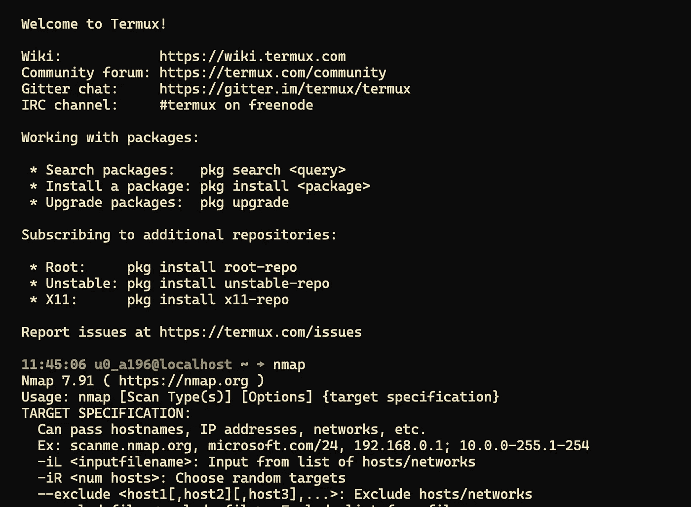
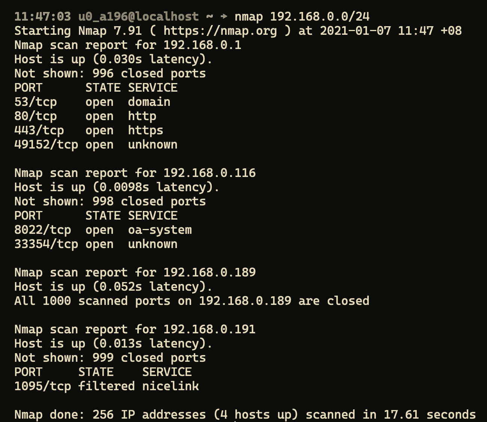
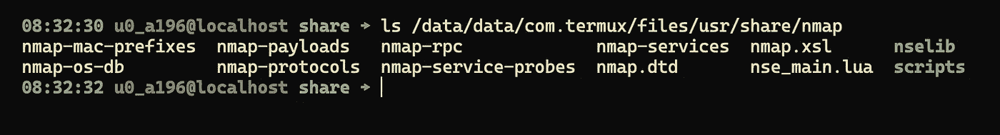

# Android 上的道德黑客——网络扫描和映射

> 原文：<https://levelup.gitconnected.com/ethical-hacking-on-android-network-scanning-and-mapping-ae7b6ed5e663>


照片由 [NASA](https://unsplash.com/@nasa?utm_source=unsplash&utm_medium=referral&utm_content=creditCopyText) 在 [Unsplash](https://unsplash.com/s/photos/network-map?utm_source=unsplash&utm_medium=referral&utm_content=creditCopyText) 上拍摄

# 概观

在我以前的文章中，我谈到了使用 Termux 在 Android 设备上设置[开发](https://medium.com/swlh/a-guide-to-setting-up-a-development-environment-on-android-devices-ee3e20923f5c)和[道德黑客](https://alpha2phi.medium.com/ethical-hacking-using-android-devices-4cc77901f9d3)环境，让我们继续享受使用 Android 设备使用 Nmap 执行网络扫描和映射的乐趣。

[](https://medium.com/swlh/a-guide-to-setting-up-a-development-environment-on-android-devices-ee3e20923f5c) [## 在 Android 设备上设置开发环境的指南

### 概观

medium.com](https://medium.com/swlh/a-guide-to-setting-up-a-development-environment-on-android-devices-ee3e20923f5c) [](https://alpha2phi.medium.com/ethical-hacking-using-android-devices-4cc77901f9d3) [## 使用安卓设备的道德黑客

### 概观

alpha2phi.medium.com](https://alpha2phi.medium.com/ethical-hacking-using-android-devices-4cc77901f9d3) 

# Nmap

[Nmap](https://nmap.org/) (“网络映射器”)是一个免费的开源工具，用于网络发现和安全审计。如果你遵循了前面的文章，那么现在你应该已经在设备中安装了`nmap`。为了便于说明，我将 ssh 连接到我的 Android 手机并展示它的用法。



Termux 上的 Nmap

# 扫描本地网络

做一个`ifconfig`检查你的本地网络。在我的例子中是 192.168.0.0/24(网络掩码 255.255.255.0)。



使用 Nmap 的本地网络扫描

`192.168.0.1`是本地网络中的网关，我可以看到 DNS (53)、HTTP (80)和 HTTPS (443)的开放端口。

我还可以在不检查任何开放端口的情况下运行快速扫描

```
01:41:05 u0_a196@localhost ~ → **nmap -sn 192.168.0.0/24**
Starting Nmap 7.91 ( [https://nmap.org](https://nmap.org) ) at 2021-01-07 13:41 +08
Nmap scan report for 192.168.0.1
Host is up (0.021s latency).
Nmap scan report for 192.168.0.111
Host is up (0.072s latency).
Nmap scan report for 192.168.0.116
Host is up (0.017s latency).
Nmap scan report for 192.168.0.189
Host is up (0.087s latency).
Nmap scan report for 192.168.0.191
Host is up (0.11s latency).
```

# 扫描特定服务

例如使用完全开放扫描(TCP 连接)来扫描网络中的 web 服务器。

```
10:19:48 u0_a196@localhost scripts → **nmap -sT -p80,443 192.168.0.0/24**Starting Nmap 7.91 ( [https://nmap.org](https://nmap.org) ) at 2021-01-08 10:21 +08
Nmap scan report for **192.168.0.1**
Host is up (0.018s latency).**PORT    STATE SERVICE
80/tcp  open  http
443/tcp open  https**Nmap scan report for 192.168.0.111
Host is up (0.079s latency).PORT    STATE  SERVICE
80/tcp  closed http
443/tcp closed httpsNmap scan report for 192.168.0.116
Host is up (0.012s latency).PORT    STATE  SERVICE
80/tcp  closed http
443/tcp closed httpsNmap scan report for 192.168.0.189
Host is up (0.36s latency).PORT    STATE  SERVICE
80/tcp  closed http
443/tcp closed httpsNmap scan report for 192.168.0.191
Host is up (0.092s latency).PORT    STATE  SERVICE
80/tcp  closed http
443/tcp closed httpsNmap done: 256 IP addresses (5 hosts up) scanned in 91.71 seconds
```

对于秘密扫描，您可以使用`-sS`开关，但这需要设备是根设备。我将在另一篇文章中介绍寻根和黑客技术。

要进行更彻底的扫描，如版本检测、脚本扫描和 traceroute，请使用以下命令。

```
05:30:53 u0_a196@localhost ~ → **nmap -A 192.168.0.1```
| ssl-cert: Subject: commonName=General Root CA/organizationName=D-Link Corporation/stateOrProvinceName=Taiwan/countryName=TW
| Not valid before: 2018-05-22T23:00:01
|_Not valid after:  2037-11-05T23:00:01
49152/tcp open  unknown
| fingerprint-strings:
|   FourOhFourRequest:
|     HTTP/1.1 404 Not Found
|     Server: WebServer
|     Date: Fri, 08 Jan 2021 09:31:04 GMT
|     Content-Type: text/html
|     Content-Length: 110
|     <title>404 Not Found</title>
|     <h1>404 Not Found</h1>
|     resource requested could not be found on this server.
|   GetRequest:
|     HTTP/1.1 404 Not Found
|     Server: WebServer
|     Date: Fri, 08 Jan 2021 09:31:09 GMT
|     Content-Type: text/html
|     Content-Length: 110
|     <title>404 Not Found</title>
|     <h1>404 Not Found</h1>
|     resource requested could not be found on this server.
|   HTTPOptions:
|     HTTP/1.1 501 Not Implemented
|     Server: WebServer
|     Date: Fri, 08 Jan 2021 09:31:09 GMT
|     Content-Type: text/html
|     Content-Length: 127
|     <title>501 Not Implemented</title>
|     <h1>501 Not Implemented</h1>
```

# 秘密扫描目标

先安装`dnsutils`。

```
# pkg install dnsutils
```

检查目标信息。对于下面捕获的信息，敏感信息被删除，您需要用您的目标替换域名。

```
11:42:45 u0_a196@localhost ~ → host **<domain name>** 8.8.8.8
Using domain server:
Name: 8.8.8.8
Address: 8.8.8.8#53
Aliases:<domain name> has address 1.2.3.4
<domain name> has address 2.3.4.5
<domain name> has address 5.6.7.8
<domain name> mail is handled by 20 abc.com.
<domain name> mail is handled by 10 xyz.com.
```

有了这些信息，我就可以进行秘密扫描。

```
08:16:52 u0_a196@localhost ~ → nmap --dns-servers 8.8.4.4,8.8.8.8 -sL <IP address>/24
```


目标上的隐藏列表扫描

# Nmap 脚本引擎

[Nmap 脚本引擎](https://nmap.org/book/man-nse.html) (NSE)是 Nmap 最强大、最灵活的特性之一。它允许用户编写(和共享)简单的脚本(使用 [Lua 编程语言](http://lua.org/))来自动化各种各样的网络任务。这些脚本以您期望从 Nmap 获得的速度和效率并行执行。用户可以依赖 Nmap 发布的不断增长的各种脚本，或者自己编写脚本来满足自定义需求。

NSE 脚本位于`/usr/share/nmap`下的`scripts`文件夹中。

```
# ls /data/data/com.termux/files/usr/share/nmap
```



Termux 中的 NSE 脚本

例如在目标上运行漏洞扫描

```
# nmap -Pn -sV --script=vulners XXX.XXX.XXX.XXX
```


漏洞扫描

# 果兰的 Nmap

还有 Nmap 的 [Golang 库](https://github.com/Ullaakut/nmap)可以探索。