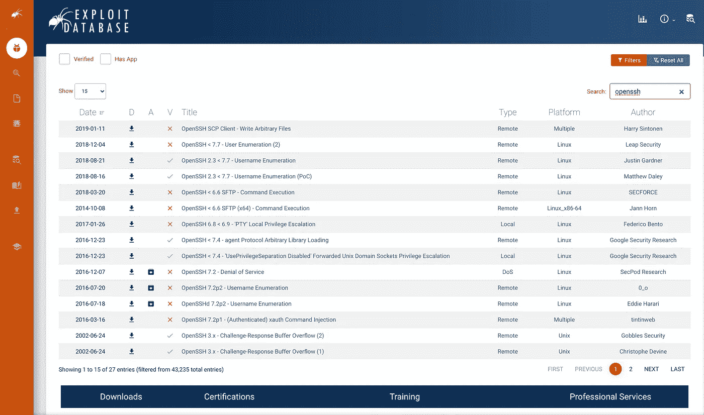

# 传输数据和远程控制

> 原文：<https://levelup.gitconnected.com/ethical-hacking-part-15-netcat-nc-and-netcat-f6a8f7df43fd>

## 使用 Netcat、Nc 和 Ncat 传输数据或远程控制系统


[Netcat](http://netcat.sourceforge.net/) 或缩写 [Nc](http://netcat.sourceforge.net/) 由“霍比特人”于 1995 年 10 月开发，被官方认为是网络管理工具。然而，它对道德黑客和渗透测试非常有帮助。它可以在所有 Linux 和 macOS 操作系统上使用。我相信也有运行在 Windows 上的非官方版本。

然而 [Ncat](https://nmap.org/ncat/) 并不等同于 [Netcat](http://netcat.sourceforge.net/) 或 [Nc](http://netcat.sourceforge.net/) 。这确实造成了很多混乱。它基于 Netcat，但是被 Nmap 项目开发成一个更加复杂的工具。

这就是 [Netcat](http://netcat.sourceforge.net/) 帮助的样子…

```
kali@kali:~$ **nc -h**
[v1.10-46]
connect to somewhere: nc [-options] hostname port[s] [ports] ... 
listen for inbound: nc -l -p port [-options] [hostname] [port]
options:
 -c shell commands as `-e'; use /bin/sh to exec [dangerous!!]
 -e filename  program to exec after connect [dangerous!!]
 -b   allow broadcasts
 -g gateway  source-routing hop point[s], up to 8
 -G num   source-routing pointer: 4, 8, 12, ...
 -h   this cruft
 -i secs   delay interval for lines sent, ports scanned
        -k                      set keepalive option on socket
 -l   listen mode, for inbound connects
 -n   numeric-only IP addresses, no DNS
 -o file   hex dump of traffic
 -p port   local port number
 -r   randomize local and remote ports
 -q secs   quit after EOF on stdin and delay of secs
 -s addr   local source address
 -T tos   set Type Of Service
 -t   answer TELNET negotiation
 -u   UDP mode
 -v   verbose [use twice to be more verbose]
 -w secs   timeout for connects and final net reads
 -C   Send CRLF as line-ending
 -z   zero-I/O mode [used for scanning]
port numbers can be individual or ranges: lo-hi [inclusive];
hyphens in port names must be backslash escaped (e.g. 'ftp\-data').
kali@kali:~$
```

与 [Ncat](https://nmap.org/ncat/) help 的样子相比…

```
kali@kali:~$ ncat -h
Ncat 7.91 ( [https://nmap.org/ncat](https://nmap.org/ncat) )
Usage: ncat [options] [hostname] [port]Options taking a time assume seconds. Append 'ms' for milliseconds,
's' for seconds, 'm' for minutes, or 'h' for hours (e.g. 500ms).
  -4                         Use IPv4 only
  -6                         Use IPv6 only
  -U, --unixsock             Use Unix domain sockets only
      --vsock                Use vsock sockets only
  -C, --crlf                 Use CRLF for EOL sequence
  -c, --sh-exec <command>    Executes the given command via /bin/sh
  -e, --exec <command>       Executes the given command
      --lua-exec <filename>  Executes the given Lua script
  -g hop1[,hop2,...]         Loose source routing hop points (8 max)
  -G <n>                     Loose source routing hop pointer (4, 8, 12, ...)
  -m, --max-conns <n>        Maximum <n> simultaneous connections
  -h, --help                 Display this help screen
  -d, --delay <time>         Wait between read/writes
  -o, --output <filename>    Dump session data to a file
  -x, --hex-dump <filename>  Dump session data as hex to a file
  -i, --idle-timeout <time>  Idle read/write timeout
  -p, --source-port port     Specify source port to use
  -s, --source addr          Specify source address to use (doesn't affect -l)
  -l, --listen               Bind and listen for incoming connections
  -k, --keep-open            Accept multiple connections in listen mode
  -n, --nodns                Do not resolve hostnames via DNS
  -t, --telnet               Answer Telnet negotiations
  -u, --udp                  Use UDP instead of default TCP
      --sctp                 Use SCTP instead of default TCP
  -v, --verbose              Set verbosity level (can be used several times)
  -w, --wait <time>          Connect timeout
  -z                         Zero-I/O mode, report connection status only
      --append-output        Append rather than clobber specified output files
      --send-only            Only send data, ignoring received; quit on EOF
      --recv-only            Only receive data, never send anything
      --no-shutdown          Continue half-duplex when receiving EOF on stdin
      --allow                Allow only given hosts to connect to Ncat
      --allowfile            A file of hosts allowed to connect to Ncat
      --deny                 Deny given hosts from connecting to Ncat
      --denyfile             A file of hosts denied from connecting to Ncat
      --broker               Enable Ncat's connection brokering mode
      --chat                 Start a simple Ncat chat server
      --proxy <addr[:port]>  Specify address of host to proxy through
      --proxy-type <type>    Specify proxy type ("http", "socks4", "socks5")
      --proxy-auth <auth>    Authenticate with HTTP or SOCKS proxy server
      --proxy-dns <type>     Specify where to resolve proxy destination
      --ssl                  Connect or listen with SSL
      --ssl-cert             Specify SSL certificate file (PEM) for listening
      --ssl-key              Specify SSL private key (PEM) for listening
      --ssl-verify           Verify trust and domain name of certificates
      --ssl-trustfile        PEM file containing trusted SSL certificates
      --ssl-ciphers          Cipherlist containing SSL ciphers to use
      --ssl-servername       Request distinct server name (SNI)
      --ssl-alpn             ALPN protocol list to use
      --version              Display Ncat's version information and exitSee the ncat(1) manpage for full options, descriptions and usage examples
```

你可以看到它们很相似，但是 [Ncat](https://nmap.org/ncat/) 有更多的功能。

在我的另一篇文章“道德黑客(第八部分):漏洞分析”中，我介绍了 NMAP，它经常被用于端口扫描。Netcat 也可以用于端口扫描，速度非常快。

这就是从端口 20–25 扫描主机 192.168.1.2 的方式。正如您所看到的，在我的 Kali linux 实例上检测到 SSH 是打开的。我在我的 Mac 上进行了这次扫描。

```
% **nc -zv 192.168.1.2 20-25**
nc: connectx to 192.168.1.2 port 20 (tcp) failed: Connection refused
nc: connectx to 192.168.1.2 port 21 (tcp) failed: Connection refused
Connection to 192.168.1.2 port 22 [tcp/ssh] succeeded!
nc: connectx to 192.168.1.2 port 23 (tcp) failed: Connection refused
nc: connectx to 192.168.1.2 port 24 (tcp) failed: Connection refused
nc: connectx to 192.168.1.2 port 25 (tcp) failed: Connection refused
```

## 抢横幅

我们可以看到 TCP 22 (SSH)在我的 Kali 实例上是打开的。我们现在要做的是找出那个 SSH 服务器使用的是什么服务和版本。这是通过名为“**横幅抓取**”的过程完成的。

```
% **nc -nv 192.168.1.2 22**
Connection to 192.168.1.2 port 22 [tcp/*] succeeded!
SSH-2.0-OpenSSH_8.3p1 Debian-1
```

如您所见，在我的 Kali linux 实例上运行的 SSH 服务器是 SSH-2.0-OpenSSH_8.3p1。这对我们很有用，因为我们可以在[漏洞数据库](https://www.exploit-db.com/)中查找它，看看是否有任何已知的漏洞。我查了一下“ **openssh 8.3** ，没有已知的漏洞。如果你在它的开启上寻找“ **openssh** ”，相反你可以看到许多已知的漏洞。



就网络安全和强化网络而言，这就是为什么如果可以的话，禁用服务横幅总是一个好主意。默认情况下，大多数(如果不是全部)服务将显示横幅，但许多服务允许您在配置中关闭它。

您可能已经注意到，当您运行标题抓取命令时，该命令没有退出。这是因为它已经打开了到允许您发送数据的服务的连接。为了演示这一点，我在 TCP 80 上的 Kali linux 实例上安装并启动了 Apache 2。

```
% **nc -nv 192.168.1.2 80**
Connection to 192.168.1.2 port 80 [tcp/*] succeeded!
```

好消息是没有横幅，所以 Apache 正在做开箱即用的正确事情。您还会注意到它现在正在等待输入。

让我们试着发送一些东西…

```
% **nc -nv 192.168.1.2 80**
Connection to 192.168.1.2 port 80 [tcp/*] succeeded!
**GET / HTTP/1.1**
HTTP/1.1 400 Bad Request
Date: Sat, 07 Nov 2020 13:19:45 GMT
Server: Apache/2.4.46 (Debian)
Content-Length: 311
Connection: close
Content-Type: text/html; charset=iso-8859-1<!DOCTYPE HTML PUBLIC "-//IETF//DTD HTML 2.0//EN">
<html><head>
<title>400 Bad Request</title>
</head><body>
<h1>Bad Request</h1>
<p>Your browser sent a request that this server could not understand.<br />
</p>
<hr>
<address>Apache/2.4.46 (Debian) Server at kali.security.local Port 80</address>
</body></html>
```

我发送了“ **GET / HTTP/1.1** ”，得到了服务器的 HTTP 响应。有趣的是，虽然没有显示横幅，但我仍然可以在响应中看到版本“**Apache/2 . 4 . 46(Debian)Server**”。

如果目标系统在 TCP 25 上运行 SMTP 服务器，并且配置不当，您可能会从该系统发送未经请求的电子邮件。

也许是这样的…

```
HELO mail
MAIL FROM: <attacker@somedomain.com>
RCPT TO: <victim@anotherdomain.com>
Subject: This is a test
Data
This is a test
.
```

您还可以尝试向各种服务发送一些诊断命令，看看是否能得到有用的响应。例如，你可以尝试发送“ **HELP** ”，看看你会得到什么样的回应。

## 简单聊天服务器

您还可以使用 Netcat 创建一个服务器来监听特定的端口。例如，这就是如何在 TCP 端口 3000 上使用 Netcat 创建服务器。您可以监听当前未使用的任何端口。

```
kali@kali:~$ **nc -lvp 3000**
Ncat: Version 7.91 ( [https://nmap.org/ncat](https://nmap.org/ncat) )
Ncat: Listening on :::3000
Ncat: Listening on 0.0.0.0:3000
```

我现在将使用前面相同的方法从我的 Mac 连接到 Kali 实例。

```
% **nc -nv 192.168.1.2 3000**
Connection to 192.168.1.2 port 3000 [tcp/*] succeeded!
```

我现在可以看到我们已经连接到服务器上了。

```
kali@kali:~$ **nc -lvp 3000**
Ncat: Version 7.91 ( [https://nmap.org/ncat](https://nmap.org/ncat) )
Ncat: Listening on :::3000
Ncat: Listening on 0.0.0.0:3000
**Ncat: Connection from 192.168.1.1.
Ncat: Connection from 192.168.1.1:54385.**
```

我们现在有了客户端和服务器之间的双向通信，如从客户端到服务器所演示的。

```
% **nc -nv 192.168.1.2 3000**
Connection to 192.168.1.2 port 3000 [tcp/*] succeeded!
**Is anyone there?**kali@kali:~$ **nc -lvp 3000**
Ncat: Version 7.91 ( [https://nmap.org/ncat](https://nmap.org/ncat) )
Ncat: Listening on :::3000
Ncat: Listening on 0.0.0.0:3000
Ncat: Connection from 192.168.1.1.
Ncat: Connection from 192.168.1.1:54385.
**Is anyone there?**
```

我们也可以从服务器向客户端演示这一点。

```
kali@kali:~$ **nc -lvp 3000**
Ncat: Version 7.91 ( [https://nmap.org/ncat](https://nmap.org/ncat) )
Ncat: Listening on :::3000
Ncat: Listening on 0.0.0.0:3000
Ncat: Connection from 192.168.1.1.
Ncat: Connection from 192.168.1.1:54385.
Is anyone there?
**Yes, it's me**% **nc -nv 192.168.1.2 3000**
Connection to 192.168.1.2 port 3000 [tcp/*] succeeded!
Is anyone there?
**Yes, it's me**
```

这可以用来在网络上的两个管理员之间建立一个快速聊天服务器。

当我们创建我们的服务器时，我们也可以执行一个命令，例如一个 shell。在 Linux 上你可以使用“ **/bin/sh** ”，或者在 Windows 上你可以使用“**cmd.exe**”。让我们来看看这是怎么回事…

```
kali@kali:~$ **nc -lvp 3000 -e /bin/sh**
Ncat: Version 7.91 ( [https://nmap.org/ncat](https://nmap.org/ncat) )
Ncat: Listening on :::3000
Ncat: Listening on 0.0.0.0:3000
```

并与我们的客户建立联系…

```
% **nc 192.168.1.2 3000**
**whoami**
kali
**cd /etc**
**ls -la | wc -l**
292
```

如你所见，我执行了“ **whoami** ”并收到了我的卡利用户名“**卡利**”。我把目录改成，“ **/etc** ”，统计文件和目录。在这种情况下有 292 个项目。这非常强大，但也非常危险，所以在尝试时要小心。这就像通过 SSH 或 Telnet 向系统提供一个 shell，但是没有提示。

## 传输文件

Netcat 的另一个极其强大的特性是能够通过 Netcat 传输文件。这是攻击者从目标系统获取文件的典型方式。一般来说，良好的安全实践是不要在您的任何系统上安装" **netcat** "、" **nc** "或" **ncat** "，因为如果攻击者获得了您系统的访问权限，从系统上取走文件将变得轻而易举。您可能认为攻击者很难进入您的系统来运行这个程序，但实际上一点也不难。如果你读过我以前的文章，你会发现有很多方法可以做到这一点，从反向外壳，浏览器攻击，利用 web 服务中的漏洞，或任何其他服务。

你可能会误以为你的防火墙在保护你。我工作过的几乎所有网络都控制入站访问，允许所有出站访问。比方说，你只允许 TCP 443 入站到你的 web 服务器，但允许所有东西出站，这是很典型的。如果您能够通过利用 PHP 入侵网站，您可以运行一个命令从 web 服务器连接到您的远程 Netcat 服务器。如果你熟悉防火墙的概念，你会知道今天的大多数防火墙是有状态的。换句话说，你建立的连接会自动打开“针孔”以允许连接工作。正如我在 Netcat 中解释的那样，连接是双向的("**双向**")，因此您所需要的只是将 web 服务器连接到您的 Netcat 服务器，以便您能够连接回来。

您可能想知道如何防范这种情况，答案很简单。如果可能，控制 web 服务器的出站访问。这往往说起来容易做起来难。您应该以专用用户和组的身份运行 web 服务器，并具有最低限度的访问权限。用户应该只能运行您的 web 服务器，而不能运行其他任何东西。绝对不允许它运行任何类似“ **nc** ”的系统命令。我见过的最常见的情况是 web 服务器作为根用户或拥有超出所需权限的用户运行。

让我们看一个如何将文件从一个系统复制到另一个系统的例子。

我已经启动了一个 Netcat 服务器，并将所有输出通过管道传输到名为“ **reveivedfile** ”的文件中。你可以用任何扩展名来称呼它。这将包含我们要发送的文件。

```
kali@kali:~$ **nc -lvp 3000 > receivedfile**
Ncat: Version 7.91 ( [https://nmap.org/ncat](https://nmap.org/ncat) )
Ncat: Listening on :::3000
Ncat: Listening on 0.0.0.0:3000
```

我为自己创建了一个要发送的样本文件，并像这样发送它…

```
% **cat sendfile** 
This is a test% **cat sendfile | nc 192.168.1.2 3000**
```

现在让我们在 Netcat 服务器上查看它是否被接收到…

```
kali@kali:~$ **nc -lvp 3000 > receivedfile**
Ncat: Version 7.91 ( [https://nmap.org/ncat](https://nmap.org/ncat) )
Ncat: Listening on :::3000
Ncat: Listening on 0.0.0.0:3000
Ncat: Connection from 192.168.1.1.
Ncat: Connection from 192.168.1.1:55044.kali@kali:~$ **cat receivedfile** 
This is a test
```

我希望你觉得这篇文章有趣并且有用。如果您想随时了解情况，请不要忘记关注我，注册我的[电子邮件通知](https://whittle.medium.com/subscribe)。

# 迈克尔·惠特尔

*   ***如果你喜欢这个，请*** [***跟我上媒***](https://whittle.medium.com/)
*   ***更多有趣的文章，请*** [***关注我的刊物***](https://medium.com/trading-data-analysis)
*   ***有兴趣合作吗？*** [***我们上领英***](https://www.linkedin.com/in/miwhittle/) 连线吧
*   ***支持我和其他媒体作者*** [***在此报名***](https://whittle.medium.com/membership)
*   ***请别忘了为文章鼓掌:)←谢谢！***