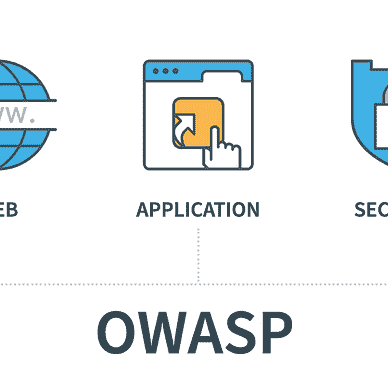

# Kali Linux 简介

> 原文：<https://levelup.gitconnected.com/ethical-hacking-part-2-introducing-kali-linux-37362fafe28b>

## 道德黑客，了解风险，防止攻击


来自 Adobe Stock 的许可图像

[Kali Linux](https://www.kali.org/) 是一个专门构建的安全操作系统，拥有大量流行的渗透测试工具。这是一个由[攻击安全](https://www.offensive-security.com/)维护和资助的开源项目。除了 Kali Linux，进攻安全还维护着[漏洞数据库](http://www.exploit-db.com/)。

我将使用[虚拟盒](https://www.virtualbox.org/)引导您完成 [Kali Linux](https://www.kali.org/) 安装。第一步是[为你的操作系统下载并安装虚拟盒子](https://www.virtualbox.org/wiki/Downloads)。

然后，您将需要进入 [Kali Linux 下载页面](https://www.kali.org/downloads/)，下载最新的“ [Kali Linux 64 位(安装程序)](https://cdimage.kali.org/kali-2020.3/kali-linux-2020.3-installer-amd64.iso)”ISO。请注意，这可能需要一段时间，因为当前版本是 3.7G。

打开**虚拟框**，点击**新建**按钮。


在此页面上，您需要提供以下信息:

*   **名称** —您的虚拟机的名称
*   **机器文件夹** —将创建虚拟机的位置
*   **类型** — Linux
*   **版本** —其他 Linux (64 位)
*   **内存** —我用的是 8192MB，不过真的看你了。


您在这里所要做的就是指定您的虚拟机应该有多大。我用了 30 GB。你可以分配更少，但我真的不想低于 10 GB。


您将返回到主虚拟框页面。右键点击你的 Kali 虚拟机，进入**设置**。


这一步是可选的，但是在“**常规**下，然后“**高级**我通常会将“**共享剪贴板**”和“**拖放**”设置为“**双向**”。


下一步是在“**存储**下，选择你的 DVD 光驱，然后在“**光驱**旁边点击蓝色光盘。然后“**选择一个磁盘文件**”并选择您的新 Kali ISO。


这一步是可选的，但我发现有时在我的 Mac 上启用虚拟盒子中的音频会导致虚拟机无法启动。我不使用我的虚拟机中的音频，所以我禁用它。


我建议将您的“**附属于:**”从“ **NAT** ”改为“**桥接适配器**”。如果所有连接都是出站的，那么“ **NAT** 就可以了。我希望能够提供像" **DVWA** "这样的外部服务，因此允许虚拟机分配自己的 IP 地址是更可取的。你可以通过打开映射对 NAT 做同样的事情，但是这很痛苦，所以我不推荐。


这一步也是可选的，但我喜欢这样做。您在您的主机系统上创建一个目录或文件夹，然后允许您的 Linux 虚拟机能够挂载它。这使得在系统间复制文件变得容易多了。在这种情况下，我 Mac 上的“Share”文件夹将被映射到虚拟机上的“/mnt/share”。


现在选择你的虚拟机，点击**开始**按钮。


如果有多个选项，请确保选择正确的 Kali ISO。


您可能会发现虚拟机在一个非常小的窗口中启动，您无法对其进行缩放。如果发生这种情况，转到虚拟框的“**视图**菜单选项，并选择“**缩放模式(主机+C)** ”。然后，您应该能够适当地缩放虚拟机窗口。


选择**图形化安装**。


选择您的语言。


选择您的位置。


配置您的键盘。


给你的系统一个主机名，我就叫我的“ **kali** ”。


配置您的域名。因为这只是一个实验室环境，所以我称之为“**实验室**”。


Kali 将在安装过程中创建一个非管理帐户。它会询问您的用户的全名。我只是把“kaliuser”这个教程。


这是您的非管理用户的用户名。


选择合适的密码并确认。


选择“**引导—使用整个磁盘**”。我尝试使用加密的 LVM，但它似乎会导致虚拟框的问题。你可以自己尝试，但这很可能会给你带来麻烦，你需要重新开始。


这里应该只有一个由虚拟框创建的选项，所以选择它。


选择“**一个分区中的所有文件(推荐新用户使用)**”。如果你喜欢，可以随意选择其他选项，但这个选项更可能是你需要的选项。


选择“**完成分区并将更改写入磁盘**”。


选择“**是**”至“**将更改写入磁盘？**


选中未选中的“ **…大-默认选择加附加工具**”。


选择“**是**”以“**将 GRUB 引导加载程序安装到您的主驱动器？**


选择您的虚拟机器来安装 GRUB 引导加载程序。


安装完成。


Kali 现在将启动…


您将看到登录屏幕，以便登录…


打开的桌面将是这样的。


点击左上角的 Kali 图标打开菜单。


您将会看到 Kali 中包含了多少安全工具。

打开“ **03 — Web 应用分析**”只能看到一小部分 Web 相关安全工具。


## 现在完成安装…

要使“**共享剪贴板**”、“**拖放**”和“**共享文件夹**”工作，您需要安装“ **Guest Additions CD 映像**”。打开虚拟盒的“**设备**菜单选项，并从那里安装。


当您的 Kali Linux 启动时，它可能没有网络连接。解决方法是右键单击时间旁边的图标，然后转到“**编辑连接…** ”。


选择你的“有线连接 1”并点击底部的设置按钮。


确保您选择了一个“**设备**”，并且“**链路协商**设置为“**自动**”。


禁用 IPv6，除非你真的需要它，因为它只会给你带来麻烦。


使用 DHCP 或配置静态地址并在此添加 DNS 服务器。


现在回到桌面，左键单击时间旁边的图标，“**断开**与网络的连接，并再次连接到“**有线网络 1** ”。

Mac 上虚拟盒子里的 Kali 网络似乎有点不稳定(至少对我来说是这样)。如果你启动 Kali，它没有网络连接，只需重复上述步骤。“断开”，然后再次连接到“有线网络 1”。这为我解决了问题。


如果一切按计划进行，您应该能够从终端 ping Google DNS 服务器。


打开您的终端并编辑“**/etc/network manager/network manager . conf**”文件。

```
root@kali:~# vi /etc/NetworkManager/NetworkManager.conf
```

将**管理的**从**假**修改为**真**并保存文件。

```
[main]
plugins=ifupdown,keyfile[ifupdown]
**managed=true**
```

并重新启动网络管理器。

```
root@kali:~# **service NetworkManager restart**
```

如果您想在终端中查看网络接口配置，请使用新的“ **ip 地址**”/**IP a**”而不是“ **ifconfig -a** ”。

编辑“ **/etc/apt/sources.list** ”文件。

```
root@kali:~# vi /etc/apt/sources.list
```

并取消“ **deb-src** ”行的注释。

```
# See [https://www.kali.org/docs/general-use/kali-linux-sources-list-repositories/](https://www.kali.org/docs/general-use/kali-linux-sources-list-repositories/)
deb [http://http.kali.org/kali](http://http.kali.org/kali) kali-rolling main contrib non-free# Additional line for source packages
**deb-src** [**http://http.kali.org/kali**](http://http.kali.org/kali) **kali-rolling main contrib non-free**
```

现在更新系统…

```
root@kali:~$ **apt-get autoremove -y**
root@kali:~$ **apt-get update -y** root@kali:~$ **apt-get upgrade -y** root@kali:~$ **apt-get install build-essential linux-headers-$(uname -r)** root@kali:~$ **apt-get update -y** root@kali:~$ **apt-get upgrade -y** root@kali:~$ **apt-get dist-upgrade** root@kali:~$ **apt-get install virtualbox-guest-x11 -y** root@kali:~$ **reboot -f**
```

检查一下一切正常吗？

```
root@kali:~# **lsb_release -a**
No LSB modules are available.
Distributor ID: Kali
Description: Kali GNU/Linux Rolling
Release: 2020.3
Codename: kali-rollingroot@kali:~# **uname -a**
Linux kali 5.8.0-kali2-amd64 #1 SMP Debian 5.8.10-1kali1 (2020-09-22) x86_64 GNU/Linux
```

# 该死的易受攻击的 Web 应用程序(DVWA)

安装和配置 Kali 很好，但是我们需要一些东西来练习和测试。我要用[该死的易受攻击的 Web 应用(DVWA)](http://www.dvwa.co.uk/) 。这是一个免费的网络应用程序，它被故意设计成漏洞百出。我建议您自己下载并安装它，按照本教程进行操作，并亲自试用。

DVWA 涵盖的漏洞有:

*   蛮力
*   命令注入
*   CSRF
*   文件包含
*   文件上传
*   不安全的验证码
*   SQL 注入
*   SQL 注入(盲)
*   弱会话 id
*   XSS
*   XSS(反射)
*   XSS(已存储)
*   CSP 旁路
*   Java Script 语言

您可以使用其他专门构建的“错误”应用程序进行练习。

*   [bWAPP，还是一个*漏洞百出的网络应用*](http://www.itsecgames.com/)
*   [小蛇二号](https://sourceforge.net/projects/mutillidae/)
*   [OWASP WebGoat](http://webappsecmovies.sourceforge.net/webgoat/)

如果你觉得这是一个挑战，这里列出了超过 60 个易受攻击的 web、移动和操作系统项目。

在这方面，我们有点被宠坏了，但我们将从 [DVWA](http://www.dvwa.co.uk/) 开始。初始设置有点棘手，所以我会告诉你。

你真的可以在任何 linux 系统上安装它，但我将把它安装到 Kali linux 中，这样我们就可以在一个地方拥有所有与安全相关的工具和实验室环境。

```
kali@kali:~$ **sudo** **apt-get update -y**
kali@kali:~$ **sudo** **apt-get upgrade -y**
kali@kali:~$ **sudo** **apt-get install apache2 mariadb-server-10.3 mariadb-client-10.3 php php-gd** **php-mysql -y** kali@kali:~$ **sudo** **/etc/init.d/apache2 start**
kali@kali:~$ **sudo** **/etc/init.d/mysql start** kali@kali:~$ **sudo** **update-rc.d apache2 defaults**
kali@kali:~$ **sudo update-rc.d mysql defaults**
```

现在，我们可以提供最新版本的 DVWA。

```
kali@kali:~$ **sudo chown -R ${USER}:${USER} /var/www**
kali@kali:~$ **cd /var/www/html**
kali@kali:~$ **git clone** [**https://github.com/ethicalhack3r/DVWA**](https://github.com/ethicalhack3r/DVWA)kali@kali:~$ **chmod -R 777 /var/www/html/DVWA**   <--   yes, not a mistake -- 777
kali@kali:~$ **mv /var/www/html/DVWA/config/config.inc.php.dist /var/www/html/DVWA/config/config.inc.php**
```

我们将使用 MySQL 作为 DVWA 的数据库，所以我们需要确保它有一个基本配置。

```
kali@kali:~$ **sudo mysql -u root**
Welcome to the MariaDB monitor.  Commands end with ; or \g.
Your MariaDB connection id is 56
Server version: 10.3.24-MariaDB-2 Debian buildd-unstableCopyright (c) 2000, 2018, Oracle, MariaDB Corporation Ab and others.Type 'help;' or '\h' for help. Type '\c' to clear the current input statement.MariaDB [(none)]> **CREATE DATABASE dvwa;**
Query OK, 1 row affected (0.000 sec)MariaDB [(none)]> **CREATE USER 'user'@'localhost' IDENTIFIED BY 'pass';**
Query OK, 0 rows affected (0.000 sec)MariaDB [(none)]> **GRANT ALL ON dvwa.* TO 'user'@'localhost';**
Query OK, 0 rows affected (0.000 sec)MariaDB [(none)]> **FLUSH PRIVILEGES;**
Query OK, 0 rows affected (0.000 sec)MariaDB [(none)]>
```

我们需要对 php.ini 文件进行一些修改。不要问我为什么，虽然我可以看到当我从命令行运行"**PHP-ini**时"**/etc/PHP/7.4/Apache 2/PHP . ini**"没有加载，但是如果您没有在中对"***allow _ URL _ fopen***"和"***allow _ URL _ include***"进行更改

*   /etc/php/7.4/cli/php.ini
*   /etc/php/7.4/apache2/php.ini

```
allow_url_fopen = On
allow_url_include = On
extension=mysqli
```

完成后，重新启动 Apache。

```
# **/etc/init.d/apache2 restart**
Restarting apache2 (via systemctl): apache2.service.
```

我们现在需要更新 DVWA 配置文件:**/var/www/html/DVWA/config/config . Inc . PHP**

在此之前还有一项任务要做。DVWA 有一个 reCAPTCHA 组件。您需要前往 [Google reCaptcha](https://www.google.com/recaptcha/admin/create) 获取您的公钥和私钥。这是非常快速和无痛的。


记下您的“**站点密钥**和“**密钥**”。


在您的"**/var/www/html/DVWA/config/config . Inc . PHP**"文件中，请进行以下更新:

```
$_DVWA[ 'db_server' ]   = '127.0.0.1';
$_DVWA[ 'db_database' ] = 'dvwa';
$_DVWA[ 'db_user' ]     = 'user';
$_DVWA[ 'db_password' ] = 'pass';$_DVWA[ 'recaptcha_public_key' ]  = '***SITE KEY***';
$_DVWA[ 'recaptcha_private_key' ] = '***SECRET KEY***';
```

现在浏览您的 DVWA 网站:[**http://SERVER _ IP/DVWA**](http://SERVER_IP/DVWA)


默认登录凭据:

用户名:**管理员**
密码:**密码**

首次登录时，您将看到这个 setup.php 页面。


现在，理想情况下，如果到目前为止一切都按计划进行，您的设置页面应该看起来像上面一样，所有相关项目都是“绿色”的。如果是，则点击“**创建/重置数据库**”完成 MySQL 数据库的配置。然后单击登录链接。

DVWA 可以在多种模式下工作，默认模式是最安全的“**不可能**”。您需要单击“ **DVWA 安全**”菜单项，并将安全级别更改为“**低**”，以模拟典型的易受攻击的应用程序。


这就是已经完成的设置，我们需要练习和测试一些东西:)

以上就是 Kali Linux 的基本安装。我将在接下来的文章中更详细地介绍各种工具。

为了进一步阅读，看看我写的关于这个话题的 19 个故事。


迈克尔·惠特尔

## 道德黑客培训课程

[View list](https://whittle.medium.com/list/ethical-hacking-training-course-710769700b83?source=post_page-----37362fafe28b--------------------------------)19 stories

# 迈克尔·惠特尔

*   ***如果你喜欢这个，请*** [***跟我上媒***](https://whittle.medium.com/)
*   ***更多有趣的文章，请*** [***关注我的刊物***](https://medium.com/trading-data-analysis)
*   ***有兴趣合作吗？*** [***我们来连线 LinkedIn 上的***](https://www.linkedin.com/in/miwhittle/)
*   ***支持我和其他媒体作者*** [***在此报名***](https://whittle.medium.com/membership)
*   ***请别忘了为文章鼓掌:)←谢谢！***