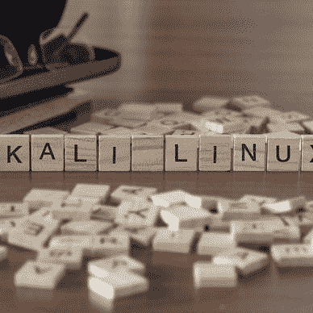

# 攻击代理介绍

> 原文：<https://levelup.gitconnected.com/ethical-hacking-part-3-introducing-attack-proxies-382780a524b9>

## 道德黑客，了解风险，防止攻击

来自 Adobe Stock 的许可图像

那么什么是"**攻击代理**"？它创建一个特殊的代理服务器，使您的网站流量通过该服务器。它们用于集成渗透测试工具，以发现 web 应用程序中的漏洞。

有两种主要的免费软件。

*   [Zed 攻击代理](https://owasp.org/www-project-zap)由 [OWASP](https://owasp.org/)
*   [打嗝套件](https://portswigger.net/burp)由 [PortSwigger](https://portswigger.net/) (“社区版”是免费的)

我将告诉你每一个的基本设置，但我会在将来为这些写专门的文章。

**OWASP ZAP**

Zed 攻击代理(ZAP)可以下载并安装在大多数操作系统上。它还捆绑了 [Kali Linux](https://www.kali.org/) ，正如我在[上一篇文章](https://medium.com/@michael_31310/ethical-hacking-part-2-introducing-kali-linux-37362fafe28b)中所讨论的。

为了这个教程，我在 Mac 上安装了 OWASP ZAP 2.9.0。

当 ZAP 第一次加载时，它会要求你从市场上更新软件包。只需点击“**更新全部**”，等待完成即可。

您可以随时通过转到 ZAP 菜单中的“**帮助**”，然后“**检查更新…** ”返回此页面。

顺便提一下，如果你点击顶部的“ **Marketplace** ”标签，你也可以安装额外的插件。我特别喜欢与创建报告相关的那些。

它还会询问您是否想要持续 ZAP 会话。对于本教程，没有必要在此时保持会话。

如果您想在开始时更改此对话框，您可以转到 ZAP 菜单，然后选择"**工具**"，然后选择"**选项…** "，然后选择"**数据库**，然后选择"**提示新会话的持久性选项**"。

第一步可能并不明显，但是您需要将 CA cert 安装到您想要使用的浏览器中。

在 ZAP 菜单中，转到“**工具**，然后是“**选项… 【T3”)，然后向下导航到“**动态 SSL 证书**”。您需要将" **owasp_zap_root_ca.cer** "证书保存到您的桌面或其他合适的地方。**

再次在 ZAP 菜单中，转到“**工具**”，然后是“**选项…** ”，然后是“**本地代理”**。除了注意攻击代理将在 **localhost** 端口 **8080** 上运行之外，这里不做任何特别的事情。

现在打开左下方的 ZAP，你会看到这个…

我们现在要做的是配置您的浏览器使用这个代理。我通常使用 Chrome 进行正常浏览，所以我更喜欢使用另一个浏览器作为我的攻击代理。我会用火狐。

你曾经使用哪个浏览器打开**偏好设置**并搜索“**代理**”。在 Firefox 中是这样的。

每个浏览器的过程都非常相似，但是在 Firefox 中，您需要如下配置代理。

*   **手动代理配置**
*   HTTP 代理 **127.0.0.1** 端口 **8080**
*   选中“**将此代理服务器用于所有协议**

现在回到您的浏览器**首选项**中，搜索“**证书**”。

点击“**查看证书**，你会想要“**导入**”在“**权限**下的 ZAP CA 证书。

勾选两个复选框，点击**确定**。

**请注意，未经许可扫描或攻击网站是非法的。我使用的是我以前文章中安装的** [**该死的易受攻击的 Web 应用程序(DVWA)**](http://www.dvwa.co.uk/) **，这里的******和****这里的** **。****

**当我打开 http://192.168.1.2/DVWA 时，你会看到一个 ZAP HUD 覆盖图。点击**继续你的目标**。**

****

**如果使用 DVWA 进行测试，请转到“ **DVWA 安全**”并将“**安全级别**”设置为“**低**”以获得最佳结果。**

****

**现在回到 OWASP ZAP，你会看到当我浏览网页时，正在扫描漏洞。**

****

**在本文中，我不打算详细介绍，如果我单击其中一个链接(例如[http://192 . 168 . 1 . 2/DVWA/vulnerabilities/sqli/)](http://192.168.1.2/DVWA/vulnerabilities/sqli/))我可以看到一些非常有用的信息，这些信息将在后续文章中介绍。请注意，我的“ **Cookie** 与我的“ **PHPSESSID** ”一起显示在那里。**

****

**如果您使用本文来帮助保护和提高 web 应用程序的安全性，那么最重要的部分就是" **Alerts** "选项卡。**

****

**如您所见，对于“**反向跳转**”有一个“**中等**”警报。如果我展开它，并单击其中一个易受攻击的页面，它会显示大量关于描述、解决方案和参考链接的信息。您真的希望确保您部署和管理的任何 web 应用程序没有任何"**中**或以上的高风险警报。**

**我刚才向您展示的方法现在依赖于您浏览站点来发现漏洞。我将在接下来的文章中介绍如何使用蜘蛛或攻击扫描来实现这一点，但通过身份验证可能会更复杂，这就是为什么使用攻击代理和手动浏览是最简单的。**

**OWASP 在提供大量关于如何使用他们的工具的免费信息和教程方面真的很棒，所以我推荐你浏览这些。**

****打嗝组曲****

**免费的 Burp Suite 社区版可以[下载](https://portswigger.net/burp/communitydownload)并安装在大多数操作系统上。正如我在[上一篇文章](https://medium.com/@michael_31310/ethical-hacking-part-2-introducing-kali-linux-37362fafe28b)中所讨论的，它还捆绑了 [Kali Linux](https://www.kali.org/) 。**

**在继续之前，请确保关闭 OWASP ZAP 以关闭攻击代理。默认情况下，Burp Suite 也在端口 8080 上使用 localhost，因此如果您同时运行它们，就会发生冲突。**

**Burp 套件的安装非常简单。加载时，系统会要求您创建或打开一个项目。只需使用一个“**临时项目**”并在下一页“**使用打嗝默认值**”。**

****

**与 OWASP ZAP 一样，代理会自动在本地主机端口 8080 上启动，但实际上，在我们配置代理之前，它不会工作。**

****

**请点击顶部橙色的“**代理**”标签。**

****

**然后转到“**选项**”。**

****

**确保代理运行在 **127.0.0.1:8080** 上，或者根据需要进行更改。如果您想将配置重置为默认值，您可以单击“**代理监听器**”和“**恢复默认值**”下的设置目录。你不需要在全新安装时这样做，但是知道它的存在是值得的。**

**这里重要和必要的部分是点击“**导入/导出 CA 证书**”。您将希望以 DER 格式导出一个“**证书”，将其命名为“ **burpsuite_root_ca.cer** ”，并将其保存在您的桌面或其他合适的地方。****

**您需要在您的浏览器中作为一个**授权机构**导入这个证书，就像我们在上面为 OWASP ZAP 代理所做的那样。那里有做什么的说明。这是同样的过程。**

**完成后，在打嗝套件的“**代理**”选项卡中，单击“**拦截**”，并确保“**拦截已打开**”。**

****

**我假设您的浏览器配置了 127.0.0.1 端口 8080 代理，并且安装了 Burp Suite CA 证书。打开你的目标站点，在我的例子中是我们在以前的文章中安装的[**【DVWA】**](http://www.dvwa.co.uk/)**，这里是******和** [**这里是**](https://medium.com/@michael_31310/ethical-hacking-part-2-introducing-kali-linux-37362fafe28b) **。******

****OWASP ZAP 和 Burp Suite 之间一个非常大的区别是，我们需要通过代理手动批准和"**转发**"请求。****

********

****正如你所看到的，它在问我是否要将**请求转发到 http://192.168.1.2:80** 。****

****出于兴趣，在我点击了“**转发**之后，我收到了另一个对 Mozilla 的请求，我“**放弃了**”。只允许通过并"**转发**"与您的测试相关的请求。****

********

****在“**目标**”选项卡下，您将看到请求的详细信息。正如我之前提到的，我可以在接下来的文章中看到一些非常有用的信息。请注意，我的“ **Cookie** ”与我的“**PHP sesid**”一起显示在那里。****

********

******结论******

****这两种攻击代理都非常流行，并且功能丰富。我只是想给你一个教程，让他们配置一个基本的设置。我打算以后写文章更详细地介绍这些特性。正如我所提到的，许多工具，尤其是 Kali Linux 中的工具，都旨在获取 Cookie 和 PHP 会话 ID 的详细信息，我已经向您展示了如何使用这两种工具来实现这一点。****

****为了进一步阅读，看看我写的关于这个话题的 19 个故事。****

****

[迈克尔·惠特尔](https://whittle.medium.com/?source=post_page-----382780a524b9--------------------------------)**** 

## ****道德黑客培训课程****

****[View list](https://whittle.medium.com/list/ethical-hacking-training-course-710769700b83?source=post_page-----382780a524b9--------------------------------)********19 stories****************************

# ****迈克尔·惠特尔****

*   *******如果你喜欢这个，请*** [***跟我上媒***](https://whittle.medium.com/)****
*   *******更多有趣的文章，请*** [***关注我的刊物***](https://medium.com/trading-data-analysis)****
*   *******有兴趣合作吗？*** [***让我们在 LinkedIn 上连线***](https://www.linkedin.com/in/miwhittle/)****
*   *******支持我和其他媒体作者*** [***在此报名***](https://whittle.medium.com/membership)****
*   *******请别忘了为文章鼓掌:)←谢谢！*******