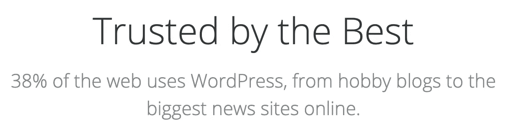

# 保护 WordPress

> 原文：<https://levelup.gitconnected.com/ethical-hacking-part-5-securing-wordpress-e866a8753328>

## 本教程涵盖了识别漏洞和保护 WordPress


来自 Adobe Stock 的许可图像



—此声明来自 [WordPress](https://wordpress.org/) 。

如果 38%的网站使用 WordPress，我们是否应该确保它的安全性？


我[下载了 WordPress](https://wordpress.org/download/) 并在我的 Kali Linux 虚拟机上安装了一个[的全新安装](https://wordpress.org/support/article/how-to-install-wordpress/)。在基础设施方面没有什么特别的，只是一个 Kali Linux VirtualBox 虚拟机，一个 Apache 2 web 服务器，以及一个名为 MariaDB 的 MySQL 的分支作为数据库。我不打算介绍 WordPress 的基本安装，因为在他们的网站上有很好的记录[。](https://wordpress.org/support/article/how-to-install-wordpress/)

我将使用一系列黑客工具来“测试”一个新安装的 WordPress。然后我会检查结果，并提出如何保护 WordPress 的建议。

```
kali@kali:~$ **wpscan --version**
_______________________________________________________________
         __          _______   _____
         \ \        / /  __ \ / ____|
          \ \  /\  / /| |__) | (___   ___  __ _ _ __ ®
           \ \/  \/ / |  ___/ \___ \ / __|/ _` | '_ \
            \  /\  /  | |     ____) | (__| (_| | | | |
             \/  \/   |_|    |_____/ \___|\__,_|_| |_|WordPress Security Scanner by the WPScan Team
                         Version 3.8.7
       Sponsored by Automattic - [https://automattic.com/](https://automattic.com/)
       [@_WPScan_](http://twitter.com/_WPScan_), [@ethicalhack3r](http://twitter.com/ethicalhack3r), [@erwan_lr](http://twitter.com/erwan_lr), [@firefart](http://twitter.com/firefart)
_______________________________________________________________Current Version: 3.8.7
Last DB Update: 2020-10-02
```

我将确保“ **wpscan** ”是最新的。

```
kali@kali:~$ **wpscan --update**
_______________________________________________________________
         __          _______   _____
         \ \        / /  __ \ / ____|
          \ \  /\  / /| |__) | (___   ___  __ _ _ __ ®
           \ \/  \/ / |  ___/ \___ \ / __|/ _` | '_ \
            \  /\  /  | |     ____) | (__| (_| | | | |
             \/  \/   |_|    |_____/ \___|\__,_|_| |_|WordPress Security Scanner by the WPScan Team
                         Version 3.8.7
       Sponsored by Automattic - [https://automattic.com/](https://automattic.com/)
       [@_WPScan_](http://twitter.com/_WPScan_), [@ethicalhack3r](http://twitter.com/ethicalhack3r), [@erwan_lr](http://twitter.com/erwan_lr), [@firefart](http://twitter.com/firefart)
_______________________________________________________________[i] Updating the Database ...
[i] Update completed.
```

第一步是使用 Kali Linux 附带的“ **wpscan** ”。

```
kali@kali:~$ **wpscan --url** [**http://192.168.1.2**](http://192.168.1.2) **--enumerate u,vp,vt,dbe**
_______________________________________________________________
         __          _______   _____
         \ \        / /  __ \ / ____|
          \ \  /\  / /| |__) | (___   ___  __ _ _ __ ®
           \ \/  \/ / |  ___/ \___ \ / __|/ _` | '_ \
            \  /\  /  | |     ____) | (__| (_| | | | |
             \/  \/   |_|    |_____/ \___|\__,_|_| |_|WordPress Security Scanner by the WPScan Team
                         Version 3.8.7
       Sponsored by Automattic - [https://automattic.com/](https://automattic.com/)
       [@_WPScan_](http://twitter.com/_WPScan_), [@ethicalhack3r](http://twitter.com/ethicalhack3r), [@erwan_lr](http://twitter.com/erwan_lr), [@firefart](http://twitter.com/firefart)
_______________________________________________________________[+] URL: [http://192.168.1.2/](http://192.168.1.2/) [192.168.1.2]
[+] Started: Sat Oct  3 19:32:00 2020Interesting Finding(s):[+] Headers
 | Interesting Entry: **Server: Apache/2.4.46 (Debian)**
 | Found By: Headers (Passive Detection)
 | Confidence: 100%[+] **XML-RPC seems to be enabled**: [http://192.168.1.2/xmlrpc.php](http://192.168.1.2/xmlrpc.php)
 | Found By: Direct Access (Aggressive Detection)
 | Confidence: 100%
 | References:
 |  - [http://codex.wordpress.org/XML-RPC_Pingback_API](http://codex.wordpress.org/XML-RPC_Pingback_API)
 |  - [https://www.rapid7.com/db/modules/auxiliary/scanner/http/wordpress_ghost_scanner](https://www.rapid7.com/db/modules/auxiliary/scanner/http/wordpress_ghost_scanner)
 |  - [https://www.rapid7.com/db/modules/auxiliary/dos/http/wordpress_xmlrpc_dos](https://www.rapid7.com/db/modules/auxiliary/dos/http/wordpress_xmlrpc_dos)
 |  - [https://www.rapid7.com/db/modules/auxiliary/scanner/http/wordpress_xmlrpc_login](https://www.rapid7.com/db/modules/auxiliary/scanner/http/wordpress_xmlrpc_login)
 |  - [https://www.rapid7.com/db/modules/auxiliary/scanner/http/wordpress_pingback_access](https://www.rapid7.com/db/modules/auxiliary/scanner/http/wordpress_pingback_access)[+] **WordPress readme found:** [**http://192.168.1.2/readme.html**](http://192.168.1.2/readme.html)
 | Found By: Direct Access (Aggressive Detection)
 | Confidence: 100%[+] **The external WP-Cron seems to be enabled**: [http://192.168.1.2/wp-cron.php](http://192.168.1.2/wp-cron.php)
 | Found By: Direct Access (Aggressive Detection)
 | Confidence: 60%
 | References:
 |  - [https://www.iplocation.net/defend-wordpress-from-ddos](https://www.iplocation.net/defend-wordpress-from-ddos)
 |  - [https://github.com/wpscanteam/wpscan/issues/1299](https://github.com/wpscanteam/wpscan/issues/1299)[+] WordPress version 5.5.1 identified (**Latest, released on 2020-09-01**).
 | Found By: Rss Generator (Passive Detection)
 |  - [http://192.168.1.2/index.php/feed/](http://192.168.1.2/index.php/feed/), <generator>[https://wordpress.org/?v=5.5.1](https://wordpress.org/?v=5.5.1)</generator>
 |  - [http://192.168.1.2/index.php/comments/feed/](http://192.168.1.2/index.php/comments/feed/), <generator>[https://wordpress.org/?v=5.5.1](https://wordpress.org/?v=5.5.1)</generator>[+] WordPress theme in use: twentytwenty
 | Location: [http://192.168.1.2/wp-content/themes/twentytwenty/](http://192.168.1.2/wp-content/themes/twentytwenty/)
 | **Latest Version: 1.5 (up to date)**
 | Last Updated: 2020-08-11T00:00:00.000Z
 | Readme: [http://192.168.1.2/wp-content/themes/twentytwenty/readme.txt](http://192.168.1.2/wp-content/themes/twentytwenty/readme.txt)
 | Style URL: [http://192.168.1.2/wp-content/themes/twentytwenty/style.css?ver=1.5](http://192.168.1.2/wp-content/themes/twentytwenty/style.css?ver=1.5)
 | Style Name: Twenty Twenty
 | Style URI: [https://wordpress.org/themes/twentytwenty/](https://wordpress.org/themes/twentytwenty/)
 | Description: Our default theme for 2020 is designed to take full advantage of the flexibility of the block editor...
 | Author: the WordPress team
 | Author URI: [https://wordpress.org/](https://wordpress.org/)
 |
 | Found By: Css Style In Homepage (Passive Detection)
 |
 | Version: 1.5 (80% confidence)
 | Found By: Style (Passive Detection)
 |  - [http://192.168.1.2/wp-content/themes/twentytwenty/style.css?ver=1.5](http://192.168.1.2/wp-content/themes/twentytwenty/style.css?ver=1.5), Match: 'Version: 1.5'[+] Enumerating Vulnerable Plugins (via Passive Methods)**[i] No plugins Found.**[+] Enumerating Vulnerable Themes (via Passive and Aggressive Methods)
 Checking Known Locations - Time: 00:00:00 <======================================================================> (363 / 363) 100.00% Time: 00:00:00
[+] Checking Theme Versions (via Passive and Aggressive Methods)**[i] No themes Found.**[+] Enumerating DB Exports (via Passive and Aggressive Methods)
 Checking DB Exports - Time: 00:00:00 <=============================================================================> (36 / 36) 100.00% Time: 00:00:00**[i] No DB Exports Found.**[+] Enumerating Users (via Passive and Aggressive Methods)
 Brute Forcing Author IDs - Time: 00:00:00 <========================================================================> (10 / 10) 100.00% Time: 00:00:00[i] User(s) Identified:[+] **m-whittle**
 | Found By: Author Posts - Author Pattern (Passive Detection)
 | Confirmed By:
 |  Wp Json Api (Aggressive Detection)
 |   - [http://192.168.1.2/index.php/wp-json/wp/v2/users/?per_page=100&page=1](http://192.168.1.2/index.php/wp-json/wp/v2/users/?per_page=100&page=1)
 |  Author Id Brute Forcing - Author Pattern (Aggressive Detection)[+] **m.whittle**
 | Found By: Rss Generator (Passive Detection)
 | Confirmed By: Login Error Messages (Aggressive Detection)**[!] No WPVulnDB API Token given, as a result vulnerability data has not been output.
[!] You can get a free API token with 50 daily requests by registering at** [**https://wpvulndb.com/users/sign_up**](https://wpvulndb.com/users/sign_up)[+] Finished: Sat Oct  3 19:32:02 2020
[+] Requests Done: 413
[+] Cached Requests: 46
[+] Data Sent: 96.65 KB
[+] Data Received: 72.608 KB
[+] Memory used: 218.762 MB
[+] Elapsed time: 00:00:02
```

我在上面强调了兴趣点。

与 WordPress 没有直接关系的第一个问题是" **wpscan** "能够确定操作系统和网络服务器，包括版本。为什么这是一个问题？因为在 [Exploit DB](https://www.exploit-db.com/) 上的快速搜索显示 Apache 2.4 中存在已验证和公开的漏洞。


web 服务器应该真正隐藏这些信息，因为它们可能被利用。您可以编辑" **httpd.conf** "，更新下面的配置，然后重启 Apache 来修复这个问题。

```
ServerTokens Prod
ServerSignature Off
```

你真的应该对 PHP 做同样的事情。编辑“ **php.ini** ”并包含以下内容。

```
expose_php = Off
```

如果你有一个真正的用例，比如使用远程技术和移动应用程序更新你的 WordPress 站点，XML-RPC 不一定是一个问题。问题是 xmlrpc.php 带来了安全风险。它为您的站点创建了一个额外的访问点，这可能会使您的站点易受外部攻击。每次验证 XML-RPC 时，都需要提供用户名和密码。可以想象，这对于安全性来说并不理想。当登录到你的 WordPress 站点时，你可以防止 bruce force 攻击，但是对于 XML-RPC 不存在同样的控制。这有点疯狂，它是默认启用的，但它是。如果你没有使用它，我建议用插件[禁用 XML-RPC](https://wordpress.org/plugins/disable-xml-rpc/) 禁用它。

我不确定为什么“ **wpscan** ”被标记为“ **WP-Cron** ”。我不知道它有任何漏洞。它被用来在 WordPress 中安排任务，就像安排文章一样。我相信它的唯一问题是在大型繁忙的网站上，它可能会导致性能问题。如果您不需要计划任务，最好禁用它。

编辑您的“**wp-config.php 文件**”并添加这一行:

```
define('DISABLE_WP_CRON', true);
```

在网站上留下示例代码和安装说明从来都不是好的做法。在这种情况下“**readme.html**”。绝对应该去掉。

我发现了 [WP 安全](https://www.wpwhitesecurity.com/)提供的一些有趣的统计数据。

**“根据 Alexa Top 100 万中 4 万+ WordPress 网站的统计，超过 70%的 WordPress 安装容易受到黑客攻击。”**

**[**WPScan 漏洞数据库**](https://wpvulndb.com/) **是 wps can 数据文件的在线浏览版本，用于检测已知的 WordPress 核心、插件和主题漏洞。迄今为止，它包含 2407 个漏洞，其中 1570 个是独特的漏洞。”****

****“WordPress 插件是 WordPress 最大的漏洞来源。到目前为止，WPScan 漏洞数据库中有 1305 个 WordPress 插件漏洞。这占了全球 WordPress 漏洞总数的 54%。然后是 344 个(14.3%) WordPress 主题漏洞和 758 个(31.5%) WordPress 核心漏洞。”****

**这里我想给大家展示的有趣的一点是，WordPress 插件占漏洞的 54%，主题占 14.4%，其余 31.5%为 WordPress 核心。不确定剩下的 1%？**

**所以你真的不想在没有尽职调查和检查 [WPScan 漏洞数据库](https://wpvulndb.com/)的情况下就安装最新的主题和插件。定期检查并确保 WordPress 和插件总是更新到最新版本是很重要的。定期自动执行“T2”wps can 并在漏洞出现时标记它们，这可能是个好主意。根据统计数据，70%以上的 WordPress 网站受到的大部分攻击是由于没有及时更新软件和插件。**

**我能够使用“**wps can**”**—enumerate u**”来识别我的用户名。在我的情况下，这是“ **m.whittle** ”。那么为什么这是一个问题呢？因为我现在知道该用哪个用户名来强迫布鲁斯了！这里最大的优点是 WordPress 在创建新用户时生成了一个非常强的密码。他们给我的密码意味着布鲁斯强制工具需要尝试超过 80 亿个组合。你真的应该使用他们提供的强密码，而不是你自己的。任何已知的密码组合都可以在很短的时间内破解。Kali Linux 附带了一个数据库，其中有 **14344392** 常用密码组合。**

```
kali@kali:~$ **wc -l /usr/share/wordlists/rockyou.txt** 
**14344392** /usr/share/wordlists/rockyou.txt
```

**我不打算在这里讨论密码暴力破解，因为我已经在我的上一篇文章“道德黑客(第 4 部分):密码哈希破解”中详细讨论过了。**

**在我的测试 WordPress 中，我的账户是用用户名“ **m.whittle** ”和一个混合了多种字符类型的 18 字符密码创建的。暴力破解工具无法破解。但是假设我偷懒了，换成了“ **Password1！**“根据密码列表中的位置、连接速度和硬件，这可能需要大约 40 个小时。**

```
kali@kali:~$ **wpscan --url** [**http://192.168.1.2**](http://192.168.1.2) **--usernames m.whittle,m-whittle --passwords /usr/share/wordlists/rockyou.txt**
```

**运筹学**

```
kali@kali:~$ **wpscan --url** [**http://192.168.1.2**](http://192.168.1.2) **--usernames usernames.txt --passwords /usr/share/wordlists/rockyou.txt**
```

**你也可以用九头蛇来完成蛮力…**

```
kali@kali:~$ **hydra -V -L usernames.txt -P /usr/share/wordlists/rockyou.txt 192.168.1.2 http-post-form '/wp-login.php:log=^USER^&pwd=^PASS^&wp-submit=Log:F=Invalid username'**
```

**尝试暴力破解 WordPress 真的没有任何意义，因为生成的密码太强了，你将无法在网络连接上每秒通过足够的密码来进行攻击。你必须试试你的运气，用户是不负责任的，并使用了一个共同的密码组合或序列。甚至常见的“随机”键盘序列也在列表中。**

**这里有一些确保你的 WordPress 站点尽可能安全的建议:**

1.  **确保您的站点流量使用证书(TLS 1.2)加密，并且 HTTP 连接被重定向/禁用。**
2.  **购买并安装 [Sucuri 插件](https://sucuri.net/wordpress-security-plugin/)。它不需要花费太多，并且为你的站点提供了必要的安全性。其中一个关键特性是检测、报警和处理暴力攻击。**
3.  **确保你定期检查你的 WordPress、插件和主题的更新。理想情况下，你应该自动运行“ **wpscan** 和“**——枚举 vp，vt** ”。这将显示你是否有易受攻击的插件或主题。**
4.  **确保所有管理账户都使用 WordPress 生成的强密码。利用管理帐户的帐户详细信息，攻击者可以造成不可挽回的损失。**
5.  **禁用任何你不使用的服务，比如“ **XML-RPC** ”和潜在的“ **WP-Cron** ”。**
6.  **删除任何示例页或安装说明。一个例子是“**readme.html**”。**
7.  **确保您的 web 服务器和 PHP 不会像前面讨论的那样公开它们的版本。**
8.  **不要向外界公开您的数据库。WordPress 应用程序应该能够连接到它，但除此之外没有其他东西(除了任何必要的管理连接)。**
9.  **为 WordPress 使用受限的数据库用户。WordPress 只需要对数据库的读写权限，所以数据库用户应该只被赋予**选择**、**插入**、**更新**和**删除**的权限。**
10.  **您的 web 服务器应该作为专用用户运行(而不是 root！)在一个专门的群中。比如“ **wwwrun** ”和“ **www** ”。这样做的原因是，如果出于任何原因您的网站受到威胁，攻击者将获得运行您的 web 服务的用户的访问权限。您希望尽可能地限制用户可以做的事情，这就是为什么您应该缩小用户可以做的事情的范围。**
11.  **确保在 PHP 中禁用了调试。如果发生任何故障，您只希望用户看到一个非常普通的错误消息。无论如何，你不会想透露太多幕后发生的事情。**
12.  **请确保您定期备份您的网站和数据库，不要将它们存储在本地！实际上有一些备份插件可以帮助解决这个问题，比如 [iThemes](https://wordpress.org/plugins/better-wp-security/) 、 [BackupBuddy](https://ithemes.com/purchase/backupbuddy/) 、 [UpdraftPlus](https://wordpress.org/plugins/updraftplus/) 、 [BackUpWordPress](https://wordpress.org/plugins/backupwordpress/) 和 [VaultPress](https://wordpress.org/plugins/vaultpress/) 。**
13.  **禁用文件编辑——WordPress 附带了一套主题和插件编辑器。你可以在**外观>主题编辑器和插件>插件编辑器**下找到它们。这些允许直接访问您站点的代码。或者，您可以通过编辑“**wp-config.php**”并添加“ **define('DISALLOW_FILE_EDIT '，true)，一次性禁用它们；**”。**
14.  **确保你的 WordPress web 服务器根目录的权限是正确的。比如我的 WordPress 安装在“ **/var/www/html** ”里。所以我会运行这个，"**find/var/www/html/-type d-exec chmod 755 { } \；**"和"**find/var/www/html/-type f-exec chmod 644 { } \；**”。**
15.  **将服务器端认证添加到“ **wp-admin/** ”目录和文件中是值得的。如果你用的是 Apache，可能是一个“**”。htaccess** "文件的基本认证只是为了增加一层安全性。使用单独的用户名和密码登录 WordPress。**
16.  **确保您的“**wp-config.php**”文件拥有权限 400，该权限对于 web 服务器是只读的。您可以将这个设置做得更进一步，从 web 服务器根目录向上移动一级，但这很难做到不破坏某些东西。您还可以使用“ **httpd.conf** ”或“**”来限制从 web 服务器对该文件的访问。htconfig** ”。**

```
<files wp-config.php>
  order allow,deny
  deny from all
</files>
```

**17.您还可以像这样限制对不打算由用户访问的脚本的访问。**

```
# Block the include-only files.
<IfModule mod_rewrite.c>
  RewriteEngine On
  RewriteBase /
  RewriteRule ^wp-admin/includes/ - [F,L]
  RewriteRule !^wp-includes/ - [S=3]
  RewriteRule ^wp-includes/[^/]+\.php$ - [F,L]
  RewriteRule ^wp-includes/js/tinymce/langs/.+\.php - [F,L]
  RewriteRule ^wp-includes/theme-compat/ - [F,L]
</IfModule>

# BEGIN WordPress
```

**注意“ **# BEGIN WordPress** ”，这告诉 WordPress 不要插入任何高于使任何安全配置无效的配置。**

**为了进一步阅读，看看我写的关于这个话题的 19 个故事。**

**

迈克尔·惠特尔** 

## **道德黑客培训课程**

**[View list](https://whittle.medium.com/list/ethical-hacking-training-course-710769700b83?source=post_page-----e866a8753328--------------------------------)****19 stories**************

# **迈克尔·惠特尔**

*   *****如果你喜欢这个，请*** [***跟我上媒***](https://whittle.medium.com/)**
*   *****更多有趣的文章，请*** [***关注我的刊物***](https://medium.com/trading-data-analysis)**
*   *****对通敌感兴趣？*** [***我们上 LinkedIn***](https://www.linkedin.com/in/miwhittle/) 连线吧**
*   *****支持我和其他媒体作者*** [***在此报名***](https://whittle.medium.com/membership)**
*   *****请别忘了为文章鼓掌:)←谢谢！*****