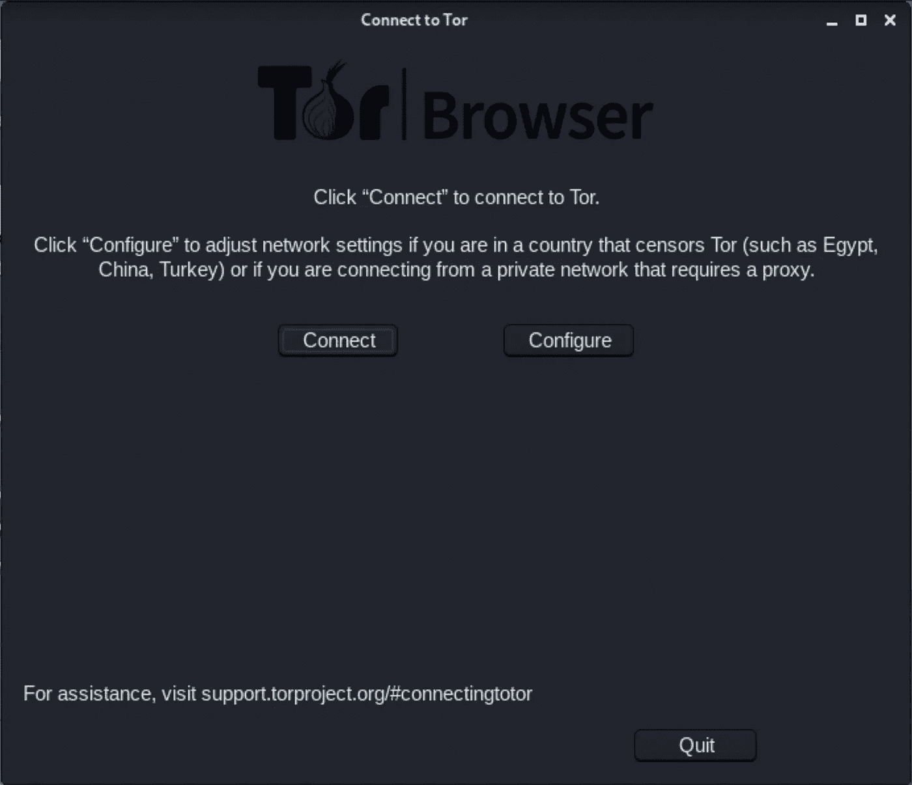
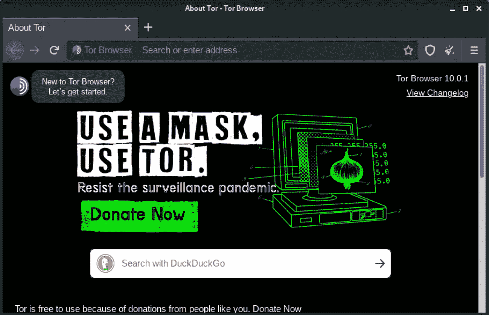
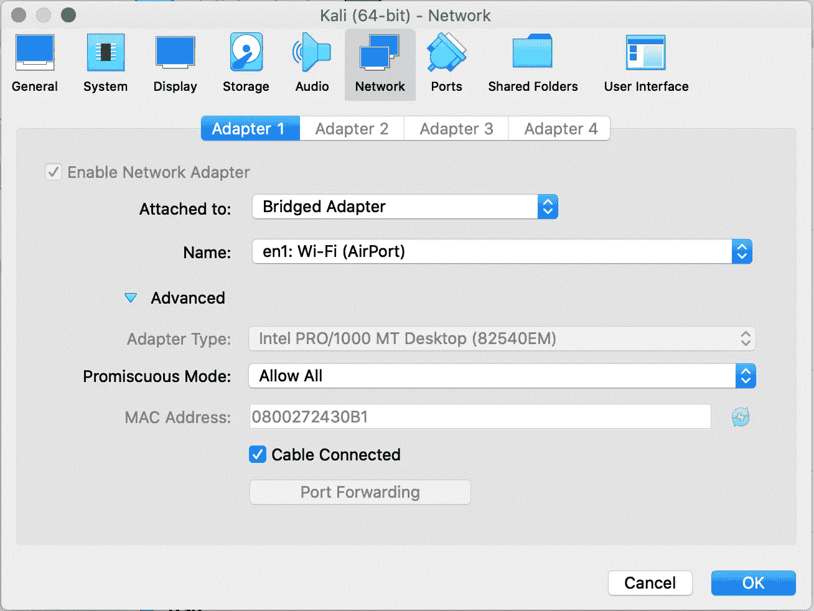
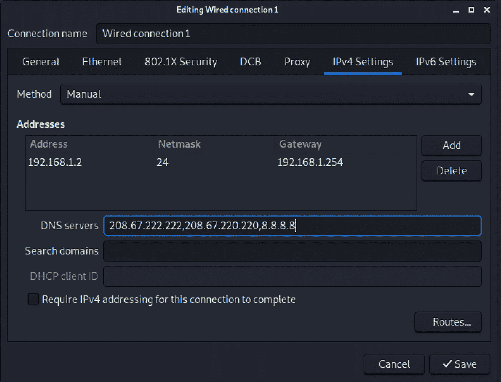
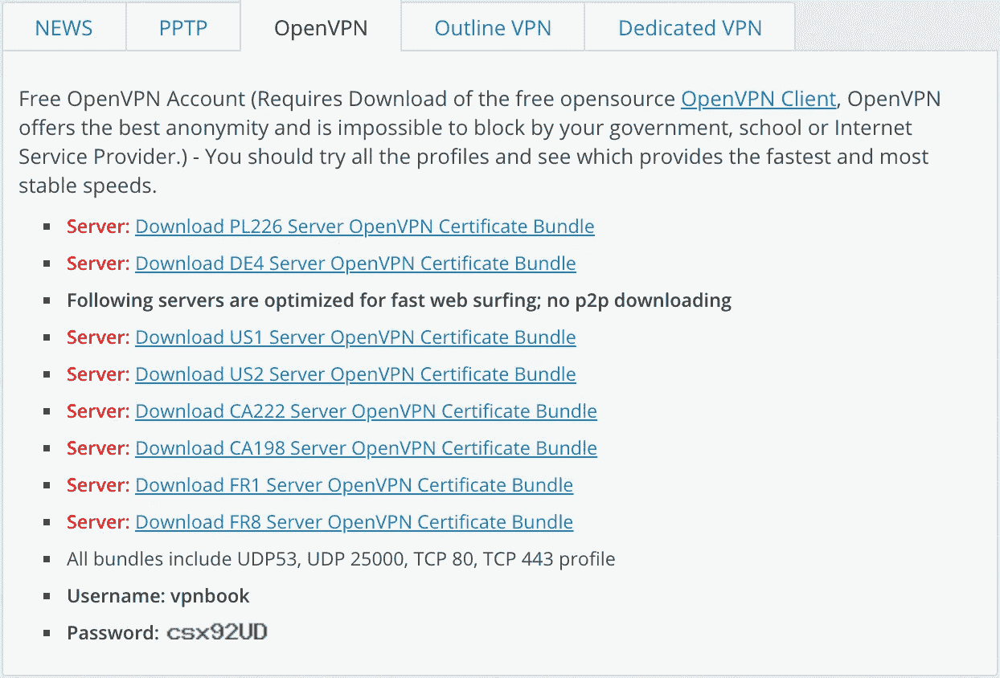

# 如何在网上匿名！

> 原文：<https://levelup.gitconnected.com/ethical-hacking-part-6-anonymisation-290bb7785d0b>

## 道德黑客了解风险以防止攻击——在线匿名和隐私


来自 Adobe Stock 的许可图像

现在这可能是一个有点"**禁忌的话题**，因为这个系列是关于"**道德黑客**"那么为什么需要匿名呢？我认为，如果你在安全领域工作，你应该知道你在防范什么。我将在本文中讨论匿名化，但这只是为了提供信息。匿名实际上并不违法，因为它有合法的用途，但不要用它做任何违法的事情！

我将这篇文章分成五个部分:

*   **禁用 WebRTC** 防止 VPN 信息泄露
*   匿名浏览的 **Tor 浏览器**
*   匿名连接的代理链
*   **虚拟专用网络(VPN)**“用于匿名连接
*   " **macchange** r "用于欺骗您的 MAC 并绕过过滤

# 禁用 WebRTC

**VPN 用户当心**:火狐和 Chrome 存在安全漏洞，可能会泄露你的 IP 地址。强烈建议禁用 WebRTC 以保护您免受漏洞攻击。在完成下面的 VPN 部分之前，您需要执行此步骤。

您可以使用以下链接测试 VPN 上的 WebRTC 漏洞:[https://browserleaks.com/webrtc](https://browserleaks.com/webrtc)

**如何在 Firefox 中禁用 WebRTC？**

1.  在 Firefox 地址栏输入“ **about:config** ”，然后按回车键。
2.  按下按钮“**我会小心的，我保证！**”
3.  搜索“**media . peer connection . enabled**
4.  双击该条目，列中的"**值**现在应该是"**假**"
5.  完成了。再次进行 **WebRTC** 泄漏测试。

**如何在 Chrome 中禁用 WebRTC？**

1.  打开 [Chrome 网络商店](https://chrome.google.com/webstore/)并搜索所需的扩展: **WebRTC 防漏**、 **WebRTC 控制**或 **Easy WebRTC 块**。
2.  点击**添加到 Chrome** ，按**添加扩展**确认安装。


3.激活扩展，它会在你的 Chrome 浏览器中禁用 WebRTC。

在谷歌 Chrome for Android 中，可以使用 Chrome 标志手动阻止 WebRTC(实验性设置):在地址栏中键入**Chrome://flags/# disable-WebRTC**并按 Enter，然后按 Enable。这将禁用 WebRTC 功能。

# Tor 浏览器

Tor 浏览器允许你访问“**暗网**”、“**深网**”或“**隐网**”。默认情况下，它不会随 Kali 一起安装。

第一步是安装“ **tor** ”。

```
kali@kali:~$ **sudo apt-get update -y && sudo apt-get upgrade -y**
kali@kali:~$ **sudo apt-get install tor -y**
```

Tor 浏览器需要一个专门的非根用户来运行，这是有充分理由的。如果出于任何原因，浏览器受到一些漏洞或欺骗性下载的危害，您需要尽可能地限制系统上的攻击面。出于同样的原因，您永远不会希望以 root 用户身份运行它。

```
kali@kali:~$ **sudo adduser tor**
Adding user `tor' ...
Adding new group `tor' (1001) ...
Adding new user `tor' (1001) with group `tor' ...
Creating home directory `/home/tor' ...
Copying files from `/etc/skel' ...
New password: 
Retype new password: 
passwd: password updated successfully
Changing the user information for tor
Enter the new value, or press ENTER for the default
        Full Name []: Tor Browser
        Room Number []: 
        Work Phone []: 
        Home Phone []: 
        Other []: 
Is the information correct? [Y/n] y
```

现在，您需要注销 Kali，并使用这个新的专用用户登录。

1.  使用您的“ **tor** ”用户登录 Kali。
2.  启动您的浏览器
3.  打开，[**https://www.torproject.org**](https://www.torproject.org)
4.  点击 [**下载 Tor 浏览器**](https://www.torproject.org/download/)
5.  找到您的操作系统版本并下载
6.  在您的系统上找到归档文件并打开它
7.  将“**浏览器**目录和“**start-tor-Browser . desktop**”文件解压到你的桌面
8.  关闭存档
9.  打开桌面上的 **Tor 浏览器设置**



点击**连接**。如果由于任何原因失败，点击“**配置**”并选择 Tor 在您的国家受到审查，并使用网桥。这应该可以解决问题，然后再次连接**和**。



Tor 浏览器可能看起来像一个普通的浏览器，但它的特殊之处在于它通过代理节点路由来处理网络流量。它还允许您访问特殊”。**洋葱网址**上的“**暗网**”。

如果您想在“**用 DuckDuckGo** 搜索”框中查看对“ **hiddenwiki url** ”的搜索示例。“ **hiddenwiki** ”一直在移动，所以你需要搜索它。它包含了许多未编入索引的不可搜索的**。洋葱**网址。请注意，很多内容都是非法的，所以不要这样做。

我想找一个例子**。洋葱**网址给你看。在隐藏的维基中，DuckDuckGo 浏览器也有一个**。洋葱**网址并且可以这样访问，“[**https://3g 2 upl 4 pq 6 kufc 4m .洋葱**](https://3g2upl4pq6kufc4m.onion/) ”。此链接在普通浏览器中不起作用，但在“**黑暗网络**”中，您可以使用 Tor 浏览器访问它。

作为一名钢笔测试员和职业黑客，你会在“**暗网**上找到很多有用的信息，以便更有效地开展工作。黑客论坛特别有趣。

我想不言而喻，永远不要在你的普通机器或任何人的机器上运行来自“**黑暗网络**的任何东西。如果你想离线运行或查看某个东西，确保你在一个没有外部访问的包含的虚拟机中运行它。

# 代理链

你知道在那些“黑客电影”中，你看到黑客在全球范围内反弹他们的流量吗？这基本上是美化了的“ **proxychains** ”。在现实中，它比你在电影中看到的要慢得多，但它是有效的。

如果你打算和我一起学习这部分教程，请确保你已经阅读了我的文章，“[道德黑客(第 2 部分):Kali Linux 简介](/ethical-hacking-part-2-introducing-kali-linux-37362fafe28b)”。

Kali Linux 上“ **proxychains** ”的配置文件可以在这里找到，“ **/etc/proxychains.conf** ”。

"**代理链**"支持许多不同的代理类型…

*   HTTP — HTTP 流量
*   SOCKS4 — IPv4 TCP 流量，无 IPv6 或 UDP
*   SOCKS5 — IPv4 和 IPv6 IP 流量

您几乎总是希望使用 SOCKS5 代理。

有三种"**代理链**"模式…

*   " **dynamic_chain** " —代理可以按任何顺序使用，失败的代理将被忽略，至少一个代理应该响应。
*   " **strict_chain** " —代理需要以特定的顺序使用，并且所有代理都需要响应。
*   " **random_chain** " —代理将被随机使用，并且至少有一个代理会响应。

如果你正在使用免费代理(我们将会使用)，你将会想要使用“**动态链**”。免费代理有点不可靠，所以在大多数情况下，这是你想要的。对于“ **tor** ”服务，也建议这样做。如果你已经购买了可靠的代理，那么“ **strict_chain** ”将是一个不错的选择。“ **random_chain** ”可用于测试 IDS 解决方案，因为每个请求将遵循不同的路径。

出于本教程的目的，请取消对“**动态 _ 链**”的注释，并确保对“**严格 _ 链**”和“**随机 _ 链**”进行注释。

确保“ **proxy_dns** ”未被注释。如果你没有使用代理 DNS，你就不是匿名的。

请复制 SOCKS5 配置文件的最后一行，然后保存并退出。

```
# defaults set to "tor"
socks4  127.0.0.1 9050
**socks5  127.0.0.1 9050**
```

您可能已经在 Kali 中安装了" **tor** "也可能没有。我没有，不得不安装。

```
kali@kali:~$ **sudo apt-get update -y && sudo apt-get upgrade -y**
kali@kali:~$ **sudo apt-get install tor -y**
```

然后让我们检查一下“ **tor** 的状态。

```
kali@kali:~$ **service tor status**
● tor.service - Anonymizing overlay network for TCP (multi-instance-master)
     Loaded: loaded (/lib/systemd/system/tor.service; disabled; vendor preset: disabled)
     Active: inactive (dead)kali@kali:~$ **service tor start**
==== AUTHENTICATING FOR org.freedesktop.systemd1.manage-units ===
Authentication is required to start 'tor.service'.
Authenticating as: Kali User,,, (kali)
Password: 
==== AUTHENTICATION COMPLETE ===
```

现在让我们运行一个基本测试…

```
kali@kali:~$ **proxychains firefox** [**www.duckduckgo.com**](http://www.duckduckgo.com)
ProxyChains-3.1 ([http://proxychains.sf.net](http://proxychains.sf.net))
|DNS-request| [www.duckduckgo.com](http://www.duckduckgo.com) 
|D-chain|-<>-127.0.0.1:9050-<>-127.0.0.1:9050-<--denied
|D-chain|-<>-127.0.0.1:9050-<><>-4.2.2.2:53-|DNS-request| content-signature-2.cdn.mozilla.net 
|DNS-request| duckduckgo.com 
|D-chain|-<>-127.0.0.1:9050-|D-chain|-<>-127.0.0.1:9050-<>-127.0.0.1:9050-<--denied
<>-127.0.0.1:9050-|D-chain|-<>-127.0.0.1:9050-<--denied
|D-chain|-<>-127.0.0.1:9050-<><>-4.2.2.2:53-<><>-4.2.2.2:53-<><>-OK
<><>-OK
|DNS-request| firefox.settings.services.mozilla.com 
<><>-OK
|DNS-response| [www.duckduckgo.com](http://www.duckduckgo.com) is 40.114.177.156
|D-chain|-<>-127.0.0.1:9050-<>-127.0.0.1:9050-<--denied
|D-chain|-<>-127.0.0.1:9050-<><>-40.114.177.156:80-|D-chain|-<>-127.0.0.1:9050-<>-127.0.0.1:9050-<--denied
|D-chain|-<>-127.0.0.1:9050-<><>-4.2.2.2:53-|DNS-response| duckduckgo.com is 40.114.177.156
<><>-OK
|D-chain|-<>-127.0.0.1:9050-<><>-40.114.177.156:80-|DNS-response|: content-signature-2.cdn.mozilla.net does not exist
|DNS-request| push.services.mozilla.com 
<><>-OK
|D-chain|-<>-127.0.0.1:9050-<>-127.0.0.1:9050-<--denied
|D-chain|-<>-127.0.0.1:9050-<><>-4.2.2.2:53-<><>-OK
|D-chain|-<>-127.0.0.1:9050-<><>-40.114.177.156:443-<><>-OK
|DNS-response| firefox.settings.services.mozilla.com is 13.227.150.21
<><>-OK
|D-chain|-<>-127.0.0.1:9050-<><>-13.227.150.21:443-|DNS-request| shavar.services.mozilla.com 
|D-chain|-<>-127.0.0.1:9050-<>-127.0.0.1:9050-<--denied
|D-chain|-<>-127.0.0.1:9050-<><>-4.2.2.2:53-Sandbox: unsupported fd-relative fstatat(24, "", 0x7FFE55A1BBA0, 4096)
|DNS-response| push.services.mozilla.com is 44.236.195.29
<><>-OK
|D-chain|-<>-127.0.0.1:9050-<><>-13.227.150.21:443-<><>-OK
<><>-OK
|DNS-request| push.services.mozilla.com 
|D-chain|-<>-127.0.0.1:9050-<>-127.0.0.1:9050-<--denied
|D-chain|-<>-127.0.0.1:9050-<><>-4.2.2.2:53-|DNS-response| shavar.services.mozilla.com is 44.241.216.61
|D-chain|-<>-127.0.0.1:9050-<><>-44.241.216.61:443-<><>-OK
<><>-OK
|DNS-response| push.services.mozilla.com is 54.213.85.78
|D-chain|-<>-127.0.0.1:9050-<><>-54.213.85.78:443-<><>-OK
|DNS-request| improving.duckduckgo.com 
|DNS-request| ocsp.digicert.com 
|D-chain|-<>-127.0.0.1:9050-<>-127.0.0.1:9050-<--denied
|D-chain|-<>-127.0.0.1:9050-<><>-4.2.2.2:53-|D-chain|-<>-127.0.0.1:9050-<>-127.0.0.1:9050-<--denied
|D-chain|-<>-127.0.0.1:9050-<><>-4.2.2.2:53-<><>-OK
<><>-OK
|DNS-request| ocsp.digicert.com 
|D-chain|-<>-127.0.0.1:9050-<>-127.0.0.1:9050-<--denied
|D-chain|-<>-127.0.0.1:9050-<><>-4.2.2.2:53-|DNS-response| ocsp.digicert.com is 93.184.220.29
|D-chain|-<>-127.0.0.1:9050-<><>-93.184.220.29:80-|DNS-response| improving.duckduckgo.com is 40.114.177.156
<><>-OK
<><>-OK
|D-chain|-<>-127.0.0.1:9050-<><>-40.114.177.156:443-|DNS-response| ocsp.digicert.com is 93.184.220.29
<><>-OK
|D-chain|-<>-127.0.0.1:9050-<><>-40.114.177.156:443-<><>-OK
|D-chain|-<>-127.0.0.1:9050-<><>-93.184.220.29:80-<><>-OK
```

这将在卡利的“**火狐**”浏览器中打开“**www.duckduckgo.com**”。您也可以在这里使用其他浏览器。这里有一点要注意，如果你已经学习了我的其他教程，但仍然在浏览器中配置了 OWASP ZAP 或 Burp Suite 代理，你需要删除它。浏览器不应配置代理。

那么，为什么使用“**www.duckduckgo.com**”而不是其他流行的搜索引擎呢？“**www.duckduckgo.com**”是一个匿名搜索引擎。显然，他们不像其他人那样记录你的 IP 地址或搜索流量。就匿名而言，这可能是更好的选择。

请浏览到“**www.dnsleaktest.com**”或者像这样重启你的代理链，“**代理链火狐 www.dnsleaktest.com**”。你应该注意到检测到的 IP 地址离你很远。它现在认为我在德国。有趣的是，我被分配的 IP 地址在垃圾邮件报告、黑名单& IP 滥用数据库中。并不奇怪。如果你点击“**标准测试**，你应该看到你的 DNS 泄露测试也是匿名的。它以为我现在在达拉斯。

我们刚刚使用了“ **proxychains** ”来打开“ **firefox** ”，但是你也可以传入其他应用程序。例如，如果您传入“ **nmap** ”，那么您所有的 nmap 流量都将通过“**代理链**”。只需在您可以从终端启动的任何应用程序前面加上“ **proxychains** ”。如果您有任何问题，只需确保您的“ **tor** 服务正在运行，并可能运行“ **sudo 服务以重启**”。

到目前为止，我们一直使用“ **tor** ”代理服务进行浏览。正如您在“ **/etc/proxychains.conf** ”中看到的，您也可以包含自己的定制代理链(示例包含在文件中)。现在你可以包括你的付费 SOCKS5 代理或者你可以在网上搜索“**免费 socks5 代理**”，有很多。不知道有多少将是可靠的或工作，但你可以给他们一个尝试。只是要说明一点，不同的国家对用户隐私的尊重是不同的。一些国家在保护用户数据安全方面比其他国家做得更好。我会做你的研究，找出哪些国家值得信任，哪些不值得。这真的不重要，因为我们没有做任何违法的事情，所以你可以选择任何可靠的性能不错的 SOCKS5 代理。我给你看这个是为了让你模拟真实的攻击。还请注意，未经许可的扫描和攻击会给你带来真正的麻烦。如果你想练习，确保你扫描和攻击属于你的服务。

最后一点建议是，不要在你的“ **/etc/proxychains.conf** ”中添加大量的代理列表，因为这将花费很长时间来解决问题，尤其是如果你使用的是超时的免费代理。我认为 2-3 个相当可靠的代理就足够了。

# 虚拟专用网络

根据我的文章“[道德黑客(第 2 部分):介绍 Kali Linux](/ethical-hacking-part-2-introducing-kali-linux-37362fafe28b) ”，我在 Virtual Box 中使用 Kali Linux。您需要对 Kali Linux 的虚拟机器网络设置做一个调整。打开虚拟盒子，右键点击你的 Kali Linux 实例，进入"**设置**，然后点击"**网络**，展开"**高级**，确保"**混杂模式**"设置为"**允许所有**"。



"**混杂模式**"允许网络适配器传递所有接收的流量，无论流量发往哪个适配器。用“**允许所有**”，在此模式下没有限制。虚拟机网络适配器可以看到所有传入和传出的流量。

Kali Linux 的第一步是确保我们的 DNS 设置是正确的。

```
kali@kali:~$ **cat /etc/resolv.conf**
# Generated by NetworkManager
nameserver 203.67.222.222
nameserver 203.67.220.200
nameserver 8.8.8.8
```

*   8.8.8.8**和 8.8.4.4**是谷歌的 DNS 服务器
*   **208.67.222.222**和**208.67.220.220**是 OpenDNS 服务器

我建议使用三台 DNS 服务器的组合，因为最多只能使用三台 DNS 服务器。不要使用 ISP 提供的 DNS。如果你需要更新你的 DNS 设置，不要直接编辑这个文件。打开您的 Kali 网络设置，并在那里对您的网络连接进行调整。

完成后，禁用网络并重新启用网络以使更改生效。

```
kali@kali:~$ **sudo service NetworkManager restart**
```



我为 Kali 使用一个静态 IP，但是如果你使用 DHCP，你能如下预先计划 DNS 服务器。

```
kali@kali:~$ **sudo vi /etc/dhcp/dhclient.conf**
```

取消对以下行的注释，添加 OpenDNS 服务器，然后保存并退出。

```
prepend domain-name-servers **208.67.222.222 208.67.220.220 8.8.8.8**;
```

您需要重新启动“网络管理器”服务。

```
kali@kali:~$ **sudo service NetworkManager restart**
```

我们将使用一个免费的 OpenVPN，我们将在 [VPN 书](https://www.vpnbook.com/)中找到。



您可以从这些服务器中的任何一个下载包 ZIP 文件。请记下上面的“**用户名**和“**密码**，因为我们以后会用到。

```
kali@kali:~$ **cd Downloads**kali@kali:~/Downloads$ **ls -la**
total 20
drwxr-xr-x  2 kali kali 4096 Oct 14 16:32 .
drwxr-xr-x 19 kali kali 4096 Oct 14 10:51 ..
-rw-r--r--  1 kali kali 9219 Oct 14 20:32 VPNBook.com-OpenVPN-US1.zipkali@kali:~/Downloads$ **unzip VPNBook.com-OpenVPN-US1.zip** 
Archive:  VPNBook.com-OpenVPN-US1.zip
  inflating: vpnbook-us1-tcp80.ovpn  
  inflating: vpnbook-us1-tcp443.ovpn  
  inflating: vpnbook-us1-udp53.ovpn  
  inflating: vpnbook-us1-udp25000.ovpn
```

现在让我们连接到 VPN…

```
kali@kali:~/Downloads$ **sudo openvpn vpnbook-us1-tcp443.ovpn**
[sudo] password for kali: 
2020-10-14 20:37:13 WARNING: Compression for receiving enabled. Compression has been used in the past to break encryption. Sent packets are not compressed unless "allow-compression yes" is also set.
2020-10-14 20:37:13 DEPRECATED OPTION: --cipher set to 'AES-128-CBC' but missing in --data-ciphers (AES-256-GCM:AES-128-GCM). Future OpenVPN version will ignore --cipher for cipher negotiations. Add 'AES-128-CBC' to --data-ciphers or change --cipher 'AES-128-CBC' to --data-ciphers-fallback 'AES-128-CBC' to silence this warning.
2020-10-14 20:37:13 OpenVPN 2.5_rc2 x86_64-pc-linux-gnu [SSL (OpenSSL)] [LZO] [LZ4] [EPOLL] [PKCS11] [MH/PKTINFO] [AEAD] built on Sep 30 2020
2020-10-14 20:37:13 library versions: OpenSSL 1.1.1g  21 Apr 2020, LZO 2.10
🔐 Enter Auth Username: **vpnbook**
🔐 Enter Auth Password: ***********

2020-10-14 20:37:31 WARNING: No server certificate verification method has been enabled.  See [http://openvpn.net/howto.html#mitm](http://openvpn.net/howto.html#mitm) for more info.
2020-10-14 20:37:31 NOTE: --fast-io is disabled since we are not using UDP
2020-10-14 20:37:31 TCP/UDP: Preserving recently used remote address: [AF_INET]198.7.62.204:443
2020-10-14 20:37:31 Socket Buffers: R=[131072->131072] S=[16384->16384]
2020-10-14 20:37:31 Attempting to establish TCP connection with [AF_INET]198.7.62.204:443 [nonblock]
2020-10-14 20:37:32 TCP connection established with [AF_INET]198.7.62.204:443
2020-10-14 20:37:32 TCP_CLIENT link local: (not bound)
2020-10-14 20:37:32 TCP_CLIENT link remote: [AF_INET]198.7.62.204:443
2020-10-14 20:37:32 TLS: Initial packet from [AF_INET]198.7.62.204:443, sid=2484a6a2 a4ab6c2a
2020-10-14 20:37:32 WARNING: this configuration may cache passwords in memory -- use the auth-nocache option to prevent this
2020-10-14 20:37:33 VERIFY OK: depth=1, C=CH, ST=Zurich, L=Zurich, O=vpnbook.com, OU=IT, CN=vpnbook.com, name=vpnbook.com, [emailAddress=admin@vpnbook.com](mailto:emailAddress=admin@vpnbook.com)
2020-10-14 20:37:33 VERIFY OK: depth=0, C=CH, ST=Zurich, L=Zurich, O=vpnbook.com, OU=IT, CN=vpnbook.com, name=vpnbook.com, [emailAddress=admin@vpnbook.com](mailto:emailAddress=admin@vpnbook.com)
2020-10-14 20:37:33 Control Channel: TLSv1.2, cipher TLSv1.2 ECDHE-RSA-AES256-GCM-SHA384, 1024 bit RSA
2020-10-14 20:37:33 [vpnbook.com] Peer Connection Initiated with [AF_INET]198.7.62.204:443
2020-10-14 20:37:34 SENT CONTROL [vpnbook.com]: 'PUSH_REQUEST' (status=1)
2020-10-14 20:37:36 PUSH: Received control message: 'PUSH_REPLY,redirect-gateway def1,dhcp-option DNS  207.244.82.25,dhcp-option DNS  108.59.15.5,route 10.9.0.1,topology net30,ping 5,ping-restart 30,ifconfig 10.9.0.158 10.9.0.157,peer-id 0,cipher AES-256-GCM'
2020-10-14 20:37:36 WARNING: You have specified redirect-gateway and redirect-private at the same time (or the same option multiple times). This is not well supported and may lead to unexpected results
2020-10-14 20:37:36 OPTIONS IMPORT: timers and/or timeouts modified
2020-10-14 20:37:36 OPTIONS IMPORT: --ifconfig/up options modified
2020-10-14 20:37:36 OPTIONS IMPORT: route options modified
2020-10-14 20:37:36 OPTIONS IMPORT: --ip-win32 and/or --dhcp-option options modified
2020-10-14 20:37:36 OPTIONS IMPORT: peer-id set
2020-10-14 20:37:36 OPTIONS IMPORT: adjusting link_mtu to 1627
2020-10-14 20:37:36 OPTIONS IMPORT: data channel crypto options modified
2020-10-14 20:37:36 Data Channel: using negotiated cipher 'AES-256-GCM'
2020-10-14 20:37:36 Outgoing Data Channel: Cipher 'AES-256-GCM' initialized with 256 bit key
2020-10-14 20:37:36 Incoming Data Channel: Cipher 'AES-256-GCM' initialized with 256 bit key
2020-10-14 20:37:36 net_route_v4_best_gw query: dst 0.0.0.0
2020-10-14 20:37:36 net_route_v4_best_gw result: via 192.168.1.254 dev eth0
2020-10-14 20:37:36 ROUTE_GATEWAY 192.168.1.254/255.255.255.0 IFACE=eth0 HWADDR=08:00:27:24:30:b1
2020-10-14 20:37:36 TUN/TAP device tun1 opened
2020-10-14 20:37:36 net_iface_mtu_set: mtu 1500 for tun1
2020-10-14 20:37:36 net_iface_up: set tun1 up
2020-10-14 20:37:36 net_addr_ptp_v4_add: 10.9.0.158 peer 10.9.0.157 dev tun1
2020-10-14 20:37:38 net_route_v4_add: 198.7.62.204/32 via 192.168.1.254 dev [NULL] table 0 metric -1
2020-10-14 20:37:38 net_route_v4_add: 0.0.0.0/1 via 10.9.0.157 dev [NULL] table 0 metric -1
2020-10-14 20:37:38 net_route_v4_add: 128.0.0.0/1 via 10.9.0.157 dev [NULL] table 0 metric -1
2020-10-14 20:37:38 net_route_v4_add: 10.9.0.1/32 via 10.9.0.157 dev [NULL] table 0 metric -1
2020-10-14 20:37:38 Initialization Sequence Completed
```

如果您看到“**初始化序列已完成**，那么您可以开始了。打开浏览器，进入“**https://www.dnsleaktest.com**”。如果你和我用的是同一个 VPN，它会显示你在美国华盛顿。如果你真的来自华盛顿，你应该使用另一个 VPN:)

# macchanger

每个网络接口卡(NIC)都有自己唯一的硬件地址(MAC)。MAC 的前半部分是组织唯一标识符(OUI)(制造商)，后半部分是网络接口特定标识符。

让我们来看看…

```
kali@kali:~$ **ip a**
1: lo: <LOOPBACK,UP,LOWER_UP> mtu 65536 qdisc noqueue state UNKNOWN group default qlen 1000
    link/loopback 00:00:00:00:00:00 brd 00:00:00:00:00:00
    inet 127.0.0.1/8 scope host lo
       valid_lft forever preferred_lft forever
    inet6 ::1/128 scope host 
       valid_lft forever preferred_lft forever
2: eth0: <BROADCAST,MULTICAST,UP,LOWER_UP> mtu 1500 qdisc pfifo_fast state UP group default qlen 1000
    link/ether **08:00:27:24:30:b1** brd ff:ff:ff:ff:ff:ff
    inet 192.168.1.2/24 brd 192.168.1.255 scope global noprefixroute eth0
       valid_lft forever preferred_lft forever
```

所以我的 Kali 虚拟机的 MAC 地址是，“ **08:00:27:24:30:b1** ”。

OUI:**08:00:27** NIC:**24:30:B1**

根据在我的浏览器中对“ **08:00:27 制造商**的快速搜索，制造商是“**卡德摩斯计算机系统**”。

希望你至少知道网络的基本知识，但是 MAC 只用于第二层。它不会离开您的局域网(LAN ),当您在外部路由时看不到它。

在有限的情况下，您可能需要更改 MAC(尤其是在虚拟机中)，但知道如何做仍然是有用的。我能想到的一个例子是，如果有某种第二层过滤，只允许来自特定供应商或 MAC 的连接。如果您知道允许哪些 MAC 地址，您可以相应地设置您的地址。

```
kali@kali:~$ **macchanger -h**
GNU MAC Changer
Usage: macchanger [options] device-h,  --help                   Print this help
  -V,  --version                Print version and exit
  -s,  --show                   Print the MAC address and exit
  -e,  --ending                 Don't change the vendor bytes
  -a,  --another                Set random vendor MAC of the same kind
  -A                            Set random vendor MAC of any kind
  -p,  --permanent              Reset to original, permanent hardware MAC
  -r,  --random                 Set fully random MAC
  -l,  --list[=keyword]         Print known vendors
  -b,  --bia                    Pretend to be a burned-in-address
  -m,  --mac=XX:XX:XX:XX:XX:XX
       --mac XX:XX:XX:XX:XX:XX  Set the MAC XX:XX:XX:XX:XX:XXReport bugs to [https://github.com/alobbs/macchanger/issues](https://github.com/alobbs/macchanger/issues)kali@kali:~$ **macchanger -s eth0**
Current MAC:   08:00:27:24:30:b1 (CADMUS COMPUTER SYSTEMS)
Permanent MAC: 08:00:27:24:30:b1 (CADMUS COMPUTER SYSTEMS)
```

“ **macchanger** ”实际上向您展示了带有“ **-s** ”参数的 OUI 供应商，这非常好。另一个非常方便的参数是“ **-l** ”，它列出了所有供应商的 OUI。如果您有一台 MAC，并且想要识别它，您可以在列表中查找它。

```
kali@kali:~$ **sudo macchanger -s eth0**
Current MAC:   08:00:27:24:30:b1 (CADMUS COMPUTER SYSTEMS)
Permanent MAC: 08:00:27:24:30:b1 (CADMUS COMPUTER SYSTEMS)kali@kali:~$ **sudo macchanger -r eth0**
Current MAC:   08:00:27:24:30:b1 (CADMUS COMPUTER SYSTEMS)
Permanent MAC: 08:00:27:24:30:b1 (CADMUS COMPUTER SYSTEMS)
New MAC:       4a:8d:65:51:10:f1 (unknown)
Current MAC:   4a:8d:65:51:10:f1 (unknown)kali@kali:~$ **sudo macchanger -s eth0**
Permanent MAC: 08:00:27:24:30:b1 (CADMUS COMPUTER SYSTEMS)
Current MAC:   4a:8d:65:51:10:f1 (unknown)kali@kali:~$ **sudo macchanger -a eth0**
Permanent MAC: 08:00:27:24:30:b1 (CADMUS COMPUTER SYSTEMS)
New MAC:       00:1a:ac:70:dd:df (Corelatus AB)
Current MAC:   00:1a:ac:70:dd:df (Corelatus AB)
Permanent MAC: 08:00:27:24:30:b1 (CADMUS COMPUTER SYSTEMS)kali@kali:~$ **sudo macchanger -s eth0**
Current MAC:   00:1a:ac:70:dd:df (Corelatus AB)
Permanent MAC: 08:00:27:24:30:b1 (CADMUS COMPUTER SYSTEMS)kali@kali:~$ **sudo macchanger -p eth0**
New MAC:       08:00:27:24:30:b1 (CADMUS COMPUTER SYSTEMS)
```

为了进一步阅读，看看我写的关于这个话题的 19 个故事。


[迈克尔·惠特尔](https://whittle.medium.com/?source=post_page-----290bb7785d0b--------------------------------)

## 道德黑客培训课程

[View list](https://whittle.medium.com/list/ethical-hacking-training-course-710769700b83?source=post_page-----290bb7785d0b--------------------------------)19 stories

# 迈克尔·惠特尔

*   ***如果你喜欢这个，请*** [***跟我上媒***](https://whittle.medium.com/)
*   ***更多有趣的文章，请*** [***关注我的刊物***](https://medium.com/trading-data-analysis)
*   ***有兴趣合作吗？*** [***让我们在 LinkedIn 上连线***](https://www.linkedin.com/in/miwhittle/)
*   ***支持我和其他媒体作者*** [***在此报名***](https://whittle.medium.com/membership)
*   ***请别忘了为文章鼓掌:)←谢谢！***