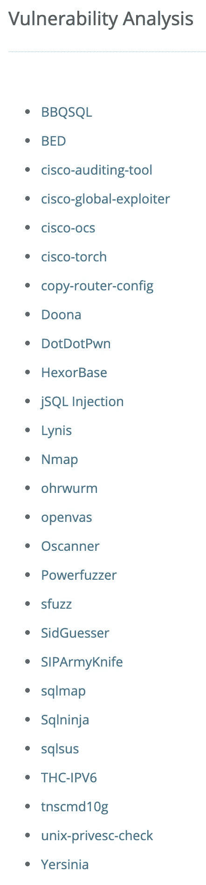
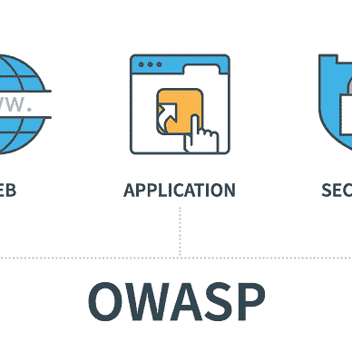

# 系统脆弱性分析

> 原文：<https://levelup.gitconnected.com/ethical-hacking-part-8-vulnerability-analysis-47f818405760>

## 了解风险以防止攻击的道德黑客技术—指纹识别和高级网络映射器(Nmap)


漏洞分析是道德黑客和渗透测试的重要组成部分。**指纹识别**指的是可以用来识别网络协议、操作系统、硬件设备、软件等的一组信息。道德黑客和笔测试人员使用“**指纹**”作为他们攻击的第一步，来收集关于他们目标的信息。有许多工具可以做到这一点，但我将介绍可能是最流行和最著名的一种。

# 介绍 Nmap

网络映射器(Nmap)是一个免费的开源网络扫描器。它是一个非常强大的工具，并且非常常用。

为了跟随这篇教程，我推荐阅读我的另外两篇文章:

*   [道德黑客(上):OWASP 十大和 DVWA](/ethical-hacking-part-1-owasp-top-10-and-dvwa-3f2d55580ba8?source=your_stories_page-------------------------------------)
*   [道德黑客(第二部分):Kali Linux 简介](/ethical-hacking-part-2-introducing-kali-linux-37362fafe28b)

目标是使用 Apache 和 PHP 安装带有[该死的易受攻击的 Web 应用程序](http://www.dvwa.co.uk/) ( [DVWA](http://www.dvwa.co.uk/) )的 Linux 系统。Nmap 可以安装在所有的 Linux 系统上，但是它作为标准与 Kali 捆绑在一起。

让我们看看帮助文件，了解一下它的作用…

```
kali@kali:~$ **nmap**
Nmap 7.91 ( [https://nmap.org](https://nmap.org) )
Usage: nmap [Scan Type(s)] [Options] {target specification}
TARGET SPECIFICATION:
  Can pass hostnames, IP addresses, networks, etc.
  Ex: scanme.nmap.org, microsoft.com/24, 192.168.0.1; 10.0.0-255.1-254
  -iL <inputfilename>: Input from list of hosts/networks
  -iR <num hosts>: Choose random targets
  --exclude <host1[,host2][,host3],...>: Exclude hosts/networks
  --excludefile <exclude_file>: Exclude list from file
HOST DISCOVERY:
  -sL: List Scan - simply list targets to scan
  -sn: Ping Scan - disable port scan
  -Pn: Treat all hosts as online -- skip host discovery
  -PS/PA/PU/PY[portlist]: TCP SYN/ACK, UDP or SCTP discovery to given ports
  -PE/PP/PM: ICMP echo, timestamp, and netmask request discovery probes
  -PO[protocol list]: IP Protocol Ping
  -n/-R: Never do DNS resolution/Always resolve [default: sometimes]
  --dns-servers <serv1[,serv2],...>: Specify custom DNS servers
  --system-dns: Use OS's DNS resolver
  --traceroute: Trace hop path to each host
SCAN TECHNIQUES:
  -sS/sT/sA/sW/sM: TCP SYN/Connect()/ACK/Window/Maimon scans
  -sU: UDP Scan
  -sN/sF/sX: TCP Null, FIN, and Xmas scans
  --scanflags <flags>: Customize TCP scan flags
  -sI <zombie host[:probeport]>: Idle scan
  -sY/sZ: SCTP INIT/COOKIE-ECHO scans
  -sO: IP protocol scan
  -b <FTP relay host>: FTP bounce scan
PORT SPECIFICATION AND SCAN ORDER:
  -p <port ranges>: Only scan specified ports
    Ex: -p22; -p1-65535; -p U:53,111,137,T:21-25,80,139,8080,S:9
  --exclude-ports <port ranges>: Exclude the specified ports from scanning
  -F: Fast mode - Scan fewer ports than the default scan
  -r: Scan ports consecutively - don't randomize
  --top-ports <number>: Scan <number> most common ports
  --port-ratio <ratio>: Scan ports more common than <ratio>
SERVICE/VERSION DETECTION:
  -sV: Probe open ports to determine service/version info
  --version-intensity <level>: Set from 0 (light) to 9 (try all probes)
  --version-light: Limit to most likely probes (intensity 2)
  --version-all: Try every single probe (intensity 9)
  --version-trace: Show detailed version scan activity (for debugging)
SCRIPT SCAN:
  -sC: equivalent to --script=default
  --script=<Lua scripts>: <Lua scripts> is a comma separated list of
           directories, script-files or script-categories
  --script-args=<n1=v1,[n2=v2,...]>: provide arguments to scripts
  --script-args-file=filename: provide NSE script args in a file
  --script-trace: Show all data sent and received
  --script-updatedb: Update the script database.
  --script-help=<Lua scripts>: Show help about scripts.
           <Lua scripts> is a comma-separated list of script-files or
           script-categories.
OS DETECTION:
  -O: Enable OS detection
  --osscan-limit: Limit OS detection to promising targets
  --osscan-guess: Guess OS more aggressively
TIMING AND PERFORMANCE:
  Options which take <time> are in seconds, or append 'ms' (milliseconds),
  's' (seconds), 'm' (minutes), or 'h' (hours) to the value (e.g. 30m).
  -T<0-5>: Set timing template (higher is faster)
  --min-hostgroup/max-hostgroup <size>: Parallel host scan group sizes
  --min-parallelism/max-parallelism <numprobes>: Probe parallelization
  --min-rtt-timeout/max-rtt-timeout/initial-rtt-timeout <time>: Specifies
      probe round trip time.
  --max-retries <tries>: Caps number of port scan probe retransmissions.
  --host-timeout <time>: Give up on target after this long
  --scan-delay/--max-scan-delay <time>: Adjust delay between probes
  --min-rate <number>: Send packets no slower than <number> per second
  --max-rate <number>: Send packets no faster than <number> per second
FIREWALL/IDS EVASION AND SPOOFING:
  -f; --mtu <val>: fragment packets (optionally w/given MTU)
  -D <decoy1,decoy2[,ME],...>: Cloak a scan with decoys
  -S <IP_Address>: Spoof source address
  -e <iface>: Use specified interface
  -g/--source-port <portnum>: Use given port number
  --proxies <url1,[url2],...>: Relay connections through HTTP/SOCKS4 proxies
  --data <hex string>: Append a custom payload to sent packets
  --data-string <string>: Append a custom ASCII string to sent packets
  --data-length <num>: Append random data to sent packets
  --ip-options <options>: Send packets with specified ip options
  --ttl <val>: Set IP time-to-live field
  --spoof-mac <mac address/prefix/vendor name>: Spoof your MAC address
  --badsum: Send packets with a bogus TCP/UDP/SCTP checksum
OUTPUT:
  -oN/-oX/-oS/-oG <file>: Output scan in normal, XML, s|<rIpt kIddi3,
     and Grepable format, respectively, to the given filename.
  -oA <basename>: Output in the three major formats at once
  -v: Increase verbosity level (use -vv or more for greater effect)
  -d: Increase debugging level (use -dd or more for greater effect)
  --reason: Display the reason a port is in a particular state
  --open: Only show open (or possibly open) ports
  --packet-trace: Show all packets sent and received
  --iflist: Print host interfaces and routes (for debugging)
  --append-output: Append to rather than clobber specified output files
  --resume <filename>: Resume an aborted scan
  --stylesheet <path/URL>: XSL stylesheet to transform XML output to HTML
  --webxml: Reference stylesheet from Nmap.Org for more portable XML
  --no-stylesheet: Prevent associating of XSL stylesheet w/XML output
MISC:
  -6: Enable IPv6 scanning
  -A: Enable OS detection, version detection, script scanning, and traceroute
  --datadir <dirname>: Specify custom Nmap data file location
  --send-eth/--send-ip: Send using raw ethernet frames or IP packets
  --privileged: Assume that the user is fully privileged
  --unprivileged: Assume the user lacks raw socket privileges
  -V: Print version number
  -h: Print this help summary page.
EXAMPLES:
  nmap -v -A scanme.nmap.org
  nmap -v -sn 192.168.0.0/16 10.0.0.0/8
  nmap -v -iR 10000 -Pn -p 80
SEE THE MAN PAGE ([https://nmap.org/book/man.html](https://nmap.org/book/man.html)) FOR MORE OPTIONS AND EXAMPLES
```

如你所见，有很多选项。

我认为最有用的三个是…

```
SERVICE/VERSION DETECTION:
  -sV: Probe open ports to determine service/version infoSCRIPT SCAN:
  -sC: equivalent to --script=default
  --script=<Lua scripts>: <Lua scripts> is a comma separated list of
           directories, script-files or script-categoriesOS DETECTION:
  -O: Enable OS detection
  --osscan-limit: Limit OS detection to promising targets
  --osscan-guess: Guess OS more aggressively
```

我知道很多使用 Nmap 的人不知道您也可以向“ **Nmap 脚本引擎(NSE)** ”提供脚本。比如“**—script = http-PHP-version**”。

我将扫描当前运行 DVWA 的 Kali 实例。让我们看看它发现了什么…

```
kali@kali:~$ **nmap -sV --script=http-php-version localhost**
Starting Nmap 7.91 ( [https://nmap.org](https://nmap.org) ) at 2020-10-16 22:57 BST
Nmap scan report for localhost (127.0.0.1)
Host is up (0.000051s latency).
Other addresses for localhost (not scanned): ::1
Not shown: 997 closed ports
PORT     STATE SERVICE VERSION
22/tcp   open  ssh     **OpenSSH 8.3p1 Debian 1 (protocol 2.0)**
80/tcp   open  http    **Apache httpd 2.4.46 ((Debian))**
|_http-server-header: **Apache/2.4.46 (Debian)**
3306/tcp open  mysql   **MySQL 5.5.5-10.3.24-MariaDB-2**
Service Info: **OS: Linux; CPE: cpe:/o:linux:linux_kernel**Service detection performed. Please report any incorrect results at [https://nmap.org/submit/](https://nmap.org/submit/) .
Nmap done: 1 IP address (1 host up) scanned in 6.88 seconds
```

这是来自单次扫描的大量信息。如果你在[漏洞数据库](https://www.exploit-db.com/)中查找或者在 Metasploit 中搜索它们，你一定会发现漏洞。

Nmap 不需要一次扫描一台主机。您可以异步扫描多个主机和端口，向其传递要扫描的主机和端口列表，或者扫描整个子网。

我们已经发现神经元特异性烯醇化酶是 Nmap 的一个非常强大的部分，但是有多少呢？nse 剧本有了？

```
kali@kali:~$ **locate *.nse | wc -l**
603
```

603 个 NSE 脚本！我不会在这里列出它们，但这应该会让您对可用的内容有所了解。我将只列出 HTTP 的内容。

```
kali@kali:~$ **locate *.nse | grep http**
/usr/share/nmap/scripts/http-adobe-coldfusion-apsa1301.nse
/usr/share/nmap/scripts/http-affiliate-id.nse
/usr/share/nmap/scripts/http-apache-negotiation.nse
/usr/share/nmap/scripts/http-apache-server-status.nse
/usr/share/nmap/scripts/http-aspnet-debug.nse
/usr/share/nmap/scripts/http-auth-finder.nse
/usr/share/nmap/scripts/http-auth.nse
/usr/share/nmap/scripts/http-avaya-ipoffice-users.nse
/usr/share/nmap/scripts/http-awstatstotals-exec.nse
/usr/share/nmap/scripts/http-axis2-dir-traversal.nse
/usr/share/nmap/scripts/http-backup-finder.nse
/usr/share/nmap/scripts/http-barracuda-dir-traversal.nse
/usr/share/nmap/scripts/http-bigip-cookie.nse
/usr/share/nmap/scripts/http-brute.nse
/usr/share/nmap/scripts/http-cakephp-version.nse
/usr/share/nmap/scripts/http-chrono.nse
/usr/share/nmap/scripts/http-cisco-anyconnect.nse
/usr/share/nmap/scripts/http-coldfusion-subzero.nse
/usr/share/nmap/scripts/http-comments-displayer.nse
/usr/share/nmap/scripts/http-config-backup.nse
/usr/share/nmap/scripts/http-cookie-flags.nse
/usr/share/nmap/scripts/http-cors.nse
/usr/share/nmap/scripts/http-cross-domain-policy.nse
/usr/share/nmap/scripts/http-csrf.nse
/usr/share/nmap/scripts/http-date.nse
/usr/share/nmap/scripts/http-default-accounts.nse
/usr/share/nmap/scripts/http-devframework.nse
/usr/share/nmap/scripts/http-dlink-backdoor.nse
/usr/share/nmap/scripts/http-dombased-xss.nse
/usr/share/nmap/scripts/http-domino-enum-passwords.nse
/usr/share/nmap/scripts/http-drupal-enum-users.nse
/usr/share/nmap/scripts/http-drupal-enum.nse
/usr/share/nmap/scripts/http-enum.nse
/usr/share/nmap/scripts/http-errors.nse
/usr/share/nmap/scripts/http-exif-spider.nse
/usr/share/nmap/scripts/http-favicon.nse
/usr/share/nmap/scripts/http-feed.nse
/usr/share/nmap/scripts/http-fetch.nse
/usr/share/nmap/scripts/http-fileupload-exploiter.nse
/usr/share/nmap/scripts/http-form-brute.nse
/usr/share/nmap/scripts/http-form-fuzzer.nse
/usr/share/nmap/scripts/http-frontpage-login.nse
/usr/share/nmap/scripts/http-generator.nse
/usr/share/nmap/scripts/http-git.nse
/usr/share/nmap/scripts/http-gitweb-projects-enum.nse
/usr/share/nmap/scripts/http-google-malware.nse
/usr/share/nmap/scripts/http-grep.nse
/usr/share/nmap/scripts/http-headers.nse
/usr/share/nmap/scripts/http-hp-ilo-info.nse
/usr/share/nmap/scripts/http-huawei-hg5xx-vuln.nse
/usr/share/nmap/scripts/http-icloud-findmyiphone.nse
/usr/share/nmap/scripts/http-icloud-sendmsg.nse
/usr/share/nmap/scripts/http-iis-short-name-brute.nse
/usr/share/nmap/scripts/http-iis-webdav-vuln.nse
/usr/share/nmap/scripts/http-internal-ip-disclosure.nse
/usr/share/nmap/scripts/http-joomla-brute.nse
/usr/share/nmap/scripts/http-jsonp-detection.nse
/usr/share/nmap/scripts/http-litespeed-sourcecode-download.nse
/usr/share/nmap/scripts/http-ls.nse
/usr/share/nmap/scripts/http-majordomo2-dir-traversal.nse
/usr/share/nmap/scripts/http-malware-host.nse
/usr/share/nmap/scripts/http-mcmp.nse
/usr/share/nmap/scripts/http-method-tamper.nse
/usr/share/nmap/scripts/http-methods.nse
/usr/share/nmap/scripts/http-mobileversion-checker.nse
/usr/share/nmap/scripts/http-ntlm-info.nse
/usr/share/nmap/scripts/http-open-proxy.nse
/usr/share/nmap/scripts/http-open-redirect.nse
/usr/share/nmap/scripts/http-passwd.nse
/usr/share/nmap/scripts/http-php-version.nse
/usr/share/nmap/scripts/http-phpmyadmin-dir-traversal.nse
/usr/share/nmap/scripts/http-phpself-xss.nse
/usr/share/nmap/scripts/http-proxy-brute.nse
/usr/share/nmap/scripts/http-put.nse
/usr/share/nmap/scripts/http-qnap-nas-info.nse
/usr/share/nmap/scripts/http-referer-checker.nse
/usr/share/nmap/scripts/http-rfi-spider.nse
/usr/share/nmap/scripts/http-robots.txt.nse
/usr/share/nmap/scripts/http-robtex-reverse-ip.nse
/usr/share/nmap/scripts/http-robtex-shared-ns.nse
/usr/share/nmap/scripts/http-sap-netweaver-leak.nse
/usr/share/nmap/scripts/http-security-headers.nse
/usr/share/nmap/scripts/http-server-header.nse
/usr/share/nmap/scripts/http-shellshock.nse
/usr/share/nmap/scripts/http-sitemap-generator.nse
/usr/share/nmap/scripts/http-slowloris-check.nse
/usr/share/nmap/scripts/http-slowloris.nse
/usr/share/nmap/scripts/http-sql-injection.nse
/usr/share/nmap/scripts/http-stored-xss.nse
/usr/share/nmap/scripts/http-svn-enum.nse
/usr/share/nmap/scripts/http-svn-info.nse
/usr/share/nmap/scripts/http-title.nse
/usr/share/nmap/scripts/http-tplink-dir-traversal.nse
/usr/share/nmap/scripts/http-trace.nse
/usr/share/nmap/scripts/http-traceroute.nse
/usr/share/nmap/scripts/http-trane-info.nse
/usr/share/nmap/scripts/http-unsafe-output-escaping.nse
/usr/share/nmap/scripts/http-useragent-tester.nse
/usr/share/nmap/scripts/http-userdir-enum.nse
/usr/share/nmap/scripts/http-vhosts.nse
/usr/share/nmap/scripts/http-virustotal.nse
/usr/share/nmap/scripts/http-vlcstreamer-ls.nse
/usr/share/nmap/scripts/http-vmware-path-vuln.nse
/usr/share/nmap/scripts/http-vuln-cve2006-3392.nse
/usr/share/nmap/scripts/http-vuln-cve2009-3960.nse
/usr/share/nmap/scripts/http-vuln-cve2010-0738.nse
/usr/share/nmap/scripts/http-vuln-cve2010-2861.nse
/usr/share/nmap/scripts/http-vuln-cve2011-3192.nse
/usr/share/nmap/scripts/http-vuln-cve2011-3368.nse
/usr/share/nmap/scripts/http-vuln-cve2012-1823.nse
/usr/share/nmap/scripts/http-vuln-cve2013-0156.nse
/usr/share/nmap/scripts/http-vuln-cve2013-6786.nse
/usr/share/nmap/scripts/http-vuln-cve2013-7091.nse
/usr/share/nmap/scripts/http-vuln-cve2014-2126.nse
/usr/share/nmap/scripts/http-vuln-cve2014-2127.nse
/usr/share/nmap/scripts/http-vuln-cve2014-2128.nse
/usr/share/nmap/scripts/http-vuln-cve2014-2129.nse
/usr/share/nmap/scripts/http-vuln-cve2014-3704.nse
/usr/share/nmap/scripts/http-vuln-cve2014-8877.nse
/usr/share/nmap/scripts/http-vuln-cve2015-1427.nse
/usr/share/nmap/scripts/http-vuln-cve2015-1635.nse
/usr/share/nmap/scripts/http-vuln-cve2017-1001000.nse
/usr/share/nmap/scripts/http-vuln-cve2017-5638.nse
/usr/share/nmap/scripts/http-vuln-cve2017-5689.nse
/usr/share/nmap/scripts/http-vuln-cve2017-8917.nse
/usr/share/nmap/scripts/http-vuln-misfortune-cookie.nse
/usr/share/nmap/scripts/http-vuln-wnr1000-creds.nse
/usr/share/nmap/scripts/http-waf-detect.nse
/usr/share/nmap/scripts/http-waf-fingerprint.nse
/usr/share/nmap/scripts/http-webdav-scan.nse
/usr/share/nmap/scripts/http-wordpress-brute.nse
/usr/share/nmap/scripts/http-wordpress-enum.nse
/usr/share/nmap/scripts/http-wordpress-users.nse
/usr/share/nmap/scripts/http-xssed.nse
/usr/share/nmap/scripts/https-redirect.nse
/usr/share/nmap/scripts/ip-https-discover.nse
/usr/share/nmap/scripts/membase-http-info.nse
/usr/share/nmap/scripts/riak-http-info.nse
```

关于如何使用每个脚本的信息位于每个脚本文件的顶部。例如，如果我想知道如何使用“ **http-csrf.nse** ”脚本，这就是用法信息。

```
---
-- [@usage](http://twitter.com/usage) **nmap -p80 --script http-csrf.nse <target>**
--
-- [@args](http://twitter.com/args) http-csrf.singlepages The pages that contain the forms to check.
--       For example, {/upload.php,  /login.php}. Default: nil (crawler
--       mode on)
-- [@args](http://twitter.com/args) http-csrf.checkentropy If this is set the script will also calculate
--       the entropy of the field's value to determine if it is a token,
--       rather than just checking its name. Default: true
--
-- [@output](http://twitter.com/output)
-- PORT   STATE SERVICE REASON
-- 80/tcp open  http    syn-ack
-- | http-csrf:
-- | Spidering limited to: maxdepth=3; maxpagecount=20; withinhost=some-very-random-page.com
-- |   Found the following CSRF vulnerabilities:
-- |
-- |     Path: [http://www.example.com/](http://www.example.com/)
-- |     Form id: search_bar_input
-- |     Form action: /search
-- |
-- |     Path: [http://www.example.com/c/334/watches.html](http://www.example.com/c/334/watches.html)
-- |     Form id: custom_price_filters
-- |     Form action: /search
-- |
-- |     Path: [http://www.example.com/c/334/watches.html](http://www.example.com/c/334/watches.html)
-- |     Form id: custom_price_filters
-- |_    Form action: /c/334/rologia-xeiros-watches.html
--
---
```

如果您有兴趣进一步探索漏洞分析，我推荐您看一看 [Kali Linux 工具清单](https://tools.kali.org/tools-listing)。



**为了进一步阅读，请查看我写的关于这个话题的 19 个故事。**


迈克尔·惠特尔

## 道德黑客培训课程

[View list](https://whittle.medium.com/list/ethical-hacking-training-course-710769700b83?source=post_page-----47f818405760--------------------------------)19 stories

# 迈克尔·惠特尔

*   ***如果你喜欢这个，请*** [***跟我上媒***](https://whittle.medium.com/)
*   ***更多有趣的文章，请*** [***关注我的刊物***](https://medium.com/trading-data-analysis)
*   ***有兴趣合作吗？*** [***我们来连线 LinkedIn 上的***](https://www.linkedin.com/in/miwhittle/)
*   ***支持我和其他媒体作者*** [***在此报名***](https://whittle.medium.com/membership)
*   ***请别忘了为文章鼓掌:)←谢谢！***