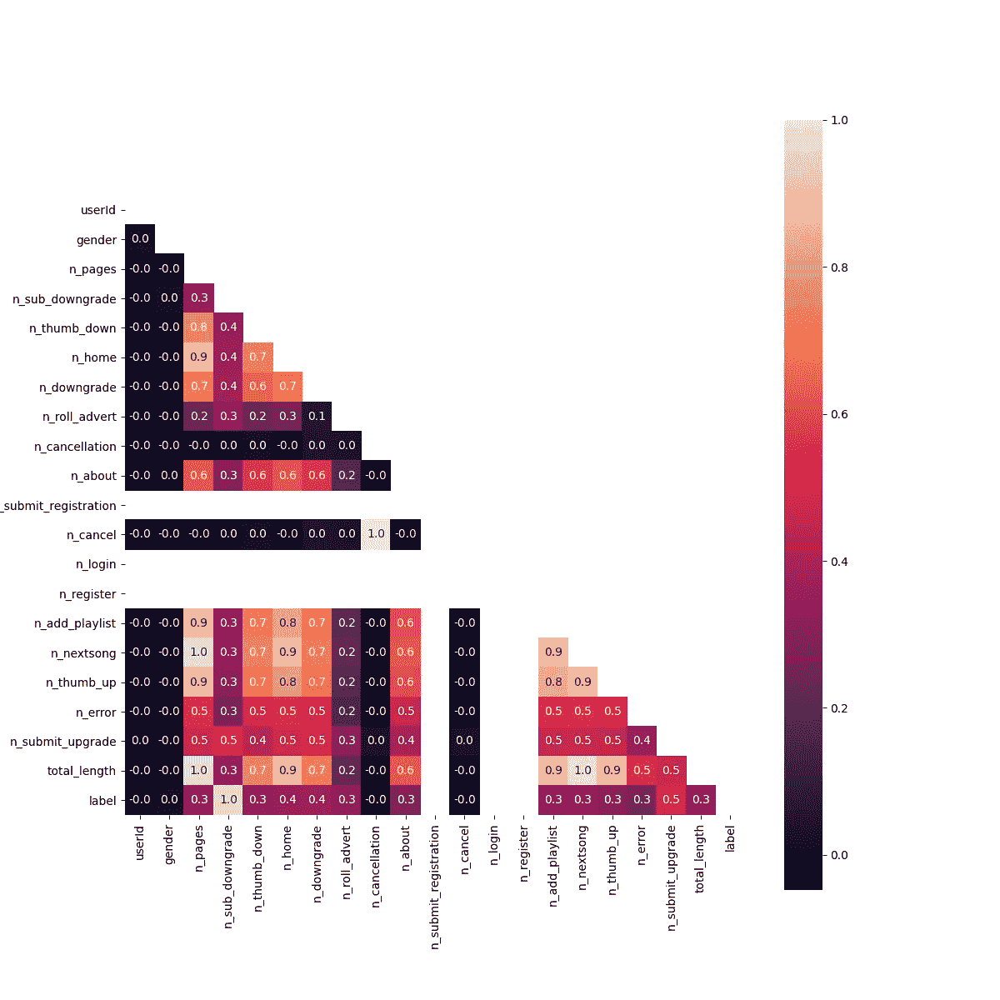
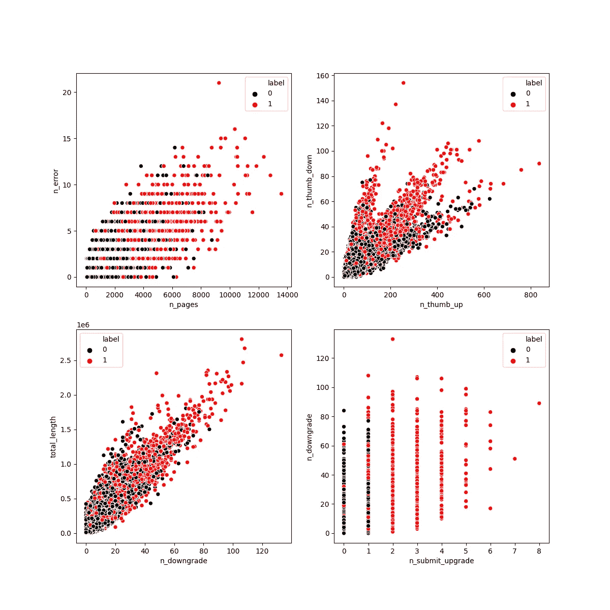
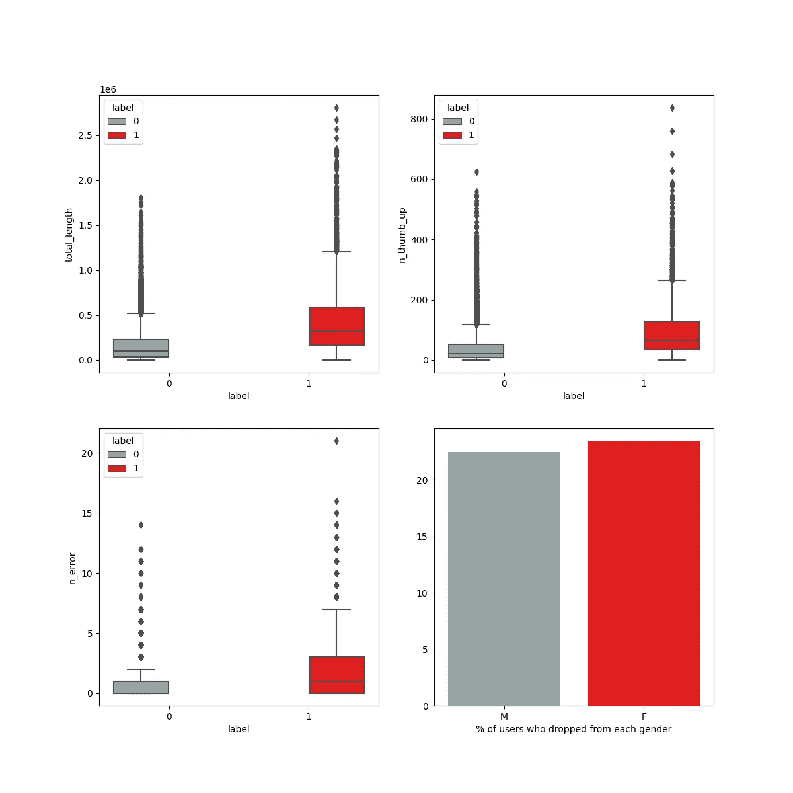
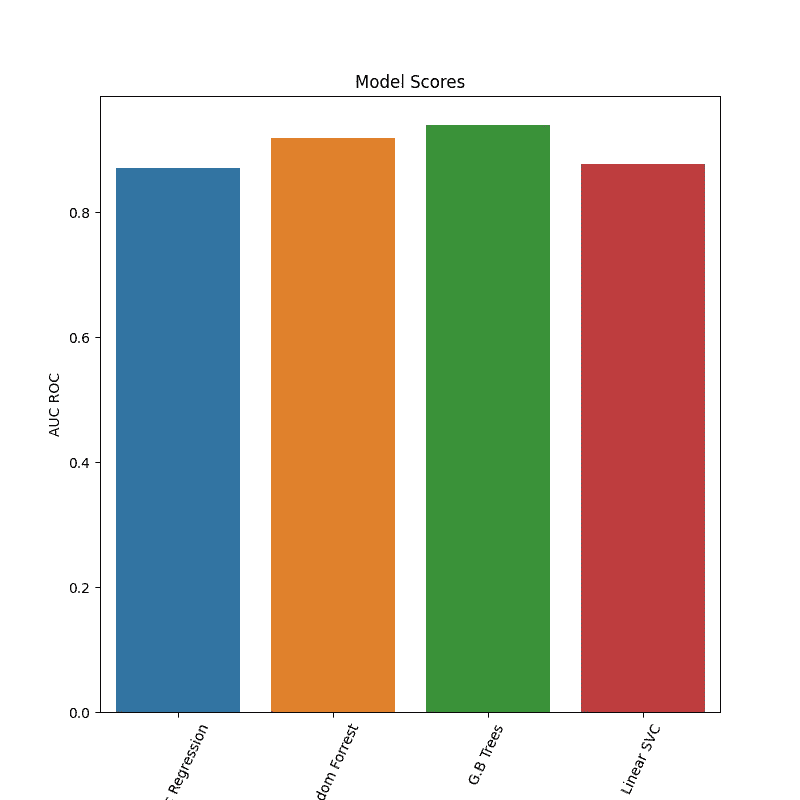
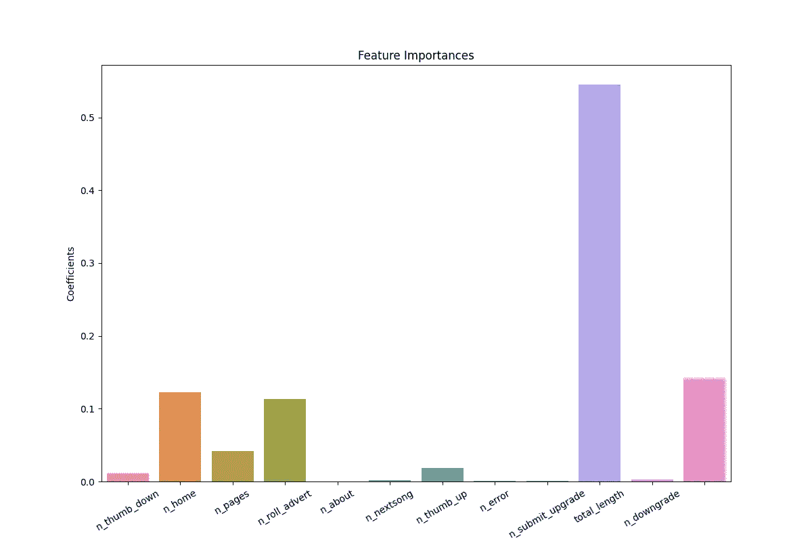

# 在 AWS 上使用 Pyspark 进行 ETL 和机器学习

> 原文：<https://levelup.gitconnected.com/etl-and-machine-learning-using-pyspark-on-aws-d4e0ed35bfdd>

我已经使用 AWS EMR 服务为数据集开发了 ETL、EDA 和 ML 管道。我正在分享我的管道来帮助其他开发者，同时也收到一些建设性的反馈(非常感谢)。关于 Jupyter 笔记本和建议，请查看我的 GitHub repo:

[https://github.com/armand-hoxha25/DSND_Capstone](https://github.com/armand-hoxha25/DSND_Capstone)

# AWS 设置

对于这个数据集，我使用以下配置创建了一个 AWS EMR:

*   **3 个 m5.xlarge，** 4 个 vCore，16 GiB 内存，仅 EBS 存储，EBS 存储:64 GiB
*   软件包括:Hive 2.3.6，Pig 0.17.0，Hue 4.4.0，Spark 2.4.4，Livy 0.6.0

我还建议使用以下配置 JSON:

[{"classification":"livy-conf "，" properties ":{ " livy . server . session . time out ":" 8h " }，" configurations":[]}，{"classification":"spark "，" properties ":{ " spark . executor . memory ":" 8g "，" spark.driver.memory":"24g "，" spark . py spark . virtualenv . enabled ":" True " }，" configurations":[]}]

上面的配置将允许您运行超过一个小时的执行计算，允许 Spark 使用 24GB 的内存，并允许虚拟环境从 PyPi 安装包。

# 导入库

我将使用的主要库是 Pyspark，目的是在 AWS EMR 集群上运行它，因为数据大约为 16GB，无法一次加载到大多数计算机的内存中(有分块加载数据的步骤，但这超出了本项目的范围)。我将使用 PySpark 加载数据，清理，特征提取以及机器学习。对于一些 EDA，我将使用 Pandas、Numpy、Matplotlib 和 Seaborn 在特征提取之后，我期望数据大小被显著减小，以便它可以被加载到存储器中。一旦数据在内存中变得更容易读取，使用 pandas 和其他图形库来显示结果就更容易了。

```
from pyspark.sql import SparkSession
from pyspark.sql import functions as F
from pyspark.sql.types import *
from pyspark.ml.feature import MinMaxScaler
from pyspark.sql import types as T
from pyspark.ml.linalg import Vectors, VectorUDT
from pyspark.sql.functions import lit, udf, struct, countDistinct, collect_list, avg, count, col
from pyspark.sql.types import ArrayType, BooleanType, LongType, FloatType
from pyspark.ml.feature import VectorAssembler
from pyspark.ml.evaluation import BinaryClassificationEvaluator
from pyspark.ml.classification import LogisticRegression
from pyspark.ml.classification import GBTClassifier
from pyspark.sql.functions import *

# Create spark session
spark = SparkSession \
    .builder \
    .appName("Sparkify") \
    .getOrCreate()
spark.sparkContext.install_pypi_package("pandas")
spark.sparkContext.install_pypi_package("sklearn")
spark.sparkContext.install_pypi_package("matplotlib")
spark.sparkContext.install_pypi_package("seaborn")
import numpy as np
import pandas as pd
from sklearn.metrics import roc_curve
import matplotlib.pyplot as plt
import seaborn as sns
```

# 输入数据

我最初导入了名为`**mini_sparkify_event_data.json**`的小数据集，我使用这个小数据集是为了在我的本地计算机上开发我的初始工作流。当我接近完成我的项目时，我在 AWS EMR 集群上使用了完整的数据集。

```
event_data = "s3n://udacity-dsnd/sparkify/sparkify_event_data.json"
df = spark.read.json(event_data)
df.createOrReplaceTempView("data")
print('shape of data is {}, {}'.format(df.count(),len(df.columns)))shape of data is 26259199, 18
```

数据是什么样的？查看模式将有助于理解列。

```
df.printSchema()
root
 |-- artist: string (nullable = true)
 |-- auth: string (nullable = true)
 |-- firstName: string (nullable = true)
 |-- gender: string (nullable = true)
 |-- itemInSession: long (nullable = true)
 |-- lastName: string (nullable = true)
 |-- length: double (nullable = true)
 |-- level: string (nullable = true)
 |-- location: string (nullable = true)
 |-- method: string (nullable = true)
 |-- page: string (nullable = true)
 |-- registration: long (nullable = true)
 |-- sessionId: long (nullable = true)
 |-- song: string (nullable = true)
 |-- status: long (nullable = true)
 |-- ts: long (nullable = true)
 |-- userAgent: string (nullable = true)
 |-- userId: string (nullable = true)
```

一个条目看起来像什么？

```
df.head(1)[Row(artist='Popol Vuh', auth='Logged In', firstName='Shlok', gender='M', itemInSession=278, lastName='Johnson', length=524.32934, level='paid', location='Dallas-Fort Worth-Arlington, TX', method='PUT', page='NextSong', registration=1533734541000, sessionId=22683, song='Ich mache einen Spiegel - Dream Part 4', status=200, ts=1538352001000, userAgent='"Mozilla/5.0 (Windows NT 6.1; WOW64) AppleWebKit/537.36 (KHTML, like Gecko) Chrome/36.0.1985.143 Safari/537.36"', userId='1749042')]
```

我们可以看到，每一行都包含非常有用的信息，比如级别、页面，以及一些我们不知道有多大用处的信息，比如性别、ts 和 itemInSession。还有一些我不会使用的列，比如名字、姓氏、位置、方法、注册、状态、用户代理。
**userId** 将是用于为每个用户提取特性的密钥。

# 缺少值

```
predrop=df.count()
df=df.dropna()
postdrop = df.count()
print('{} rows were dropped, NaNs account for {} % of the data'\
      .format(predrop-postdrop,100*(predrop-postdrop)/predrop))
# there are no NaNs5408927 rows were dropped, NaNs account for 20.59821779026847 % of the data
```

# 删除列

我不打算使用这些数据中的所有栏目，其中一些栏目无助于得出各组之间的统计差异，只会给数据增加不必要的信息。

```
drop_columns =['artist', 'firstName','lastName','song', 'useAgent','location','method',\
               'registration']
for col in drop_columns:
    df=df.drop(col)
```

# 特征工程

在这个数据集中，用户的动作被描绘在`page`列中。以下是页面列的所有可能值:

```
pages=[x.page for x in spark.sql('''SELECT DISTINCT(page) FROM data''').collect()]
print(pages)['Cancel', 'Submit Downgrade', 'Thumbs Down', 'Home', 'Downgrade', 'Roll Advert', 'Logout', 'Save Settings', 'Cancellation Confirmation', 'About', 'Submit Registration', 'Settings', 'Login', 'Register', 'Add to Playlist', 'Add Friend', 'NextSong', 'Thumbs Up', 'Help', 'Upgrade', 'Error', 'Submit Upgrade']
```

“流失”指标是当用户进入“提交降级”页面，有效地将他们的帐户级别从“付费”降至“免费”。在这些数据中，我们只对使用“付费”服务的用户感兴趣。

鉴于用户操作将构成该数据集中的要素，我通过计算用户完成每个操作的次数以及他们使用该应用程序的总时间来创建要素数据框架。

```
labeler = lambda x: 1 if x>0 else 0 # a small function o generate labels
                                    #if a user goes through the submit downgrade page
labelfunc = F.udf(labeler,IntegerType())
convert_to_int=F.udf(int,IntegerType())
# this SQL Query will take care of the feature exctraction from the data
features=spark.sql('''
SELECT BIGINT(userId),
gender,
BIGINT(COUNT(page)) AS n_pages,
BIGINT(COUNT(IF(page='Submit Downgrade',1,NULL))) AS n_sub_downgrade,
BIGINT(COUNT(IF(page='Thumbs Down',1,NULL))) AS n_thumb_down,
BIGINT(COUNT(IF(page='Home',1,NULL))) AS n_home,
BIGINT(COUNT(IF(page='Downgrade',1,NULL))) AS n_downgrade,
BIGINT(COUNT(IF(page='Roll Advert',1,NULL))) AS n_roll_advert,
BIGINT(COUNT(IF(page='Cancellation Confirmation',1,NULL))) AS n_cancellation,
BIGINT(COUNT(IF(page='About',1,NULL))) AS n_about,
BIGINT(COUNT(IF(page='Submit Registration',1,NULL))) AS n_submit_registration,
BIGINT(COUNT(IF(page='Cancel',1,NULL))) AS n_cancel,
BIGINT(COUNT(IF(page='Login',1,NULL))) AS n_login,
BIGINT(COUNT(IF(page='Register',1,NULL))) AS n_register,
BIGINT(COUNT(IF(page='Add to Playlist',1,NULL))) AS n_add_playlist,
BIGINT(COUNT(IF(page='NextSong',1,NULL))) AS n_nextsong,
BIGINT(COUNT(IF(page='Thumbs Up',1,NULL))) AS n_thumb_up,
BIGINT(COUNT(IF(page='Error',1,NULL))) AS n_error,
BIGINT(COUNT(IF(page='Submit Upgrade',1,NULL))) AS n_submit_upgrade,
BIGINT(CEILING(SUM(length))) AS total_length
FROM data 
GROUP BY userId,gender
''')

features = features.withColumn("gender", F.when(F.col("gender")=="M", 0).otherwise(1))
features = features.withColumn("label",labelfunc("n_sub_downgrade"))
features.createOrReplaceTempView("features")
print("Nrows before dropping NaNs:",features.count())
features=features.dropna()
print("Nrows AFTER dropping NaNs:",features.count())Nrows before dropping NaNs: 22278
Nrows AFTER dropping NaNs: 22261features.printSchema()root
 |-- userId: long (nullable = true)
 |-- gender: integer (nullable = false)
 |-- n_pages: long (nullable = false)
 |-- n_sub_downgrade: long (nullable = false)
 |-- n_thumb_down: long (nullable = false)
 |-- n_home: long (nullable = false)
 |-- n_downgrade: long (nullable = false)
 |-- n_roll_advert: long (nullable = false)
 |-- n_cancellation: long (nullable = false)
 |-- n_about: long (nullable = false)
 |-- n_submit_registration: long (nullable = false)
 |-- n_cancel: long (nullable = false)
 |-- n_login: long (nullable = false)
 |-- n_register: long (nullable = false)
 |-- n_add_playlist: long (nullable = false)
 |-- n_nextsong: long (nullable = false)
 |-- n_thumb_up: long (nullable = false)
 |-- n_error: long (nullable = false)
 |-- n_submit_upgrade: long (nullable = false)
 |-- total_length: long (nullable = true)
 |-- label: integer (nullable = true)
```

# 电子设计自动化(Electronic Design Automation)

既然计算了特征矩阵，就很容易将这个较小的数据集导入 pandas，并利用 pandas dataframe 函数。

```
featuredf = features.toPandas()
```

## 特征相关性和差异

值得探索的是，我们的特征之间是否存在某种相关性，以及这些相关性在涉及用户是否感到不适时是否显著。

我选择使用肯德尔的 Tau 相关性，因为我更感兴趣的是事物是否倾向于向同一个方向移动，而不是以相同的量移动。

```
plt.figure(figsize=(12,12),facecolor='white')
corr = featuredf.corr(method='kendall')
mask = np.zeros_like(corr)
mask[np.triu_indices_from(mask)] = True
sns.heatmap(corr,annot=True, fmt='.1f', square=True, mask = mask)
%matplot plt #command needed to plot on AWS EMR
```



我们可以看到 n_add_playlist、n_nextsong、n_thump_up 和 n_length 等特征之间的明显相关性。这种相关性是有意义的，因为它们表示用户与服务交互的时间；因此，用户与服务的交互越多，他们的动作就越多，这也由 n_length 和 n_pages 的高相关性来表示。
我主要对`label`的相关性感兴趣，因为这是我试图预测的。我不会去调查 n _ sub _ downgrade(因为`label`是利用该专栏的信息得出的)。

```
plt.figure(figsize=(12,12),facecolor='white')
plt.subplot(2,2,1)
sns.scatterplot(x='n_pages',y='n_error',hue='label',data=featuredf,
               palette = ['#000000', '#FF0000'])
plt.subplot(2,2,2)
sns.scatterplot(x='n_thumb_up',y='n_thumb_down',hue='label',data=featuredf,
               palette = ['#000000', '#FF0000'])
plt.subplot(2,2,3)
sns.scatterplot(x='n_downgrade',y='total_length',hue='label',data=featuredf,
               palette = ['#000000', '#FF0000'])
plt.subplot(2,2,4)
sns.scatterplot(x='n_submit_upgrade',y='n_downgrade',hue='label',data=featuredf,
               palette = ['#000000', '#FF0000'])
%matplot plt
```



很难确定是否有一个直接的关联图，可以清楚地区分哪些用户会呕吐，哪些不会。但是从第四个情节来看，很明显，多次进入提交升级页面的用户以后有流失的趋势。这些用户可能正在争论是否升级到该平台。

```
plt.figure(figsize=(12,12),facecolor='white')
plt.subplot(2,2,1)
sns.boxplot(x='label',y='total_length',hue='label',data=featuredf,
               palette = ['#95a5a6', '#FF0000'])
plt.subplot(2,2,2)
sns.boxplot(x='label',y='n_thumb_up',hue='label',data=featuredf,
               palette = ['#95a5a6', '#FF0000'])
plt.subplot(2,2,3)
sns.boxplot(x='label',y='n_error',hue='label',data=featuredf,
               palette = ['#95a5a6', '#FF0000'])
plt.subplot(2,2,4)
gendersums=featuredf.groupby('gender').sum()
gendercount=featuredf.groupby('gender').count()
vals=100*gendersums['label']/gendercount['userId']
sns.barplot(x=['M' , 'F'],y=vals,
               palette = ['#95a5a6', '#FF0000'])
plt.xlabel('% of users who dropped from each gender');
%matplot plt
```



我们可以在这些图中观察到一些差异。流失的用户倾向于使用该服务的时间更长。这项服务正在努力留住用户。抱怨的用户也倾向于在服务中发现更多的错误。在我最初分析的数据子集中，显示女性用户比男性用户有更高的流失率，然而，在更大的数据集中，这两个比率几乎相等。

# 机器学习管道

## **管道&指标**

对于这个项目，我将使用一个以上的学习模型，并比较他们如何执行相互比较。

```
print("{} % of the users churned".format\
      (np.round(100*featuredf['label'].sum()/featuredf.shape[0],2)))22.92 % of the users churned
```

鉴于只有约 22%的用户表示不满，将准确性作为预测性能的衡量标准是不明智的。

我选择使用 ROC 曲线下的面积来对每个学习者的表现进行排名。ROC 曲线下的面积是使用真阳性率和假阳性率的图。当真阳性率最高时，面积最大，假阳性率最低。
在分类方面做得好的分类器将具有接近 1.0 的分数。如果 I 分类器的得分接近 0.5，那么它在分类方面做得很差。

## **车型**

我将使用 4 个模型进行拟合和分类。

*   逻辑回归
*   梯度提升树分类器
*   随机森林分类器
*   线性支持向量机

我选择这些算法是因为它们已经存在于 spark 框架中，并且它们有不同的分类方法。

逻辑回归基于将特征组合到回归模型中的能力，然后在最后应用逻辑函数来对回归模型的结果进行分类。
梯度提升树分类器是一种提升算法，它通过降低每次重复的错误率来调整其分离特征。
随机森林分类器是一种 bagging 算法。它由多个弱学习者组成，他们最终对样本的可能结果进行投票。拥有多个弱学习者通常可以防止过度适应，同时提供一个强学习者。
支持向量机试图通过使用所有可用的特征维度来分离类别。由此产生的 SVM 试图在离这两个类最远的地方画一条“线”。

```
from pyspark.ml import Pipeline
from pyspark.ml.classification import GBTClassifier, LogisticRegression, LinearSVC, RandomForestClassifier
from pyspark.ml.feature import VectorAssembler,MinMaxScaler
from pyspark.ml.tuning import CrossValidator, ParamGridBuilder
from pyspark.ml.evaluation import BinaryClassificationEvaluator
from sklearn.metrics import roc_curve,aucevaluator = BinaryClassificationEvaluator()lr = LogisticRegression(maxIter=10, regParam=0.3, elasticNetParam=0.8)
rf = RandomForestClassifier(labelCol="label", featuresCol="features", numTrees=10, seed = 20)
gbt = GBTClassifier(labelCol="label", featuresCol="features", maxIter=10, seed = 20)
lsvc = LinearSVC(maxIter=10, regParam=0.1)
model_list = [lr,rf,gbt,lsvc]
```

## 管道

流水线包括使用 `MinMaxScaler`缩放特征，然后使用 `VectorAssembler`收集特征。然后，数据将由学习模型拟合，模型将使用交叉验证进行调整，最佳模型将用于进一步评估。

```
columns = ['n_thumb_down','n_home','n_pages','n_roll_advert','n_about',\
'n_add_playlist','n_nextsong',\
'n_thumb_up','n_error','n_submit_upgrade','total_length', 'n_downgrade']
assembler = VectorAssembler(inputCols= columns,outputCol='features_stage1')
scaler = MinMaxScaler(inputCol="features_stage1", outputCol="features")
```

## 装配调谐

使用`ParamGrid`,我将调整选择用于评估的模型。

```
lrgrid=ParamGridBuilder()\
.addGrid(lr.maxIter,[5,10,15,20])\
.addGrid(lr.regParam,[0.1,0.3,0.5])\
.addGrid(lr.elasticNetParam,[0.3,0.5,0.8])\
.build()

rfgrid=ParamGridBuilder()\
.addGrid(rf.numTrees,[10,20,30,40,50])\
.addGrid(rf.maxDepth,[2,3,5])\
.build()

gbtgrid=ParamGridBuilder()\
.addGrid(gbt.maxIter,[5,10,15,20])\
.build()

lsvcgrid=ParamGridBuilder()\
.addGrid(lsvc.maxIter,[5,10,15,20])\
.addGrid(lsvc.regParam, [0.01,0.1,0.5])\
.build()

grids= [lrgrid, rfgrid, gbtgrid, lsvcgrid]
```

将数据分成 80%的训练和 20%的测试。

```
train = features.sampleBy("label",fractions={0:0.8,1:0.8},seed=1)
test = features.subtract(train)
```

## 培养

```
best_models = {}
model_names= ['Logistic Regression','Random Forrest', 'G.B Trees', 'Linear SVC']
plt.figure(figsize=(12,12))
#run through each model and perform tuning, then we perform AUC ROC Scoring and plotting
for n, model_name in enumerate(model_names):
    print(n,model_name)
    pipe=Pipeline(stages=[assembler,scaler, model_list[n]])
    crossval = CrossValidator(estimator=pipe,
                              estimatorParamMaps=grids[n],
                                    evaluator=BinaryClassificationEvaluator(),
                              numFolds=5)
    cvModel=crossval.fit(train)
    bestmodel=cvModel.bestModel
    predictions=bestmodel.transform(test)
    score = evaluator.evaluate(predictions,{evaluator.metricName: "areaUnderROC"})
    print(""+model_name+": " + str(score))
    #get all the variables in a dictionary to use later
    best_models[model_name]=bestmodel
    best_models[model_name+'_score']=score
    best_models[model_name+'_predictions_variables']=[prob,pred,labels]
```

**计分**

```
scores=[]
for model_name in model_names:
    scores.append(best_models[model_name+'_score'])
plt.figure(figsize=(8,8))
sns.barplot(x=np.linspace(1,len(scores),len(scores)),y=scores)
plt.xticks(ticks=np.linspace(0,len(scores)-1,len(scores)),labels=model_names, rotation=65)
plt.ylabel('AUC ROC')
plt.title('Model Scores')
%matplot plt
```



# 讨论

观察调整后每个模型的得分，其中 3 个模型的性能相当相似，只有一个模型的性能落后。

一个重要的问题是，我们能从模型中学到什么，有没有一个特征比其他的更重要？

看看随机森林模型，要素重要性是模型的一部分。

```
rfmodel=best_models['Random Forrest'].stages[-1]
rfmodel.featureImportancesSparseVector(12, {0: 0.0113, 1: 0.1226, 2: 0.0419, 3: 0.1136, 4: 0.0001, 5: 0.0017, 6: 0.0188, 7: 0.0011, 8: 0.0005, 9: 0.5448, 10: 0.0026, 11: 0.1411})
```

从特征重要性可以看出，特征 4、5 和 9 没有值，因此它们在建模和预测过程中没有帮助，不应该被认为是重要的。

```
xticks=columns
plt.figure(figsize=(12,8))
sns.barplot(x=np.linspace(0,len(xticks),len(xticks)+1),y=rfmodel.featureImportances.values)
plt.xticks(ticks=np.linspace(0,len(xticks),len(xticks)+1),labels=xticks, rotation=30)
plt.ylabel('Coefficients')
plt.title('Feature Importances')
%matplot plt
```



上图中有趣的是，用户使用服务的最有用的特征之一总长度。不幸的是，我们的音乐流服务似乎很难让其长期客户退出这项服务。虽然从前面的图表中我们可以看到，用户遇到的错误数量可能会导致客户流失，但在这里我们看到这不是一个决定性因素。

## 改进注意事项

这些特性可以用更多的领域知识来进一步改进。在 AWS 上，开发期间当前可用的是 120MB 和 16GB，在 AWS 上开发可能会很昂贵，但是在 AWS 上执行 EDA 和功能探索可以带来更深入的探索。

## 其他注释

我最初在 120MB 的数据集上运行管道，这允许我快速开发数据。

我在我的本地 Linux 机器上安装了 Spark 2.4.5，这样我就可以不用每小时都被充电了。这花了一些时间，但最终，我对能够在闲暇时探索而不必感到匆忙感到满意。我还必须使用 pip 安装 AWS 服务，这允许我从数据科学纳米学位项目的 AWS S3 存储桶中获取 120MB 数据集。
尽管我采取了所有这些先发制人的措施，但在设置 AWS EMR 集群以使其正常运行方面仍然存在一些困难，尤其是集群在 1 小时的活动后会进入睡眠状态，以及内存管理方面的问题。

谢谢你看我的帖子！