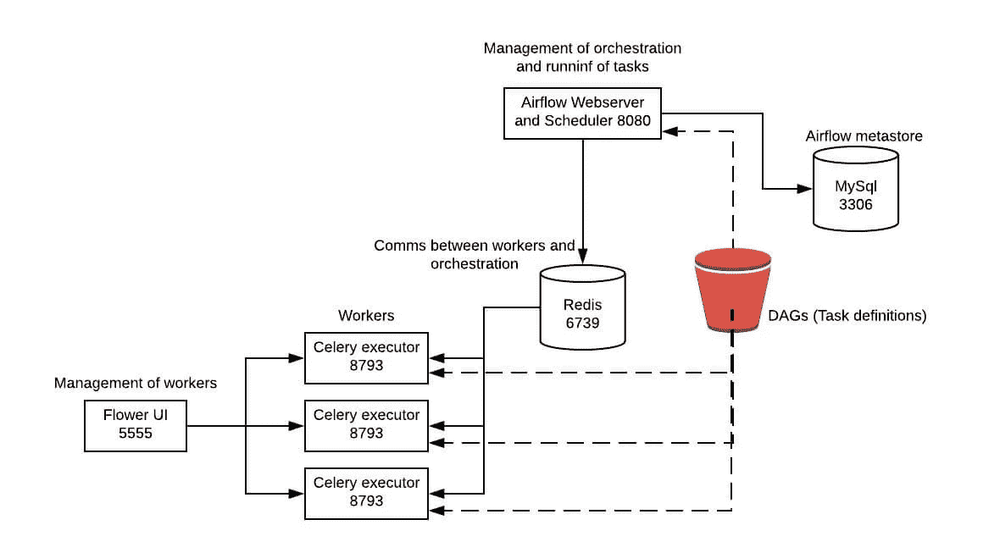

# 在 Docker 中使用芹菜执行器设置气流

> 原文：<https://levelup.gitconnected.com/etting-up-airflow-using-celery-executors-in-docker-8fcb94407ccc>


我最近接到一个任务，要建立一个阿帕奇气流的概念验证。

# 什么是阿帕奇气流？

Apache Airflow 是一个开源工具，用于编排复杂的计算工作流和数据处理管道。气流工作流被设计为有向无环图(DAG)。这意味着，当创作一个工作流时，你应该考虑如何将它分成可以独立执行的任务。

# 我的目标是学什么？

概念验证的目的是找出是否可以实现:

*   高度可用
*   可恢复的
*   可攀登的
*   能够从不同的 AWS 帐户推送和提取数据，因此能够在一个角色下运行

首先，我需要在集装箱环境中设置气流，以便能够勾掉一些点。这相对简单，虽然官方的 airflow docker 映像不是最容易设置的，但我最终还是建立了自己的 docker 文件，使用[https://github.com/puckel/docker-airflow](https://github.com/puckel/docker-airflow)作为指导方针。

```
FROM python:3.7-slim-stretchENV DEBIAN_FRONTEND noninteractive
RUN echo 1 > /dev/null
RUN apt-get update -yqq && apt-get upgrade -yqq && \
    apt-get install -yqq apt-utils && \
    apt-get install -yqq --no-install-recommends \
        freetds-dev libkrb5-dev libsasl2-dev libssl-dev libffi-dev libpq-dev git \
        freetds-bin \
        build-essential \
        default-libmysqlclient-dev \
        cron && \
    apt-get autoremove -yqq --purge && \
    apt-get clean && \
    rm -rf \
        /var/lib/apt/lists/* \
        /tmp/* \
        /var/tmp/* \
        /usr/share/man \
        /usr/share/doc \
        /usr/share/doc-baseRUN useradd -ms /bin/bash -d /usr/local/airflow airflow && \
    pip install -U pip setuptools wheel && \
    pip install pytz pyOpenSSL ndg-httpsclient pyasn1 awscli boto3RUN pip install apache-airflow[crypto,celery,postgres,hive,jdbc,mysql,ssh,redis,dynamodb]COPY airflow.cfg /usr/local/airflow/airflow/airflow.cfg
RUN chown -R airflow: /usr/local/airflow
COPY dags/* /usr/local/airflow/airflow/dags/EXPOSE 8080 5555 8793USER airflow
WORKDIR /usr/local/airflowUSER root
COPY init.sh /usr/local/airflow/init.sh
RUN chmod 755 /usr/local/airflow/init.shUSER airflowENTRYPOINT ["/bin/sh", "-c", "/usr/local/airflow/init.sh"]
```

默认情况下，airflow 似乎是以支持在单个实例上运行其所有任务的方式构建的，我需要它支持跨多个节点运行。快速搜索后，我发现使用`celery`运行是可能的，这是 python 开发人员熟悉的概念，但由于我没有编写大量的 python，对我来说是新的！

# 芹菜是什么？

Celery 是一个分布式任务队列，一个基于分布式消息传递的异步任务队列/作业队列。称为任务的执行单元是在一个或多个使用多处理、eventlet 或 gevent 的工作服务器上并发执行的。

在 airflow 中，可以使用 redis 或 rabbitMQ 进行工人和主人之间的交流。因为我的概念验证是在 AWS 中进行的，所以我很自然地使用了 redis，因为 AWS 将 redis 作为一项服务提供，而 rabbitMQ 我必须托管自己的服务。



# 初始化脚本

因为 airflow 使用相同的库和不同的可执行文件来运行 worker、webserver 等。我更新了 init 脚本，以便能够注入我想要运行的进程类型，但保持相同的基础映像。

```
if [ -z "$AIRFLOW_TYPE" ]
then
  echo "Set the airflow type to either 'WEBSERVER', 'FLOWER' or 'WORKER'"
  exit 1
fi# start airflow
if [ "$AIRFLOW_TYPE" = "WORKER" ]
then
  airflow workerelif [ "$AIRFLOW_TYPE" = "WEBSERVER" ]
then
  airflow scheduler & airflow webserver -p8080elif [ "$AIRFLOW_TYPE" = "FLOWER" ]
then
  airflow flower
fi
```

有一个想法是，应该有一个或多个工作者，但只有一个网络服务器或花卉实例

# 调查的结果

它很容易设置，只要您使用数据库后端并配置远程日志，它似乎涵盖了我们需要的所有领域，即

*   高度可用(在 AWS 的 ecs 中托管，具有 99.9%的 SLA)
*   可恢复的——不可变的容器，都连接到一个数据库实例并通过 redis 共享工作
*   可伸缩性——根据所需的工作负载无限增加容器数量的能力(根据运行容器的统计数据自动实现这一点应该很简单)
*   从不同的 AWS 帐户推送和提取数据的能力——这部分来自任务本身，我在网上读过很多关于如何做到这一点的内容。所以技术上是可能的，虽然我还没有机会证明这一点。

然后，我继续构建一个示例 DAG，它允许我从 S3 提取一个 CSV 文件，转换成 JSON，然后将结果存储在 dynamodb 存储中。

```
import datetime
import csv
import json
import os
import string
import random
from airflow import DAG
from airflow.hooks.S3_hook import S3Hook
from airflow.contrib.hooks.aws_dynamodb_hook import AwsDynamoDBHook
from airflow.operators.python_operator import PythonOperators3 = S3Hook(aws_conn_id="s3_bucket")
dynamo_db = AwsDynamoDBHook(aws_conn_id="dynamo_db")
bucket_name = "airflow-poc-data"
csv_key_name = "example-data.csv"
tmp_filename = "/tmp/example-data.json" def random_string():
    """ Generate a random string of 20 characters"""
    letters = string.ascii_lowercase
    return ''.join(random.choice(letters) for i in range(20)) def s3_csv_to_json(**kwargs):
    """ convert file from s3, from csv to json """
    print(kwargs)
    csv_content = s3.read_key(csv_key_name, bucket_name)
    print("fetched " + csv_key_name + " from " + bucket_name + ". length is " + str(len(csv_content))) tmp_csv_filename = random_string() + ".tmp"
    with open(tmp_csv_filename, 'w') as csv_file:
        csv_file.write(csv_content) s3_tmp_filename = random_string() + ".json.tmp"
    tmp_json_filename = convert_csv_file_to_json_file(tmp_csv_filename)
    with open(tmp_json_filename, 'rb') as file:
        s3.load_file_obj(file, s3_tmp_filename, bucket_name) # cleanup
    os.remove(tmp_csv_filename)
    os.remove(tmp_json_filename)
    return s3_tmp_filename def convert_csv_file_to_json_file(csv_filename):
    tmp_json_filename = random_string() + ".tmp"
    with open(csv_filename, 'rt') as csv_file:
        with open(tmp_json_filename, 'w') as json_file:
            reader = csv.DictReader(csv_file.readlines(), ('Id', 'Name', 'Enabled', 'FavouriteNumber'))
            for rows in reader:
                json_file.write(json.dumps(rows))
    return tmp_json_filename def save_to_dynamo(**kwargs):
    """ save json from previous task to dynamo """
    print(kwargs)
    s3_tmp_filename = kwargs['ti'].xcom_pull(task_ids='fetch_file_from_s3')
    print("fetching previous state: key:" + str(s3_tmp_filename) + " bucket:" + str(bucket_name))
    json_data = s3.read_key(s3_tmp_filename, bucket_name)
    print("processing json data. length is " + str(len(json_data)))
    dynamo_db.write_batch_data(json_data)
    s3.delete_objects(bucket_name, [s3_tmp_filename]) args = {
    'owner': 'Craig Godden-Payne',
    'retries': 10,
    'start_date': datetime.datetime(2019, 8, 15),
    'retry_delay': datetime.timedelta(minutes=1)
}with DAG(dag_id='csv_to_json_example', default_args=args) as dag:
    convert_csv_to_json = PythonOperator(task_id='fetch_file_from_s3', provide_context=True, python_callable=s3_csv_to_json)
    save_to_dynamo = PythonOperator(task_id='save_to_dynamo', provide_context=True, python_callable=save_to_dynamo)convert_csv_to_json >> save_to_dynamo
```

# 逮到你了

我注意到了一些问题，值得一提；

*   如果使用 sqllite 在本地运行，由于并行性问题，不能同时运行 scheduler 和 webserver。
*   当添加新的 Dag 时，它需要一段时间才会出现在 web 服务器中，它不是即时的，也不是中断的！
*   调度器可以在多个工作线程上多次触发单个任务，因此使 Dag 幂等非常重要。在概念验证过程中，我并没有亲眼看到这一点，尽管我已经阅读了很多相关资料。

写于 2019 年 8 月 20 日。

最初发表于:[https://craig.goddenpayne.co.uk/airflow/](https://craig.goddenpayne.co.uk/airflow/)