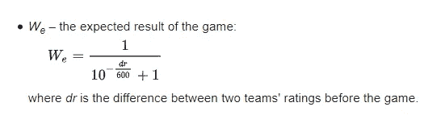
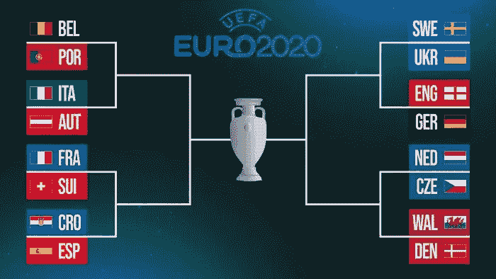
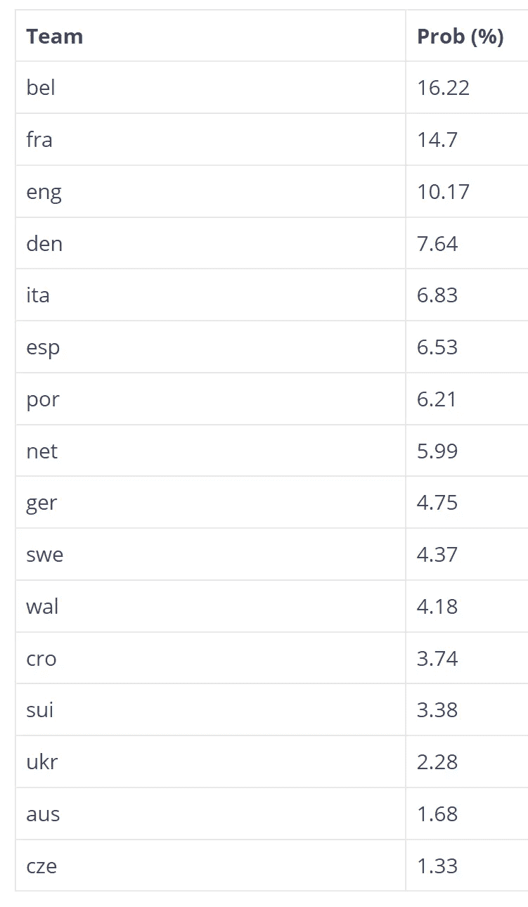
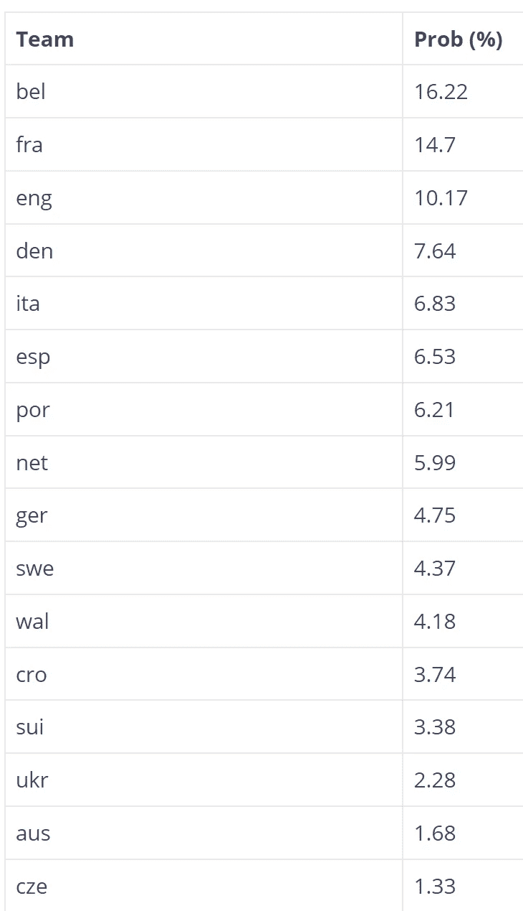

# 基于国际足联排名系统的 2020 年欧洲杯预测模型

> 原文：<https://levelup.gitconnected.com/euro-2020-predictive-model-based-on-fifa-ranking-system-70bc97167b99>

## 举例说明如何估计每支球队赢得 2020 年欧洲杯的概率

在之前的帖子中，我们基于国际足联排名的[建立了一个](https://www.fifa.com/fifa-world-ranking/men?dateId=id13295)[预测模型](https://predictivehacks.com/who-is-going-to-win-the-euro-2020/)，并假设积分遵循正态分布。如果我们更仔细地观察[国际足联的排名模型](https://en.wikipedia.org/wiki/FIFA_World_Rankings)，我们会发现它是基于 ELO 体系的，比赛的预期结果可以从以下公式中得出:



# 根据预期结果模拟最终 16 阶段



让我们运行 10000 次模拟来估计 2020 年欧锦赛冠军的概率。

```
# get the UEFA Rankingranking<-list(bel=1783,
fra=1757,
eng=1687,
por=1666,
esp=1648,
ita=1642,
den=1632,
ger=1609,
sui=1606,
cro=1606,
net=1598,
wal=1570,
swe=1570,
aus=1523,
ukr=1515,
cze=1459)win_prob<-function(a,b) {

  w_prob<-1/(1+10^(-(a-b)/600))
  outcome<-sample(c(TRUE,FALSE), 1, prob=c(w_prob, 1-w_prob))
  return(outcome)
}sim_champion<-c()
final<-c()# number of simulations
n<-10000
for (i in 1:10000) {#######################
#### Final 16
######################## game bel vs por
teams_game1<-c("bel","por")
game1<-win_prob(ranking[[teams_game1[1]]], ranking[[teams_game1[2]]])
if (game1) {
  qualified_game1<-teams_game1[1] 
  } else {
  qualified_game1<-teams_game1[2]}qualified_game1# game ita vs aus
teams_game2<-c("ita","aus")
game2<-win_prob(ranking[[teams_game2[1]]], ranking[[teams_game2[2]]])
if (game2) {
  qualified_game2<-teams_game2[1] 
} else {
  qualified_game2<-teams_game2[2]}qualified_game2# game fra vs sui
teams_game3<-c("fra","sui")
game3<-win_prob(ranking[[teams_game3[1]]], ranking[[teams_game3[2]]])
if (game3) {
  qualified_game3<-teams_game3[1] 
} else {
  qualified_game3<-teams_game3[2]}qualified_game3# game cro vs esp
teams_game4<-c("cro","esp")
game4<-win_prob(ranking[[teams_game4[1]]], ranking[[teams_game4[2]]])
if (game4) {
  qualified_game4<-teams_game4[1] 
} else {
  qualified_game4<-teams_game4[2]}qualified_game4# game swe vs ukr
teams_game5<-c("swe","ukr")
game5<-win_prob(ranking[[teams_game5[1]]], ranking[[teams_game5[2]]])
if (game5) {
  qualified_game5<-teams_game5[1] 
} else {
  qualified_game5<-teams_game5[2]}qualified_game5# game eng vs ger
teams_game6<-c("eng","ger")
game6<-win_prob(ranking[[teams_game6[1]]], ranking[[teams_game6[2]]])
if (game6) {
  qualified_game6<-teams_game6[1] 
} else {
  qualified_game6<-teams_game6[2]}qualified_game6# game net vs cze
teams_game7<-c("net","cze")
game7<-win_prob(ranking[[teams_game7[1]]], ranking[[teams_game7[2]]])
if (game7) {
  qualified_game7<-teams_game7[1] 
} else {
  qualified_game7<-teams_game7[2]}qualified_game7# game wal vs den
teams_game8<-c("wal","den")
game8<-win_prob(ranking[[teams_game8[1]]], ranking[[teams_game8[2]]])
if (game8) {
  qualified_game8<-teams_game8[1] 
} else {
  qualified_game8<-teams_game8[2]}qualified_game8#######################
#### Final 8
#######################teams_f8_1<-c(qualified_game1,qualified_game2)
game_f8_1<-win_prob(ranking[[teams_f8_1[1]]], ranking[[teams_f8_1[2]]])if (game_f8_1) {
  qualified_f8_1<-teams_f8_1[1] 
} else {
  qualified_f8_1<-teams_f8_1[2]}qualified_f8_1teams_f8_2<-c(qualified_game3,qualified_game4)
game_f8_2<-win_prob(ranking[[teams_f8_2[1]]], ranking[[teams_f8_2[2]]])if (game_f8_2) {
  qualified_f8_2<-teams_f8_2[1] 
} else {
  qualified_f8_2<-teams_f8_2[2]}qualified_f8_2teams_f8_3<-c(qualified_game5,qualified_game6)
game_f8_3<-win_prob(ranking[[teams_f8_3[1]]], ranking[[teams_f8_3[2]]])if (game_f8_3) {
  qualified_f8_3<-teams_f8_3[1] 
} else {
  qualified_f8_3<-teams_f8_3[2]}qualified_f8_3teams_f8_4<-c(qualified_game7,qualified_game8)
game_f8_4<-win_prob(ranking[[teams_f8_4[1]]], ranking[[teams_f8_4[2]]])if (game_f8_4) {
  qualified_f8_4<-teams_f8_4[1] 
} else {
  qualified_f8_4<-teams_f8_4[2]}qualified_f8_4#######################
#### Final 4
#######################teams_f4_1<-c(qualified_f8_1,qualified_f8_2)
game_f4_1<-win_prob(ranking[[teams_f4_1[1]]], ranking[[teams_f4_1[2]]])if (game_f4_1) {
  qualified_f4_1<-teams_f4_1[1] 
} else {
  qualified_f4_1<-teams_f4_1[2]}qualified_f4_1teams_f4_2<-c(qualified_f8_3,qualified_f8_4)
game_f4_2<-win_prob(ranking[[teams_f4_2[1]]], ranking[[teams_f4_2[2]]])if (game_f4_2) {
  qualified_f4_2<-teams_f4_2[1] 
} else {
  qualified_f4_2<-teams_f4_2[2]}qualified_f4_2#######################
#### Final 
#######################teams_f<-c(qualified_f4_1,qualified_f4_2)
game_f<-win_prob(ranking[[teams_f[1]]], ranking[[teams_f[2]]])if (game_f) {
  champion<-teams_f[1] 
} else {
  champion<-teams_f[2]}sim_champion<-c(sim_champion,champion)
final<-c(final, teams_f)
}prop.table(table(sim_champion))*100sort(table(final), decreasing = FALSE)/10000
```

# 估计获胜者

通过运行上面的模拟，我们可以估计每支球队赢得 2020 年欧洲杯的概率。

结果:

```
sim_champion
  aus   bel   cro   cze   den   eng   esp   fra   ger   ita   net   por   sui   swe   ukr   wal 
 1.68 16.22  3.74  1.33  7.64 10.17  6.53 14.70  4.75  6.83  5.99  6.21  3.38  4.37  2.28  4.18
```



正如我们所见，**比利时有 16.22%** 赢得 2020 年欧洲杯，根据这种方法，它是最有希望的。

# 估计每个队进入决赛的概率

我们也可以估算一下每支队伍进入决赛的概率。



正如我们所看到的，比利时和法国最有机会进入决赛，还有英格兰。比较比利时和法国赢得欧洲杯的机会(16.22%对 10.17%)和进入决赛的机会(21.91%对 21.63%)。这与英格兰的赛程比比利时和法国更“轻松”有关。当时间表起作用时，模拟的需要是最重要的。