# 用探索性分析和层次聚类法评价社会经济指标

> 原文：<https://levelup.gitconnected.com/evaluating-socio-economical-indicators-with-exploratory-analysis-and-hierarchical-clustering-af1575782141>

## 使用凝聚层次聚类对巴塞罗那的相似邻域进行分组

图片由 [Miquel Migg](https://unsplash.com/@miquelmigg) 在 Unsplash 拍摄

分层聚类是一种**无监督学习技术**，它通过连续合并或拆分来构建嵌套聚类。这种方法产生了一个完整的聚类层次结构，使我们能够很容易地确定聚类的数量和数据点之间的相似性。在本文中，我们将应用**凝聚层次聚类**来根据社会阶层对巴塞罗纳的各个地区进行分类。为此，我们使用**三个属性** : (1) **收入**、( 2) **失业率**、(3) **教育水平**。在对社区进行聚类之后，我们将能够识别出 5 个社会阶层。从商业的角度来看，根据社会阶层对地区进行分类非常有用，可以使商业策略适应顾客的偏好和习惯。

# 数据集

本文中使用的数据集可在**巴塞罗那开放数据中获得。**

## 失业

该数据集包含巴塞罗那市 16 至 64 岁人口按月份和地区统计的失业率。

 [## 城市 16 至 64 岁人口中登记失业的比重

### 这些数据是根据巴塞罗那一级登记处的估计数据提供的

open data-a jument . Barcelona . cat](https://opendata-ajuntament.barcelona.cat/data/en/dataset/est-atur-pes) 

## **收入**

该数据集包含巴塞罗那市的平均家庭收入。

 [## 巴塞罗那市每户平均税收收入-巴塞罗那公开数据

### 这是 INE 国家统计局人口司的一份报告

open data-a jument . Barcelona . cat](https://opendata-ajuntament.barcelona.cat/data/en/dataset/renda-tributaria-unitat-consum-atlas-distribucio) 

## 教育

数据集包含按性别和学术水平分列的巴塞罗那居民人数。

 [## 居民登记册。按性别和学术水平分列的巴塞罗那市人口-公开数据…

### 居民登记册。按性别和学术水平分列的巴塞罗那市人口

-开放数据……居民登记册。按性别和学术水平分列的巴塞罗那市人口](https://opendata-ajuntament.barcelona.cat/data/en/dataset/est-padro-nivell-academic-sexe) 

**注:所有数据集中的信息均指 2018 年。**

# 开源代码库

这个项目的代码可以从 GitHub 上的 Jupyter 笔记本中获得。

 [## amandaiglesiasmoreno -概述

### 此时您不能执行该操作。您已使用另一个标签页或窗口登录。您已在另一个选项卡中注销，或者…

github.com](https://github.com/amandaiglesiasmoreno) 

# 项目步骤

该项目由以下部分组成:

1.  **探索性数据分析和数据清理**
2.  **理论介绍:层次聚类**
3.  **用 Scipy 进行层次聚类**
4.  **用树状图可视化层级**
5.  **聚类图上聚类的可视化**
6.  **每组社会经济指标的平均值**
7.  **为什么从商业角度来看，识别社会阶层如此重要？**
8.  **项目总结**

# 1.**探索性数据分析和数据清理**

本节的目标是创建一个包含后续分析所需的所有数据的数据框。**最终数据框架包含三栏:(1)每户平均收入，(2)受过大学教育的人口比例，以及(3)失业水平**。该信息是为巴塞罗那市的每个区提供的。GitHub 上的 Jupyter 笔记本详细介绍了清理数据的所有必要步骤。

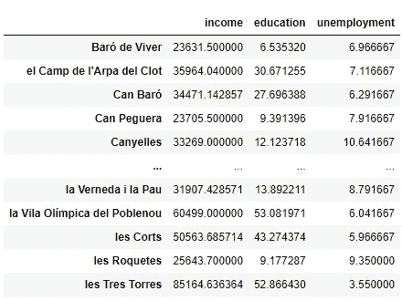

清理后的最终数据帧(df_all)

# 2.理论介绍:层次聚类

分层聚类是一种**无监督学习技术**，用一系列嵌套分区对数据进行分组。有两种类型的层次聚类算法:凝聚和分裂。

## **凝聚与分裂层次聚类**

**使用**自顶向下**或**自底向上**的方法生成层次聚类**。

*   **凝聚层次聚类(自下而上):**该过程从大小为 1 的 n 个聚类开始(每个观察值都有其自己的聚类)，并以大小为 n 的 1 个聚类结束(一个包含所有观察值的聚类)。
*   **分裂式层次聚类(自上而下)**:所有观察值最初都是一个单一聚类的一部分。这个初始聚类被递归地分成越来越小的聚类，直到每个观察值自己形成一个聚类。

在本文中，我们使用自下而上的方法(凝聚层次聚类)根据社会经济指标将相似的社区分组。

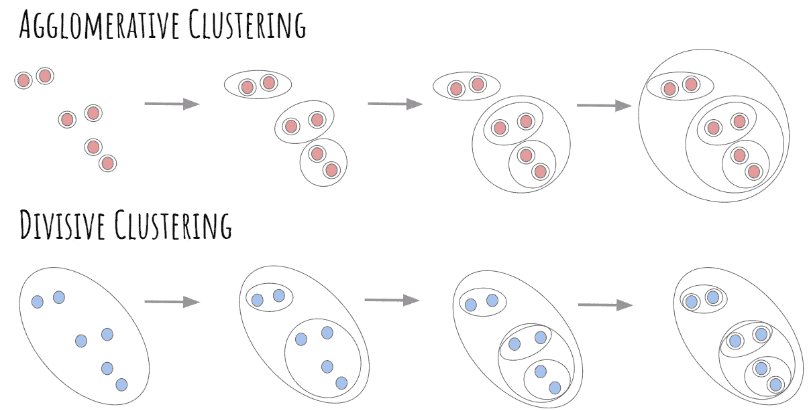

凝聚与分裂的层次聚类(图片由作者创建)

## 层次聚类:链接方法

**凝聚层次聚类**的目标是将彼此相似的元素放在一起。在该过程的任何阶段，具有最小连锁距离的两个簇融合形成单个簇。

有许多链接方法可供选择。最常用的方法是(1)单，(2)完全，(3)平均，(4)质心连接。

*   **单链接**:该方法使用两个簇之间的最小距离来确定链接。
*   **完全链接**:该方法考虑两个聚类元素之间所有成对距离的最大值。
*   **平均关联**:两个聚类之间的距离定义为两个聚类的观测值之间所有成对距离的平均距离。
*   **质心联动**:两个簇之间的距离就是它们质心之间的距离。

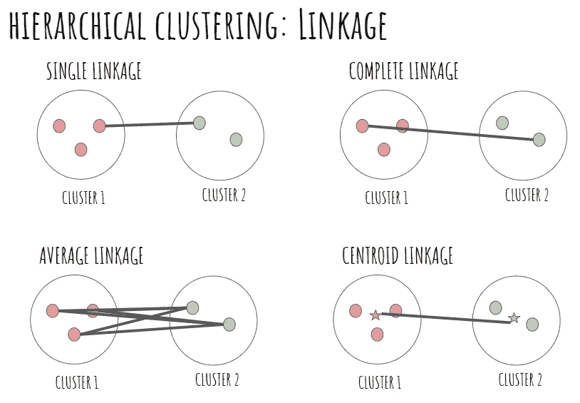

链接方法(图片由作者创建)

# **3。使用 Scipy 进行层次聚类**

我们使用`linkage`函数来执行 NumPy 数组`X_standard`的行的分层聚类，使用 4 种链接方法:(1) **单个**、( 2) **完整**、(3) **平均**和(4) **质心**。这个函数返回一个 **(n-1)乘 4** 的矩阵。前两列包含组合在一起形成新分类的分类。第三列表示列 1 和列 2 的簇之间的距离。第四列包含新创建的分类中的观察次数。正如所料，最后形成的聚类总共包含 73 个观察值(我们数据集中的地区数)。

如下所示，结果取决于使用的链接方法。重要的是要记住，在计算数据点之间的距离之前，有必要对所有列进行标准化，因为这些列具有非常不同的范围。

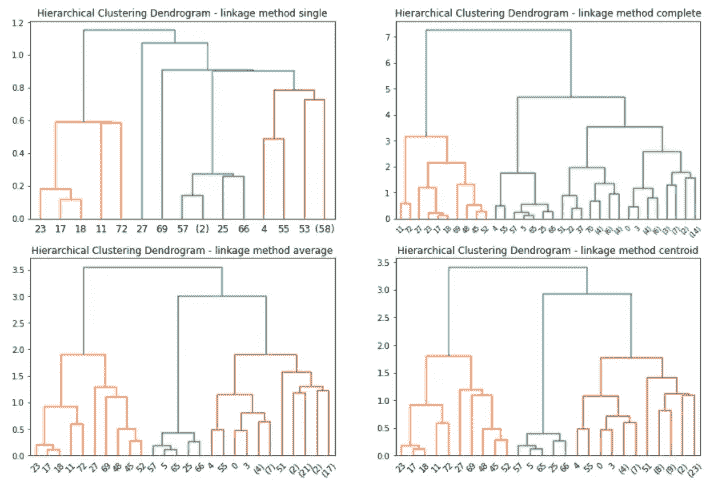

采用不同链接方法的聚类(图片由作者创建)

在我们确定了链接矩阵之后，我们可以将结果传递给树状图函数。

如上所示，链接方法 average 和 centroid 提供了真正相似的划分，其中可以区分 3 或 5 个不同的聚类。最后，我们将决定继续使用平均链接方法，并在下面的部分中更详细地可视化所获得的聚类。

# **4。用树状图可视化层级**

分层聚类产生一种称为树状图的树状结构。节点的水平位置(通常是垂直的)对应于聚类被合并的顺序。

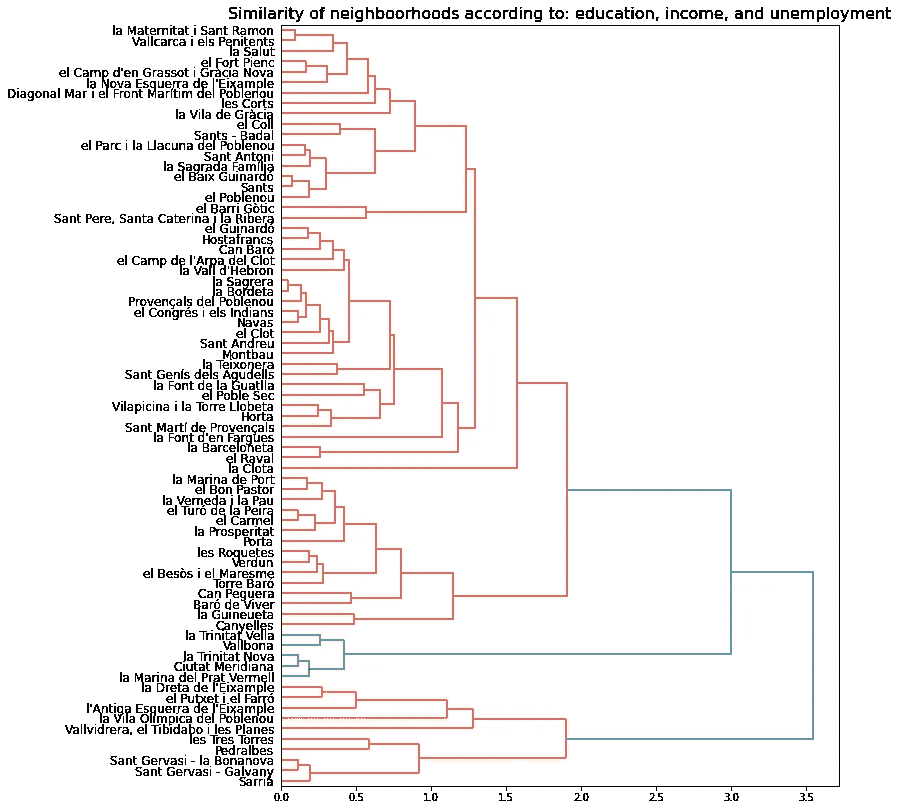

树状图(图片由作者创建)

在特定高度切割树状图会将邻域分割成不相交的簇。在这种情况下，我们决定切割树状图以形成 5 个聚集。这些聚类表示根据社会经济指标彼此相似的邻居组。

# 5.聚类图中聚类的可视化

在确定链接矩阵并可视化结果之后，我们使用`cut_tree`函数来形成 5 个不相连的聚类(`n_clusters=5`)。

获得的结果存储在名为`clusters_districs`的**数据帧**中，其中**列** `clusters`代表**簇**，**列** `NOM`代表城市的不同**区。如上图所示，我们已经重命名了地区`el Poble Sec`，以匹配 **JSON 文件**中使用的名称。**

为了构建地图，我们使用了 Geopandas 库。构建 choropleth 图主要有两个要素:

*   一个 JSON 文件,包含巴塞罗那每个区的边界(多边形)。本文中使用的 JSON 文件可以在下面的 GitHub 存储库中找到:

[https://raw . githubusercontent . com/martgnz/BCN-geodata/master/barris/barris . JSON](https://raw.githubusercontent.com/martgnz/bcn-geodata/master/barris/barris.json)

*   一个**数据帧**，包含我们想要表示的值(在本例中为集群)。

我们使用`geopandas.read_file`函数将 **JSON 文件**作为**地理数据框架**读取。选择感兴趣的列(`NOM`和`geometry`)后，我们将聚类标签添加到**地理数据框**。最后，我们使用`plot`方法可视化结果。

下面的**簇分布图**显示了每个簇(共 5 个)的位置。这些聚类代表了巴塞罗那的社会阶层，是根据以下**社会经济指标**计算出来的:(1)失业率，(2)每户收入，以及(3)拥有大学学历的公民比例。

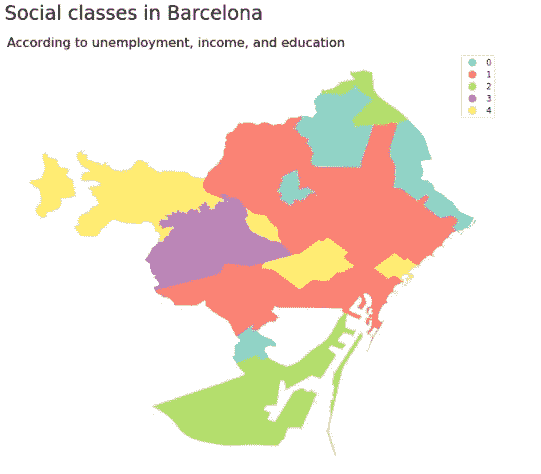

Choropleth 地图(图片由作者创建)

# 6.按类别分列的每个社会经济指标的平均值

下表显示了**得出的聚类(总共五个)的每个社会经济指标**的平均值。通过观察这些值，我们可以进行以下联想。

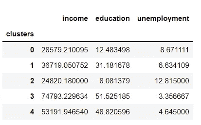

作者创造的形象

## 高级社区(聚类 3-紫色)

巴塞罗那的**上流区**分别是:(1) Pedralbes，(2) Sant Gervasi — Galvany，(3) Sant Gervasi — la Bonanova，(4) Sarrià，(5) les Tres Torres。那些地区位于城市的内部。他们呈现出真正的**低失业率** (3.35%)，**高受教育率** (51.52)，和**高人均收入** (74793)。

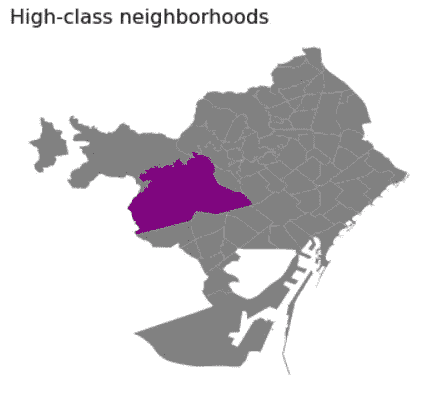

高级社区(图片由作者创建)

这些数值远远高于西班牙和加泰罗尼亚的平均水平，甚至高于挪威、瑞典或丹麦等国家的平均收入(见 https://en.wikipedia.org/wiki/Median_income)。

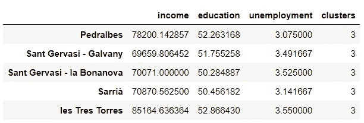

## 高中产阶级社区(聚类 4-黄色)

**高中产阶级区**位于城市内部和市中心。有 5 个社区属于这个组群:(1) Vallvidrera，el Tibidabo i les Planes，(2) el Putxet i el Farró，(3) l'Antiga Esquerra de l'Eixample，(4) la Dreta de l'Eixample，(5)la Vila olmpica del poblenu。

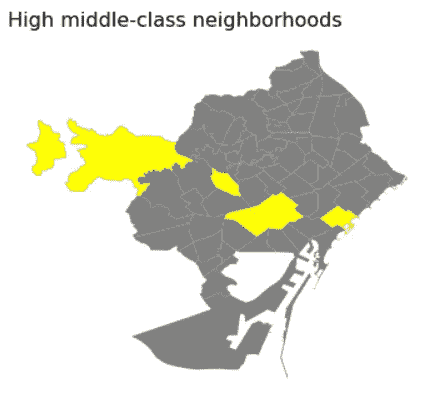

高中产阶级社区(图片由作者创建)

这些社区显示出高教育率(都超过 40%)、低失业率和相对较高的收入。

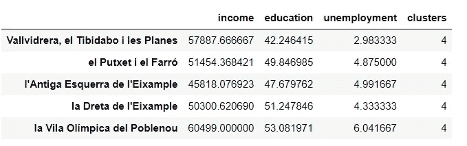

## 中产阶级社区(聚类 1-鲑鱼)

正如我们所料，大多数街区属于**中产阶级集群**。

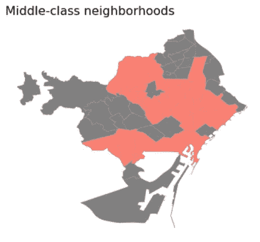

中产阶级社区(图片由作者创建)

如下图，这些街坊的收入从 25485 到 50563 不等。失业率不到 9%,教育率超过 17%。

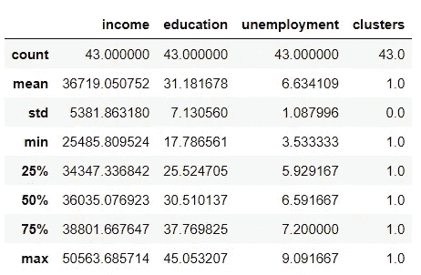

## 低中产阶级(聚类 0 —蓝色)

低中产阶级社区位于城市的北部和南部。教育水平不到 20%，失业率非常高(平均 8.67%)

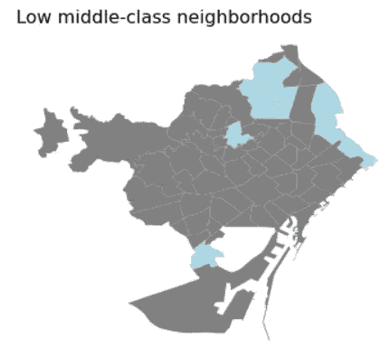

低中产阶级社区(图片由作者创建)

## 低阶层社区(聚类 2-绿色)

低阶层社区位于港口附近和城市的内北侧。

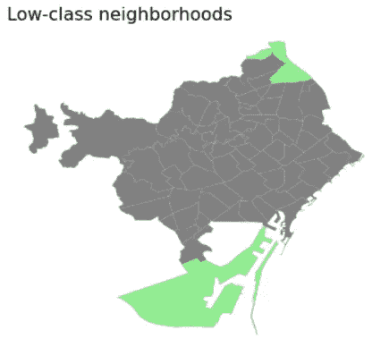

下层社区(图片由作者创建)

目前的失业率非常高(超过 12%)，教育水平低，收入低，如下表所示。

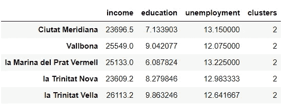

# 为什么从商业角度来看，识别社会阶层如此重要？

从商业角度来看，社会阶层通常被衡量为多种属性的组合，如收入、教育、职业、财富和其他变量。社会阶层对消费习惯有很大的影响。例如，高上层阶级的个人购买昂贵的珠宝和豪华汽车，而那些属于下层阶级的人则倾向于日常生活，将大部分收入花在食物和住所上。营销人员应该了解目标市场的社会阶层，以制定适合个人品味和需求的营销策略。

# 8.项目摘要

在这个项目中，我们使用了无监督学习，根据三个经济方面创建了巴塞罗那地区的层次聚类:(1)家庭人均收入，(2)失业水平，以及(3)大学入学率。我们已经能够区分 5 个社会等级，这些等级已经使用 choropleth 图可视化。从商业角度来看，这种根据社会因素对社区进行的划分有助于适应顾客的需求和愿望。

感谢阅读💜

阿曼达·伊格莱西亚斯