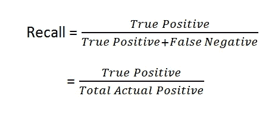
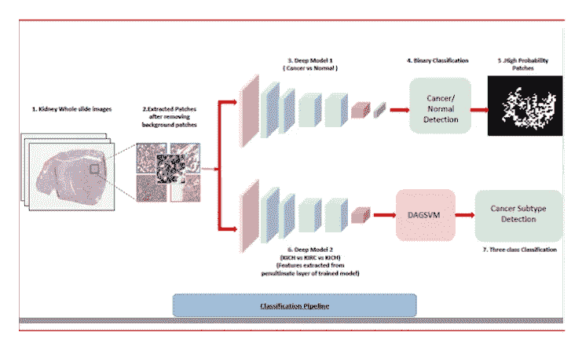

# 分类的评估标准

> 原文：<https://levelup.gitconnected.com/evaluation-metrics-for-classification-32ea1d3ebc5c>

我进入分析领域已经有 3 年了，当我听到有人用准确性作为分类的评估标准时，我很恼火。人们应该理解**准确性**的内在错误，以及当他们试图解决分类问题时，为什么他们应该更喜欢**召回**和**精确度**作为关键评估指标。

要选择评估模型时应该考虑的指标，您应该理解您试图解决的业务/现实问题。在这个博客中，我将列出各种问题，并帮助您选择评估指标。事不宜迟，让我们深入研究一下。

在这篇文章中，我们将认为 1 代表积极的情景，0 代表消极的情景。

**精度、召回率、准确度、**等都是从我们所谓的**混淆矩阵**中推导出来的。您可以通过调整模型中的**截止值**来微调这些指标。通常，您的模型会返回类别概率，您可以决定一个**阈值(截止值)**，它会将您的概率分类为 1 和 0。例如，如果您将**阈值**设置为 0.6，则所有值大于或等于 0.6 的行将被标记为 1，而值小于 0.6 的行将被标记为 0。

# **消除混淆矩阵中的混淆**

混淆矩阵

混淆矩阵告诉你你的模型的结果。理想情况下，你的目标是最大化真阳性，减少假阳性和假阴性。但是，有一个权衡。你通常只能以牺牲另一个为代价来减少一个。这是唯一的原因，你应该明白减少什么:假阳性或假阴性。这就是我进来的地方；)

# **精度**

理解精度

精度告诉你，在你的模型做出的所有预测中，有多少是正确的。

# **召回**

理解回忆

回忆告诉你，在所有实际的积极因素中，你的模型正确识别了多少。

我觉得这就是所有困惑的地方。乍一看，这两个术语似乎非常相似，但事实并非如此。

# **精度**

理解准确性

准确性既看真正的正面，也看真正的负面。它会告诉你你的模型做出的正确预测的百分比。这就是准确性欺骗你相信你的模型表现良好的地方；事实上，它不是。

# **准确性谬误**

看下面的**混淆矩阵**:

准确理解谬误

你已经达到了大约 91%的准确率。但是想象一下，如果一个实际的阳性病例代表一个冠状病毒患者，你就把 9 个人分类错了。仅仅是 10%的召回，你就引起了一场流行病/疫情，因为你认为你创造了一个伟大的分类模型！

如果你有一个不平衡的分类问题(太多的 0 和太少的 1)，作为一个度量标准，你只需要正确地评估你的分类模型。

这就是你需要理解精确和回忆的重要作用的地方。

# **了解分类错误的成本**

当您对结果进行错误分类时，会产生相关的成本。你必须明白什么会弊大于利，并相应地调整**(调整截止值)**你的产量。

下面你会发现一些现实生活中的问题，以及我用来理解应该最大化哪个指标来解决它们的方法。

# **问题:垃圾邮件检测:识别垃圾邮件**

来源:[https://towards data science . com/applied-text-class ification-on-email-spam-filtering-part-1-1861 E1 a 83246](https://towardsdatascience.com/applied-text-classification-on-email-spam-filtering-part-1-1861e1a83246)

**误报造成的成本:**如果您将非垃圾邮件归类为垃圾邮件，您将错过重要邮件
**误报造成的成本:**如果您将垃圾邮件归类为非垃圾邮件，您将收到不需要的垃圾邮件

**结论:误报成本>误报成本**
尽量**最大化精度**

# **问题:欺诈检测:识别用户是否会拖欠还贷/信用卡账单**

来源:[https://www . xenonstack . com/use-cases/credit-fraud-detection-analytics/](https://www.xenonstack.com/use-cases/credit-fraud-detection-analytics/)

**误报造成的成本:**如果您将非欺诈用户归类为欺诈用户，您会在提供贷款/信用卡之前对用户进行双重检查
误报造成的成本:如果您将欺诈用户归类为非欺诈用户，您会将贷款/信用卡发放给潜在的违约者

**结论:误报成本> >误报成本**
尽量**最大化召回**

# **问题:癌症/病毒检测:识别患者是否患有癌症或携带威胁生命的病毒**

来源:[https://blogs.iiit.ac.in/cancer-diagnosis/](https://blogs.iiit.ac.in/cancer-diagnosis/)

**假阳性造成的成本:**如果你将非癌症患者归类为癌症患者，你正在进行更彻底的测试
**假阴性造成的成本:**如果你将癌症患者归类为非癌症患者，你已经牺牲了患者的生命

**结论:误报成本> > >误报成本**
尽量**最大化召回**

# **以轻快的音符结束:**

> **被证明有罪之前是无辜的**

来源:[http://allamericanbailcolorado . com/the-importance-of-innocent-unt-proven-有罪/](http://allamericanbailcolorado.com/the-importance-of-innocent-until-proven-guilty/)

假阳性的代价:如果你把一个实际上无辜的人归类为罪犯，你就把一个无辜的人送进了监狱
**假阴性的代价:**如果你把一个实际上是罪犯的人归类为无辜的人，你就释放了一个罪犯

**结论:假阳性代价> > > >假阴性代价** 尽量将**精度最大化**

# **有趣的事实**

你经常被告知，在增加截止值时，你减少了回忆，增加了精确度。这种说法对了一半。不能保证精度会提高；)

我希望当你下次看到一个分类问题时，上面所有的例子都能给你启发。快乐学习:)