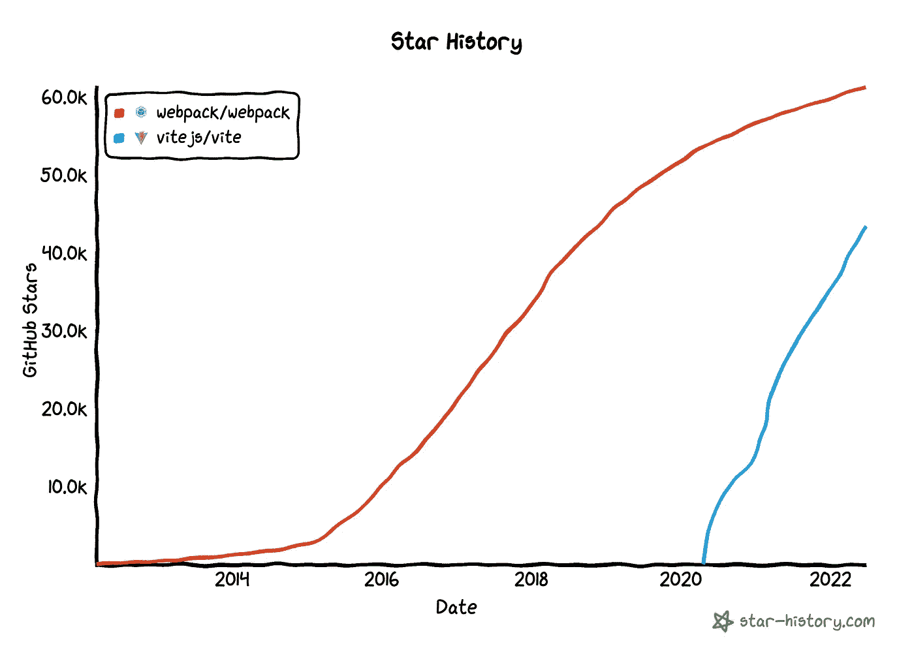
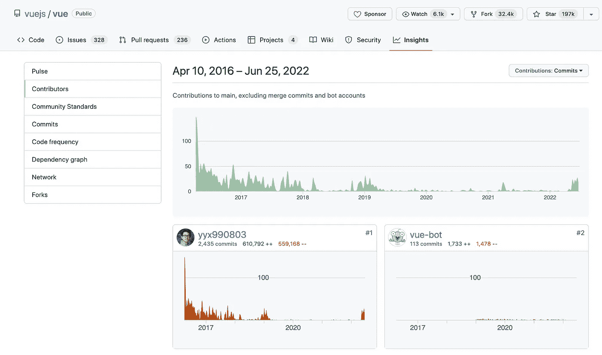
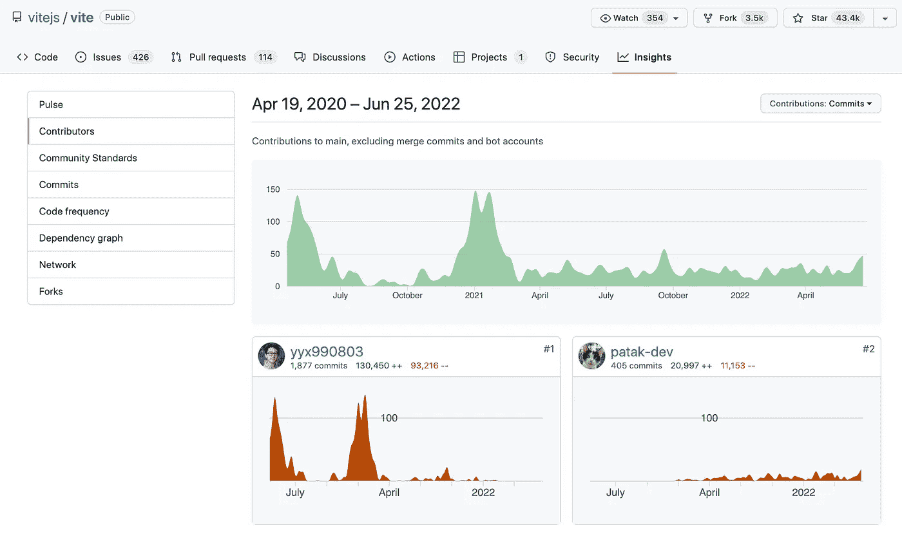

# Vue Creator 告诉 React 团队:你应该向 React 开发者推荐 Vite，而不是 Create-React-App

> 原文：<https://levelup.gitconnected.com/evan-you-tells-react-team-you-should-recommend-vite-over-create-react-app-for-react-developers-e73aa4a789f>

## React 和 Vue 之间的战争:维特之战。

最近，React 团队正在更新 React 文档。借此机会，Vuejs 的创造者尤雨溪向 React 开发团队提出了一个建议:

CRA 代表创造-反应-应用。

Vite 是一个构建工具，旨在为现代 web 项目(如 VanillaJS、Vue、React 和 Svelte)提供更快、更精简的开发体验。它的竞争对手是 Webpack。

这个建议看起来很好，很正常。但是如果你知道故事的背景，你一定会觉得很有趣。

首先，尤雨溪是 Vue 的创造者，Vue 和 React 之间的战争已经持续多年。为什么伊凡会建议在这个时候做出反应？

**虽然 Vite 本身是一个通用构建工具，但它并不依赖于任何特定的框架。但是，但是，但是，Vite 是 Vue 开发团队开发的。**

以下是 Vuejs 的贡献者:

以下是 Vite 的贡献者:

尤雨溪(yyx990803)是 Vue 和 Vite 的核心开发者！

所以当我看到这条推特的时候，我的感觉是:

> 肯尼迪建议赫鲁晓夫从美国购买核武器。

你能想象这种场景吗？

## 丹·阿布拉莫夫的回应

事实上，尤雨溪向反应小组扔了一颗炸弹。

作为一个基于 Webpack 的工具，create-react-app 在性能和开发体验上并不完美。如果 React 团队拒绝了 Vite，可能会显得小气。

但如果 React 团队拥抱 Vite，就好像苏联允许美军驻扎在莫斯科一样。

如果你是丹·阿布拉莫夫(React 维护者)，你会如何应对？

以下是他的回应:

丹认为 Vite 太低级了，不能开箱即用。这是对 Vite 的间接拒绝。

但我认为这只是一个借口。Vite 内置了 React 模板，使用起来相当方便。

## 战争

其实 Vue 和 React 的战争已经持续了很多年。目前在正面战场上，双方都有自己坚定的支持者，彼此之间是不可逾越的。

因此，尤雨溪一直在试图攻击其他地方。

早些时候，[抱怨 beta.reactjs.org](https://medium.com/geekculture/how-does-dan-abramov-optimize-beta-reactjs-org-after-be-complained-about-website-speed-840b02cf5ee8)的糟糕表现。现在尤雨溪推荐使用 Vite。

每次丹都平静地回应。

维特之战之后，下一场战斗会在哪里进行？

不得不说，这场战争真的很刺激，尤其是作为一个旁观者。

## 最后

你认为 React 最终会使用 Vite 作为默认的构建工具吗？

或者，您现在会使用 Vite 创建一个 React 项目吗？

*   [丹阿布拉莫夫被投诉网站速度后如何优化 beta.reactjs.org？](https://medium.com/geekculture/how-does-dan-abramov-optimize-beta-reactjs-org-after-be-complained-about-website-speed-840b02cf5ee8)

[字节鱼](https://bytefish.medium.com/?source=post_page-----e73aa4a789f--------------------------------)

## 反应文章

[View list](https://bytefish.medium.com/list/react-articles-f03ed95b6f26?source=post_page-----e73aa4a789f--------------------------------)11 stories