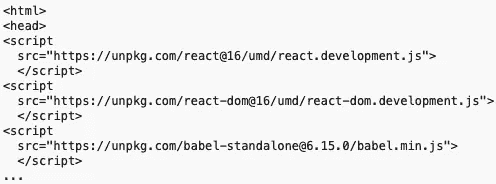
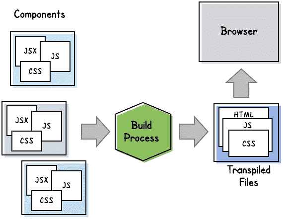

# 即使你讨厌 JavaScript，你也可能喜欢 React

> 原文：<https://levelup.gitconnected.com/even-if-you-hate-javascript-you-might-love-react-9e4134787d87>

## 正是 JavaScript 框架最终使 web UI 开发变得正确。

安妮·斯普拉特在 [Unsplash](https://unsplash.com?utm_source=medium&utm_medium=referral) 上的照片

我喜欢创建交互式用户界面。后端开发很棒，但是没有什么比一个设计精美的 UI 对你的操作做出反应更令人满意、更直接的满足感了。与此同时，我一直对 JavaScript 在所有语言中成为 web 开发的*选择*感到沮丧，仅仅是因为这是 Netscape 几年前在其 Navigator 浏览器中引入的。所以在我的职业生涯中，我的大部分 UI 开发都是使用像 Swing 和 JavaFX、Cocoa 和 Objective-C 这样的工具包，以及原生移动应用程序开发。我定期停下来涉猎 JavaScript，尝试最新的框架——最新的，但很少持续很长时间。

我并不是一直不喜欢使用 JavaScript。很久以前(我指的是*时间*以前，那时“ [DHTML](https://en.wikipedia.org/wiki/Dynamic_HTML) ”是一个常用术语)，我很乐意花时间开发交互式 Web-UI 应用程序。在 XMLHttpRequest 对象出现之前，我使用隐藏框架来创建单页应用程序。我认为像 Flash 这样的浏览器插件是令人憎恶的。

但是大约在那个时候，我也发现了像 Java 这样的语言——后来是 C 语言家族，然后是 Scala、Kotlin 和 Swift 之类的语言。所有编译语言，类型安全，具有强类型系统。很快，构建复杂的 JavaScript 应用程序就像用水球盖房子一样。我也许能让它工作。它看起来会非常令人印象深刻。但该死的，如果我真的建议任何人住在里面。

所以，让我暂停一下，提前向读到这篇文章的 JavaScript 工程师道歉。我们工程师都有自己喜欢的语言，我们已经爱上了这种语言，包括所有的缺点(事实上，所有的语言都有缺点！)这听起来可能像是我在贬低你的。

但这不是我的总体意图。相反，我想让我们在一起。为了向所谓的“硬核”程序员——以 Java、Go、Rust、C 或任何其他编译的、类型安全的语言为生的工程师们展示，他们对 JavaScript 的厌恶使他们无法为自己的后端创建 Web UIs 我们有理由重新审视 JavaScript。那就是 React.js

# 那你为什么会喜欢反应呢？

对于不经意的观察者来说，React 似乎只是 JavaScript 框架漫长道路上的一个小站。我觉得不是这样的。虽然它可能不是最终目的地，但我认为它至少是一个重要的里程碑。

反应不一样。真的。

很难量化 React 为何如此吸引人。不仅仅是对 JavaScript 开发人员，对您也是如此:静态类型的死忠粉丝，他们讨厌投身于似乎是另一种 JavaScript 时尚的潮流。这很大程度上是主观的。但是 React to me 感觉是基于浏览器的 UI 开发的正确方法。很容易捡起来。很容易使它适应我选择编写的任何后端。有道理。这…很有趣。下面，我将试着找出它如此吸引我的原因，以及为什么它也可能吸引你。

## 它把 JavaScript 放到了它的位置上

JavaScript 是一种脚本语言。它最初存在的理由是作为 UI 和浏览器本机功能之间的粘合剂。从 UI 中捕获事件——比如，按钮点击——然后触发一些动作——比如，弹出一个对话框或加载一个新页面。对于我们中的许多人来说，使用这种语言来构建一个复杂应用程序的整体似乎是非常危险的。水球屋之类的。

使用 React，您将主要创建组件。组件代表网页中独立的功能单元。这意味着你要写三样东西:

*   **标记代码。**您可能不会创建大型的 HTML 文件，而是编写一小段标记来呈现每个组件。你将使用 [JSX](https://reactjs.org/docs/introducing-jsx.html) ，它看起来几乎和 HTML 一样，只有一些小的不同。您可能还会在您的 JSX 中嵌入最少量的 JavaScript 例如，循环访问列表中的元素，或者将事件处理程序附加到 UI 元素。
*   **生命周期方法和事件处理程序。当然，你将会编写 JavaScript。但是你不会创建大量的程序代码。相反，因为 React 应用程序主要由组件组成，所以您将实现组件生命周期方法，React 框架将在应用程序的整个生命周期中调用这些方法。此外，您将创建谨慎的事件处理函数来响应来自应用程序 UI 的事件。这真的很像 JavaScript 的设计初衷。**
*   **CSS。使用 React，几乎不可能在标记中嵌入样式指令，所以要为每个组件创建一个单独的样式表。所以同样的，这感觉就像是 CSS 的设计意图！**

这三个元素——标记、样式和逻辑——的组合构成了一个组件。通过这种方式，您的 JavaScript 就成为了组件的平等成员。它还有助于防止混乱的、不可维护的代码在运行时爆炸。

## 它有一个伟大的建筑系统，提供有用的护栏

但是 React 的护栏不止于此。我们在上面提到过，标记是用 JSX 语言写的，虽然它看起来很像 HTML，但对 web 浏览器来说是不可理解的。你可能会想，怎么可能在浏览器中运行 React 应用程序。

不好的方式

有两种方法；我将称它们为坏路和好路的*。*坏方法*是在你的网页中包含一些助手脚本，这将有效地引入 React 框架，并允许你的 JSX 被解释和显示为 HTML。*

正如您所猜测的，这极大地增加了您的应用程序的网络和内存开销，并导致运行时性能的严重下降。但是这是寻求快速原型开发的开发人员的一个选择。

好方法

*另一方面，好的方法*是安装并运行一个基于 Node.js 的开发环境。在我们继续之前…是的，我对[说在你的电脑上安装 Node.js(和它的包管理器，NPM](https://docs.npmjs.com/downloading-and-installing-node-js-and-npm) )。没事的。您不会突然被迫用 JavaScript 编写您的服务器端代码(就像在您的系统上安装 Python 意味着您突然需要切换到 Django 一样)。相反，您将使用 Node.js 将 React 应用程序构建成生产就绪文件，并在浏览器中测试这些文件(开发环境甚至在浏览器中提供实时刷新，以反映您所做的任何更改)。

使这个*成为好方法*——除了避免额外 JavaScript 库的开销——的是构建过程本身。虽然不像真正的编译器那样包罗万象，但构建过程会捕捉某些编程错误，尤其是那些与您的 JSX 代码相关的错误。这将减少像 JavaScript 这样的脚本语言容易犯的运行时错误。

它仍然感觉有点像用水球建造的房子…只是现在有一个木制的框架。

## 这不是一个不自然的范例

JavaScript 以其丰富的可用库和框架而闻名。其中许多人试图将其他语言的范例引入 JavaScript 领域。*创建一个感觉像 Java 的 JavaScript 框架*，理论似乎是这样的，*Java 开发者将开始接受 JavaScript* 。

换句话说，一些 JavaScript 工具包似乎试图通过*对抗* JavaScript 来吸引开发者。

例如，几年前，jQuery 和 [Dojo](https://dojotoolkit.org/) 框架就出现了。有一段时间，他们似乎是一场流行竞赛中的竞争者。jQuery 很快成为大多数 JavaScript 开发人员的首选语言。但是许多专注于后端的开发人员——包括我在内——采用了 Dojo。部分原因是这感觉有点像企业软件开发。它很强大。它从一开始就是为大规模应用而设计的。代码被安排在模块中，并且非常注意管理它们之间的相互依赖。而且……感觉就是不对劲。对于一个典型的网站用户界面来说，这种模式让人感觉笨拙、夸张和混乱。选择 Dojo 最终感觉就像选择了 [BetaMax](https://legacybox.com/blogs/analog/vhs-beat-betamax) 。

或者以谷歌开发的工具包 [GWT](http://www.gwtproject.org/) 为例。使用 GWT，代码用 Java 编写，然后转换成 JavaScript 在浏览器中运行。我涉足了 GWT，甚至开始了一个复杂的 web 应用程序的开发工作，该应用程序将投入生产。首先，它很有趣；我会编写 Java 代码并在一个环境中测试，然后将它转换成 JavaScript 并在浏览器中运行。但是将 GWT 生成的代码整合到网站的其他部分是极其困难的。由于它试图模仿传统的桌面应用程序开发，GWT 范式不适用于常规的 web 开发。

然后是 [Angular.js](https://angularjs.org/) ，这可能是 React 之前最后一个超级流行的 js 框架。Angular 吹嘘的好处包括依赖注入和完整的模型-视图-控制器环境。这听起来对服务器端开发人员很有吸引力，他们习惯了依赖注入框架，如 Spring，以及 MVC 框架，如 Ruby on Rails、Django、Struts，当然还有 SpringMVC。但是这些在其他语言和环境中感觉很自然的范例似乎并不适合 JavaScript 和基于浏览器的应用程序。

反应不一样。它不会试图模仿其他生态系统的框架，并把它们的范例强加到浏览器中。但它也不像是一个 JavaScript 框架。相反，它只是感觉像一个设计良好的 UI 框架。

所以，当然……当你开发一个 React 应用程序时，它可能和开发一个 [Spring](https://spring.io/) 应用程序，或者一个 [Rails](https://rubyonrails.org/) 、 [Django](https://www.djangoproject.com/) 或者 [Revel](https://revel.github.io/) 应用程序感觉不一样。但是这感觉就像是开发一个 *UI 应用程序*应该做的。

## 这很容易掌握和理解

React 可能是我学习过的 JavaScript 框架中最简单的，更重要的是，也是最容易理解的。虽然我不得不从头开始设置开发环境(我没有安装 Node.js 或 NPM ),但这个过程非常简单。一旦我这样做了，我就立即开始运行了。

从概念层面来说，我从来没有一刻不明白自己在做什么。一切以组件为中心的概念很有意义。

此外，我从未觉得我需要成为 JavaScript 专家才能使用 React。当然，如果你真的要拥抱一个框架，你应该准备花时间学习语言…但是回到 JavaScript 是 React 的粘合剂的想法，直到你开始开发一些非常复杂的应用程序，一点 JavaScript 知识就足够了。

最后，我相信有一个不是 JavaScript 的语言背景会有所帮助。例如，React 组件是对象，所以理解对象构造函数和生命周期肯定会有所帮助。对函数式编程原则的理解带来了对不可变数据结构重要性的理解，这是使用 React 的关键。

## 单页应用和传统网站一样简单

许多 JavaScript 框架似乎对是否应该开发单页面应用程序(spa)或更传统的多页面网站持有强烈的意见。

例如，Angular 和 GWT 就大力发展水疗中心。有了这些框架，您的标记就变成了一个外壳，您可以将大量的 JavaScript 代码放入其中。另一方面，jQuery 似乎旨在让传统的多页面网站更容易增加交互性。

就我个人而言，我不喜欢把自己放在 SPA 角落里。我想保留将我的 web 应用程序拆分到多个页面的权利，并保留我的核心网站的功能或多或少依赖 JavaScript 的权利。此外，我从专注于前端的同行那里听到了关于面向商业网站的 spa 成功的不同结果；许多尝试过水疗的人似乎正在逆转这一趋势，转而使用更传统的多页面网站。

同时，我希望能够实现和单页应用程序在我想去的地方。虽然我工作的大部分——至少在白天——是商业应用程序，但我也喜欢在业余时间涉足游戏或其他有趣的沉浸式应用程序。这类应用通常非常适合作为 spa。

React 似乎并不在乎你构建的是哪种类型的 app。React 本身使构建由多个网页组成的网站变得很容易，每个网页都可以很容易地共享组件。还可以很容易地添加一个库，如 [React Router](https://reacttraining.com/react-router/) 来将您的页面合并成一个全功能的单页面应用程序。有了 React，我从来不觉得我必须在两个选项之间做出选择。

## 如果您愿意，可以使用 TypeScript

大约在我开始用 React 开发的同时，我也开始探索[类型脚本](https://www.typescriptlang.org/)。TypeScript 作为 JavaScript 的超集越来越受欢迎，它提供静态类型，以及一系列其他特性([联合类型](https://www.typescriptlang.org/docs/handbook/advanced-types.html#union-types)，有人知道吗？)它可以编译成普通的 JavaScript，因此可以在任何现代网络浏览器中运行。而且，正如 word 所说，它与 React 配合得非常好。

事实上，我对 TypeScript 的兴奋是我学习 React 的动力。我的计划是使用 React 作为学习 TypeScript 的真实工具。毕竟，像大多数后端开发人员一样，我认识到静态类型语言和丰富类型系统的好处，无论我是开发微服务、移动应用程序还是基于浏览器的 ui，我都更愿意留在这个世界上。

实际上，我决定从使用 JavaScript 的 React 教程开始。我想，这将是熟悉 React 的最好方式，然后我可以在以后添加 TypeScript。

嗯，事实是，我一直在开发几个 React 应用程序，还没有引入 TypeScript。我一直在编写的 JavaScript 真的很少，构建系统在浏览器出现之前很好地捕捉了一些使用 JavaScript 引入的错误。

尽管如此——如果你坚决反对用动态类型语言开发——TypeScript 仍然可以使用。

## 这是…我敢说吗？…有趣

这大概是所有原因中最主观的一个。我决定学习 React 来帮助自己跟上更流行的编程趋势。但是我很快发现自己很有趣，尤其是当我开始将 React 前端应用程序与现代 Java 后端应用程序结合起来时。我不再把 React 开发看作是一项需要完成的任务，而是开始寻找借口用它做更多的事情。

# 你自己试试吧！

但是真的，自己决定的唯一方法就是自己去尝试。抓一本 React 书或者找[一本教程](https://medium.com/better-programming/build-a-movie-tracking-system-using-react-and-java-522388965c55)或者[两本](https://reactjs.org/tutorial/tutorial.html)。谁知道；也许你会喜欢它。或者，如果没有，您可能至少会喜欢它，开始将 web UIs 放在您编译的、类型安全的服务器应用程序之上。

# 资源

*   [https://www.springboard.com/blog/history-of-javascript/](https://www.springboard.com/blog/history-of-javascript/)
*   [https://dev . to/mkrl/JavaScript-quirks-in-one-image-from-the-internet-52m 7](https://dev.to/mkrl/javascript-quirks-in-one-image-from-the-internet-52m7)
*   [https://medium . com/@ mnemon 1 CK/why-you-should-not-use-angular js-1 df 5 DD F6 fc 99](https://medium.com/@mnemon1ck/why-you-should-not-use-angularjs-1df5ddf6fc99)

觉得这个故事有用？想多读点？只需[在这里订阅](https://dt-23597.medium.com/subscribe)就可以将我的最新故事直接发送到你的收件箱。

你也可以支持我和我的写作——并获得无限数量的故事——通过今天[成为媒体会员](https://dt-23597.medium.com/membership)。