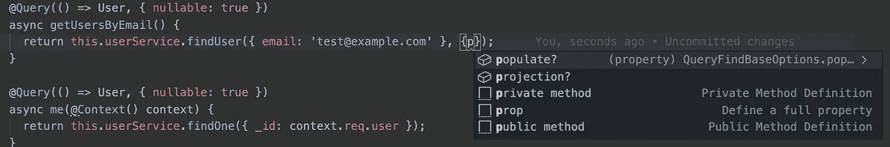

# 使用 Mongoose 和 TypeScript 的强类型服务

> 原文：<https://levelup.gitconnected.com/even-stronger-typed-models-with-mongoose-and-typescript-916f0a9e5c3c>

[在之前的帖子中，我们探讨了如何将 TypeScript 与您的 Mongoose 模型集成。](https://medium.com/@tomanagle/strongly-typed-models-with-mongoose-and-typescript-7bc2f7197722)在这篇文章中，我们将进入服务层，看看我们如何使用 mongose 类型从您的应用程序的 mongose&Typescript 实现中获得更多。

首先让我们回答一些关于服务层的基本问题:什么是服务层，我如何使用它？

服务层用于封装应用程序业务逻辑的实现，并为以一致的方式调用该逻辑提供 API。

服务是对数据执行常见任务的函数，如读取、写入、更新和删除。服务通常由控制器或解析器调用，一个服务通常由几个不同的功能使用。

关于服务层以及如何在 JavaScript 应用程序中使用它的实用指南，请阅读关于提供者的 [NestJS 文档](https://docs.nestjs.com/providers)。

本指南将包括几个不同的服务层代码示例。它还将包括使用这些服务的代码示例。如果您使用过 NestJS，那么使用的语法看起来会很熟悉。然而，本指南不是关于解析器或服务，而是关于如何在服务层使用 Mongoose 的类型。

要开始使用 mongose 类型，您需要从 DefinitelyTyped 安装 mongose 包:

`yarn add @types/mongoose -D`

## 查询方法

通常有一个服务负责通过某个字段获取数据，很像 Mongoose 的`[Model.findById()](https://mongoosejs.com/docs/api.html#model_Model.findById)`方法。

例如，一个需要通过电子邮件地址查找用户的应用程序将受益于一个服务级别的方法来完成这项任务。

在这个简单的例子中，我们可以简单地输入来自用户模型的电子邮件地址。这使得我们可以与其他开发人员交流数据的来源和类型。

> 请注意，如果电子邮件字段在用户界面上是可空的，则输入在这里也将是可空的。这可能是你想要的，但也可能导致一些意想不到的结果。

当应用程序需要一个更通用、可重用的方法时会发生什么？我们使用 Mongoose 的内置类型来告诉控制器或解析器方法期望什么。

语法突出显示表明服务将接受来自用户模型的任何属性

您会注意到`[FilterQuery](https://github.com/DefinitelyTyped/DefinitelyTyped/blob/master/types/mongoose/index.d.ts#L181)`是一个[泛型类型](https://www.typescriptlang.org/docs/handbook/generics.html)，它将您的`User`类型作为参数。如果您在这里看到一个错误，请确保您的`User`接口扩展了`mongoose.Document`。这是您将在本指南中看到的常见模式。

使用选项和` [QueryFindBaseOptions](https://github.com/DefinitelyTyped/DefinitelyTyped/blob/master/types/mongoose/index.d.ts#L2527) `类型一样简单。

在上面的例子中，我们包括了选项的默认值，使得输入是可选的。

语法突出显示了该方法将接受哪些选项

这两种用法都有效:

## 更新方法

更新方法遵循与上面相同的模式，但是至少有两个输入，`FilterQuery`和`[UpdateQuery](https://github.com/DefinitelyTyped/DefinitelyTyped/blob/master/types/mongoose/index.d.ts#L190)`。选项输入也可以通过`[ModelUpdateOptions](https://github.com/DefinitelyTyped/DefinitelyTyped/blob/master/types/mongoose/index.d.ts#L3775)`界面输入。

另一种常见的做法是将来自对象接口的类型与来自模型的类型结合起来，来自 Mongoose 的类型可以结合起来创建满足您的业务逻辑需求的服务。

上面的例子很简单，但是说明了如何使用 Mongoose DefinitelyTyped 包来使您的服务更容易使用和更可靠。

## 延伸阅读:

**可用类型:**[https://github . com/definitely typed/definitely typed/blob/master/types/mongose/index . d . ts # l 3775](https://github.com/DefinitelyTyped/DefinitelyTyped/blob/master/types/mongoose/index.d.ts#L3775)

**带有 mongose 和 TypeScript 的强类型模型:**[https://medium . com/@ to managle/strong-typed-models-with-mongose-TypeScript-7 bc2f 7197722](https://medium.com/@tomanagle/strongly-typed-models-with-mongoose-and-typescript-7bc2f7197722)

## 🌎让我们保持联系

[在 YouTube 上订阅](https://www.youtube.com/TomDoesTech)
[不和](https://discord.gg/4ae2Esm6P7)
[推特](https://twitter.com/tomdoes_tech)
[抖音](https://www.tiktok.com/@tomdoestech)
[脸书](https://www.facebook.com/tomdoestech)
[insta gram](https://www.instagram.com/tomdoestech)
[给我买杯咖啡](https://www.buymeacoffee.com/tomn)