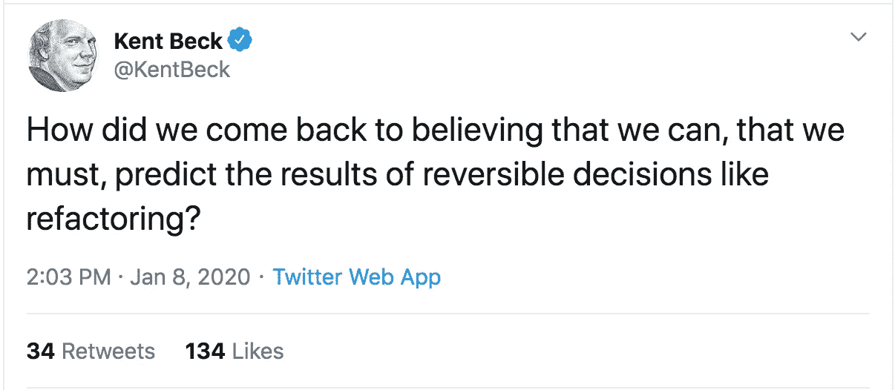

# 甚至你的重构也会被重构

> 原文：<https://levelup.gitconnected.com/even-your-refactors-will-be-refactored-20b6e21f9edf>

由 [Unsplash](https://unsplash.com/s/photos/boxes?utm_source=unsplash&utm_medium=referral&utm_content=creditCopyText) 上的 [chuttersnap](https://unsplash.com/@chuttersnap?utm_source=unsplash&utm_medium=referral&utm_content=creditCopyText) 拍摄

在软件工程领域，有许多决策。我们应该为这个项目使用什么数据库？我们应该使用 Jenkins、Travis 或其他人来实现自动化吗？我们如何将这项服务从整体服务转变为微观服务？还是微服务已经过时了？

有一个问题我经常遇到，我认为它被给予了过多的时间。这个问题是我们在查看一些旧代码时都会问自己的问题:“我应该重构这些代码吗？”

很有可能你应该。如果你问了这个问题，它可能值得一试。你甚至可以考虑[对你的重构进行时间限制](https://medium.com/@dangoslen/time-boxing-can-help-your-team-stay-productive-d55849d4d3de)，而不是全力以赴，发现自己陷入绝望的无底深渊。

我认为这是因为大多数时候，你的代码不是静态的。你的代码会被修改。您的重构将在以后进行。你的要求会改变。其他开发人员将加入您的团队。你会跳槽到另一个项目、团队或公司。

我们不应该把“我应该重构这段代码吗？”生死抉择。

但是我想得太多了。让我倒回去一点。

## 重构到底是什么？

在深入细节之前，让我们先从基础开始。重构到底是什么？

值得庆幸的是，软件工程的两位领导者，Martin Fowler 和 Kent Beck，有一整本关于这个主题的书。不用担心；本文并不试图涵盖这本书的所有内容，也没有附属链接:)

福勒在他的网站(恰当地命名为[refactoring.com](https://refactoring.com/))上将重构定义为:

> 一种规范的技术，用于重组现有的代码体，改变其内部结构而不改变其外部行为

换句话说(我的定义):

> 重构是有条不紊地对现有代码进行结构性更改并进行测试，而不添加、删除或破坏功能，以便将来更容易地添加、删除或修改功能

好极了。那么**那个**是什么意思呢？先打个比方。

## 重构就像搬家

在你生活中的某个时刻，你可能已经搬家，帮助朋友搬家，或者听到人们抱怨搬家。如果没有，你是幸运的。

然而，我，**爱**动人。我是一名工程师，把一个大问题分成子问题的想法很有趣。另外，谁不喜欢用 U-Haul 玩 3-D 真人大小的俄罗斯方块呢？！

搬家还需要**有条不紊地**把东西放进箱子里，这样你要搬的东西就可以更容易地**运输**，然后包装和整理它们，这样它们就不会摔坏**以便你以后可以使用。**

你很少看到有人把一堆书直接放到卡车上。一般来说，书和其他小件物品会先放在盒子或板条箱里。为什么？嗯，当很多书装在盒子或板条箱里时，搬运起来更容易。

您也可以将相似的项目分组。盒子里很少装有不同质量的物品。根据我的经验，事物是根据一个简单的“地点和事物”层次来分组的。例子包括“厨房用盘子”、“卧室用床单”或“办公室用书”

你也很少看到有人为了把吉他、盘子或家具装进卡车而打碎它们。当你在移动的时候，你必须保持你移动的每样东西的功能。如果你没有，你还不如摆脱它。

这是移动的另一个典型特征:**扔掉** **无用的** **东西**。如果你没有使用它，因为你有一个副本，或者因为你已经意识到你的超级酷的 8 轨收集不值得保留了。

重构包含所有这些要素:

1.  你需要有条不紊地决定什么该改变，什么不该改变。保持你的重构小，仅限于相似的组件，并且有意义是必要的。
2.  目标是使未来对代码的增强更容易。也就是说，把两本小书放进冰箱里并不是更容易管理，而是更难。
3.  你不能破坏代码库的功能来进行重构。它必须保持完整。
4.  去除无用的功能或重复的代码总是一个好主意——需要维护的东西越少越好。

## 你从来没有完全正确地移动过

搬家的另一件事是，你也永远不会完全正确。你把东西放在一个盒子里，然后发现它们更适合放在任何一个盒子里。你知道你用错误的方式在卡车里打包了一些东西，如果你重新打包，可以更好地利用空间。你注意到你可以把相似的东西分成更紧密的组。

你可能会做的事情，比如重新打包一个盒子。其他事情，如重新包装卡车，可能太昂贵了。你可以在心里记下下次做这件事的更好方法。

这就是重构。

甚至在你重新打包了那箱书之后，你可能还会再换一次。或者你的朋友或配偶可能会移动它。可能你甚至没有意识到你确信放在卧室里的东西会出现在厨房里。却没人告诉你！

所有这些都是说，你最好的代码和最好的重构可能会再次被重构。几乎没有代码是静态的——它总是在变化。

## 有什么意义？

关键是，与其担心进行重构的每一个暗示，不如尝试一下，看看结果如何。与其花精力强调你是否做出了正确的决定，不如花精力学习下次如何做得更好。

我看到 Kent Beck 有一篇关于这个的很棒的推文。

肯特·贝克论可逆决策

我们不能总是预测重构的结果！我们可以尽最大努力做出明智的改变和决定，但最终，我们并不总是确定。相反，我们应该做出小的、不连续的改变，一旦我们看到它们的效果，我们可以很快逆转或再次改变。

当然，有些决定比其他决定更难改变。选择使用 RESTful 服务而不是 RPC 或 Kafka 消息的格式可能比将一个函数从 A 类移动到 b 类更难改变。

重点是:拥抱重构！拥抱改变！接受代码是可变的这一事实——包括你的代码。

编码快乐！