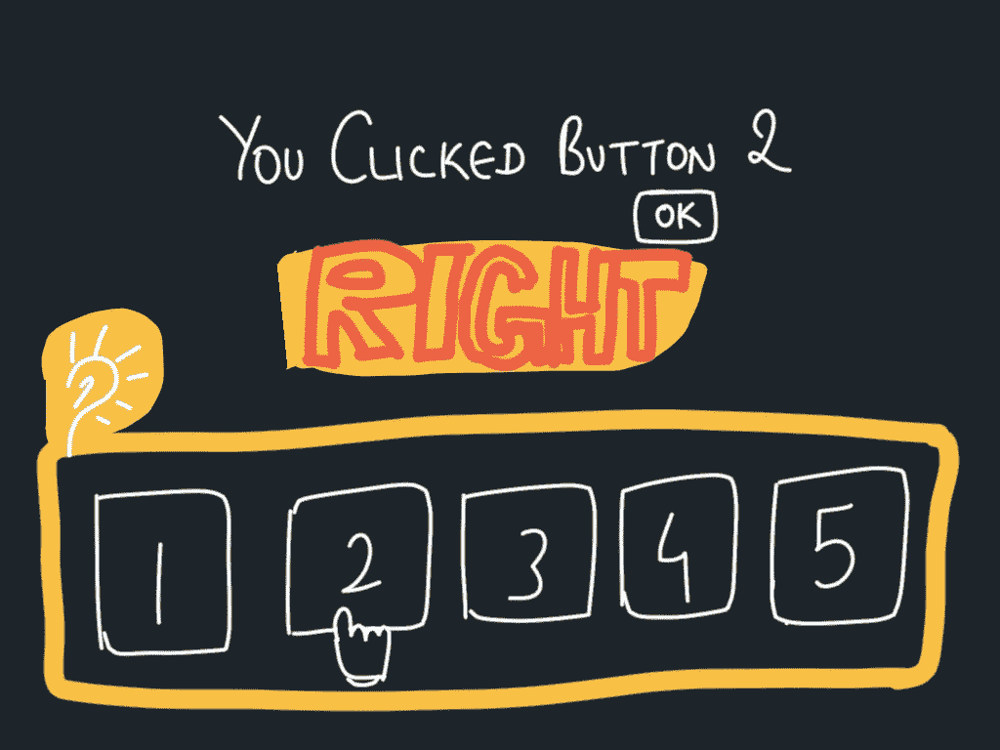

# 2 分钟内的活动委派— JavaScript 面试准备

> 原文：<https://levelup.gitconnected.com/event-delegation-in-2-mins-javascript-interview-prep-852b24f70ed>


*问题-* 为了监听按钮点击，需要添加多少个事件监听器？


*回答*——如果你认为你必须为所有按钮添加事件监听器，请继续阅读。您还不知道事件委派。


***事件委托*** 是一种在父节点而不是子节点上添加事件监听器的技术。当由于 DOM 树中的“事件冒泡”而在子节点上触发事件时，将调用侦听器。

让我们看一个例子。这里有 5 个按钮包装在一个`button- wrapper` div 中。

```
<div class=”button-wrapper”>
  <button>1</button>
  <button>2</button>
  <button>3</button>
  <button>4</button>
  <button>5</button>
</div>
```

您可以使用事件委托，只需将侦听器添加到按钮的父节点`button-wrapper` div 中。

```
document.querySelector(‘.button-wrapper’).addEventListener(‘click’, function(event){
  if(event.target && event.target.nodeName == “BUTTON”) {
    alert(`you clicked button ${event.target.innerHTML}`)
  }
})
```



如果你觉得这有帮助，请留下一些或许多:)掌声。