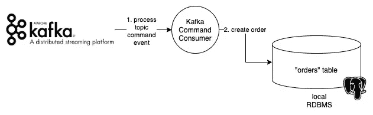

# 事件驱动的架构演示

> 原文：<https://levelup.gitconnected.com/event-driven-architecture-demo-29f5649144b7>

一个单柱架构，有 Kafka 和 GraphQL

图片来自 [Pixabay](https://pixabay.com/?utm_source=link-attribution&amp;utm_medium=referral&amp;utm_campaign=image&amp;utm_content=143832) 的[托马斯·乌尔里希](https://pixabay.com/users/lobostudiohamburg-13838/?utm_source=link-attribution&amp;utm_medium=referral&amp;utm_campaign=image&amp;utm_content=143832)

这篇文章是关于一个包含以下特性的演示 Web 应用程序:

1.  **事件驱动**。应用程序状态是作为处理事件的结果来维护的。只有一个暴露的突变端点，一个接受事件有效负载的`POST`。该端点由专用事件服务器提供服务。
2.  **命令和事实事件**:登记的事件属于两类事件。I)命令和 ii)事实事件。前者传达更新业务模型状态的意图/请求，而后者传达状态已经被更新的事实。
3.  **事件持续性**。事件被持久存储在 [Apache Kafka](https://kafka.apache.org/) 中。他们永远生活在那里，随时可以被任何消费者消费。
4.  **GraphQL 查询**。应用程序从其对应的应用程序服务器(不同于事件服务器)读取其状态。使用 GraphQL 加载整个状态。
5.  **CQRS——命令查询责任分离**:命令和查询的信息路径是分开的。或者换句话说，有一个命令模型和一个不同的读取模型。应用程序将命令作为命令事件发送到事件服务器，并使用 Graphql 查询从读取模型中读取其状态。
6.  **实时更新**。应用程序正在使用 Web 套接字获取有关其状态的实时更新。

# 架构图

演示的架构图

上图描述了组成演示的组件。

这应该是一个订单管理应用程序，实现了以下用例:

*   新秩序
*   订单列表

该图显示了组件之间的信息流。特别是:

1.  订单管理 Web 应用程序正在向事件服务器发送一个`POST /events`请求。有效负载包含关于需要创建的订单的信息。正是指挥事件`CreateOrder`。
2.  事件服务器验证事件并将其发布到 Apache Kafka 中。
3.  属于订单管理服务器的 Kafka 命令事件消费者监听事件。
4.  一旦事件到达，它就在数据库中创建订单。RDBMS 数据库保存订单管理应用程序的状态。
5.  随着订单在数据库中的成功创建，Kafka 命令事件消费者使用`POST /events`端点来创建事实事件`OrderCreated`。
6.  事件服务器验证事件并将其发布到 Apache Kafka。
7.  另一个卡夫卡事实事件消费者正在收听`OrderCreated`事实事件。一出版就消费。
8.  Kafka 事实事件消费者所做的只是将更新发布到 Redis 发布/订阅队列，该队列为 Web 应用程序的推送更新提供服务。
9.  创建的新订单的电报消息被推送给所有订户，因此我们实现了运行订单管理应用程序的 Web 浏览器的实时更新。

此外，您可以看到 Web 应用程序通过使用 GraphQL 从订单服务器获取订单来引导它们在浏览器中的状态。

# 使用的工具

我们使用的工具列表如下:

1.  [阿帕奇卡夫卡](https://kafka.apache.org/)。分布式事件流平台，允许应用程序通过使用事件进行通信并建立状态。
2.  [Rails](https://rubygems.org/gems/rails) API。用于事件服务器实现`POST`端点。以及应用程序服务器服务于 GraphQL 查询和维护应用程序的持久状态。
3.  `[ruby-kafka](https://rubygems.org/gems/ruby-kafka)` gem:在事件服务器中，它用于向 kafka 发布事件。
4.  `[rack-cors](https://rubygems.org/gems/rack-cors)` gem:它同时用于事件服务器和应用服务器，以允许浏览器发出跨站点请求。
5.  gem:它在应用服务器中用于响应 GraphQL 查询。
6.  `[karafka](https://rubygems.org/gems/karafka)` gem:在应用服务器中使用它来构建事件的消费者。
7.  `[redis](https://rubygems.org/gems/redis)` gem:用于与 Redis 服务器接口，使用 [ActionCable](https://rubygems.org/gems/actioncable) 和 Web sockets 实现浏览器的实时更新。
8.  `[typhoeus](https://gist.github.com/pmatsinopoulos/4017d8ac36021492c529d585062ec0cd)` gem:它用于从 Ruby 内部发送 POST 请求。
9.  Redis 服务器:它用于存储 ActionCable 实现的消息。
10.  [React](https://reactjs.org/) :浏览器层使用的 JavaScript 库，用于构建应用表示层。
11.  [Redux for React](https://react-redux.js.org/) :为 React 应用程序提供 [Redux](https://redux.js.org/) 状态管理功能的 React 组件。
12.  [React Bootstrap](https://react-bootstrap.github.io/) :一组 JavaScript 组件，包装 Twitter Bootstrap，允许在 Web 上快速开发漂亮的响应应用程序页面。

# 源代码库

*   [接收事件以创建订单的事件服务器](https://github.com/pmatsinopoulos/events-server)
*   [与 Kafka 消费者](https://github.com/pmatsinopoulos/orders-app-server)的订单管理服务器。
*   [允许用户创建订单和查看订单列表的网络应用](https://github.com/pmatsinopoulos/order-entry)

# 如何在本地运行它

## 阿帕奇卡夫卡

1.  从这里下载

2.然后，解压缩下载的文件。这将创建文件夹`kafka_2.12-2.7.0`(取决于你下载的版本)。

3.移至该文件夹(`cd kafka_2.12–2.70`)。

4.启动动物园管理员

`$ bin/zookeeper-server-start.sh config/zookeeper.properties`

5.开始卡夫卡

打开另一个终端窗口，使用以下命令启动 kafka:

`$ bin/kafka-server-start.sh config/server.properties`

6.创建`events_commands`主题

创建一个名为`events_commands`的主题。这将用于存储命令事件。

打开另一个终端窗口，运行以下命令创建它:

`$ bin/kafka-topics.sh --create --topic events_commands --bootstrap-server localhost:9092`

7.创建`events_facts`主题

创建一个名为`events_facts`的主题。这将用于存储事实事件。

打开另一个终端窗口，运行以下命令创建它:

`$ bin/kafka-topics.sh --create --topic events_facts --bootstrap-server localhost:9092`

8.启动控制台消费者

这一步不是必需的，但是很高兴看到 Kafka 附带的用于调试目的的标准消费者是如何消费事件的。

打开另一个终端，使用以下命令启动命令事件的控制台使用者:

`$ bin/kafka-console-consumer.sh --topic events_commands --from-beginning --bootstrap-server localhost:9092`

打开另一个终端，使用以下命令启动事实事件的控制台消费者:

`$ bin/kafka-console-consumer.sh --topic events_facts --from-beginning --bootstrap-server localhost:9092`

9.Redis 服务器

如果已经运行了 Redis 服务器，可以跳过这一步。否则，在本地下载、安装并运行 [Redis 服务器](https://redis.io/)。

10.Postgres

如果你已经运行了 Postgres，你可以跳过这一步。否则，在本地下载、安装并运行 Postgres 服务器。如果你在 Mac 上工作，我强烈推荐 [Postgres.app](https://postgresapp.com/) 。

11.启动事件服务器

如果您还没有这样做，您需要在本地克隆 [Rails 事件服务器](https://github.com/pmatsinopoulos/events-server) repo。

克隆后，移动到 repo 的根文件夹，`bundle`然后可以用命令启动服务器:

`$ bundle exec rails -p 3002`

12.启动订单应用服务器

如果您还没有这样做，您需要在本地克隆[订单应用服务器](https://github.com/pmatsinopoulos/orders-app-server) repo。

克隆后，移动到存储库的根文件夹，并

*   `$ bundle`
*   `$ bundle exec rake db:create`
*   `$ bundle exec rake db:migrate`

然后使用以下命令启动订单应用服务器:

`$ bundle exec rails s -p 3001`

13.启动卡夫卡消费者

在同一个订单应用服务器中，使用一个新的终端窗口，需要启动 Kafka 消费者。卡夫卡的消费者依赖`karafka`:

`$ bundle exec karafka server`

14.启动订单管理应用程序

如果您还没有这样做，您需要在本地克隆[订单管理应用程序](https://github.com/pmatsinopoulos/order-entry) repo。

在 repo 的根文件夹中，运行`yarn install`来安装必要的软件包。

然后，您可以使用以下命令启动应用程序:

`$ yarn start`

这将启动一个浏览器，在地址`[http://localhost:3000](http://localhost:3000)`本地运行应用程序

15.使用应用程序

一切都已设置好，您可以使用该应用程序来创建订单。在浏览器窗口上创建订单时，在此处[http://localhost:3000/orders/new](http://localhost:3000/orders/new):

*   你可以在这里打开另一个浏览器窗口:[http://localhost:3000/orders](http://localhost:3000/orders)。你会看到新的订单进来。
*   你将会看到 Kafka 控制台消费者也在他们自己的终端窗口中消费的事件。

## 观看视频

您可以观看此视频，了解演示应用程序的运行情况:

[https://youtu.be/9AJnCHci55g](https://youtu.be/9AJnCHci55g)

# 有趣的代码部分

## 事件服务器

事件服务器是一个非常简单的服务器，它只响应一个`POST /events`端点。它已经使用 Ruby on Rails 实现，并使用 gem `[ruby-kafka](https://rubygems.org/gems/ruby-kafka)`与 Apache Kafka 集成。

1.  卡夫卡的初始化

gem 使得初始化 Kafka 客户端变得非常容易。我们在文件`config/initializers/kafka_init.rb`中这样做

2.事件建模

事件建模

我们决定将这些事件分为两大类。

*   命令事件:这些事件揭示了改变业务实体状态的意图。例如，当需要创建新的`Order`时，会发布一个`CreateOrder`事件。消费者对这些事件感兴趣，因为他们负责维护企业实体的状态。
*   事实事件:这些是描述已经发生的事件的事件，它是一个*事实*。例如，事实事件可以是`OrderCreated`。也可能是`ActionButtonClicked`。这些事件通常用于通知消费者，他们想要对已经承诺、已经发生的事情采取行动。例如，如果我们有一个计算特定按钮点击次数的消费者，这个消费者可能对事件`ActionButtonClicked`感兴趣。

*参考*:如果你想了解更多为什么把命令事件和事实事件分开是有益的，你可以阅读标题为“[事件和命令:一枚硬币的两面？](https://opencredo.com/blogs/events-and-commands-two-faces-of-the-same-coin/)”。

3.处理传入事件

演示应用程序使用最简单的方法构建事件并将其发送给 Kafka:

向阿帕奇卡夫卡发布事件

为了便于演示，这种方法非常简单。例如，根据输入的`event_class`，主题名称可以是`events_commands`或`events_facts`。

请注意，接受事件的端点将请求体解析为 JSON 编码的有效负载，并期望找到:

*   `event_class`:这需要有一个值`Command`或`Fact`。
*   `event_type`:带`CreateOrder`或`OrderCreated`中的一个。
*   `payload`:实际事件有效载荷。

4.已发布事件的结构

请注意，Kafka 接受各种形式的实际发布事件。我们决定使用普通字符串。然而，我们所做的是使用`ActiveSupport::JSON.encode(event)`命令对 Ruby 事件实例进行 JSON 编码。

演示应用程序中使用的事件实例是`Events::Commands::CreateOrder`或`Events::Commands::OrderCreated`:

两者都源自基类`Events::Base`:

由于事件是`Events::Commands::CreateOrder`或`Events::Commands::OrderCreated`的实例，并且`data`和`event_id`属性源自`Events::Base`，这意味着实际事件将是一个 JSON 对象，例如:

这是一个非常简单的设计，在实际的生产应用中，人们需要彻底考虑事件的设计和主题的设计。

## 订单管理服务器

这是另一个 Ruby on Rails 服务器，作为一个卡夫卡消费者，使用`[karafka](https://rubygems.org/gems/ruby-kafka)`宝石与 Apache 卡夫卡集成。

1.  `karafka`配置

这可以通过各种方式来实现，但是一个简单的方法可以在文件`karafka.rb`中实现，我们已经将它放在了[项目](https://github.com/pmatsinopoulos/orders-app-server/blob/main/karafka.rb)的根文件夹中。

其中最重要的部分是卡夫卡的消费者将会从事件中听到的主题的配置。

如上图所示，我们正在建立 2 个消费群，每个消费群分别来自`events_commands`和`events_facts`主题。

消费者的实现在 Ruby 中实现如下:

2.`events_commands`话题消费者

`events_commands`主题事件的消费者是`::Commands::EventsConsumer`。

events_confumer.rb

在我们看到它的实际代码之前，让我们确保您理解这个消费者的责任。

卡夫卡指令消费者的责任

I)卡夫卡命令消费者需要处理来自主题`events_commands`的命令事件。

ii)需要在 Postgres 数据库的`orders`表中创建订单。

这些足以处理命令事件，但是在这个演示应用程序中，创建订单的卡夫卡消费者想告诉世界其他地方这个成功的信息提交。为了实现这一点，它会发布回一个事实事件`OrderCreated`。因此，这是它的第三项责任:

ii)发布事实事件`OrderCreated`以使任何利害关系方知晓。

卡夫卡指令消费者的第三责任

从上图中可以看出，我们已经决定使用发布事件的端点来发布`OrderCreated`事实事件，即事件服务器中的`POST /events`，尽管我们可以直接发布回 Kafka。但是，我们希望为事件的创建提供一个单一的入口点，这样我们就可以应用验证和其他特性，比如身份验证和授权。

了解了 Kafka command 消费者的责任之后，现在让我们来看看其背后的实际代码:

您可以在第 6 行清楚地看到订单的创建。对 T2 的争论来自 T3。这种便利是由`karafka`宝石提供给我们的。

第 7 行调用方法`send_reponse_with()`。该方法在超类`ApplicationConsumer`中实现如下:

这非常简单，并且遵循将响应委托给相应的`Responder`对象的模式。换句话说，`Commands::EventsConsumer`通过调用`#respond`方法将响应委托给`Commands::EventsResponder`对象。

命令::事件消费者委派对命令的响应::事件响应者

3.响应命令事件

响应者位于`responders`文件夹中:

响应者的位置

在这种特殊情况下，响应者将负责请求创建事实事件`OrderCreated`。下面是它的实现代码:

它用事实事件的细节准备请求体，并通过调用方法`post_message`进行 post。该方法在`ApplicationResponder`超类中实现。

这里，我们只是向事件服务器发出一个`POST`请求。请求是在宝石`[typhoeus](https://gist.github.com/pmatsinopoulos/4017d8ac36021492c529d585062ec0cd)`的帮助下完成的。

响应者发布到事件服务器

4.`events_facts`话题消费者

在我们的演示应用程序中，我们还设置了另一个消费者，一个用于到达`events_facts`主题的事实事件。这个消费者生活在订单管理服务器中，但是它也可能生活在另一个服务器中。

事实事件消费者的位置

消费者的责任是将新订单的详细信息推送到浏览器中运行的应用程序，即客户端应用程序。

正如您从上图中看到的，它通过将订单的细节作为一条`ActionCable`消息进行广播来消费`OrderCreated`事实事件。换句话说，新订单的细节通过 Web 套接字被推送到浏览器。

下面的实际代码可能会让事情变得更清楚:

5.GraphQL 请求处理程序

最后，订单管理服务器处理 GraphQL 请求。它使用`[graphql](https://rubygems.org/gems/graphql)` gem 来提供这一功能并公开一个 GraphQL API。

演示应用程序只公开了一个查询，即获取订单列表。当用户访问 URL `/orders`时，订单管理 Web 应用程序使用它来引导其状态。

GraphQL API 公开的订单列表

这里给出了`query_type.rb`的实现:

而`order_type.rb`本身就很简单:

## 订单管理 Web 应用程序

这是通过使用

*   反应
*   Redux(反应-还原)
*   带`@rails/actioncable`的 Web Sockets 客户端。

1.  设置

一切都从`[src/App.js](https://github.com/pmatsinopoulos/order-entry/blob/main/src/App.js)`文件开始

*   设置 redux 存储
*   我们订阅了`application_messages`通道，按照惯例，它需要在浏览器/JavaScript 层被称为`ApplicationMessageChannel`。

当新消息作为实时更新从服务器传入时，流程从`received`处理程序的实现开始。

我们使用 redux `dispatch`方法来分派正确的动作。

2.`Orders`反应组分

在`[src/pages/orders/Orders.js](https://github.com/pmatsinopoulos/order-entry/blob/main/src/pages/orders/Orders.js)`中实现的`Orders`组件已经将其属性绑定到 redux 状态。因此，当`dispatch`发生时，该组件知道有新的东西进来并更新其状态。

此外，组件使用`useEffect`钩子，以便使用 GraphQL 从服务器获取订单列表。

# 单柱

我们不知道你是否注意到了，但是这个演示提出了一个全世界只有一个 POST 端点的架构。你能做到这种思维转变吗？你有没有想过只用一个 POST 端点来实现你的新项目？一个只接受事件的端点。我们觉得这个想法很吸引人。你呢？

— — — — — — — — — — — — — — — — — — — — — — — — — — — — —

现在的我:我在[拉万达](https://getlavanda.com/)工作，有很棒的同事和很棒的项目。我是后端工程师的成员。此外，我在[帕宁音乐学院学习音乐。当我不工作时，我尝试软件工程中的新事物，我弹钢琴，阅读音乐，阅读文学作品(大部分是历史)，我看电影，我和我的狗玩耍，和我的家人过着可爱的生活。](https://www.paneion-odeio.gr/)