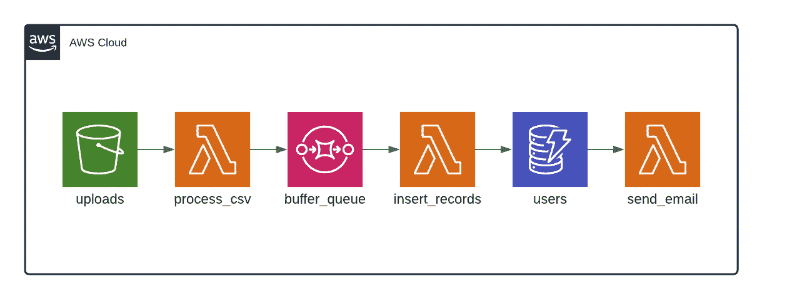

# 面向虚拟对象的事件驱动架构

> 原文：<https://levelup.gitconnected.com/event-driven-architecture-for-dummies-222c7b930e5f>

## 使用 AWS 和 Terraform 的简单示例。


在 [Unsplash](https://unsplash.com?utm_source=medium&utm_medium=referral) 上由 [Sereja Ris](https://unsplash.com/@serejaris?utm_source=medium&utm_medium=referral) 拍摄的照片

设计软件时，有许多架构模式可供我们选择。我们有每个人都试图逃离的单块应用程序，也有每个人都努力追求的微服务。我想谈谈事件驱动架构。

# **事件驱动架构对应用程序状态的变化做出反应。**

为了说明这一点，让我们制作一个简单的应用程序。该应用程序的目的是上传姓名和电子邮件的 CSV 文件，并模拟批量创建用户帐户的过程。插入每个用户后，我们会向他们发送一封欢迎电子邮件。

有些事情要先做。[如果您的 SES 处于沙盒模式，您应该验证至少一个电子邮件地址，以便发送和接收电子邮件。](https://docs.aws.amazon.com/ses/latest/DeveloperGuide/verify-email-addresses-procedure.html)

该应用程序由以下部分组成:

*   一个 S3 桶上传我们的 CSV 文件。上传的文件将使用 [S3 生命周期规则](https://docs.aws.amazon.com/AmazonS3/latest/userguide/object-lifecycle-mgmt.html)自动删除。
*   处理新插入的 SQS 队列。为了获得更可靠的解决方案，我们应该添加一个 [DLQ](https://docs.aws.amazon.com/AWSSimpleQueueService/latest/SQSDeveloperGuide/sqs-dead-letter-queues.html) 。
*   一个 DynamoDB 表来存储我们的用户。[流](https://docs.aws.amazon.com/amazondynamodb/latest/developerguide/Streams.html)将被启用。
*   三个 Lambda 函数:1)处理 CSV 文件，2)将记录插入 DynamoDB 表，3)发送欢迎电子邮件



事件驱动架构图

解释图表的时间到了:

1.  我们上传一个 CSV 文件到 S3 桶。上传可以从前端或对 S3 的 API 调用进行。我们在 S3 桶上启用了通知，因此每次有上传时，我们都会触发`process_csv` Lambda 函数。
2.  `process_csv` Lambda 函数将解析 CSV 文件，并一次向我们的`buffer_queue` SQS 队列发送 10 条记录。
3.  当新记录在`buffer_queue` SQS 队列中时，将执行`insert_records` Lambda 函数。它将抓取这些记录，并批量插入到我们的`users` DynamoDB 表中。我们配置了启用了`streams`的表，因此在新插入时，它将触发`send_email` Lambda 函数。
4.  λ会给新用户发送一封电子邮件。

Terraform 代码来匹配和解释上述步骤:

1)要创建 S3 桶，我们可以编写以下代码。定义参数`lifecycle_rule`将在我们上传 CSV 文件一天后自动删除它们。这将使我们的水桶长时间保持清洁，并避免支付存储费用。

```
resource "aws_s3_bucket" "uploads" {
  bucket        = "my-custom-uploads"
  acl           = "private" lifecycle_rule {
    id      = "my-custom-uploads-object-removal-rule"
    enabled = true
    expiration {
      days = 1
    }
  }
}
```

接下来我们定义一个 Lambda 函数，它将在每次上传后处理我们的 CSV 文件。为了触发 Lambda 函数，我们需要定义一个 [S3 通知](https://docs.aws.amazon.com/AmazonS3/latest/userguide/NotificationHowTo.html)，并向 Lambda 函数添加权限，以便 S3 桶可以执行它。

```
resource "aws_lambda_function" "process_csv" {
  filename = "path/to/lambda/zip/file"
  function_name = "myCustomFunction"
  role = aws_iam_role.role.arn
  handler = "handler"
  source_code_hash = filebase64sha256("path/to/lambda/zip/file")
  runtime = "nodejs14.x"
  memory_size = 1024
  timeout = 30
}resource "aws_lambda_permission" "process_csv_allow_s3" {
  statement_id  = "${var.name}-process-csv-AllowExecutionFromS3"
  action        = "lambda:InvokeFunction"
  function_name = aws_lambda_function.process_csv.function_name
  principal     = "s3.amazonaws.com"
  source_arn    = aws_s3_bucket.uploads.arn
}resource "aws_s3_bucket_notification" "bucket_notification" {
  bucket = var.uploads_bucket_name
  lambda_function {
    id                  = "uploads-event-process-csv"
    lambda_function_arn = aws_lambda_function.process_csv.arn
    events              = ["s3:ObjectCreated:*"]
  }
}
```

2)现在我们的 Lambda 函数将处理这些 CSV 文件，并一次向 SQS 队列发送 10 条记录。通过这样做，我们可以抑制对 Lambda 函数的调用，该函数会将记录插入到 DynamoDB 表中。

3)为了保存记录，我们需要创建一个 SQS 队列、一个 Lambda 函数和一个启用了流的 DynamoDB 表。通过启用这个特性，我们可以自动调用我们的第三个 Lambda 函数，并向新用户发送电子邮件。

```
resource "aws_sqs_queue" "buffer_queue" {
  name = "my-custom-buffer-queue"
}resource "aws_lambda_function" "insert_records" {
  filename = "path/to/lambda/zip/file"
  function_name = "myCustomFunction"
  role = aws_iam_role.role.arn
  handler = "handler"
  source_code_hash = filebase64sha256("path/to/lambda/zip/file")
  runtime = "nodejs14.x"
  memory_size = 1024
  timeout = 30
}resource "aws_dynamodb_table" "users" {
  name              = "my-custom-users"
  billing_mode      = "PAY_PER_REQUEST"
  hash_key          = "type"
  stream_enabled    = true
  stream_view_type  = "NEW_IMAGE"
  attribute {
    name = "type"
    type = "S"
  }
}
```

**需要记住的一件重要事情是，处理记录插入的 Lambda 函数需要从 SQS 队列中接收和删除消息的权限。**

```
data "aws_iam_policy_document" "sqs" {
  policy_id = "my-custom-lambda-sqs"
  version   = "2012-10-17" statement {
    effect  = "Allow"
    actions = [
      "sqs:ReceiveMessage",
      "sqs:DeleteMessage",
      "sqs:GetQueueAttributes"
    ] resources = [aws_sqs_queue.buffer_queue.arn]
  }
}
```

我们需要通过`[event_source_mapping](https://docs.aws.amazon.com/lambda/latest/dg/invocation-eventsourcemapping.html)`将 Lambda 函数与 SQS 队列连接起来，并向 Lambda 函数添加权限，以便 SQS 队列可以执行它。

```
resource "aws_lambda_event_source_mapping" "buffer_queue" {
  event_source_arn = aws_sqs_queue.buffer_queue.arn
  function_name    = aws_lambda_function.insert_records.arn
}resource "aws_lambda_permission" "buffer_queue_execution" {
  statement_id  = "${var.name}-buffer-queue-AllowExecutionFromSQS"
  action        = "lambda:InvokeFunction"
  function_name = aws_lambda_function.insert_records.function_name
  principal     = "sqs.amazonaws.com"
  source_arn    = aws_sqs_queue.buffer_queue.arn
}
```

4)我们的 Lambda 函数将插入新记录，但我们需要监听这些插入。我们已经在表上启用了 DynamoDB 流，所以我们只需要连接一个 Lambda 函数，就可以发送欢迎电子邮件了。

**需要记住的一件重要事情是，处理电子邮件发送的 Lambda 函数需要权限来接收来自 DynamoDB 流的数据。**

```
data "aws_iam_policy_document" "dynamodb" {
  policy_id = "my-custom-lambda-dynamodb"
  version   = "2012-10-17"statement {
    effect  = "Allow"
    actions = [
      "dynamodb:GetRecords",
      "dynamodb:GetShardIterator",
      "dynamodb:DescribeStream",
      "dynamodb:ListShards",
      "dynamodb:ListStreams"
    ] resources = [aws_dynamodb_table.users.arn]
  }
}
```

我们需要通过`event_source_mapping`将 Lambda 函数与 DynamoDB 流连接起来，并向 Lambda 函数添加权限，以便 DynamoDB 流可以执行它。

我们再次定义了 Lambda 函数，并添加了适当的权限来读取 DynamoDB 流并执行 Lambda 函数。

```
resource "aws_lambda_function" "send_email" {
  filename = "path/to/lambda/zip/file"
  function_name = "myCustomFunction"
  role = aws_iam_role.role.arn
  handler = "handler"
  source_code_hash = filebase64sha256("path/to/lambda/zip/file")
  runtime = "nodejs14.x"
  memory_size = 1024
  timeout = 30
}resource "aws_lambda_event_source_mapping" "send_email" {
  event_source_arn = aws_dynamodb_table.users.stream_arn
  function_name    = aws_lambda_function.send_email.arn
}resource "aws_lambda_permission" "send_email_execution" {
  statement_id  = "send-email-AllowExecutionFromDynamoDB"
  action        = "lambda:InvokeFunction"
  function_name = aws_lambda_function.send_email.function_name
  principal     = "sqs.amazonaws.com"
  source_arn    = aws_dynamodb_table.users.stream_arn
}
```

要查看完整的解决方案，您可以[克隆 repo](https://github.com/jagonzalr/event-driven-architecture-example) 并在您的 AWS 帐户上部署该解决方案。Lambda 函数的实际代码可以用 AWS 支持的任何 l [语言编写。在示例 repo 中，它是用 Node.js 编写的](https://docs.aws.amazon.com/lambda/latest/dg/lambda-runtimes.html)

如果你上传了正确格式的 CSV 文件，几秒钟后你会收到一封电子邮件。就这样，您刚刚构建并部署了您的第一个事件驱动的解决方案🎉

[](https://blog.jagonzalr.com/membership) [## 加入我的介绍链接媒体-何塞安东尼奥冈萨雷斯罗德里格斯

### 作为一个媒体会员，你的会员费的一部分会给你阅读的作家，你可以完全接触到每一个故事…

blog.jagonzalr.com](https://blog.jagonzalr.com/membership)