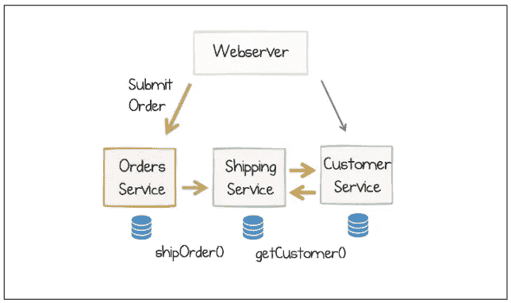
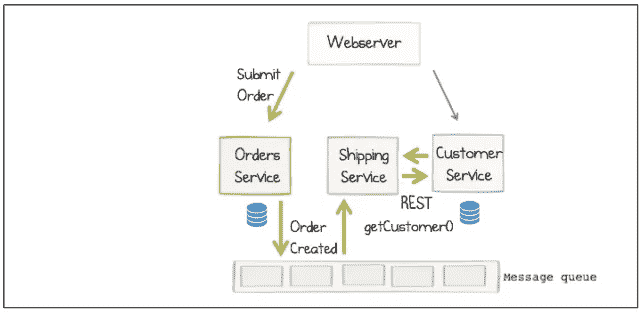
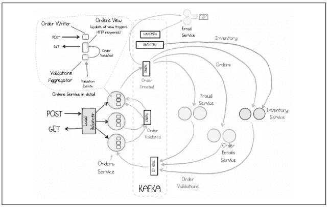

# 软件设计中的事件驱动架构

> 原文：<https://levelup.gitconnected.com/event-driven-architectures-in-software-design-757d92b85df5>

随着现代应用程序必须处理的数据量不断增加，需要新的更复杂的系统架构。

近年来最闪亮的宝石之一是事件驱动架构。

这种模式帮助脸书、谷歌、LinkedIn 和其他巨头克服了他们特有的一系列问题，同时也帮助快速成长的小公司保持势头，成为成功的组织。

那么…交易是什么？

事件驱动架构(或 EDA)是一种软件设计风格，其理念是服务之间的通信必须通过发送和响应“事件”来完成。

这些事件通常被定义为系统中某处的状态变化，这些变化被公开给其他可能感兴趣的服务，而不是直接与它们通信。

以任何在线商店的简单客户订单为例。

在请求驱动的架构中(简单请求/响应设置的别称)，在线购买可能如下图所示:

本·斯托福德的《设计事件驱动系统》中的图表

这里我们有一个 web 服务器，它将用户的订单提交给订单服务，然后

1.  订单服务向运输服务发送一个`shipOrder()`请求。
2.  运输服务需要客户的信息，所以它向客户服务请求信息。
3.  然后，当信息返回时，运输服务可以完成处理。

这听起来像是合乎逻辑的第一步，但是随着系统的增长，这些类型的服务会变得非常复杂，尤其是在添加更多交互时。

我们可能希望添加订单分析组件，我们可能希望有一个实时欺诈检测组件，或者一个单独的库存管理系统，我们可能需要处理客户的请求，但这是不可能的，直到某些信息通过一个阶段，如运输服务。各种各样的复杂情况都会出现。

在事件驱动的体系结构中，前面的事务如下所示:

编辑图，摘自 Ben Stopford 的《设计事件驱动系统》

在这个过于简单的示例中，有一个微小的变化，即 Orders 服务决定传达订单创建的方式。

这里，它不是直接向运输服务发送请求，而是向所有正在收听的人发送一个“Order Created”事件，通知他们刚刚发生了什么。

这种微小的差异是 EDA 的一个重要优势。您不再需要交互，甚至不需要知道您自己的子域之外的服务的存在，这带来了很多可能性。

**推出新服务**

考虑添加一个新服务的情况，该服务需要知道订单是何时创建的，以便进行一些额外的处理，比如实时分析订单的数据，以将其显示在产品团队仪表板上。

在请求/响应世界中，您需要修改 Orders 服务来发送对新服务的`shipOrder()`调用，但是在 EDA 世界中，新服务只需要订阅 Order Created 事件，其他人不需要知道或更改任何事情。

很酷吧。

在最后一个例子中，我已经介绍了很多概念，所以在接下来的章节中，我们将对组件、考虑事项、模式以及是否适合 EDA 进行分析。

# 在事件驱动的架构中，哪些组件是必不可少的？

**服务**

为了能够设计 EDA，您的系统需要以松散耦合的服务来构建。要么你现在就开始构建它们，要么从一个整体开始慢慢迁移。它可能是一个 SOA 或者一个[微服务架构](https://medium.com/geekculture/brief-introduction-to-microservices-b99a91c77c72)。关键是需要跨不同服务的通信。

**通信**

通信媒介也很重要，你需要一个可以承载事件数据的消息系统，最好是像 [RabbitMQ](https://www.rabbitmq.com/) 这样的消息队列系统或者像 [Kafka](https://kafka.apache.org/) 这样的流媒体平台。

这是仅有的两个主要组件。之后，您的系统的需求将会有很大的变化，您可能需要也可能不需要其他组件，如数据存储、分析、APMs 等。

也就是说，在如此复杂的系统中，您可能需要良好的监控和设计良好的数据网格。如果你不怕麻烦走这条路，它肯定是值得的，如果不是一个实际的要求。

# 设计 EDA 时需要考虑什么？

如果你发现自己在设计一个事件驱动的架构，在你从头开始构建它之前，你可能不会坐在那里画画。很有可能你会(或者已经)在一段时间内进化它。

设计考虑更多的是您需要记住的一组持续的原则和模式，并且将根据您的增长和期望的规模而变化。

设置它的时间点也很重要。如果你刚刚起步，设计一些东西来处理脸书的交通是没有意义的。

开始的时候，保持简单，但要留有成长的空间。决定您想要遵循的模式，并遵循这些指导原则构建您的服务。

也就是说，有一些常见的模式你可能想看看

**领域驱动设计**

顾名思义，这种思想就是软件开发是围绕一个特定的领域进行的，该领域有特定的规则和过程。有明确的界限，与其他域的通信通过触发到“外部”的事件发生。这允许其他域根据其他地方发生的事情进行监听和更新，而不需要将系统中分离的部分连接在一起。

**事件采购**

这种方法在业务实体(或对象)经历变化时存储其状态。每当发生变更事件时，我们都会将其存储为事务的一部分。这允许我们根据发生在物体上的事件来重建物体的状态。

建立一个像 Kafka 这样的流媒体平台，事件可以永久存储，这使得原子地执行这些操作变得更加容易。

事件采购示例可以是我们的客户订单场景。我们可以存储每次状态改变后创建、验证、处理、发货和完成的订单。

**命令查询责任分离(CQRS)**

这可能是设计事件驱动架构时要遵循的理想模式。读取和写入职责是分离的，允许服务读取特定的数据存储(或构建自己的本地缓存)，而数据所有者负责写入数据。这种模式可能很复杂，只有在真正需要的时候才应该使用，但是让模型来读，让其他人来写的想法创造了一个解决问题的机会的世界。

# 埃达是你的吗？复杂性与规模

我们可能都听说过有人设计了复杂的微服务或无服务器架构，使用多种编程语言和框架，而他们只需要一个包含几项服务的网站。

像软件工程中的任何其他模式或工具一样，EDA 并不适合所有场景。你需要衡量你从中获得了什么，以及你是否真的需要它。

在这种范式下，小软件系统成为大系统的自然路径实际上是从一个(或一个小集合)只做基础工作的单块应用开始。

随着更多功能的增加，您可以开始构建服务(或微服务)来满足这些需求。在某个时候，您将到达通信成为一种约束的门槛，您可能需要重新设计您的服务来通过事件进行通信。这是你想开始考虑复杂模式的时候，但是等到你看到需要的时候。

您甚至可以使用轻量级解决方案，如消息队列，在提交完整的流媒体服务之前传递消息。

关键是，你需要在复杂性和规模之间保持平衡。您希望为规模做好准备，但在没有充分理由的情况下，不要让您的工程师过早地陷入痛苦。

# 有什么工具可以帮助你

我最喜欢的两个在事件驱动架构中实现通信的工具是 RabbitMQ(用于轻量级消息队列)和 Kafka(用于大量分布式流)。

两者各有利弊。作为一般指导，我会使用 RabbitMQ 进行消息传递，以取代一些 RPC 场景，或者实现一个轻量级 EDA。如果您以正确的方式设置它，RabbitMQ 可以在您需要更重的解决方案之前带您走很长的路。

如果你的需求更加复杂和详细，那么卡夫卡可能是你的最佳选择。现在，你可以使用像 Confluent 或 Cloudkarafka 这样的云服务，这使得你只需点击几下鼠标就可以更容易地建立 Kafka 集群并开始测试。

这里最重要的部分是选择符合你需求的东西。其他任何事情都是麻烦而不是有益的。

# 那么，最后是什么样子的呢？

EDAs 可以像你想要的那样复杂，但是原理是一样的。您传递关于发生了什么的事件，并让其他服务决定它们是否感兴趣。

下面是我们在后台下网上订单的例子。下图显示了不同的服务如何与流媒体平台上的事件进行交互(在本例中为 Kafka)。

本·斯托福德的《设计事件驱动系统》中的图表

注意订单服务是如何做三件事的，

*   它接收订单并发送订单创建事件。
*   它侦听订单验证事件。
*   一旦更新了自己的数据存储，它就会通过 GET 显示订单的状态。

其他的对它来说都不重要。有欺诈组件、库存组件、订单验证组件和电子邮件服务……所有这些组件都独立工作以履行其职责，当它们这样做时，它们只是遵循模式并发送适当的事件。

另一个好处是，所有这些服务都可以独立扩展。如果一些服务比其他服务更忙，更多的权力可以交给他们。与此同时，他们一次只处理流中的一个项目(形象地说，更有可能你已经将它并行化了)，所以处理是非常高效的，因为他们像流水线一样不断地执行任务。

# 结论

软件工程充满了非常酷的挑战，创新总是在拐角处。似乎每天人们都在创造非常酷的东西，想出解决问题的新方法。

困难的是仔细看看，并决定什么是手头工作的最佳工具。从最好的编程语言，到最好的云托管、框架或系统架构。

当选择复杂的事件驱动架构时，会有很多乐趣，但也有很多挑战需要克服。我们必须关注基础，学习软件模式以避免常见错误。

在这个层面上，糟糕的设计决策会让你付出代价，而且很难撤销。预先做大量的思考将帮助你更好地理解你想要达到的目标，并决定你想要如何构建你的组件。

关注这个行业正在做什么，问很多问题，和已经解决了你面临的一些问题的人聚在一起。这可能是设计复杂系统的最佳方法。

快乐设计！