# C#中的事件驱动编程

> 原文：<https://levelup.gitconnected.com/event-driven-programming-in-c-9264efb06c01>


卡罗尔·郑在 [Unsplash](https://unsplash.com/) 上的照片

从我作为一名系统管理员(用各种语言编写脚本——Bash、Python、PowerShell 等)到现在作为一名开发人员/DevOps，我只真正地遵循过过程驱动编程。

我写软件的方法一直是:

1.  把一个问题分解成一系列更小的问题(步骤)
2.  写出解决每一步的方法(步骤)
3.  按照正确的顺序调用这些过程，以解决原来的问题。

所以一个典型的程序应该是这样的:

```
public void DoSomething()
{
    DoStep1();
    DoStep2();
    if (SomeCondition())
    {
        DoStep3();
    }
}
```

我最近完成了一项编码挑战(工作面试的一部分),虽然我成功地满足了挑战指定的功能需求，但我收到的反馈是我未能展示我对事件驱动编程的理解。

我承认，我一直认为事件驱动更适合前端(我主要在后端工作)。就像点击一个按钮…

```
<button onclick="myFunction()">Click me</button>
```

所以我开始研究如何用 C#编写一个事件驱动的解决方案。

这是我发现的。

# 什么是事件驱动编程？

互联网上有大量的信息，所以我将简单地引用我认为最容易理解的定义:

> 基于事件的编程与旧形式的不同之处在于，以前，指令列表是以预先确定的固定顺序执行的，程序使用期间发生的下一件事是列表中的下一个点。此外，所有的程序都是由代理运行的，即计算机。**在基于事件编程的条件下，对象(即用户)可以在程序中发起一些事件(“火灾事件”)，程序中接下来发生的事情由那些事件决定。**因此，基于事件的编程促进了用户和计算机之间的动态交互。

*-“*[*事件驱动编程:为什么现在流行了？*](https://www.rswebsols.com/tutorials/programming/event-driven-programming) *”，苏维克·班纳吉*

# 在 C#中实现发布者-订阅者模式

发布者-订阅者(pub-sub)模式是实现事件驱动架构的一种形式。在这种模式中:

*   **Publisher** :公开事件的类；事件发射器。这是每个事件的起源。
*   **订阅者**:订阅你事件的类；事件处理程序。方法被定义来响应事件。

在 C#中，这个实现是通过使用**事件处理程序**和**事件**来完成的。我总结了以下 4 个步骤:

**#1 —定义事件。**

通常当一个事件发生时，我们需要传递一些关于它的信息。这是通过 EventArgs 完成的。

我们的第一步是创建一个定制的 EventArgs 类，它包含我们想要的任何事件细节。

例如:

```
public class SomeEventArgs : EventArgs
{
    public string Description{ get; set; }
    public DateTime Date { get; set; }public SomeEventArgs(string description, DateTime date)
    {
        Description = description;
        Date = date;
    }
}
```

**#2 —定义发布者**

发布者是*向*发送事件通知的类。这是通过使用`event EventHandler`属性完成的，该属性充当*事件中枢*。

发布者可以向 EventHandler 发送事件通知。

然后，其他对象可以订阅 EventHandler，并在发送通知时响应事件。

*   首先，添加一个公共 eventhandler 属性(使用步骤 1 中的 eventArg 类型)。
*   就您要通知订阅者的操作发送事件通知。

```
public class Publisher
{
    // Add the public eventhandler
    public event EventHandler<SomeEventArgs> OnSomeEvent;public void DoSomething()
    {
        // Do something here
        RunSomeCode(); // Send a notification that an event has occurred
        if (OnSomeEvent != null)
        {
            OnTransactionProcessed(this, new SomeEventArgs("something happened", DateTime.Now);
        }
    }
}
```

**#3 —定义用户**

订户指的是对事件做出响应的类。

*   使用与发布者的 eventhandler 匹配的签名创建方法。这可以是一个私有方法。
*   创建一个公共方法来订阅。

```
public class Subscriber
{
    private void RespondToEvent(object sender, SomeEventArgs e)
    {
        DoStuff(e.Description, e.Date);
    }public void Subscribe(Publisher publisher)
    {
        publisher.OnSomeEvent += RespondToEvent;
    }
}
```

**#4 —记得订阅！**

```
public static void Main(string[] args)
{
    var pub = new Publisher();
    var sub = new Subscriber(); sub.Subscribe(pub);
    pub.DoSomething();
}
```

# 示例:审计服务

在本例中，我编写了一个 API 来完成以下任务:

*   处理交易(存款和取款)
*   处理的每个事务都需要写入审计日志

***注意:*** *本例中没有实现实际的处理和审计源，这更多地是为了演示过程驱动和事件驱动的方法。*

## 程序范式

这是我通常写这种东西的方式。

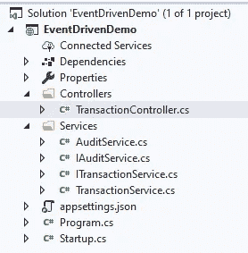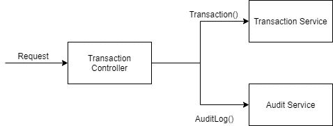

请求被路由到控制器类，控制器类将业务逻辑的执行交给服务类。在这个例子中，我已经创建了一个单独的审计服务，它必须在事务完成时由控制器显式调用。

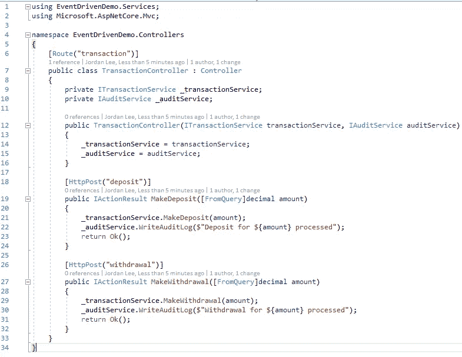

**交易控制器**—ASP.Net 核心控制器；接收 HTTP 请求并将值交给事务和审计服务进行处理

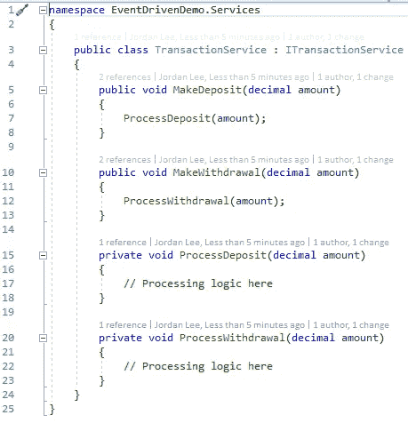

**事务服务** —执行事务逻辑

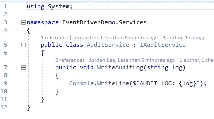

**审计服务** —执行审计逻辑

最后，这是我们在执行存款/取款时看到的情况:

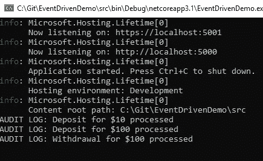

## 事件驱动范式

使用前面的例子，我重构了代码，使用事件驱动的方法来编写审计日志。

下面是重构后的样子。

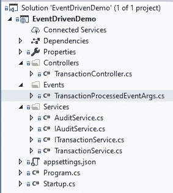

**# 1——定义事件。**

在本例中，它是*事务处理事件*。

为了应对这一事件，我需要知道两件事:

1.  交易类型—存款或取款
2.  交易金额

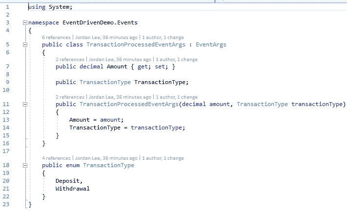

**#2 —定义发布者**

记住，发布者是事件*产生*的地方。在这种情况下，它将是*事务服务*。

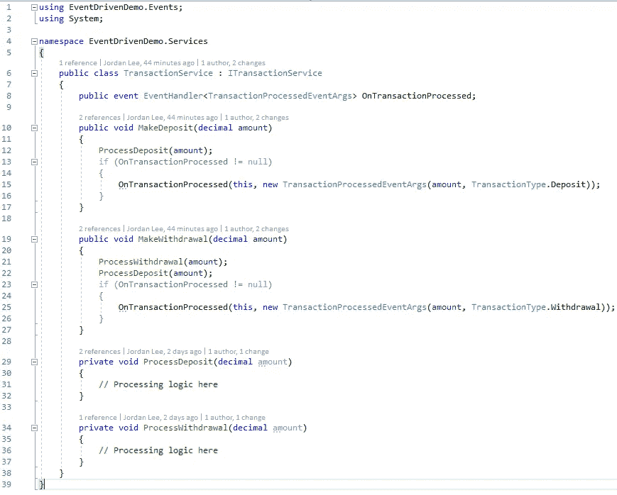

此处的主要变化:

*   公开 EventHandler 属性以允许其他类订阅
*   在每个事务(MakeDeposit 和 MakeWithdrawl)之后，我们向 OnTransactionProcessed eventhandler 发送一个通知。

**#3 —定义用户**

订户*对事件做出响应*。在本例中，它是*审计服务*。

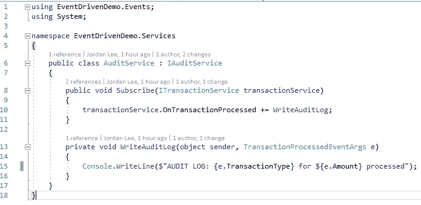

此处的主要变化:

*   新的 Subscribe()方法允许 AuditService 订阅 transaction service event handlers
*   WriteAuditLog 现在是订阅 transaction processed eventhandler 的方法。
    方法已更改为 private，签名也已更改以适应 eventhandler。

**#4 —更新控制器以管理发布订阅**

控制器没有显式调用 AuditService 来写入审计日志，而是将 AuditService 设置为订阅事务服务中的 TransactionProcessed 事件。

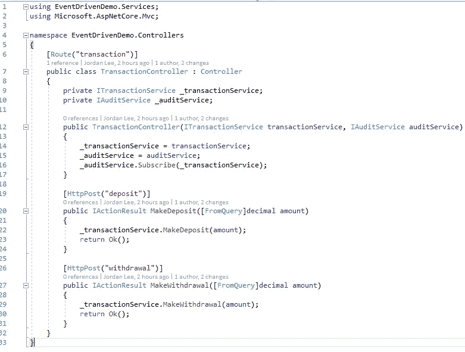

现在，当我们运行程序和执行一些事务时，我们仍然可以看到审计日志被写入。

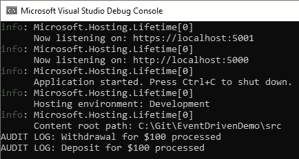

# 参考

*   [https://codewithshadman . com/publish-subscribe-design-pattern-in-cs harp/](https://codewithshadman.com/publish-subscribe-design-pattern-in-csharp/)
*   [https://docs.microsoft.com/en-us/dotnet/standard/events/](https://docs.microsoft.com/en-us/dotnet/standard/events/)
*   [https://stack overflow . com/questions/803242/understanding-events-and-event-handlers-in-c-sharp](https://stackoverflow.com/questions/803242/understanding-events-and-event-handlers-in-c-sharp)
*   [https://stack overflow . com/questions/46824524/event-vs-eventhandler](https://stackoverflow.com/questions/46824524/event-vs-eventhandler)

*示例项目的代码可以在 GitHub 上找到:* [【https://github.com/therealjordanlee/EventDrivenDemo ](https://github.com/therealjordanlee/EventDrivenDemo)

如果您想了解从过程化方法到事件驱动方法的转变过程中发生了哪些变化，您可以查看 git 历史记录。

*如果你觉得这篇文章很有趣，你可能也想看看我写的关于使用观察者模式作为事件驱动编程的替代实现的后续文章:*

[](/event-driven-programming-in-c-observer-pattern-7a8d790bbdb2) [## C#中的事件驱动编程——观察者模式

### 在我之前的 C#事件驱动编程文章中，我讲述了使用发布者-订阅者的基本知识…

levelup.gitconnected.com](/event-driven-programming-in-c-observer-pattern-7a8d790bbdb2) 

*感谢阅读！*