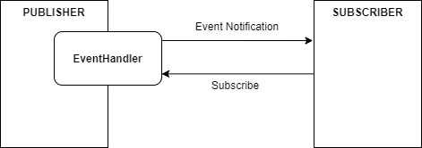
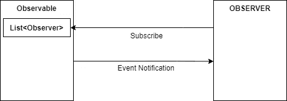
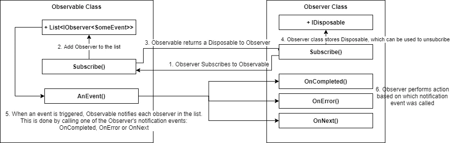
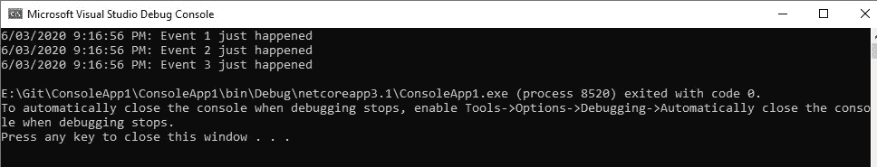

# C#中的事件驱动编程——观察者模式

> 原文：<https://levelup.gitconnected.com/event-driven-programming-in-c-observer-pattern-7a8d790bbdb2>


由[沙恩·豪泽](https://unsplash.com/@shanehauser)在 [Unsplash](https://unsplash.com/) 上拍摄的照片

在我的上一篇文章—[*c#*](/event-driven-programming-in-c-9264efb06c01)中的事件驱动编程中，我讲述了使用发布者-订阅者方法在 ASP.Net 核心应用程序中实现事件驱动架构的基础知识。

在这篇文章中，我们来看看观察者模式——另一种用 C#实现事件驱动编程的方式。

# 观察者与发布者-订阅者模式

乍一看，观察者模式似乎与发布-订阅模式几乎相同。

一个*可观察的*(发布者)发出事件。
观察者*(订阅者)订阅可观察对象，并在发出事件通知时执行操作。*

*这里的关键区别在于事件通知如何传达给观察者(订阅者)。*

*在发布-订阅模式中，事件通知是通过使用*事件处理程序来实现的—* 是一个抽象层，它将发布者和订阅者分离开来。发布者不需要知道订阅者。*

**

*在发布订阅中，事件处理程序充当发布者和订阅者之间的代理。发布者不需要知道关于订阅者的任何事情。*

*在观察者模式中，*观察者*(发布者)必须跟踪*观察者*(订阅者)。可观察对象将事件发送给每个观察者。*

**

*可观察对象保存了一个观察对象列表。当一个事件发生时，一个通知事件必须被发送到被观察对象正在跟踪的每个用户。*

*就个人而言，我会选择发布-订阅而不是观察者模式，因为这种架构的耦合要松散得多。然而，有些人可能更喜欢 Observer 模式，因为它实现简单。*

# *在 C#中实现观察者模式*

*与发布-订阅模式非常相似，观察者模式也可以说由两个“参与者”组成:*

*   ***可观察:**相当于 Pub-Sub 中的发布者；这是通知事件的类(事件发射器)。在 C#中，这由`IObservable<T>`接口来表示*
*   ***观察者:**相当于发布订阅中的订阅者；这是响应事件的类。在 C#中，这由`IObserver<T>` 接口表示。*

*下面的图表是我展示可观察对象和观察者如何相互作用的最佳尝试。*

**

*下面是代码的样子:*

***#1 —事件类别***

*这只是一个用于表示事件的标准 POCO 类。它应该包含响应事件所需的所有必要信息。示例:*

```
*public class SomeEvent
{
    public string Description{ get; set; }
    public DateTime Date { get; set; } public SomeEvent(string description, DateTime date)
    {
        Description = description;
        Date = date;
    }
}*
```

***# 2——可观察类***

*可观察对象是事件发射器(事件从那里产生)。*

*可观察对象必须:*

*   *维护一份观察员名单。
    *提供商有责任跟踪哪些观察者已经订阅。**
*   *实现`IObservable<T>`接口。
    这需要实现一个`Subscribe()`方法并定义一个`Unsubcriber` (IDisposible)类。*

*`Subcribe()`方法为观察者提供了一种订阅和获得事件通知的方式。*

*`Unsubscriber` 类为观察者提供了取消订阅通知的方法。*

*最后，记得在事件发生时通知观察员！*

```
*public class NotificationProvider : IObservable<SomeEvent>
{
    // Maintain a list of observers
    private List<IObserver<SomeEvent>> _observers; public NotificationProvider()
    {
        _observers = new List<IObserver<SomeEvent>>();
    } // Define Unsubscriber class
    private class Unsubscriber : IDisposable
    {
        private List<IObserver<SomeEvent>> _observers;
        private IObserver<SomeEvent> _observer; public Unsubscriber(List<IObserver<SomeEvent>> observers,
                            IObserver<SomeEvent> observer)
        {
            this._observers = observers;
            this._observer = observer;
        } public void Dispose()
        {
            if (!(_observer == null)) _observers.Remove(_observer);
        }
    } // Define Subscribe method
    public IDisposable Subscribe(IObserver<SomeEvent> observer)
    {
        if (!_observers.Contains(observer))
            _observers.Add(observer); return new Unsubscriber(_observers, observer);
    }// Notify observers when event occurs
    public void NotificationEvent(string description)
    {
        foreach (var observer in _observers)
        {
            observer.OnNext(new SomeEvent(description, 
                            DateTime.Now));
        }
    }
}*
```

***#3 —观察者类***

*观察者根据发送的通知类型来响应事件。在 C#中，有 3 种通知方法(或类型)可以调用:*

****on next():****为观察者提供新的数据。* ***on completed():****通知观察者提供者遇到了错误情况。* ***on error():****通知观察者提供者已经完成发送基于推送的通知。**

*观察员必须:*

*   *实现`IObserver`接口。
    这意味着实施上述 3 种方法。*
*   *实现一个`Subscribe` 方法。
    这又调用了可观察对象的`Subscribe` 方法。*

```
*public class NotificationSubscriber : IObserver<SomeEvent>
{
    private IDisposable _unsubscriber; public virtual void Subscribe(IObservable<SomeEvent> provider)
    {
        // Subscribe to the Observable
        if (provider != null)
            _unsubscriber = provider.Subscribe(this);
    } public virtual void OnCompleted()
    {
        Console.WriteLine("Done");
    } public virtual void OnError(Exception e)
    {
        Console.WriteLine($"Error: {e.Message}");
    } public virtual void OnNext(SomeEvent ev)
    {
        Console.WriteLine($"{ev.Date}: {ev.Description}");
    } public virtual void Unsubscribe()
    {
        _unsubscriber.Dispose();
    }
}*
```

***#4 —订阅***

*最后，观察者必须认同可观察的事物才能让一切运转。*

```
*public class Program
{
    public static void Main(string[] args)
    {
        var observable = new NotificationProvider();
        var observer = new NotificationSubscriber();
        observer.Subscribe(observable); observable.NotificationEvent("Event 1 just happened");
        observable.NotificationEvent("Event 2 just happened");
        observable.NotificationEvent("Event 3 just happened");
    }
}// Output
6/03/2020 9:16:56 PM: Event 1 just happened
6/03/2020 9:16:56 PM: Event 2 just happened
6/03/2020 9:16:56 PM: Event 3 just happened*
```

**

*完整的代码如下:*

# *参考*

*   *[https://docs . Microsoft . com/en-us/dot net/standard/events/observer-design-pattern](https://docs.microsoft.com/en-us/dotnet/standard/events/observer-design-pattern)*
*   *[https://stack overflow . com/questions/17020011/iob server-and-iob servable-in-c-sharp-for-observer-vs-delegates-events/17020368](https://stackoverflow.com/questions/17020011/iobserver-and-iobservable-in-c-sharp-for-observer-vs-delegates-events/17020368)*

*希望这篇文章对你有用。感谢阅读！*