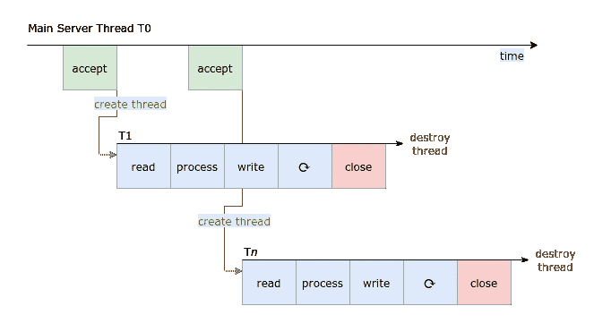
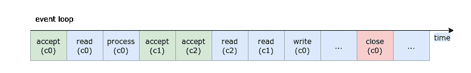

# 事件驱动服务器:直观的研究

> 原文：<https://levelup.gitconnected.com/event-driven-servers-a-intuitive-study-6d1677818d2a>


不要阻塞循环。克里斯·阿洛克在 [Unsplash](https://unsplash.com?utm_source=medium&utm_medium=referral) 拍摄的照片

这是一篇关于事件驱动服务器的简短说明，旨在帮助读者对事件循环有一个直观的理解。在以下情况下，它会很有用:

*   为 Apache HTTP 服务器选择不同的[MPM](https://httpd.apache.org/docs/2.4/mpm.html)
*   Apache HTTP Server 和 NGINX 的比较
*   为 gunicorn 选择并发模型
*   事件循环故障排除

# 并发服务器

在传统的客户端-服务器架构中，服务器接受来自客户端的连接，在新的套接字上接收数据，将其转发给应用程序进行处理，然后在同一套接字上将数据发送回客户端。


MVP:单线程服务器。我们准备好了一些风险投资。

为了实现并发性，最简单的多线程实现可以为每个新连接创建一个新线程。一旦创建，线程就被绑定到连接上，按顺序处理这个连接上的所有请求和响应。然后，当连接关闭时，线程被销毁并释放。



为了减少这种创建-销毁模式的开销，服务器可以使用线程池。

这描述了流行的 Apache HTTP 服务器的`worker` [多处理模块](https://httpd.apache.org/docs/2.4/misc/perf-tuning.html#compiletime)。

根据每个实现的具体情况，这种模型可能有一些缺点，包括每个连接产生的内存开销。这在期望大量并发客户端的部署中伸缩性很差，每个客户端维护持久连接(例如 [HTTP/1.1 Keep-Alive](https://developer.mozilla.org/en-US/docs/Web/HTTP/Headers/Keep-Alive) ，长轮询，或者重用 TLS 套接字)。宝贵的系统资源会浪费在大部分时间处于空闲状态的线程上。


线程可能正在等待来自数据库的结果或来自客户端的数据。

```
memory required = memory required per thread * number of connections
```

为了进一步推动这种直觉，考虑这个例子:如果使用这种 1:1 模型实现的服务器为每个连接分配 1 MB 的内存，那么它将需要 10 GB 的内存来服务 1 万个并发连接。

1 MB 是一个好的估计吗？一个 PyMySQL 客户端大约占用 0.37 MB。参见[内存分析器](https://pypi.org/project/memory-profiler/)。

这是 C10K 问题的要点，我们希望实现的资源消耗配置文件能够随着并发连接数的增长而呈亚线性增长。

# 走向事件驱动的实现

为了在处理大量空闲连接时节省内存和 CPU，我们可以通过执行以下操作来改进上述实现:

1.  通过允许主线程处理多个连接，减少每个新连接所需的内存量，以及
2.  当套接字准备好被读/写时，使用来自内核的事件通知来触发回调，从而减少轮询所浪费的 CPU 周期。

在没有进入精确定义的情况下，步骤 1 向我们介绍了*异步编程*，其中每个线程不再绑定到单个连接，而是在多个连接上多路复用。为了成功，主线程需要知道每个套接字的准备情况和状态，一旦套接字准备好被读取，就从套接字读取，并在有数据要发送时快速写入套接字。



连接 c0、c1 和 c2 上的多路复用，一个线程上有一个事件循环。

此外，由于我们在许多客户端之间共享主线程，应用程序需要确保没有单个请求会阻塞整个线程，从而浪费其他客户端的时间。任何正在使用主线程的东西都需要尽快放弃它的控制权。

步骤 2 向我们介绍了*内核事件通知*，比如 I/O 就绪、UNIX 信号和超时。这些可以通过 BSD 中的`kqueue`或 Linux 中的`epoll`来使用。下面的例子集成了`libevent`，它是一个独立于 OS 的库，支持`kqueue`、`epoll`和`select`等。

# 一个小例子

[event-proxy](https://github.com/jimjh/event-proxy) 是我编写的一个小程序，用来演示基于事件的服务器的基本原理，以及 [libevent](https://libevent.org/) 的使用。这是最小的设计，以帮助教学和学习。它也是用 C 写的，我发现 C 是学习系统工程最好的语言。


使用带有 cURL 的[事件代理](https://github.com/jimjh/event-proxy)。

下面是事件代理的一个简短演示:


构建和运行事件代理。注意它是如何接收请求并将其转发给代理服务器的。


卷曲本地代理；将这张 gif 与之前的 gif 并排观看。

事件代理的结构如下:

*   `main.c`，提供程序的入口点，初始化记录器，调用`proxy.c#proxy`启动代理；
*   `proxy.c`，创建监听套接字，初始化事件循环，阻塞直到循环退出；
*   `io.c`，为`proxy.c`提供接受连接的`do_accept`回调；和
*   `client.c`，创建一个套接字并连接到代理服务器。

# proxy.c

在`proxy.c#proxy`中，我们首先创建一个 TCP 套接字，将其绑定到一个 IP 地址和端口号，并使用 [listen](https://beej.us/guide/bgnet/html/#listen) 系统调用来等待传入的连接。我们到目前为止还没有做什么独特的东西，这些步骤被分割成`_init_listen_fd`，可以重点放在`_init_event_loop`上。

为了开始使用 libevent，我们首先使用 [event_base_new](http://www.wangafu.net/~nickm/libevent-book/Ref2_eventbase.html) 分配一个`event_base`结构。这个结构将用于保存我们感兴趣的事件，以及注册指向回调的指针。稍后，它用于启动事件循环。为简单起见，我们创建了一个默认的`event_base`，没有任何定制配置:

```
ev_base = event_base_new();
```

接下来，我们针对`listen_fd`上的读取事件注册`do_accept`回调，这是之前的监听套接字。这告诉事件循环，只要在那个套接字上有新的传入连接，就调用`do_accept`。

```
ev_listen = event_new(ev_base, listen_fd, EV_READ|EV_PERSIST, do_accept, …);
event_add(ev_listen, NULL);
// NULL here means no timeout
// without EV_PERSIST, this event will be triggered at most once
```

然后，我们根据`SIGQUIT`信号注册`quit_cb`回调。

```
ev_quit = evsignal_new(ev_base, SIGQUIT, quit_cb, ev_base);
event_add(ev_quit, NULL);
// NULL here means no timeout
```

最后，我们开始事件循环并无限期阻塞:

```
event_base_dispatch(ev_base);
```


` event_base_new '和` event_add '设置说明` event_base_dispatch '使用的设置。

大概来说，`event_base_dispatch`开始并阻塞一个无限循环，该循环一直等到至少一个事件被触发，并调用被激活事件的注册回调。这些回调是在同一个线程上调用的，如下所示:

do_accept 与`*_init_event_loop*`运行在同一个堆栈上，同一个线程中。

花费太长时间返回的回调会惩罚整个事件循环并破坏公平性。因此，回调必须尽快返回，并将主线程的控制权交还给事件循环。因此，基于事件的编程通常需要避免阻塞调用，例如 I/O 等待、显式休眠和互斥等待。

注意，`event_new`和`evsignal_new`的最后一个参数在回调函数被调用时被传递给它们。例如，当`SIGQUIT`被发送给程序时，我们将`ev_base`传递给`quit_cb`，这样它就可以告诉事件循环退出。不幸的是，由于我们是在 C 语言中工作，参数的类型是`void *`，一些转换是必要的:

```
struct event_base *ev_base = arg;
event_base_loopexit(ev_base, NULL);
// NULL here means exit after all current events are complete
```

# io.c

`io.c`提供`do_accept`，每当监听器套接字接收到新的传入连接时都会调用这个回调。调用时，我们首先使用[接受系统调用](https://beej.us/guide/bgnet/html/#acceptthank-you-for-calling-port-3490.)为每个连接创建一个新的套接字(名为`accept_fd`)。然后，我们连接到代理服务器，创建名为`client_fd`的新套接字。我们还没有做任何新的东西，新鲜感从`_init_bufferevents`开始。

至此，我们已经创建了:

*   `accept_fd`，可用于对连接的客户端读写字节的套接字，以及
*   `client_fd`，一个套接字，可以用来对代理服务器读写字节。

剩下的任务是:

*   从`accept_fd`读取字节，并将其写入`client_fd`
*   从`client_fd`读取字节，并将其写入`accept_fd`

这可以通过在两个套接字上注册一个针对 read 事件的回调来实现。为此，我们使用 libevent 的 [bufferevent](http://www.wangafu.net/~nickm/libevent-book/Ref6_bufferevent.html) API，它提供了一个使用缓冲区和流套接字的方便接口。我们首先创建一个与主事件循环和新套接字相关联的`bufferevent`结构:

```
bev = bufferevent_socket_new(ev_base, fd, BEV_OPT_CLOSE_ON_FREE);
// create a bufferevent structure
```

然后，我们注册读取回调和错误回调:

```
bufferevent_setcb(bev, readcb, NULL, errorcb, arg);
```

默认情况下，新的`bufferevent`允许写入，但不允许读取，以下是必需的:

```
bufferevent_enable(bev, EV_READ | EV_WRITE);
```

拼图的最后一块是`readcb`的实现，看起来像:

```
static void readcb (struct bufferevent *bev, …) {
    …
    input = bufferevent_get_input(bev);
    …
    bufferevent_write_buffer(output, input);
    …
}
```

注意，我们像以前一样重用同一个`ev_base`，这让我们可以插入同一个事件循环。新注册的回调将由在`proxy.c#proxy`中调度的同一个事件循环调用，并且在同一个线程上。

readcb 运行在与`*_init_event_loop*`相同的堆栈上，在相同的线程中。

# 超越服务器

批处理作业的设计也可以从线程和事件循环的讨论中受益。

例如，假设我们有一个批处理作业运行在一台机器上，它从许多数据库中检索大量记录并聚合数据。为了实现并发性，我们可以使用多线程来实现这个批处理作业，每个数据库一个线程。这个设置看起来很熟悉，除了我们的批处理作业充当连接到多个数据库服务器的客户机。

这种实现也有上述缺点:每个新线程都会消耗相当多的内存。此外，如果我们假设 SELECT 查询在数据库主机上花费了很长时间，那么我们也管理了大量的空闲线程和连接。

在这种情况下，事件循环可能是一种有用的优化。在创建了所有数据库连接之后，我们可以注册来自它们的 I/O 事件的回调。然后，事件循环将在一个主线程上运行，当来自数据库的结果可以在各自的套接字上读取时，调用相关的回调。每个调用的回调都会将查询结果拉入进程内存进行聚合。

在这个模型中，我们将大量的空闲线程减少到一个充分利用的主线程；然而，我们也丧失了在机器上利用多个内核的能力。通过将工作分配给每台机器上的多个进程来进一步优化可能是有利的:每个内核一个进程，每个进程都有自己的事件循环。

在我的下一篇文章中，我将探索 Linux 如何调度等待 I/O 的线程和进程的细节，并讨论使用事件驱动实现的一些缺点。

感谢[加比·费希尔](https://gabbi.fish/)审阅了初稿。

# 进一步阅读

*   [GitHub 上的事件代理](https://github.com/jimjh/event-proxy)
*   StackOverflow:什么是事件驱动服务器？
*   [堆栈溢出:异步 vs 非阻塞](https://stackoverflow.com/a/2625565)
*   丹·凯格尔的 C10K 问题
*   【NGINX 内部:我们如何设计性能&规模
*   【NGINX 内部:信息图
*   开源应用的架构:安德鲁·阿莱克谢耶夫的 NGINX
*   辛迪·斯里达哈兰的《埃波尔的疯狂》
*   [Eli bender sky 的并发服务器](https://eli.thegreenplace.net/2017/concurrent-servers-part-1-introduction)