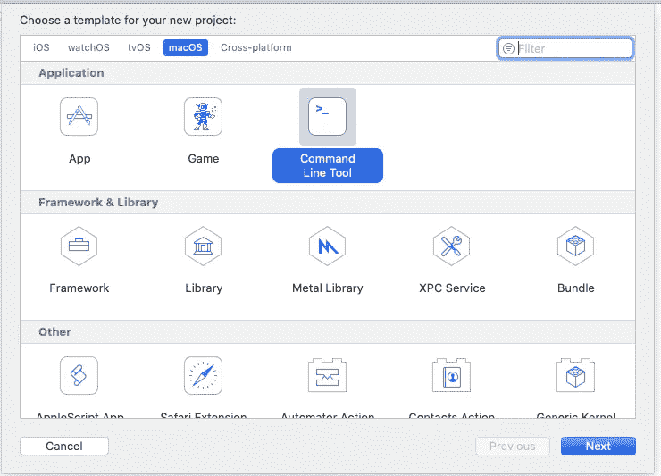
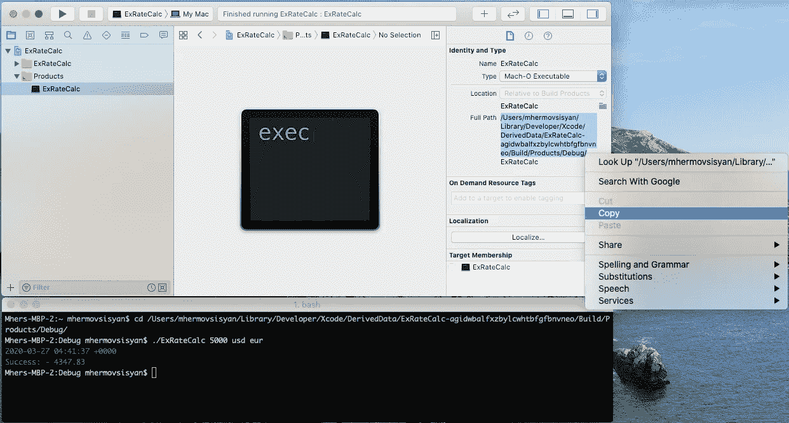
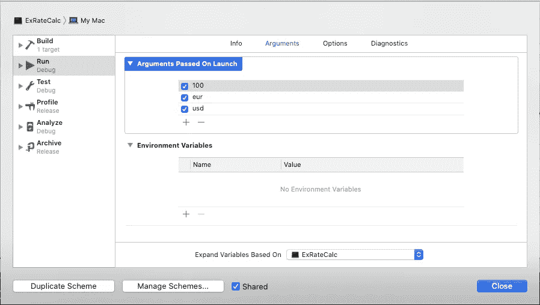
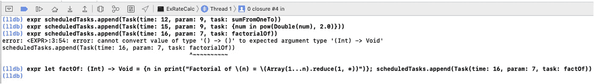
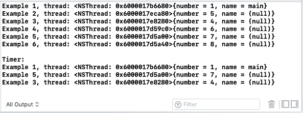

# 事件循环、运行循环、有无事件循环的程序

> 原文：<https://levelup.gitconnected.com/event-loop-run-loop-programs-with-and-without-it-5503e28e6a62>

在深入研究这篇文章之前，我想简要概述一下你应该从中期待什么。本文的主要目的是提供对不同应用程序类型是如何构建的一般理解。为了做到这一点，我们将编写一些小程序来演示不同的概念。此外，我们还将了解 CFRunLoop，它是 iOS 和 macOS 中的事件循环。

*请注意我将交替使用术语* ***事件循环*** *和* ***运行循环*** *。事件循环是一个更通用的术语，运行循环是这个概念在 iOS 和 macOS 中的具体实现。在不同的平台上，事件循环也称为消息循环和消息泵。*

# 本文将试图解决以下问题

*   什么是事件循环？
*   我们为什么需要它？
*   我们能有一个没有事件循环的程序吗？如果有，会是什么样的节目？
*   最后但并非最不重要的是，这一切都是为了什么？

由于对这个主题没有先决条件，我假设一些读者对它不熟悉。这就是为什么我要从回答最后一个问题开始，我认为这是一个核心问题。

# 这是怎么回事？

简而言之，它是关于程序的执行流程，或者简单地说，它是关于你的代码的哪一部分将在什么时候被执行。基本上，事件循环是一种代码，它允许您基于特定类型的事件来完成程序执行的特定流程。

我们对程序执行流程了解多少？我首先想到的是一个标准的 C 类自顶向下的执行流程，当你的程序从 main 函数的顶行开始，继续逐行执行指令，直到到达程序 end exits 的最后一行。比如两个数字简单相加或打印“你好，世界！”申请。

# 我们能有一个没有事件循环的程序吗？如果有，会是什么样的节目？

是的，我们可以有一个没有事件循环的程序。比如一个简单的印刷体(“Hello，World！”)是一个没有事件循环的程序。我们怎么知道它没有事件循环？很简单。不是我们放的:)。

为了回答第三个问题的第二部分，并对程序的执行流程有一个很好的理解，让我们写一些代码。在用事件循环编写程序之前，我们将首先用两种更简单的设计方法实现一个程序。

# 设计 1:自上而下的方法。

这些应用程序运行一次就会终止。这些类型的应用程序缺乏任何形式的用户交互性。许多命令行程序都在使用这种方法。参数预先在程序自变量列表中设置。

所以，让我们用上述模式创建一个简单的应用程序。对于我们的目的，货币兑换应用程序将是一个很好的选择。正如你可能已经猜到的，这将是一个 macOS 的 CLI 应用程序。

请注意，我不会一行一行地描述代码，因为这将占用文章太多的篇幅。不代表我不会提供任何解释。应用程序的代码会很简单，所以它应该是不言自明的。

打开 Xcode，为 macOS 创建一个新的命令行工具应用程序。

我认为 ExRateCalc 这个名字非常适合这个应用程序，所以我将继续使用它。你可以给它起任何你想要的名字，但是记住俄罗斯的名言“你给船起的名字，它就会浮起来”(原文引用“корабль назовешь，поплывет").

在项目导航器中，您将找到 main.swift 文件。与许多类似 C 的语言不同，Swift 不提供作为程序入口点的 main 函数。而是提供 main.swift 文件；这是程序执行时操作系统将调用的内容。

下面简单描述一下我们 app 的系统需求。

*   该程序应该能够从用户那里得到输入来计算它，并输出结果。
*   如果输入错误，程序应该显示帮助(使用说明)。

从需求中我们可以清楚地看到，我们需要一个机制，它将读取用户的输入，并在交换完成后提供一个输出。

现在让我们创建输入输出服务。

正如你所看到的，它是一个单例结构，有两个主要函数" **readArguments"** 负责读取用户输入，**“写”，**负责提供输出。在 write 函数中你可以看到一个用来定制输出的记录器，理想情况下，它还应该包含写入文件的逻辑，但是我懒得添加。记录器使用三种颜色-红色表示错误，绿色表示调试，黄色表示指令。颜色在 Xcode 控制台中不可见，但在终端中可见。

这是伐木工。

在这一点上，我们的部分需求得到了满足，但是我们仍然需要实现计算部分。计算器将是一个类类型对象，带有**“interest rate”**参数和**“convert”**函数，包含主要转换逻辑。

在 Calculator 类中，您可以看到“convert”函数有两个货币类型的参数。货币实体是保存货币类型和汇率的枚举。

最后一部分是组装所有东西的 **main.swift** 文件。

程序准备好了。现在你有了自己的汇率计算器。要在终端中运行程序，您应该导航到程序可执行文件，并使用以下命令运行它。

*   **。/ExRateCalc 150 美元欧元 5:** 带利率
*   **。/ExRateCalc 150 美元欧元:**无利率

这里有一个简单的方法。在项目导航器上点击选择可执行文件，然后从文件检查器中复制路径。打开终端，使用更改目录命令导航到复制的路径***“CD(复制路径)”。*** 瞧，现在你可以使用这个程序了。

当然，你也可以使用 Xcode 中的程序。要在 Xcode 中传递参数，您需要点击编辑模式，选择运行并将其添加到启动时传递的参数列表中。

恭喜你！你已经正式完成了文章的 1/3。

# 设计 2:菜单驱动的方法。

现在我们来讨论一下菜单驱动的设计。在这些应用中，为用户提供了一组选项供选择。然后，应用程序调用适当的函数来执行用户选择的任务，然后请求下一条指令。

为了使用菜单驱动的模型，我们将扩展我们的 ExRateCalc 应用程序。现在让我们看看我们的扩展应用程序必须具有哪些额外的功能。它必须能够在不退出程序的情况下进行多项交易，还必须向用户提供如何使用应用程序的提示。

我们首先需要的是一个保存应用程序当前执行状态信息的实体。为了满足这个需求，让我们创建一个 enum 并将其命名为 ProgramState。该枚举将保存所有程序状态和**“print instruction”**函数，该函数将提供与正在进行的执行状态相关的指令。

正如你从 enum 中看到的，程序有 8 种状态，在大多数状态中，用户必须提供一个输入，基于这个输入，程序将继续执行。用户提供的说明的问题是它并不总是正确的。因此，如果我们希望有一个健壮的应用程序，它不会因为第一次错误输入而崩溃，我们必须添加一个广泛的错误处理，这将有助于覆盖边缘情况，并为用户输出提示。

让我们创建 **ErrorType.swift** 文件，并在那里添加我们的错误类型。如您所见，有一个 **ExRateError** 错误协议和三个错误枚举实体。在实际的程序中，你将把所有东西放在单独的文件中，但是对于我们的应用程序，我将把所有东西放在一起，以便使文章稍微短一点。让我简单介绍一下错误类型。第一个 **ArgumentInputError** 用于在应用程序启动时指示程序参数错误。第二个 **InputError** 用于处理错误的用户输入，第三个 **ProgrammedExit** 用于程序退出应用程序。关于第三种错误类型，我知道使用 throw 并不是将应用程序状态更改为 exit 的最佳方式，但我认为它只是让事情变得简单，这就是我使用它的原因。

现在让我们看看我们的 **IOService** 是如何变化的。 **IOService** 获得了一个名为**“readInput”**的全新函数，负责获取用户的输入，另外**“read arguments”**函数也发生了变化，现在它可以处理更多的应用启动选项。

最后要看的是我们的主要功能，所有的魔法都会在这里发生。 **main.swift** 文件中有两个函数。第一个是包含货币计算部分的**“计算”**，第二个是**“启动程序”**。**“launch program”**函数包含了程序的状态改变逻辑，这是我们菜单驱动模型的关键部分，所以让我们来看看它是如何工作的。该功能由两部分组成。在第一部分中，我们声明将要使用的变量，在第二部分中，我们有一个 while 循环来帮助我们遍历应用程序的不同状态。在第一部分中有五个变量——一个负责保持程序正在进行的状态，其余的用于存储用户的输入。在 while 循环的第二部分中，您会发现一个包含所有八种程序执行状态的 switch 语句。为了很好地理解我们的程序是如何工作的，我们应该一行一行地检查所有的状态。

1.  第一个状态是**“开始”:**该状态在应用程序启动期间只被调用一次。如果在应用程序启动期间，用户提供了适当的参数，交易将被计算。然后，如您所见，状态更改为“introduction”。
2.  在**“引入”**状态下，用户有两种选择，通过输入**“新建”**指令开始新的操作，或者通过输入**“退出”**退出程序。如果用户选择新选项，状态将变为**“insert amount”**，如果用户选择退出选项，状态将变为**“exit”**，如果用户提供错误输入，错误处理将起作用，用户将被要求从有效选项中选择一个。
3.  在**“插入金额”**状态下，将要求用户插入金额。如果输入正确，状态将变为**“choosebase currency”**，否则将要求用户重新输入货币。
4.  在**“选择基础货币”**状态下，将要求用户选择基础货币。如果输入正确，状态将变为**“chooseConvertedCurrency”，**否则将要求用户输入正确的货币名称。
5.  在**“chooseConvertedCurrency”**状态下，将要求用户选择转换后的货币。在正确输入的情况下，状态将变为**“插入利率”，**否则将要求用户输入正确的货币名称。
6.  在**“插入利率”**状态下，用户将被要求输入金额。如果输入正确，状态将变为“计算”，否则将要求用户重新输入利率。
7.  在**“计算”**状态下，程序将进行最终计算，此时，整个循环结束，用户将看到计算的最终结果。然后，状态将变为**“介绍”**，用户必须从第二点继续。
8.  最后一个“退出”状态将结束应用程序的执行。

恭喜你！你离文章的结尾又近了一步。

# 什么是事件循环？我们为什么需要它？

是时候解决我们的主要问题了，理解什么是事件循环，为什么我们需要它

在用不同的方法构建了两个程序之后，我们很好地理解了事件循环会给我们什么，以及使用事件循环的程序与其他程序有何不同。简而言之，事件循环使你的应用程序具有交互性。事件循环持续监视程序中的新事件。它的主要职责是安排工作和协调接收到来的事件。

每当您使用任何有延迟的函数调用或使用任何类型的计时器来做一些重复的工作时，事件循环工作调度部分负责使其发生。下面是事件循环正在接收的一些类型的事件:用户交互，如按钮点击、鼠标点击、键盘按压等，不同的传感器输出，来自其他线程或程序的消息。事件循环使用不同的机制让程序的其他部分知道新的事件。它可以借助于观察者和订阅者或者回调函数，也可以使用委托模式或其他方式。

事件驱动模型广泛应用于图形用户界面应用程序和响应用户输入执行特定动作的应用程序中。比如 iOS、macOS、Android、Windows 程序和 Node.js 都使用事件循环。虽然一个程序可以有多个事件循环，但其中只有一个被认为是主循环。主事件循环是在主线程上运行的循环，它是应用程序启动时唯一活动的事件循环，并且在应用程序结束前一直保持活动状态。每个线程都有自己的事件循环，但可能不会运行。例如，在 iOS 中，新创建线程的运行循环不会运行，您应该手动运行它。

好了，现在让我们到有趣的部分，做一些编码。我们将创建一个小应用程序，将听取用户交互事件，并将能够安排工作。这一次我不会提供完整的工作代码部分，相反，我们将一步一步地构建它。

下面这段代码只是读取用户的输入并打印出来。

如您所见，我们有一个 while 循环，它必须作为事件循环工作，并等待用户的输入。那么，我们是否可以说这个程序是一个交互式应用程序，它对不同的输入源和任务调度使用一个事件循环？不，我们不能，因为我们的循环被卡住了，正在等待用户的输入。这与我们的菜单驱动模式完全相同。我们怎么知道它卡住了？选项一——你可以相信我，选项二——我们可以添加一个心跳功能，打印日期和当前线程。我甚至不会做任何调查，会增加一个心跳功能。

给你！

## 我们应该如何改进我们的 while 循环？

要记住的最重要的事情是，事件循环不等待任何特定的源，相反，在大多数情况下，主事件循环总是在工作，当它进行迭代过程时，它会询问各种输入源，看它们是否有话要对他说。事件循环通常每秒有固定的迭代次数。

好吧，让我们再改进一下我们的程序。首先，我们需要添加一个代码，它将从用户那里获得输入，但不会阻塞程序的主线程。我们可以通过添加一个新的线程来负责它。我们的新线程将读取输入，并将其添加到一个队列中，稍后将由我们的主事件循环进行检查。

如果您不熟悉队列数据结构，这里有一个简单的描述。队列是一种数据结构，能够以先进先出的方式处理数据。Swift 的标准库不包含队列数据结构，所以我们必须实现它。

让我们回到我们的主要事件循环。正如我已经提到的，通常事件循环每秒有恒定的迭代次数。为了实现它，我们需要在 while 循环中添加一个睡眠函数。为了使一切更具可读性，并添加一个休眠部分，我们将创建 **EventLoop** 类。

如你所见， **EventLoop** 类的 API 非常简单。它有两个功能:**【运行】****【停止】。**前者运行循环，后者停止循环。

终于我们做到了！该程序有处理输入源的主事件循环。

至此，您应该对事件循环如何处理输入源有了很好的理解，但是我们还没有讨论事件循环的另一个非常重要的方面，那就是它的工作调度能力。正如我们已经知道的，事件循环处理事件源。逻辑上我们可以将事件源分为两部分:第一输入源和第二定时器源(任务调度源)。这是它们之间的主要区别。输入源从其他线程或其他程序向您的线程异步传递事件。计时器源将事件同步传递给线程。我知道这不是一个非常清楚的解释，只是阅读它没有多大意义。一如既往，更好地理解这个主题的唯一方法是自己实现一个。

我们将以最简单的方式实现它。首先，我们需要创建一个任务结构，它将包含时间延迟、可执行任务和该任务的参数。

如您所见，我们将时间转换为迭代计数，该计数将因调度该任务的事件循环而减少。当迭代计数达到 0 时，事件循环将执行该任务，并将其从计划任务列表中删除。我们程序的主事件循环每秒进行 10 次迭代。这意味着在 n 秒内，它将进行 n * 10 次迭代，也意味着如果我想在 5 秒内完成某项工作，我可以将 5 秒转换为 50 次迭代，并在我的迭代次数减少到 0 后完成我的工作。

*请注意，这并不意味着在实际的事件循环中，计时器的实现是基于每分钟的事件循环迭代次数。他们很有可能使用日期参数比较，因为这样会更精确。我们基于迭代的定时器方法的问题是我们忽略了指令执行的时间。这意味着我们将无法每秒进行恒定数量的迭代，并且会有一个小的*偏差*。尽管如此，我还是选择这样做，因为我认为使用每秒迭代次数来实现计时器是一种有趣的体验。*

这是我们完整的任务调度程序。

代码应该是不言自明的，因为我们已经非常详细地讨论了它的每个方面。

您还可以借助 lldb 调试器添加新任务。只需在循环中放置一个断点，并按以下方式计算表达式。

例 1:**expr scheduled tasks . append(Task(time:12，param: 9，task: sumFromOneTo))**

例 2:**expr scheduled tasks . append(Task(time:15，param: 9，task: {num in pow(Double(num)，2.0)})**

它与传递的函数和定制代码块完美地工作，但是它抛出了我们的 factorialOf 闭包的错误。但是如果你在调用函数之前声明一个闭包，它会工作得很好。

恭喜你，我们的程序已经准备好了，它既可以处理输入源，也可以调度任务。我相信，在这一点上，您应该清楚地看到所讨论的方法之间的差异。

# 运行循环

请注意，这只是运行循环的一个小介绍，在某些情况下，我不会深入细节。你可以在苹果的 [*文档中找到详细信息。*](https://developer.apple.com/library/archive/documentation/Cocoa/Conceptual/Multithreading/RunLoopManagement/RunLoopManagement.html#//apple_ref/doc/uid/10000057i-CH16-SW5)

RunLoop 和 NSRunLoop 是 CoreFoundation 的 CFRunLoop 的包装器，它们提供了更方便和面向对象的方式来处理运行循环。请记住，RunLoop 和 NSRunLoop 都不被认为是线程安全的，因此它的方法应该只在当前线程的上下文中调用。相反，使用 CFRunLoop 不会遇到这个问题，因为它被认为是线程安全的。CFRunLoop 是 CoreFoundation 框架底层 c 函数的 API。

RunLoop 从两种不同类型的源接收事件。输入源提供异步事件，定时器源提供同步事件。下一件重要的事情是运行循环模式。简而言之，它允许运行循环跟踪特定的源，并根据运行循环模式通知特定的观察者。你可以在苹果的文档中了解更多关于不同模式的信息。

在讨论 iOS 主运行循环之前，让我们先看看一些最常用的 run loop 和 CFRunLoop APIs。这些方法不言自明，所以我不会给出太多关于它们的细节。

1.  获取当前运行循环。

2)获取主运行循环

3)运行当前运行循环。

4)停止运行循环。只有 CFRunLoo 的 API 提供了停止运行循环的功能。对于 RunLoop 和 NSRunLoop，您可以在 run 方法中设置终止时间。如果不提供终止时间，运行循环将在有源要处理时运行。

5)添加一个定时器源。交付同步事件。

6)添加端口源。交付异步事件。

7)添加一个观察者。

这些方法可以互相配合使用。这里有一个小例子，演示了如何在 macOS 的命令行应用程序中进行网络请求。请记住，主线程的主运行循环不在这些应用程序中运行。所以，你必须显式地运行它，否则你的程序会在网络响应到来之前结束。

如你所见，我使用了 CFRunLoop API。您也可以用 RunLoop 做同样的事情。如果您想知道如何将 RunLoop 转换为 CFRunLoop，这里有代码“**run loop . current . getcfrunloop()”。**

# iOS 和 RunLoop

每个 iOS 应用程序都有一个在主线程上运行的主运行循环。主运行循环由 UIApplication 自动启动。为了理解我们的应用程序的主运行循环有多重要，让我们列出它的一些职责。

1.  它处理所有类型的用户交互，如点击、滑动、输入信息等。
2.  它在主线程上处理计时器和任务调度。
3.  它负责更新屏幕。CoreAnimation 的 CATransaction.commit()在主运行循环中被调用。
4.  主运行循环还可以处理来自不同线程和程序的套接字、网络和其他消息。

虽然主运行循环可以做很多事情，但这并不意味着它必须单独做所有的事情。有时，创建一个线程并设置其运行循环以特定模式运行会更好。例如，您可以拥有一个网络或套接字库，它们将使用自己的运行循环。如果我没弄错的话，AFNetworking 就是这样的库之一。

如你所知，主队列并不是 iOS 中唯一的开箱即用队列。更准确地说，苹果的框架创建了 7 个队列:其中一个是串行的，其余的是并发的。串行队列是我们的主队列(主线程)，并且它是唯一一个有运行循环的队列。例如，这意味着您只能在主线程中使用计时器，否则您需要手动运行线程的运行循环。好吧，让我们做一些编码。

让我们用一个定时器来调度一个任务，从不同的线程调用它，看看会发生什么。

这个函数是从主线程调用的，我们知道主线程有一个活动的 run 循环，这意味着预定的任务将被执行。你会看到下面的输出**"线程:<NSThread:0x 600000 d9 ACC 0>{ number = 1，name = main}"** 。数字 1 和名称 main 表示它在主线程中被调用。这是一个微不足道的例子，我们都知道它会起作用。更多有趣的例子呢

这里还有六个例子。

这是输出。

让我们检查一下是怎么回事。

1.  这是一个非常有趣的例子，正如你所看到的，它使用了主线程。怎么可能呢？事实是，DispatchQueue 的 sync 方法总是使用当前线程，这是真的，对于串行和并发队列都是如此。在这种情况下，当前线程是主线程，这就是计时器工作的原因。
2.  在这种情况下，我们使用并发队列的 async 方法，为每个代码块创建一个新线程。我们没有显式地运行我们新创建的线程的运行循环，这就是为什么我们的计时器不起作用。
3.  在这种情况下，创建线程后，我们显式地运行线程的运行循环，这就是计时器工作的原因。
4.  这在概念上与第二种情况相同，其行为方式也相同。唯一的区别是，这里我们显式地创建了一个线程，而在第二种情况下，线程是由并发队列自动创建的。
5.  与第三种情况相同，不同之处在于螺纹制造部分。
6.  最后一种情况与第五种情况非常相似。不同之处在于 run loop launch 是在第一行调用的。问题是当运行命令被调用时，我们的定时器不在运行循环定时器列表中。现在你应该想知道，我们能看看计时器的列表吗？尽管 run loop 没有 API，但它会给你一个定时器列表，你仍然可以打印 run loop 对象并看到一个定时器列表。您可以看到，它是 CFRunLoopTimer 对象的 CFArray。你还会发现很多关于运行循环的有趣信息，比如观察者列表和来源。更确切地说，有两个版本的来源。首先是**“sources 0”**，处理 UIEvent、CFSocket 等事件。第二，**【源 1】**哪个处理内核事件。

我希望这篇文章对你有用。感谢阅读！