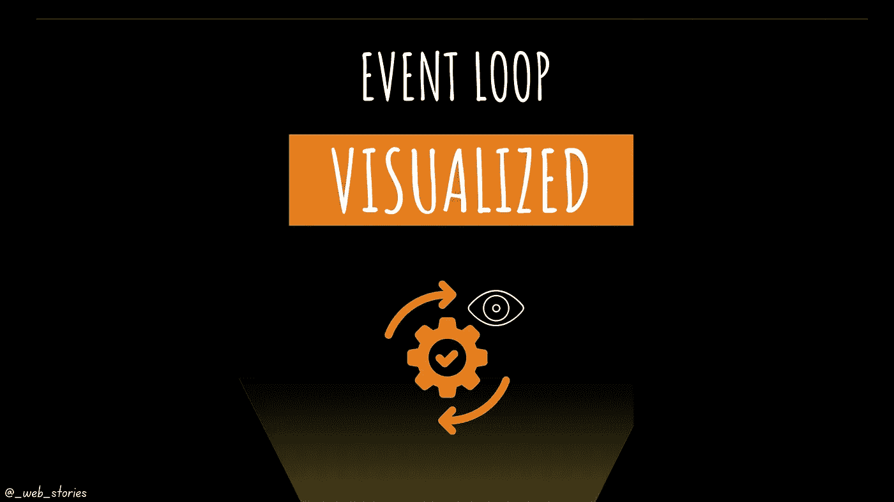

# 👀事件循环可视化！

> 原文：<https://levelup.gitconnected.com/event-loop-visualized-78c5861e98fb>

## 事件循环是如何工作的？

作者:FAM

## 你好👋

> 在开始我的故事之前，我想感谢我新推荐的成员[伊森·卡维尔](https://medium.com/u/62818e91720f?source=post_page-----78c5861e98fb--------------------------------)。我每天都在 LinkedIn 上，如果你需要什么，就给我发消息。迫不及待地想看你的文章。让我们一起在培养基上成长！

我之前在本文中讨论过事件循环:

 [## JavaScript 中什么是事件循环？

### JavaScript 多线程背后的秘密。

javascript.plainenglish.io](https://javascript.plainenglish.io/what-is-event-loop-in-javascript-917ca464808e) 

对于当前的文章，我将把它写成一个小故事。如果你觉得它太短，请查看上面的文章了解更多细节。

# 事件循环目的

JavaScript 不是多线程的。它不能异步执行多项任务。如果我们等待每一个任务完成，没有人会再使用网络。

事件循环使得网络**活了起来**。你点击按钮，下载启动，然后更换过滤器，去导航条和切换到黑暗模式，等等，…

## 在此视频中找到事件循环运行的完整示例:

## 关键想法

*   事件循环作业正在连接或编排 JS 调用堆栈中等待执行的任务。
*   事件循环作业正在连接或编排 JS 调用堆栈中等待执行的任务。
*   事件循环优先级:

→首先同步任务(调用堆栈)(例如控制台 API)

→微任务队列第二(例如，获取 API)

→异步任务排在第三位(例如 setTimeout API)

今天就到这里，看阿雅🙋

如果你有任何问题或反馈，请点击评论或通过 LinkedIn 联系我— **我洗耳恭听！**

[**想请我喝杯咖啡吗？☕️**](https://www.buymeacoffee.com/fatimaamzil)

> 让我们为 2022 年打造一个更好的‘我们’！

## 了解有关 2022 年网络快车计划的更多信息:

I- [网络常识](https://medium.com/geekculture/2022-web-program-chapter-n-1-is-done-499fb0707220?source=your_stories_page----------------------------------------)

[II-网页框架:HTML](https://famzil.medium.com/your-html-essentials-69d9b2349355?source=your_stories_page----------------------------------------)

[III-网页样式:CSS](https://medium.com/geekculture/recap-of-the-css-chapter-ae388d51e564?source=your_stories_page----------------------------------------)

[IV-网络互动:JavaScript](/congrats-to-js-chapter-finishers-e38a3ca1612c)

## 虚拟物料清单和 DOM

*   [什么是 BOM 和 DOM](https://medium.com/geekculture/what-are-the-dom-and-bom-9fb1a3ed736f?source=your_stories_page-------------------------------------) ？
*   [元素选择器](https://javascript.plainenglish.io/selecting-dom-elements-e33fb235e81d?source=your_stories_page-------------------------------------)
*   [操纵 DOM](https://famzil.medium.com/dom-manipulation-13959986300?source=your_stories_page-------------------------------------)
*   [阿贾克斯&取](/calling-for-data-d9523c7c62e2?source=your_stories_page-------------------------------------)
*   [事件阶段](https://javascript.plainenglish.io/events-phases-inside-the-dom-8ca5d8929ade?source=your_stories_page-------------------------------------)

> **事件循环**

*   阴影 DOM
*   蜜蜂

 [## 2022 网络计划启动！

### 改变来自心态和习惯

medium.com](https://medium.com/geekculture/2022-web-program-is-launched-f38a3280af1a) 

与想成为 web 开发人员的人分享该程序！这将有助于保持进步，并在旅途中互相帮助。

> 如果你喜欢我的文章， [**订阅**](https://famzil.medium.com/subscribe) 获取我的最新。如果你自己喜欢体验媒介，可以考虑通过[**注册会员**](https://famzil.medium.com/membership) 来支持我和其他成千上万的作家。每月只需 5 美元，它支持我们，作家，你也有机会用你的作品赚钱。当然，你可以随时取消会员资格。通过注册[这个链接](https://famzil.medium.com/membership)，你将直接用你的一部分费用来支持我，不会花你更多的钱。如果你这样做了，万分感谢！

让我们在 [**上**取得联系****](https://medium.com/@famzil/)**[**Linkedin**](https://www.linkedin.com/in/fatima-amzil-9031ba95/)**[**脸书**](https://www.facebook.com/The-Front-End-World)**[**insta gram**](https://www.instagram.com/the_frontend_world/)**[**YouTube**](https://www.youtube.com/channel/UCaxr-f9r6P1u7Y7SKFHi12g)**或**********

****** [## 通过我的推荐链接——FAM 加入 Medium

### 作为一个媒体会员，你的会员费的一部分会给你阅读的作家，你可以完全接触到每一个故事…

famzil.medium.com](https://famzil.medium.com/membership)****** 

# ******分级编码******

******感谢您成为我们社区的一员！更多内容见[升级编码出版物](https://levelup.gitconnected.com/)。
跟随:[推特](https://twitter.com/gitconnected)，[领英](https://www.linkedin.com/company/gitconnected)，[通迅](https://newsletter.levelup.dev/)
**升一级正在改造理工大招聘➡️** [**加入我们的人才集体**](https://jobs.levelup.dev/talent/welcome?referral=true)******