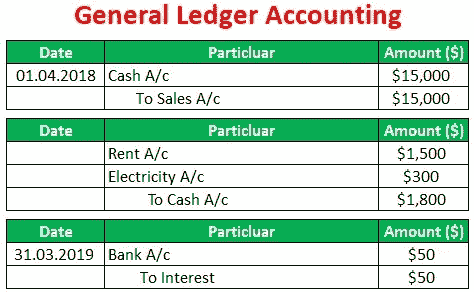

# 事件采购:新的银弹？

> 原文：<https://levelup.gitconnected.com/event-sourcing-the-new-silver-bullet-1c58ff48d56f>

事件源是称为事件驱动架构的大型架构设计的一部分。这是我在研究后学到的东西，希望能帮助你弄清楚这种架构是你应该使用的还是只会让事情变得复杂。

[斯科特·格雷厄姆](https://unsplash.com/@homajob?utm_source=medium&utm_medium=referral)在 [Unsplash](https://unsplash.com?utm_source=medium&utm_medium=referral) 上拍照

> 事件驱动架构使用事件来触发解耦服务并在它们之间进行通信，这在使用微服务构建的现代应用程序中很常见。事件是状态的变化或更新，就像电子商务网站上购物车中的商品。事件可以携带状态(购买的商品、价格和送货地址)，也可以是标识符(订单已发货的通知)。

许多系统被称为*事件驱动*，但是这意味着什么以及你被事件驱动的范围还有更多细节。在某些场景或用例中，将整个系统的服务或组件解耦并利用外部系统或最终用户触发的事件是天作之合。然而，尽管事件驱动的架构为您提供了一个松散耦合的系统，但您却失去了查看代码和理解正在发生的事情的能力。您必须依赖许多不同的信息或代码来真正理解当一个事件被触发时会发生什么，以及什么系统利用这些信息以及如何利用。

Christian Kapeller 在 [Unsplash](https://unsplash.com?utm_source=medium&utm_medium=referral) 上拍摄的照片

# **事件通知**

这是事件驱动系统的基本层次，通常意味着您正在系统中的某个地方使用事件。系统的某个部分触发一个事件并把它放到一个队列或总线上，另一个系统读取该事件并执行一个任务。简而言之，使用事件通知系统，但是除了“发生了一些事情”之外，事件通常没有太多其他数据。一个例子是“下了一个订单”,另一个系统可能会向客户发送一封电子邮件，对订单表示感谢，然后通知仓库系统开始包装和运输该商品。

赞成的意见

*   去耦高可用系统

骗局

*   下游用户通常需要来自源系统的更多信息，额外的流量可能会淹没或影响源系统的性能

# **事件携带状态转移**

事件驱动系统的下一个领域是事件携带状态转移，由 Martin Fowler 和 Thoughtworks 的人员创造。此版本中的事件具有包含在事件中的附加信息以及所发生事件的名称或上下文。一个例子可以是一个客户地址，该事件将具有进行更改之前的地址和更新后的地址。有了这两条信息，下游系统就不必为了对事件采取行动而回到源系统去了解发生了什么变化。下游系统通常会缓存或存储这些增量，以便以后使用。这种模式在野外不太常见，但比事件通知要高级一些。

赞成的意见

*   去耦高可用系统
*   因为事件包含附加信息，所以源系统上的负载较少

骗局

*   事件和本地数据库或缓存中的复制数据
*   利用事件时的最终一致性

# **事件采购**

我们到了。事件驱动架构的进一步发展是事件源，随着对事件驱动架构兴趣的增长，事件源最近似乎越来越受欢迎。

> 事件源确保对应用程序状态的所有更改都存储为一系列事件。

这些事件必须在应用程序的生命周期中作为事实的来源保存，本质上这些事件就是您的应用程序状态。如果你使用了版本控制系统，那么你就使用了事件源系统，因为版本控制(如 Git、SVN、Mercurial)会存储对文件系统或结构所做的更改(也称为事件),重放这些更改会使你进入一个特定的状态。

非开发人员的另一个真实例子是会计分类账。

分类账记录了不同的事件及其背景。如果你“回放”了所有的事件，那么你应该得到你的“当前状态”,也就是你的银行账户里有多少钱。

赞成的意见

*   清除审计记录
*   能够重放事件和调试问题，并确切知道发生了什么变化
*   系统设计的历史状态
*   如果有人意识到不久前发生的一个错误的价值观，那就是另一种状态
*   内存映像——可以拥有高性能的内存系统，因为您的状态存在于不可变的事件存储中

骗局

*   新的设计模式，许多开发人员不熟悉
*   外部系统—您无法重放来自外部系统的事件，因此您应该生成事件来促进这种行为
*   事件架构—以代码始终可以继续处理事件的方式存储事件
*   标识符-知道何时在数据中生成标识符可能很困难
*   版本控制 Greg Young 讨论过，但是当希望从时间开始的所有事件都可以重放时，这可能会很困难(快照可能是帮助实现这一点的一种方法)

# **CQRS —命令查询责任分离**

这是迄今为止最复杂的系统，需要两个独立的系统来处理查询(即读取)和命令(即写入)。在设计或迁移系统时，您应该认真考虑是否需要这种级别的架构，因为它很快就会变得很糟糕。这里有一些来自马丁·福勒和另一位作者 T2 的参考资料。许多公司利用的一个例子是将操作数据库与报告或分析数据库分离，并使用 ETL 作业或其他机制将数据传输到单独的系统中进行大量读取。

赞成的意见

*   在适当的时候工作非常出色，并且可以成为工作的乐趣

骗局

*   很多复杂性、基础设施和开销

需要记住的一点是，高可用性系统最终只会保持一致。这是您为高度可用的系统所做的折衷，即最终的一致性和潜在的其他 ACID 属性。

[廷杰律师事务所](https://unsplash.com/@tingeyinjurylawfirm?utm_source=medium&utm_medium=referral)在 [Unsplash](https://unsplash.com?utm_source=medium&utm_medium=referral) 上拍摄的照片

如果您有兴趣进一步研究和评估活动采购，这里有一些资源。看看 Martin Fowler 的视频[和他的博客文章](https://www.youtube.com/watch?v=STKCRSUsyP0)中的分类。 [Greg Young](https://leanpub.com/esversioning/read) 经验丰富，是 [EventStore](https://www.eventstore.com/event-sourcing) 的作者。

如果你喜欢这篇文章，考虑[订阅 Medium](https://medium.com/@ascourter/membership) ！

 [## 通过我的推荐链接加入媒体-安德鲁考特

### 阅读安德鲁·考特(以及媒体上成千上万的其他作家)的每一个故事。您的会员费直接支持…

medium.com](https://medium.com/@ascourter/membership) 

如果你或你的公司有兴趣找人进行技术面试，那么请在 Twitter ( [@Exosyphon](http://twitter.com/Exosyphon) )上给我发 DM，或者访问我的[网站](https://andrewcourter.com/)。如果你喜欢这样的话题，那么你可能也会喜欢我的 [Youtube 频道](https://www.youtube.com/channel/UCx3Vist13GWLzRPvhUxQ3Jg)。如果你想支持更多像这样的内容 [buymeacoffee](https://www.buymeacoffee.com/andrewcourter) 。祝您愉快！

# 分级编码

感谢您成为我们社区的一员！在你离开之前:

*   👏为故事鼓掌，跟着作者走👉
*   📰查看[升级编码](https://levelup.gitconnected.com/)中的更多内容
*   🔔关注我们:[Twitter](https://twitter.com/gitconnected)|[LinkedIn](https://www.linkedin.com/company/gitconnected)
*   🚀👉 [**软件工程师的顶级工作**](https://jobs.levelup.dev/)