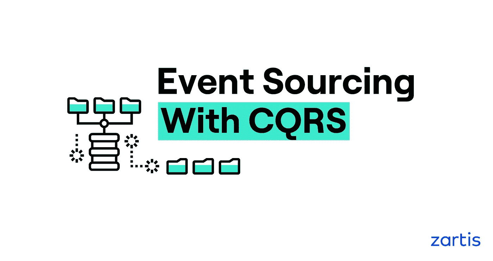
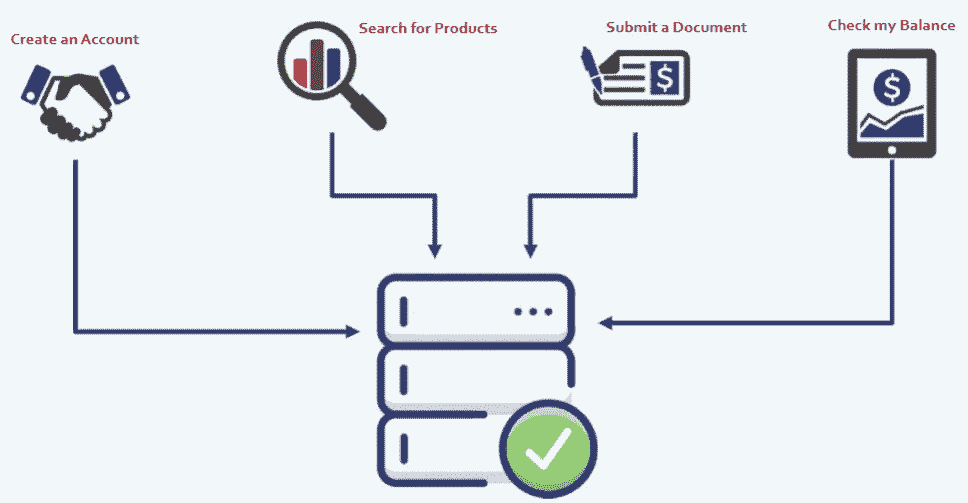
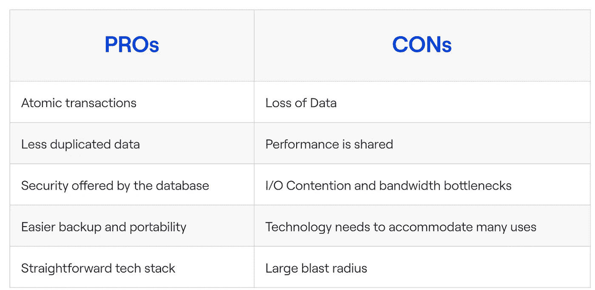
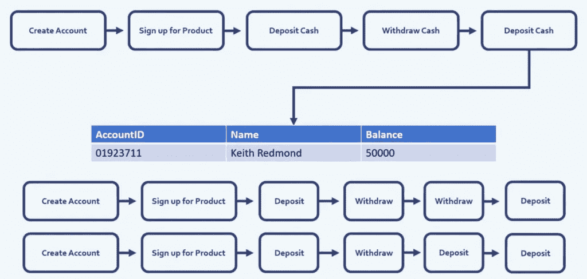
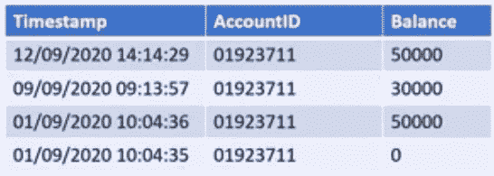
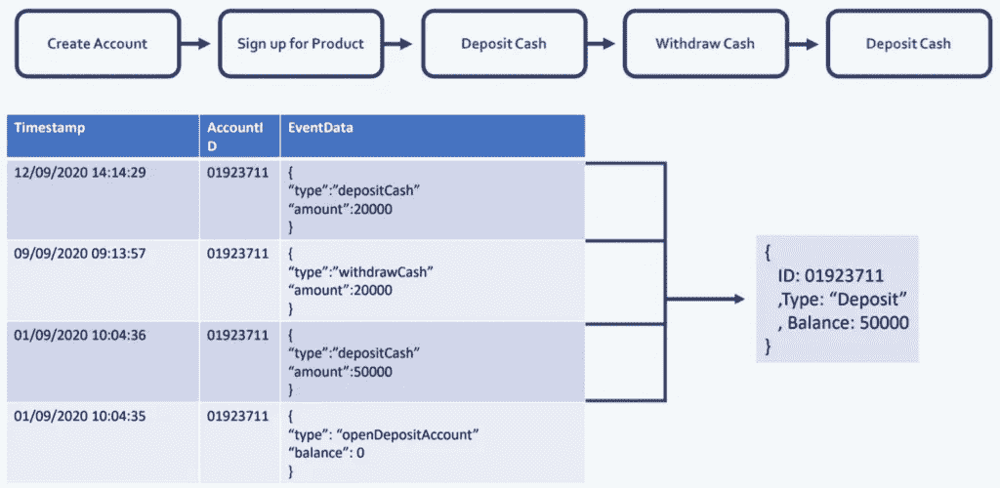
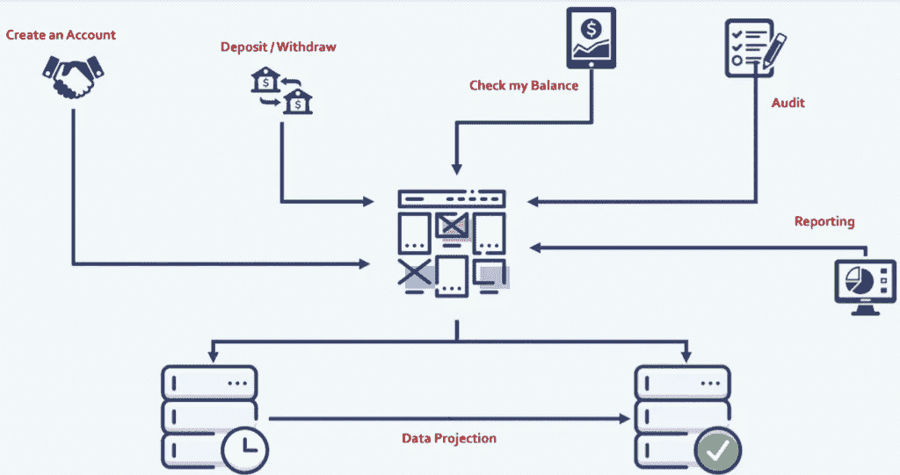
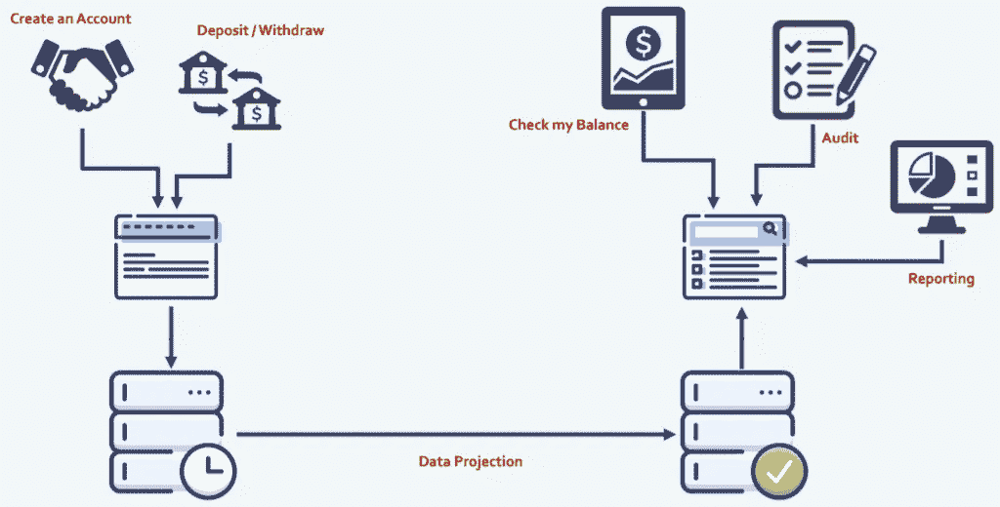
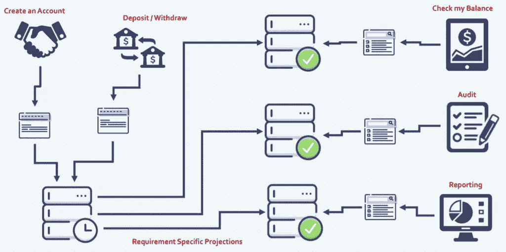
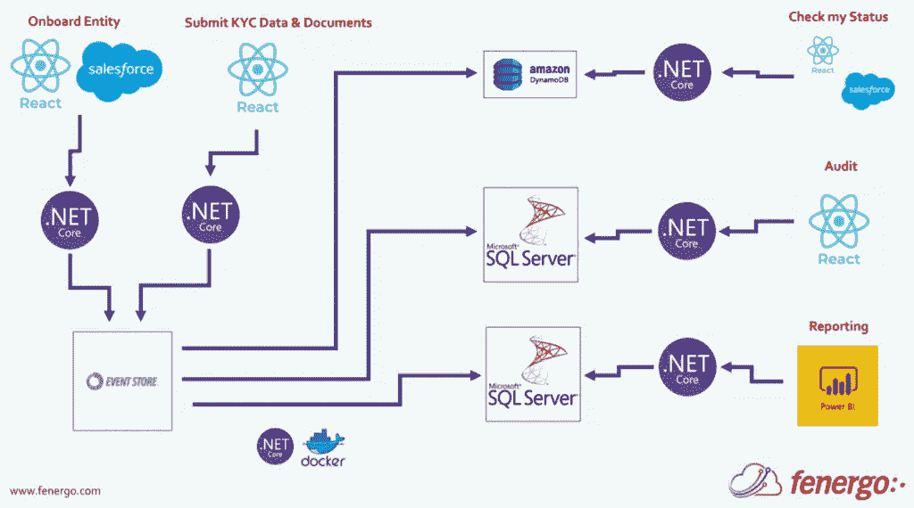

# CQRS 的活动采购

> 原文：<https://levelup.gitconnected.com/event-sourcing-with-cqrs-d20393aed74a>

如何同时利用 CQRS 和事件采购

zart is SaaS 工程副总裁 Keith Redmond 分享了他对如何在应用程序开发中利用 CQRS 事件源的见解。

这篇文章是作为“[谈话”的一部分以网络研讨会的形式呈现的。NET'](https://www.zartis.com/talking-dotnet-an-online-conference/) 大会，你可以在这里看到完整的网上研讨会[。](https://youtu.be/nhve0sMA1DE)

# 什么是事件采购？

**Event Sourcing 是一种应用程序设计模式，它专注于将操作作为一系列事件进行跟踪，然后将这些事件聚合起来产生系统状态。**

您不仅可以查询这些事件，还可以使用事件日志来重建过去的状态，并自动调整状态以应对追溯性更改。

首先也是最重要的，它是关于如何设计您的应用程序，不仅关注跟踪您的数据看起来是什么样子，而且关注为什么您的数据看起来是那样。创建您正在存储的数据的操作是什么，产生您的系统状态的事件序列是什么？

# 什么是 CQRS？

命令查询责任分离(CQRS)是一种架构模式，它将操作/创建数据的应用程序与读取数据的应用程序分开。

重要的是不要将 CQRS 与面向服务的架构和微服务等概念相混淆，这实际上与我们要做的事情的大小无关，与应用程序的大小或粒度无关，而是与它们执行的操作有关。活动采购并不是试图成为一个银弹。它并不试图取代所有其他解决方案，但在某些方面，它可能是您业务的最佳选择。

# 集中式状态数据库

要开始讨论向事件采购和 CQRS 的转变，理解更传统或更常见的方法所面临的挑战是很重要的。最好的例子之一就是*集中式状态数据库*，以及您系统中的操作如何改变我们数据库的状态。

举一个非常简单的例子，在下图中，我们有一个状态数据库，在顶部，有四个业务操作可以改变数据的状态:

您可以创建一个帐户，它将产生一个记录和一个帐户表；您可以在州数据库中搜索产品，并且可以看到现有的产品；您可以提交一个文档，它将被存储在文档存储中，一些元数据将被放入状态数据库；您还可以检查您的余额，这样您就可以查询数据库以返回有关您帐户的特定信息。

# 使用集中式数据库的利与弊:

让我们探讨一下这样的数据库的一些优点和缺点。

好处是数据库控制我的事务，所以我内置了原子事务。我不必在集中式状态数据库中复制大量数据，我可以在数据库中创建第一/第二/第三范式对象。数据库可以管理我的安全，并给我访问备份和便携性。对于加入团队的人或试图解释架构的人来说，这使得技术堆栈非常简单，易于理解。

它也带来了一些挑战。第一个是它会丢失数据(我们稍后会谈到这一点)。性能是共享的，因此每个读取数据的人都在与向数据库写入数据的人竞争性能。这类似于 I/O 争用——因此所有进出数据库的管道都在争夺带宽。如果我们选择一种数据库技术，这意味着我们需要用它来解决许多不同的挑战，而集中式状态数据库会产生很大的爆炸半径—如果该中央数据库宕机，我们就会遇到问题，因为很大一部分应用程序将无法运行。

此表中最重要的一点是*数据丢失*，这也是事件源成为更好解决方案的主要原因之一。在集中式数据库中，您可能无法跟踪对象的更改或这些更改的原因。举个例子，我们可以用下面的例子，一个银行账户持有人可以用几种不同的方法得到 50000 英镑的账户余额。

在一个集中的数据库中，我们不会自动地告诉特定的用户如何在他们的账户中有 50，000 英镑。当然，有一些常见的方法来处理这个问题，比如引入一个审计表，顶部的流就变成了状态记录。见下文。

然而，这仍然不能告诉我们为什么记录的状态发生了变化，因此重建您的状态变得极其困难。如果你像这样使用审计跟踪，你不知道为什么 50K 变成 30K，或者为什么 30K 又变成 50K。这使得创建一个通用的解决方案来生成这些跨不同领域的审计表变得非常困难，并且您最终会编写大量的业务逻辑。

最终，你会得到一张审计表，涵盖了你的一些损失。然后，您将需要引入一个报告层来报告中央数据库，并审计想要从该中央数据库订购的用户。这意味着，虽然您已经解决了一些数据丢失问题，但您可能已经增加了性能挑战，并可能在数据库上放置更多的 I/O。

这就是事件源变得非常有用的地方。在事件源中，操作本身就是您要存储的内容，您按照它们发生的顺序存储它们，这样您就可以将它们聚合在一起以生成您的状态。

让我们从事件采购的角度来看一下我们的例子。屏幕上显示的是与我们之前在集中式数据库设计中相同的流程，因此我们再次得出 50，000 的结果作为平衡，但现在我们有了让我们达到这一点的所有业务运营背景。

以这种方式利用事件源肯定会帮助您防止数据丢失和可靠性，但是，您可能仍然会面临 I/O、性能、备份或升级方面的挑战。那么，你需要做些什么来应对这些挑战呢？

事件采购自然会有**预测:**的想法

如果你看上面的图表，当我们创建一个帐户，或者当我们存款或取款时，我们将这些事情作为业务操作存储在我们的事件源数据库中。但是，当我们想要实际使用这些数据来查询当前状态、历史状态或者审计时，我们可能想要从另一个数据库中读取这些数据。所以我们介绍右边的数据库，本质上是一个状态数据库。在中间，我们有一个箭头— *数据投影—* 代表我们迭代历史业务运营的位置，我们创建查询所需的状态。

在这种结构中，您不再丢失数据，您的性能不再在查询和命令数据库之间共享，您有更少的 I/O 争用和瓶颈。此外，您现在可以开始将数据投影到不同的技术，以满足您的特定需求。

通过实现事件源，您现在有了与查询分离的命令，这就是我们可以开始引入命令查询职责分离的地方。

# CQRS:

## 根据应用程序是创建数据还是查询数据来拆分应用程序

因此，创建了一个独立于状态数据库的事件源数据库后，现在我们可以开始考虑如何拆分我们的实际应用程序，而不仅仅是我们的数据库，这取决于它们是否创建数据(在我们的事件源数据库中)或者它们是否查询我们的状态数据库中的数据。

此时，我们在这些数据库之间来回推送数据，并使用数据投影从事件源创建状态记录。但是我们仍然没有在应用层做任何事情。我们仍在推动您的所有操作，无论是命令还是通过单个应用程序的查询。因此，有机会获得更积极的结果。

在大多数系统中，读取往往比写入更重要，因为读取用户(也称为查询用户)往往比命令用户做更多的连续工作。所以，这给了我们一个机会把它们分开。

我们不希望出现这样的问题，当我们想为查询用户改变功能时，我们必须为命令用户发布一个全新的应用程序，反之亦然。这样我们就可以获得可扩展性、性能改进、更小的版本、更小的爆炸半径。

拆分任何应用程序的另一个好理由是为了开发人员。从开发人员的角度来看，能够开发小型应用程序真的很好，在这种情况下，更改不会影响大量的代码，发布和构建管道也非常小和快速。这允许团队真正敏捷，快速部署，并运行多个实例，而不影响其他工程师。

因此，您的系统将看起来更像这样:

它与前面的图相同，但是我们已经将那个中心应用程序分开了。

在左侧，我们从业务运营(command)中创建了一个命令应用程序，该应用程序与我们的事件源数据库进行对话。在右边，我们为查询用户创建了一个单独的应用程序。因此，如果您想检查您的余额、获取审计数据或报告，您可以使用查询应用程序，它会与州数据库进行通信。再次强调，在事件源数据库和状态数据库之间有一个数据投影器，以查询应用程序所需的格式产生状态。

# 拆分应用程序时需要考虑的事项

该系统带来的挑战之一是**最终的一致性**。命令发生和状态可用之间有时间差，这是你需要在投影仪中考虑的。有了写得好的投影仪和聪明的商业逻辑，你可以很容易地管理最终的一致性。

您还需要注意类似于**并发写入**，或者人们同时写入数据库，记录或事件的版本控制等等。

举例说明从我的团队的角度来看这是什么样子，或者我们是如何做到的:

我们有一个事件源数据库，我们通过业务用户获得所有业务操作，他们使用命令应用程序。然后，特定于需求的投影仪形成数据、形成状态，并将它们推入特定用户组的特定数据库。因此，如果有人想要检查他们的余额，他们会查询不同于审计用户或报告用户的数据库。在每个数据库中，数据存储在真正适合该用户组的形状中。

添加 CQRS 层后，我们实际上将我们的应用程序拆分开来，因此对于每一组用户来说，都有一个特定的应用程序可以真正满足他们的需求。我们有一个与事件源数据库对话的命令 API，专门针对想要创建帐户的人。在右边，我们有一个位于审计数据库和审计用户之间的查询 API。因此，当我们想要对应用程序的审计功能进行更改时，我们可以只发布该应用程序，而不会影响任何其他用户。

最后，让你们了解一下我们在费内戈使用的技术:

我们用 CQRS 实现的那些应用程序、命令和查询 API 都是用。NET Core，对于我们的前端应用程序，我们使用 React，并且我们与 Salesforce 一起做了大量工作来实际集成这些 API。对于活动采购，我们使用一家名为 Event Store 的公司作为我们活动的来源。对于我们的状态数据库，我们使用 DynamoDB，SQL Server。我们所有的投影仪都用集装箱包装。NET 核心应用程序。

# 结束语

如果您的企业处于高度监管的行业，您需要获得这种级别的可审计性、可追溯性和无数据丢失，那么 CQRS 的事件采购可能是适合您的解决方案。