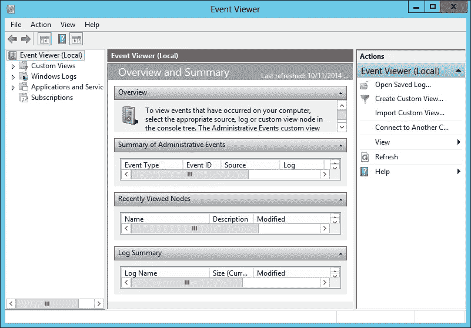
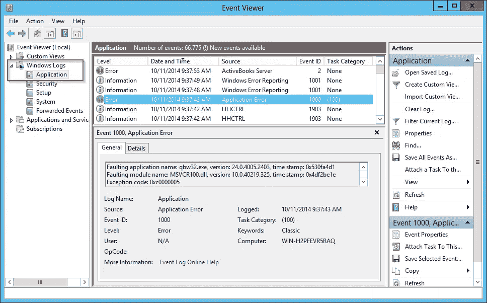
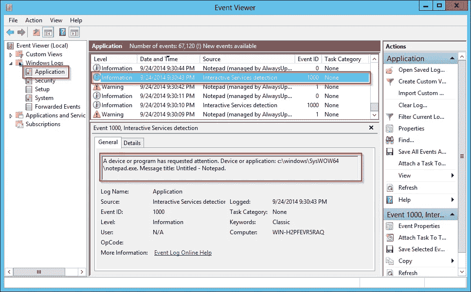
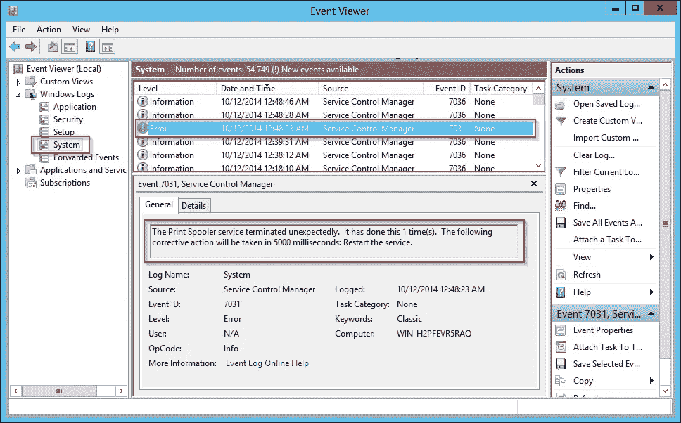

# 事件查看器故障排除

> 原文：<https://levelup.gitconnected.com/event-viewer-troubleshooting-96c56ba586ee>

## 使用事件查看器解决 Windows 服务问题

设计为在后台“无头”运行和无人看管的 windows 服务不能容易地使用传统的弹出窗口来报告其活动，因为用户甚至可能没有登录。相反，该服务被鼓励将重要的通信发送到 **Windows 事件日志**——一个收集和存储消息和事件的管理实用程序。一旦记录下来，这些消息对解决问题非常有帮助，例如当服务意外停止或根本无法启动时。

# 从 Windows 服务查看事件

使用[微软的事件查看器](http://en.wikipedia.org/wiki/Event_Viewer)查看写入事件日志的消息。点击开始按钮，在**事件查看器**中输入，或者从控制面板(按名称搜索)启动应用程序。几秒钟后，有些杂乱的窗口应该会出现:

左侧显示了一个树，将您机器上捕获的各种日志分组。来自 Windows 服务(以及运行在您电脑上的其他应用程序)的事件被归档在 **Windows 日志>应用程序**下。导航到该部分以在窗口中央加载事件，整个列表在顶部，突出显示事件的详细信息在下面:

来自 windows 服务的消息将在 Source 列中显示服务的名称**。**

# 事件的重要组成部分

事件查看器显示与每个事件相关的 10 多条信息，包括:

*   **级别** —这个事件有多重要？
*   每个事件分为三类:
*   **信息**:信息丰富但不重要的事件。您可能会看到很多这样的问题，可以放心地忽略它们，除非您正在深入研究应用程序或服务的特定问题。
*   **警告**:中度重要事件。这些不一定意味着失败，您的软件可能会一瘸一拐地运行，但是应该定期检查它们，看是否有任何提到的问题可以解决。
*   **错误**:表示可能需要您立即注意的严重问题或故障！
*   **日期和时间** —这件事什么时候发生的？
*   **来源** —哪个应用程序报告了此事件？
*   如前所述，由 Windows 服务编写的事件将包含服务的显示名称作为源。
*   **描述** —发生了什么？
*   下方窗格中突出显示的完整描述将(希望)提供事件的相关细节。

例如，此信息事件来自交互服务检测服务(“UI0Detect”)，报告记事本在会话 0:

# 查看关于 Windows 服务的事件

应用程序日志记录正在运行的服务的事件，而 **Windows 日志>系统**区域记录服务何时启动、停止、崩溃或无法启动。寻找源设置为**服务控制管理器** (SCM)的事件。例如，下面是 SCM 告诉我们 Windows 后台打印程序服务已经崩溃:

# 从 AlwaysUp 和 Service Protector 查看事件

AlwaysUp 和 Service Protector 都将消息写入事件日志的应用程序部分( **Windows 日志>应用程序**)。

对于 AlwaysUp，来自名为“我的应用程序”的应用程序的事件将被记录，源设置为**我的应用程序(由 AlwaysUpService 管理)**。“事件日志消息”页面列出并解释了报告的事件。

对于 Service Protector，与名为“MyService”的服务相关的事件将有一个来源**Service Protector:my Service**。

对于这两个应用程序，与底层服务本身的启动和停止相关的事件出现在 **Windows 日志>系统**部分。如果您有 AlwaysUp 自身无法在启动时启动的问题，请查看此处。