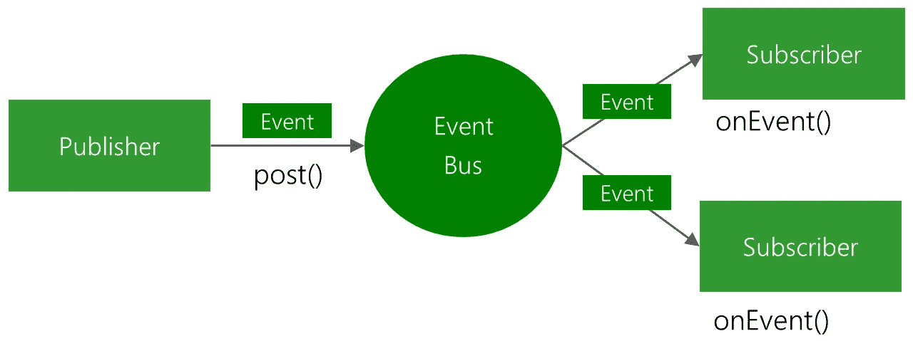

# Java 中的 EventBus:发布/订阅拯救！

> 原文：<https://levelup.gitconnected.com/eventbus-in-java-publish-subscribe-to-the-rescue-ca0505cb53b1>

任何需要发布/订阅架构的人都会发现 EventBus 是一个很好的工具。它很容易使用，并且有许多实现。但是我们应该小心，因为滥用这样的库可能会导致意想不到的后果。

在本文中，我将重点介绍 Greenbot 对 EventBus 的实现。Guava 也提供了自己的解决方案，但是无论我们在看哪个库，它们的使用都非常相似。

# 什么是 EventBus？

EventBus 提供了一个简单的 API 来向注册用户传递事件。

EventBus 是一个软件总线，它允许您注册某些事件，并在与该事件相关的内容发布时得到通知。事件以类的形式出现。首先，将您的类注册到总线，然后定义使用 **Subscribe** 注释的方法，以便注册到事件。您可以定制 EventBus，甚至可以创建多个事件总线实例，但是为了简单起见，我们现在将使用默认的实例。

在订阅了 **TemperatureUpdateEvent** 之后，每当有人发布该事件时，就会调用您注册的方法。事件以下列方式发布:

> **EventBus.getDefault()。post(新的温度更新事件(15.7))；**

一旦不再需要注册的类，就需要从 EventBus 中注销。如果没有取消注册，EventBus 将保留对您的对象的引用，这将防止它被垃圾收集。在 Android 的片段/活动中取消注册很容易，因为它们有自己的生命周期方法，如 onStop/onDestroy，它们提供了一个取消注册的好地方。然而，对于普通的 java 类，您可能需要将注册的责任交给另一个类。

> **EventBus.getDefault()。注销(这个)；**

# EventBus 线程模式

Greenbot 的 EventBus 库中有 5 种线程模式。其中 3 个是安卓特有的(与 UI 线程相关)。

*   发布-这是默认的线程模式。事件被传递给发布者线程中的所有订阅者。
*   MAIN——在 Android 的 UI 线程中调用订阅者。这对于小的 UI 更新来说非常好。
*   MAIN_ORDERED —假设您当前正在主线程中执行某个操作，如果您再次发布事件，将立即调用指定主线程模式的订阅者，就像方法调用一样。但是如果订阅者的线程模式恰好是 thread mode。MAIN_ORDERED，订户的事件交付将简单地排队，您将继续执行您正在做的任何事情。一段时间后，当 UI 线程再次可用时，排队的事件将被执行。
*   背景—在 Java 上，这基本上与发布模式是一回事。但是在 Android 上如果发帖线程是主线程，它会排队等待 EventBus 的后台线程执行。
*   ASYNC —所有事情都在单独的线程上处理。这是完全异步的，所以发布线程不会等待任何东西。它可用于耗时的任务，如网络操作。使用过多的异步可能会导致性能问题。

Greenbot EventBus 线程模式

# 棘手事件

有时，您希望您的对象接收在创建之前发布的事件。在这种情况下，可以使用粘性事件来接收最后发布的事件。您可以选择自动或手动接收。

> **EventBus.getDefault()。postSticky(新时区变化事件(" GMT "))；**

# 当心！事件交付顺序可能不是你想的那样！

您可能认为至少在默认发布模式下，嵌套事件会像函数调用一样工作。不对！

如果你的当前线程还没有发布一些东西，它确实像一个函数调用一样工作。但如果是，嵌套的 post 会在前一个 post 完成后执行。

让我们检查以下代码:

如果我们假设它像常规函数调用一样工作，您将会看到以下顺序的打印结果:

> E̵v̵e̵n̵t̵A̵ ̵i̵s̵ ̵c̵a̵l̵l̵e̵d̵！̵̵
> e̵v̵e̵n̵t̵b̵̵i̵s̵̵c̵a̵l̵l̵e̵d̵！̵̵
> k̵e̵e̵p̵̵g̵o̵i̵n̵g̵̵i̵n̵̵e̵v̵e̵n̵t̵̵h̵a̵n̵d̵l̵e̵r̵̵a̵！̵̵
> k̵e̵e̵p̵̵g̵o̵i̵n̵g̵̵i̵n̵̵c̵o̵n̵s̵t̵r̵u̵c̵t̵o̵r̵！̵

但事实是这样的:

> EventA 叫！
> 在事件处理程序 A 中继续！
> 调用 EventB！
> 在构造器里继续走！

如果你真的查看这个库的内部来发布事件，有一个状态叫做 **postingState。**如果当前线程已经处于这种状态，那么你在该线程中发布的新事件将被排队等待以后执行。

# 包裹

## 赞成的意见

*   好用。使您不必实现自己的发布/订阅者体系结构和/或观察器。
*   减少类的耦合，从而减少依赖性。
*   实现通常是轻量级的。
*   非常适合更新 UI 层。
*   能够指定线程模式而不是自己手动处理它是很方便的。

**缺点**

*   随着时间的推移，跟踪哪个类处理哪个事件变得越来越困难。这会让你的代码变得复杂/难以理解。
*   在 Android 中，将信息从一个活动传递到另一个活动可能很棘手。不过，粘性事件在某种程度上提供了实现这一点的方法。
*   忘记取消注册可能会导致内存泄漏(软引用支持可能会解决这个问题)。
*   容易滥用它。请记住，它仅用于简单的事件交付。不要用 EventBus 代替简单的函数调用，除非你想毁了你的内部 API，迷惑所有人。