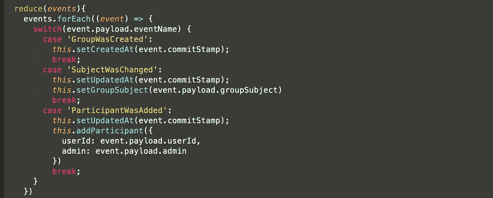

# 使用 NodeJS 的事件源

> 原文：<https://levelup.gitconnected.com/eventsourcing-with-nodejs-5d0f8e255676>

最近我一直在使用 NodeJS 中的事件源构建一个小应用程序。

通常我是用 Ruby 做的，用 NodeJS 做很有趣，想和你分享一下。

我举了 WhatsApp 的例子:我们将构建 WhatsApp 的一个子部分，特别是群组功能。
我们不会建立聊天功能…:)

让我们从互动开始:

*   创建组
*   添加参与者
*   移除参与者
*   改变话题

每个动作都有一个到域事件的一对一映射。

简单来说:

*   GroupWasCreated {groupSubject，userIds，currentUserId}
*   参与者已添加{groupId，userId，admin}
*   参与者已删除{groupId，userId，admin}
*   SubjectWasChanged { group subject }

很自然，对吧？

> *这就是事件采购的美妙之处:设计交互及其结果是一件很容易的事情。*

不需要考虑数据库模型或关系:我们完全按照人类的方式来描述系统。

语义注释:我们正在实现一个基于聚合的微服务。我们可以将 WhatsApp::Group 视为 AggregateRoot，并确定两个子实体:WhatsApp::Group 和 WhatsApp::GroupParticipant。
后者引用带有 `*userId*` *外键的远程聚合。*

让我们为这些特性定义一个 API 服务(一个 AggregateRoot api)。

这将被我们的 HTTP API 层(即。MVC 模式中的控制器)，在本例中是 ExpressJS。但是我们也可以将这个 AggregateRoot api 挂接到像 Kafka 这样的消息总线上，接收命令消息。

*技术提示:我们将假设所有方法都是* `*async*` *并返回承诺。
NB:我不是节点。JS 专家，我是相当的 Ruby 专家。所以如果你有什么代码推荐，欢迎评论。*

## “创建组”命令

我们可以选择如何实现它:

*   要么使用单个事件***group is created***(它包括原始参与者和主题)来描述参与者列表、主题和组管理。
*   或者在发射 ***组创建*** 时，发射事件 ***参与者被添加******主题被更改*** 。

第一种解决方案减少了事件的数量，并且具有隐含的行为；而后者使创建时发生的事情一目了然，并允许命令端( *createGroup* 调用 *addParticipant* )和查询端(我们不必将***group was created***作为特殊事件处理，并从中提取参与者，因为我们知道***participant was add***事件将与它一起发出)。

为了可重用性(DRY)和清晰性(没有隐式行为)，我将选择第二种解决方案并发出每个事件。

我使用一个库来帮助我存储和获取 npm 上的事件:`eventstore`。

`npm install --save eventstore`

`npm install --save uid`

有一个内存适配器(基本上是一个假的数据库)，但是 lib 也提供了一个 MongoDB 和 Redis 适配器。我个人在以前的项目中使用过 Redis，但 MongoDB 应该是 imo 的默认选择。

我将在我的服务的构造函数中初始化 lib，并在加载事件周围添加一个小的 Promise 包装器，以获得一个良好一致的 Promise api。

但到目前为止，我还没有运行代码。

所以，因为我很懒…而且很专业…(懒的部分实际上更准确，但那是另一个争论)我要写一个自动化测试:)

是的编码人员，如果你不写自动化测试…你只是半个专业人员！(根据鲍勃大叔；而且练了 4 年 BDD/TDD，不得不认同)。

`npm install --save-dev assert`

`npm install --save-dev mocha`

由于我们目前没有办法获得我们实体的“结束状态”，我们只能验证事件正在被发出。
让我运行一下，看看这是否有效……好的，在几次修复后，它确实运行了。

这一步的代码在分支“step-1”的 [github 上。
可以拉一下试跑`npm install`和`npm test`。](https://github.com/diegodurs/evented_whatsapp/tree/step-1)

请注意，聚合行为由以下内容定义(至少对于创建而言):

*   当*命令*时
*   然后是 ***事件***

这反映在测试中。
当我们要实现“更新”命令(如“addParticipant”)时，我们将有:

*   给定**事件*事件*事件**
*   当*命令*时
*   然后是 ***事件***

到目前为止，我们一直在构建应用程序的“命令端”,目前只有一个命令，但没有读取应用程序状态的功能(除了对用户不太友好的事件流)。
这就是 EventSourcing 与 CQRS 相结合的原因:命令/查询分离。

这个阶段的应用程序代码可以在 [github 分支 step-1](https://github.com/diegodurs/evented_whatsapp/tree/step-1) 上找到。

## 到目前为止怎么样？

让我们意识到，有了这个，我们就有了一个持久化模型，它可以接受非结构化数据，并为参与者持久化一个多对多关系。

这本身就很强大:如果您想添加一个新的命令或持久化另一个“属于”或“有多个”关联，您不必进行任何数据库迁移或深入思考；只要在无处不在的领域语言和事件源中定义了清晰的 AggregateRoot，就很容易以清晰一致的方式添加行为。我们将在下一步看到这一点。

假设我们想要添加特定于该组的通知设置，这只是一个新命令和一个新事件。就命令模型而言非常简单:不需要更改数据库，唯一需要的更改仅限于领域需求:一个命令、一个事件；就是这样。

## 让我们来比较一下 CRUD:

我们需要一个 Group 模型和一个 GroupParticipant 模型，用一个`has_many/belongs_to`关系联系起来。两者都有像底层 ORM 中的“创建”、“更新”和“销毁”这样的方法。
*create group*逻辑您可以在控制器中使用`GroupParticipant.create`添加参与者(在我看来这是个坏主意)。更好的方法是在模型中，将 Group.create 方法覆盖到使用`GroupParticipant.create`的定制域逻辑。
但更好的是:您可以围绕每个 AggregateRoot(正如我们在这里所做的那样)构建一个服务模块(在模型之外),它将定义围绕该聚合可用的所有命令和查询。这将最终得到一个与我们现有的代码结构非常相似的代码结构。但在 MVC 框架中并不常见:Rails 和其他人不鼓励这种类型的代码结构。

> 在 ORM 默认值之外进行开发，可以使用集合、存储库和值对象的清晰架构概念，使您的代码更加整洁。

但是，即使使用干净的代码架构，使用经典的 MVC，您也需要两个 DB 表，并且任何新特性都可能需要数据库迁移。

## 状态？

现在，让我们来看看如何获得某种状态。
目前我们可以查询事件，通常是通过`aggregate_id`，但是也可以通过`aggregate_type`或者`event_name`加载。
但这并不高效(例如，查询所有超过 2 个参与者的组将需要处理所有`ParticipantWasAdded`事件)，也不人性化(我们没有简单的方法来获得组的最终状态，只有它的事件)。

这个问题的常见解决方案是实现一个投影，该投影处理所有事件并更新为查询而创建的特殊数据库。

# 在投影中构建状态

我们可以把它看作一个独立的微服务，从消息总线流式传输事件，用增量变化更新数据库，把投影状态和新事件结合起来。它不会访问事件的历史，而是实时流。

一个投影是:

*   给定状态(投影状态)
*   当 ***事件*** (新聚合事件)
*   然后状态(新投影状态)

# 减少值对象中的状态

在事件源文献中，通常我们说读取模型是从事件流中构建的投影。但是还有另一个选择:加载一个聚合的历史，并将其还原到它的结束状态。

动机:几年前，在我之前的工作中，在我们使用事件源大约 1.5 年后，我正在与预测和重放的复杂性作斗争:对一个实体的最终状态 100%有信心并不容易。

为此，我想到了围绕 Aggregate 的历史构建减速器的想法。当时我称它们为`StateModel`:因为它们代表了一种构建聚合最终状态的方式；一个聚合类型可能有多个 StateModel(不同解释)。
现在我相信`Reducer`是正确的术语，因为它在 ReactJS 中是众所周知的……而且想法非常相似。

减速器是:

*   给定 ***事件*** (一个集合的历史)
*   然后陈述

并且可以看作是 ValueObject(功能性的)。

这具有不依赖于预测数据库的巨大优势(这通常意味着最终的一致性)。
有了这个想法，我们可以返回一个实体的结束状态(由 REST 端点如`/group/:id`返回),而不需要额外的投影。当然，这不允许我们轻松地查询组。

因此，让我们编写一个极简的读取模型来轻松获取我们的聚合状态。

让我们开始吧，但是…让我们从测试开始吧，:D

我们应该为我们的测试加载事件…但是因为我很懒，并且因为我更喜欢我的测试使用服务 api，所以我不会从前面的测试中提取事件来创建我的“给定”案例，而是，我将使用服务 api，并且简单地使用 CreateGroup 命令来填充数据库中的事件:

我们可以看到，通过测试，我定义了 api 行为和预期的有效负载。
我还添加了将从事件中推断出来的`createdAt`和`updatedAt`属性。

让我们实现缩减器:

和模块函数来完成我们的聚合 api:

这给了我们一个绿色测试和以下最终状态有效载荷:

我们现在有了一个生成事件的命令，这些事件可以被简化为一种人类友好的最终状态。
我们注意到，我们在创建组时发出了多个事件，从而简化了缩减器。

由此，很容易创建查询数据库:只需将这个最终状态保存到 AggregateRoot 的保存后钩子中的 NoSQL 数据库中！

但是…对于简单的应用程序，您可能不需要它…

此状态下的代码在 [github 分支 step-2](https://github.com/diegodurs/evented_whatsapp/tree/step-2) 上

## 让我们添加缺少的动作:*add participant&remove participant*

如果我们不验证用户是否已经存在(我们应该验证，以避免多余的事件)，AddParticipant 很简单。
对于 *RemoveParticipant* 我们必须检查用户 Id 是否在参与者列表中。如果没有，我们应该抛出一个错误，因为命令是无效的。

为此，我将使用 aggregateState 并向状态对象添加一个助手函数`hasParticipant(userId)`。

首先编写测试:

和域代码:

我添加了不在不存在的集合上执行命令的验证(未经测试🤦).

我用
*const {groupId，userId，admin} = payload 提取命令 payload 的具体属性；*避免我的事件中的未知属性。稍后将详细介绍数据验证。

和域状态对象:

好的，我的测试通过了，但是还缺少一点，如果我在删除一个参与者之后加载状态，这个参与者仍然在列表中，这是因为我没有减少`ParticipantWasRemoved`事件。

让我们调整测试，并在当前测试中包含状态断言。

让我们将事件添加到我们的缩减器中，以返回一个有效的状态:

瞧！今天的代码到此结束..

## 更新 groupSubject 怎么办？

轻松点。没有吗？

基本上，所需要的是实现我们服务的 changeSubject 方法，以便它在 aggregateId(即 groupId)已存在，不再存在。
不需要减少聚集的状态来验证命令，也不需要将事件添加到减少器中:它已经存在了。

如果你准备接受一点挑战，请在评论中评论你的代码片段 *changeSubject(payload)* ！；-)

## 你怎么想呢?

如何看待这个使用:
command + events + reducer 编写新特性的过程？

测试呢？

在我看来，非常简单(一致)且强大:一旦设置完成，就很容易添加通常需要数据库设计和迁移的定制特性，而在这里，我们只是实现业务所谈论的内容。

## 摧毁呢？

如果我们想摧毁这个团体呢？嗯，我们应该在 reducer 中添加一个新的命令，一个新的事件`GroupWasDestroyed`,并在那里决定我们是否保持状态，只是在添加一个字段 *deleted_at，或者取消状态。
另一个选择是销毁聚合流…但这意味着永远失去这些信息。除非在 GDPR 的暗示下，否则我不会考虑那样做。*

> 最后，由业务来决定领域细节，
> 这就是 EventSourcing 的美妙之处:您专注于您真正关心的东西，使用
> 给定状态(事件)、何时动作、然后状态(事件+新事件)来实现它们

# 生产就绪了吗？

除了我们没有太多的能力来查询组(当前唯一的方法是加载所有的集合)，还有一个重要的部分(在我看来)是这个应用程序所缺少的…

你能猜到吗？嗯……数据库……是商业应用的金矿。我们没有足够的地方来强制我们的事件保持理智。

目前，我们防范:

*   避免对不存在的聚合执行命令。
*   避免在已经存在的聚合 id 上创建组。
*   当用户不存在时，避免发出 ParticipantWasRemoved。
*   我们将命令有效负载过滤为已知的属性。

关于:

*   这是一封电子邮件吗？UUID 吗？一个 UID？从现在开始，这可以是任何事情。现在所有的字段都是这样:我们不约束它们的类型。在一个严肃的应用程序中，我肯定会仔细验证每个字段的类型。
*   事件定义？我们有隐式的事件定义，但不是显式的。目前只有事件名称和有效负载是众所周知的，但是没有一个中心位置来读取这些定义。一个错误(例如在事件名称中)很容易犯并且不容易被发现。

所以基本上，我们严重缺少的是事件模式定义。

如果 api 很小，并且您是唯一使用它的开发人员，这不是一个大问题，因为在理想情况下，您不会犯错误。但是在现实世界中，你会犯错误，你可能会错误地将无效数据推送到你的有效载荷中。所以你应该保护你的数据库免受你自己的伤害…因为你是人…你会犯错误。
你会的！:)

这种状态的代码在 [github 分支 step-3](https://github.com/diegodurs/evented_whatsapp/tree/step-3) 上

# 结论

瞧，通过这个例子，你可以看到我在定义基于聚合的微服务时的编码风格:

基本上我们有以下几个部分:

*   服务 api
*   服务 api 测试
*   聚合(命令端)
*   减压器(单个骨料的读取端)

由此，只需将缩减器的计算状态保存到 NoSQL 数据库中，就可以很容易地创建查询数据库。

*注意:如果最终的一致性不成问题，您可以将事件(+ end-state，取决于您对增量变化计算或哑推-更新的偏好)推送到总线，并让另一个进程实现该投影。*

## 结论

EventSourcing 背后的思想对于构建严肃的应用程序有很大的前景。CRUD 可能会留给简单的应用程序……在这种情况下，您可能不需要后端开发人员，而需要前端开发人员，只需使用 RESTfull 数据库(如 [RestDB.io](https://gist.github.com/diegodurs/RestDB.io) )作为后端。

*注:我已经用*[*https://markdowntomedium.com/create*](https://markdowntomedium.com/create)*创建了这篇从 Markdown 到 Medium 的博文。*