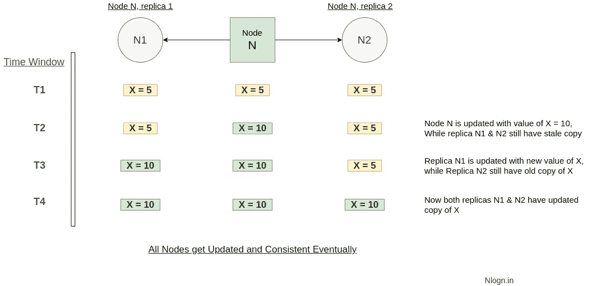
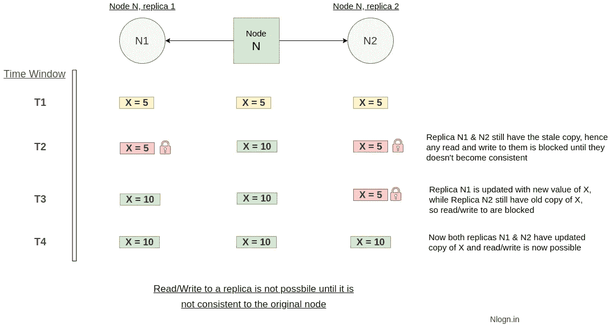

# 最终一致性和强一致性

> 原文：<https://levelup.gitconnected.com/eventual-consistency-and-strong-consistency-d0b882133ca5>

丹尼斯·库默在 [Unsplash](https://unsplash.com?utm_source=medium&utm_medium=referral) 上拍摄的照片

在讨论最终一致性和强一致性之间的区别之前，让我们首先理解分布式系统中的一致性。

一致的分布式系统是指所有节点同时看到相同数据的系统。换句话说，如果我们在多次写操作之后执行读操作，那么一致的系统应该为所有读操作返回相同的值，并且返回最近一次写操作的值。

为了正确理解这个概念，我强烈推荐阅读一下 [CAP 定理。](https://intmain.co/what-is-cap-theorem-and-where-is-it-used/)

## 最终一致性

最终一致性保证了如果对节点(比如节点 N)的数据进行更新，那么更新的值将**最终**传播到该节点的所有副本，并且最终所有副本将变得与原始节点(N)一致。节点将最终保持一致，这意味着更新到达其他副本需要时间。

因此，最终一致性是用于实现高可用性的一致性模型，并且是弱一致性模型。

已经实现最终一致性的节点通常被称为已经**收敛**，或者实现了**副本收敛。**

最终一致性

最终的一致性提供了高可用性(低延迟),但存在返回陈旧数据的风险。

实现最终一致性的最流行的系统是 [DNS](https://www.cloudflare.com/learning/dns/what-is-dns/) (域名系统)。根据配置的模式并结合时间控制的高速缓存来分发对域名的更新；最终，所有客户端将变得一致或看到更新。

## 强一致性

与最终一致性相反，强一致性保证如果对一个节点(比如说 N)进行更新，那么更新后的值将立即传播到节点(N)的所有副本(N1 和 N2 ),换句话说，在更新完成后，任何后续访问(对 N、N1 或 N2)将总是返回更新后的值。

注意:在用新数据更新这些复制副本期间，对这些复制副本的任何读/写请求都会延迟，因为所有复制副本都忙于保持彼此一致，一旦它们与原始节点一致，它们将再次开始接受读/写请求。

与强一致性中的最终一致性相反，总是只能观察到一个一致状态。

强一致性

最终一致性提供低可用性(高延迟)，但总是返回新鲜/更新的数据。

实现最终一致性的最流行的系统是关系数据库。这意味着在关系数据库中，更新后立即查看的数据对所有观察者来说是相同的。

进一步阅读

1.  [上限定理](https://intmain.co/what-is-cap-theorem-and-where-is-it-used/)
2.  [数据库分片](https://intmain.co/what-is-database-sharding-and-how-is-it-done/)

*最初发表于 intmain.co***，我强烈推荐你去看看这个博客。**