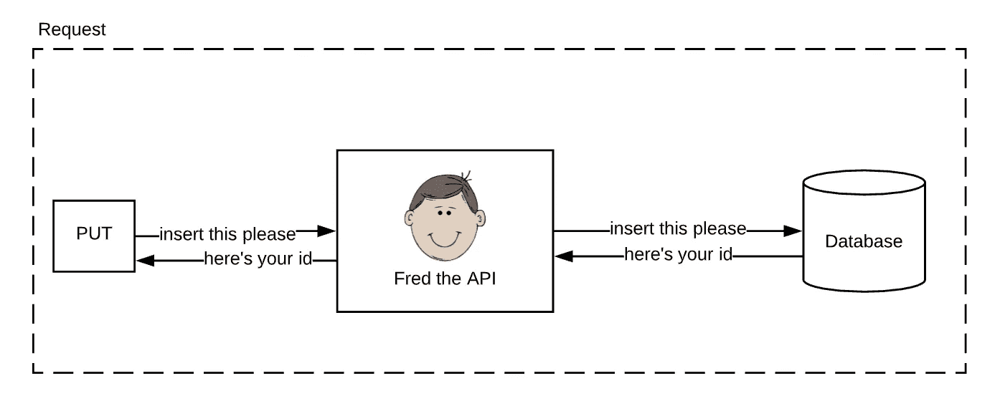
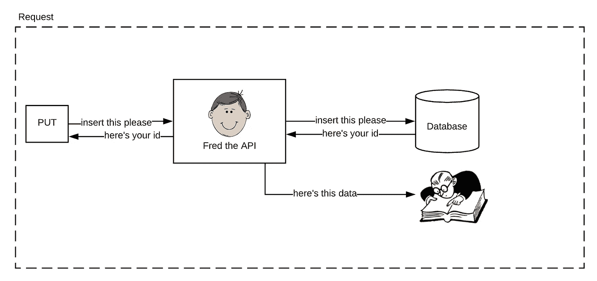
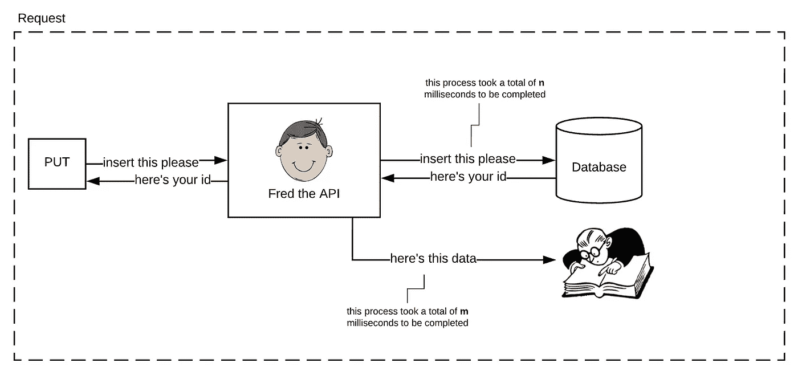
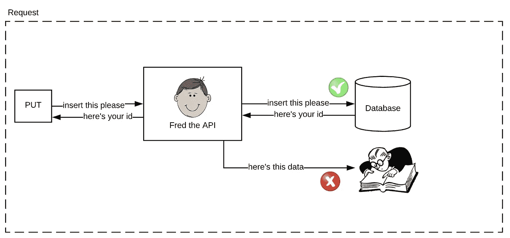
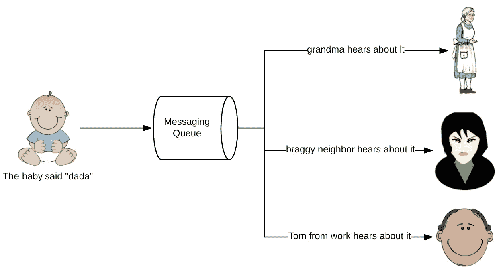
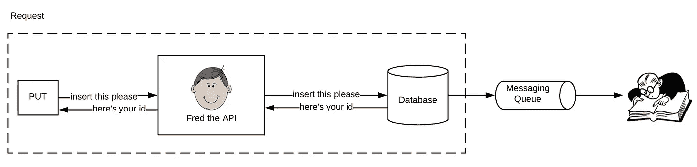
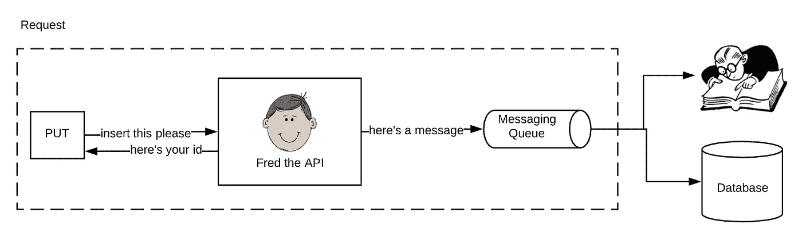
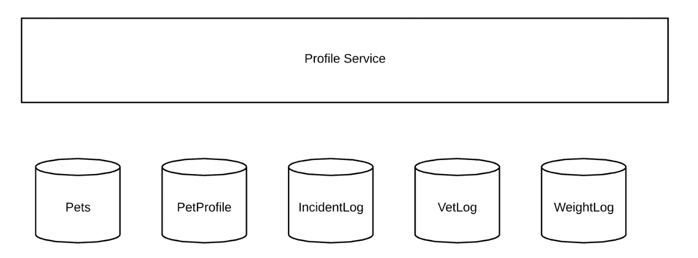
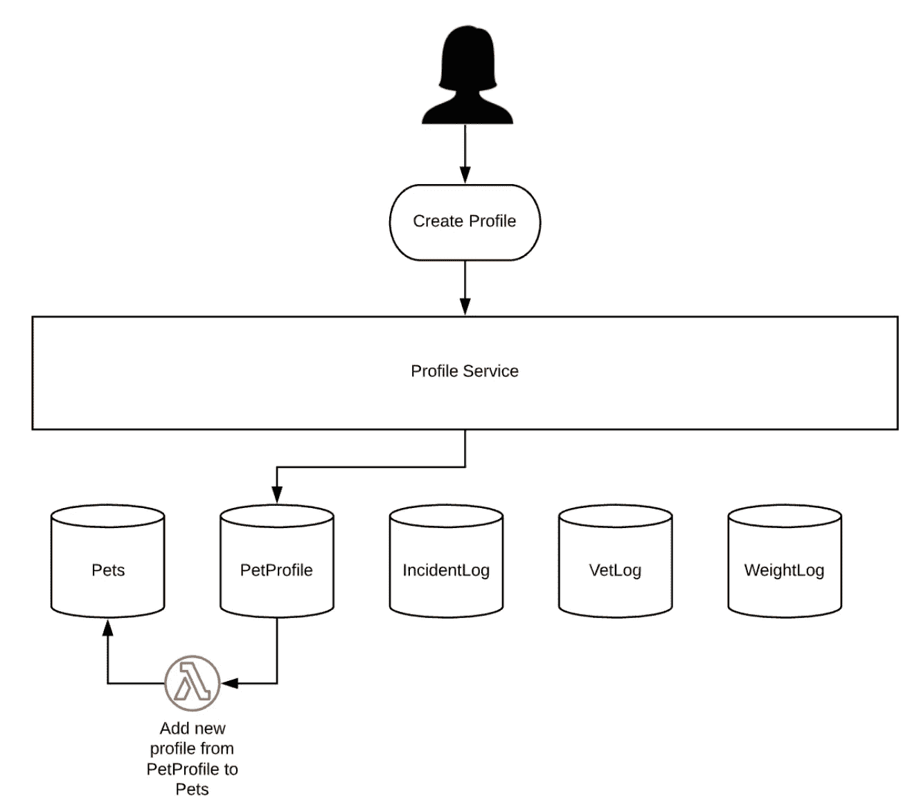
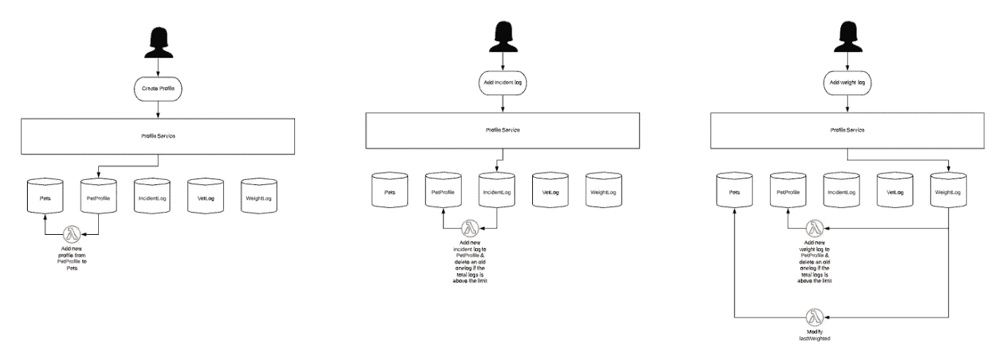

# 最终一致性:什么，如何，为什么

> 原文：<https://levelup.gitconnected.com/eventual-consistency-what-how-and-why-50c942472a0c>

曾经有一个 API 叫弗雷德。Fred 经常收到来自客户端的 PUT 请求，并将数据插入数据库，然后用 id 进行回复。

Fred 的生活很简单，直到一个新的数据审计服务开始要求 Fred 接收的任何数据也要进入它。

这产生了两个不同的问题。

## 问题#1

想象一下，将数据插入数据库需要大约 **n** 毫秒，这意味着在第一个场景中，发出请求的客户端将需要 **n** 来接收 id 并完成请求。我们还假设请求数据的审计服务花费了大约 **m** 毫秒来消耗数据，因此在添加了该服务之后，发出请求的客户端现在需要 **n+m** 来完成请求。

由于我们正在构建可扩展的架构，随着我们添加更多的服务，这一时间将会不断增加。

## 问题#2

现实生活中，有时请求失败的原因有很多:客户端没有准备好，验证失败，请求太多..等等..等等..那么，如果其中一个请求失败了，也就是说，如果数据被插入到数据库中，但是没有到达审计服务，会发生什么呢

我们不能告诉客户端请求失败了，因为它并没有失败，如果我们试图重新插入数据，数据库会抱怨(我们可以通过向上插入来解决这个问题，但我们会违反业务规则)

两个问题的一个解决方案是**最终一致性**，但是要理解我们需要首先覆盖 **CAP**

# 上限原则

**CAP** 代表一致性、可用性和分区阻力。CAP 原则指出，不可能构建一个保证一致性、可用性和抵抗分区的分布式系统。任何一个或两个都可以实现，但不能同时实现所有三个。

> 一致性意味着所有节点同时看到相同的数据。
> 
> 可用性是一种保证，即每个请求都会收到一个关于它是成功还是失败的响应。
> 
> 分区容差意味着尽管任意消息丢失或系统的一部分出现故障，系统仍能继续运行。

*摘自 Thomas A. Limoncelli、Strata R. Chalup、Christina J. Hogan 所著的《云系统管理实践:Web 服务的 DevOps 和 SRE 实践，第 2 卷》*

最终一致性(EC)能够以一致性为代价实现可用性和分区容差，这意味着我们不能保证所有数据接收者都能在同一时间看到数据，但我们可以保证服务始终可用，因为我们能够容忍任何依赖关系失败。

我们保证:
- **A** 可用性
- **P** 划分容差(也称为失败依赖)
我们不保证:
- **C** 数据存储之间的一致性

# 用咖啡解释最终的一致性

想象一下，你去一家咖啡店，点了一杯拿铁和一份烤饼。收银员帮你点餐，你付钱，然后等你的咖啡，但你马上拿走了你的烤饼。

当你走到下一个窗口等着拿咖啡的时候，你在想刚刚发生了什么:

*   收银员可以接受您的订单，并给您一张交易收据
*   你不知道点餐时浓缩咖啡机是否在工作，但这并不影响你的点餐
*   你保证你最终会得到你的咖啡，但是你不知道确切的时间

你的拿铁现已准备好，你拿着它和烤饼一起享用吧。

我们已经讨论了为什么，现在让我们讨论它是什么以及如何实现它。

# 什么？

EC 将数据传递到一个消息队列，该队列接收消息并将其传递给任何正在侦听的人。

一些消息队列推送到接收方，而另一些队列只保存数据，接收方记录它们所在的消息。

但是，大多数消息队列的主要特征是，如果接收方出于任何原因没有使用消息，消息队列将继续尝试发送消息，或者接收方将继续尝试使用消息。

# 怎么做？

使用我们前面的例子，Fred API，我们可以用两种方式实现 EC:

## 方式 1 数据库优先

该请求仅限于在数据库中插入数据；插入数据后，Fred 告诉他的客户数据已经进入，请求到此结束，但数据的旅程并没有结束。数据库触发 MQ 并向它发送刚收到的数据，审计服务拾取数据并使用它，而不会影响可靠性或完成请求所需的时间。

在这种方法中，我们保证在请求结束时数据已经在数据库中，但是我们不能保证它在消息队列中。

## 方式 2 消息队列优先

在这种方法中，我们保证数据在消息队列中，而不在数据库中。API 还负责为新数据创建标识符。

如果将数据放在消息队列中比放在数据库中更重要，那么可以使用这种方法。

# 最终一致性的真实例子

在我的豚鼠应用程序中，我们将宠物的档案数据拆分到不同的 DynamoDb 表格中。

*PetProfile* 表包含该个人资料的摘要，但不是全部数据，即姓名、年龄、性别和一些日志。

*宠物*表包含较少的关于简档的数据，但是包含该用户宠物的所有名字。

如果客户端请求查看用户拥有的所有宠物，我们使用*宠物*表，如果客户端请求查看关于特定宠物的摘要数据，那么我们查询*宠物简介*表，如果客户端需要更新宠物的年龄，那么我们转到拥有该数据的表，在这种情况下是*宠物简介*。

然而，如果客户端需要添加新的配置文件，则需要将数据存储在两个表中，即使我们可以在单个事务中同时批量更新两个表，我们也不需要*使用*，因为 *Pets* 表不需要在该信息可用时立即知道它，但最终需要知道它，所以我们使用了 EC。

## DynamoDb 的最终一致性

DynamoDb 提供了一个名为 Streams 的特性，它允许我们触发一个 lambda 函数，将数据放入另一个表中:

其余的表也是如此，在某些情况下，我们有触发多个函数的流。

## 这张图有什么问题？

正如 CAP 原理所解释的，我们可以保证服务可用，并且数据将被插入到至少一个表中，但是我们不能保证所有的表在任何时间点都具有相同的数据。在我们的例子中，这是一个可以接受的场景，在一个健康的系统中，客户端不会注意到，因为数据传输几乎是瞬间发生的。

## 进一步阅读

我希望这篇文章简单地解释了什么是最终一致性以及如何使用它，但是我鼓励你在决定 EC 适合你之前做进一步的阅读:

 [## 微服务权衡

### 许多开发团队已经发现微服务架构风格是一种更好的方法

martinfowler.com](https://martinfowler.com/articles/microservice-trade-offs.html)  [## 使用最终一致性和 Spring for Kafka 管理分布式数据模型:第 1 部分

### 给定一个由多个微服务组成的现代分布式系统，每个微服务拥有域的子集…

programmaticponderings.com](https://programmaticponderings.com/2018/06/17/using-eventual-consistency-%E2%80%A8and-spring-for-kafka-to-manage-a-distributed-data-model-part-1/)  [## 事务发件箱模式-帕拉德普·洛根纳森

### 微服务通常需要发布消息或事件，作为更新数据库的事务的一部分。对于…

pradeeploganathan.com](https://pradeeploganathan.com/patterns/transactional-outbox-pattern/)