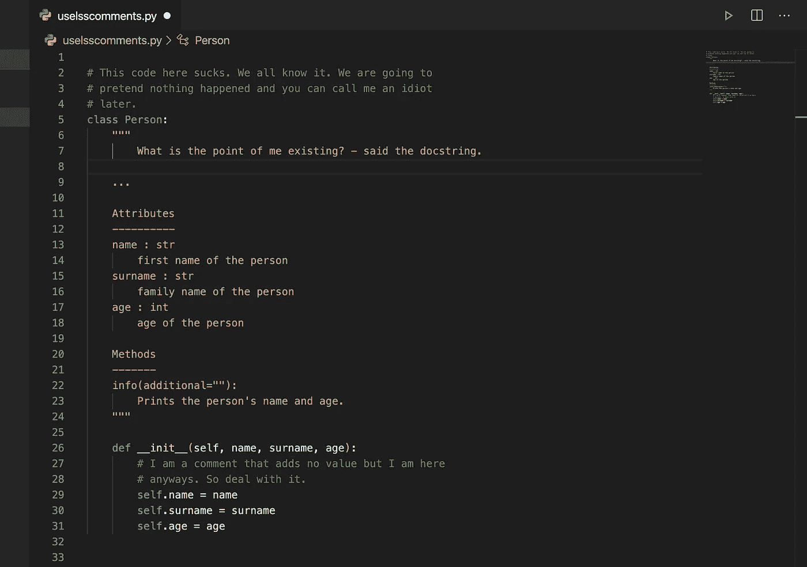

# 每当你注释代码时，你已经失败了。

> 原文：<https://levelup.gitconnected.com/every-time-you-comment-code-youve-already-failed-6fa9773b080f>

## 代码的艺术

## 拿好你的干草叉，先听我说完…

仅仅阅读这篇文章的标题可能会让你热血沸腾，但是请拿好你的干草叉，听我说完。一个恰当的注释可能非常有用，但是没有什么比无聊的注释更让代码混乱的了。在某些情况下，我敢大胆地说，注释可以弥补我们无法用代码表达自己的缺陷。所以写评论不应该是一件值得庆祝的事情，而是停下来问问自己是否有更好的方式用代码来表达自己。

带有少量注释的清晰而富有表现力的代码远远优于带有大量注释的混乱而复杂的代码。如果你把事情搞得一团糟，不要花时间写评论来解释，而是花时间来收拾残局。如果每次你写评论的时候都愁眉苦脸，感觉自己表达能力的失败，最终会让你写出干净清晰的代码，让评论变得完全没有必要。每次你用代码表达自己的时候，给自己一个鼓励。

# 为什么对评论如此不屑？

因为它们会撒谎，还会弄乱代码。不总是，也不是故意的，但是太频繁了。坏代码和有很多注释的代码之间也有很高的相关性。旧的注释倾向于进一步偏离它们应该描述的代码——在某些情况下，它们可能是完全错误的。随着代码库和团队的成长，维护注释实际上是不可能的。

> **点评**不像《辛德勒的名单》。它们不是“纯粹的好”的确，**评论充其量是一种不可避免的罪恶——罗伯特·C·马丁**

当谈论评论的话题时，很重要的一点是要了解什么是好的评论，什么是不好的评论，这样我们就能学会写更好的评论或者完全避免它们。

# 好评

并非所有的评论本质上都是不好的——有些评论实际上是非常必要的。

## 法律术语

有时候，出于法律目的，你可能需要写一些评论，比如一个开源项目的创造性许可。一些现代的 IDE 和文本编辑器会自动将它们折叠起来，以获得更整洁的工作空间。

## 神奇的表情

如果你有一个复杂的 SQL 或 regex，它神奇地做了一些令人兴奋的事情——一定要对它进行注释以使读者更容易理解，因为我们不是所有人都是 regex 忍者。

## 解释意图

在某些情况下，注释是解释决策或特定解决方案背后的意图所必需的。例如，测试套件中的注释让我们知道添加了什么来降低死锁的几率。

## 后果警告

解释激烈或可怕后果的评论是允许的，甚至是鼓励的。在这个例子中，开发者让读者知道 QT 函数在与回调一起使用时不是线程安全的。总的来说，如果一个评论帮助某人不坠入编程绝望的深渊——它是有用的。

## 待办事项注释

这些评论可以帮助我们标记我们认为应该做，但由于某种原因未能做的事情。它可能是一个删除已被否决的特性的提醒，或者是请求其他人关注这个问题。这可能是请求别人想一个更好的名字，或者是提醒你根据计划好的事件做出改变。

请记住，TODO 注释不是在系统中留下糟糕代码的借口。每一行代码本质上都是一种负担——最安全和最快的代码根本就不是代码。

现在，大多数好的 ide 都提供了特殊的手势和特性来定位所有的 TODO 注释，所以它们不太可能会丢失。尽管如此，你不希望你的代码被 TODOs 弄得乱七八糟。所以定期浏览它们，尽可能地剔除那些。

# 不好的评论

负面评论的列表更长，但我们将在这一部分看看一些更陈词滥调和常见的评论。

## **队长明显的评论**

一些评论恢复了显而易见的东西，这意味着它们没有增加任何真正的价值——而且大部分只是噪音。

下面是来自一个开源项目的一个片段，其中包含了大量明显的注释，使代码变得混乱和晦涩。这些注释并不比代码本身提供更多的信息，在某些情况下，阅读起来要比代码更费时间。

## 含糊不清的评论

如果你的评论是公司政策所要求的，或者你只是觉得有必要对某些事情进行评论，你就不会对这些评论进行适当的思考。所以如果你写了评论，花点时间让它对阅读它的人有所帮助。

在这个例子中，这个人想要传达一些关于在异常情况下会发生什么的重要信息。但该评论未能解释我们将依赖于哪些违约。如果一个注释要求我们去另一个模块找出缺省值，那么它就没有发挥应有的作用。

## 注释掉的代码

尽管注释掉代码直到团队准备好放弃它看起来是个好主意，但是不要这样做。注释代码像疾病一样聚集在一起，团队中的其他成员不会删除它，因为他们认为它很重要。我们不都在使用源代码控制吗？所以我们不需要保留旧代码。我们可以跳到任何我们想要的版本。

## 嘈杂的评论

有些评论毫无意义，纯粹是噪音。随着时间的推移，我们的大脑将学会浏览这些，我们也将开始跳过需要注意的重要评论。考虑这些例子——它们提供了很多价值吗？

通过用写干净代码的决心取代制造噪音的诱惑，你将成为一个更好、更快乐的开发人员。

## 强制性意见

这肯定会是一个有争议的问题。规定每个函数都需要一个 Java doc 或者 python docstring 是不是有点傻？大多数时候，对于类或函数名已经告诉我们的内容来说，它们是多余的。在这个例子中，评论比代码还多——这让我很恼火。

## 使用好的函数名或变量名

您可以通过用更有表现力的函数和变量名替换注释来使您的代码更整洁。考虑下面的例子，第一个例子中的注释变得不必要，因为有一个更好的函数告诉读者这个函数到底做什么。

## **评论并不能弥补糟糕的代码**

写评论背后更常见的动机之一是糟糕的代码。我们以前都见过，并在某些时候为自己的所作所为感到内疚。我们编写一个模块或一个类，我们知道它是令人困惑和混乱的。我们知道这很乱。所以我们对自己说，“哦，我最好评论一下！”不要！你最好打扫干净！

# 外卖食品

我绝不提倡没有任何注释的代码，只是建议培养对注释的轻微蔑视可以产生更干净和更具表达力的代码——这将提高开发人员的水平。在我自己寻求更干净的代码的过程中，我已经高度意识到写不好的注释和在可能的时候重组代码——把我的代码从宜家的画变成梵高的画。

所以让我们约定不再写这么多评论。