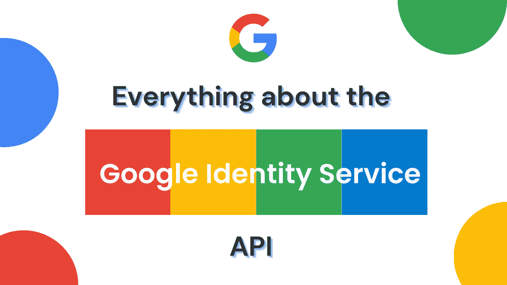
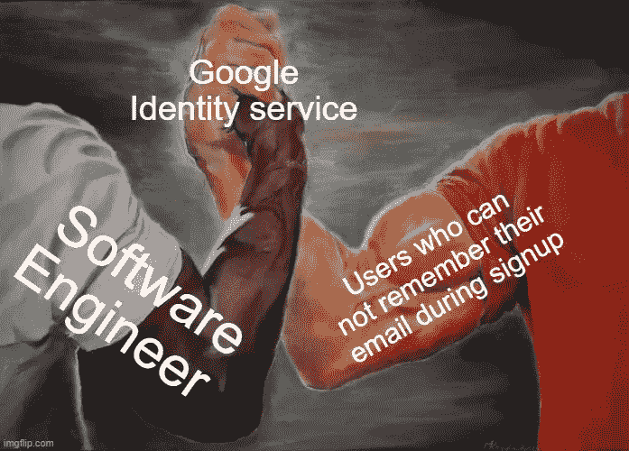

# 关于 Google 身份服务(GIS) API 的一切

> 原文：<https://levelup.gitconnected.com/everything-about-the-google-identity-service-gis-api-168df3498c5a>

正如你可能已经知道的，谷歌的大男孩和女孩们已经决定，最好放弃*谷歌登录平台*，代之以*谷歌身份服务*

快速背景*谷歌登录平台*和*谷歌身份服务*都是 API，允许用户将他们的谷歌账户连接到第三方应用

迁移到这个新的 API 对我来说是一个麻烦，所以我想和你分享我学到的东西。我将分享如何使用 GSI、Node.js 和 React 来执行认证和授权

需要注意的是，与 Google 登录平台不同，GIS 中的身份验证和授权是分开的

# 认证🪪

身份验证只是从 google 获取用户的基本信息，以便在您的应用程序上设置一个帐户。

下面的 React 代码是一个组件，它返回一个用于 Google 身份验证的按钮。成功授权后，JWT 令牌会发送到应用程序的客户端，您可以在后端验证该令牌，然后存储用户信息

更多定制请看 [HTML API 参考](https://developers.google.com/identity/gsi/web/reference/html-reference)

# 证明🔐

认证是为了获得与用户的谷歌账户相关联的某些谷歌服务的使用权

有两种使用 GIS 处理身份验证的方法

*   [代码模型](https://developers.google.com/identity/oauth2/web/guides/use-code-model)
*   [授予模式](https://developers.google.com/identity/oauth2/web/guides/use-token-model)

**代码模型**用于您需要长时间访问某个 google 服务，或者您不希望用户每次都必须重新验证自己的场景。使用这种方法，一旦用户授予必要的权限，客户端将获得一个代码，然后该代码将被发送到您的服务器，以获得一个**刷新 _ 令牌**(长期)和一个**访问 _ 令牌**

**授权模式**适用于你只需要一次性访问谷歌服务的情况。使用这种方法，一旦用户授予必要的权限，客户端就会获得一个 **access_token** ，它可以被发送到后端，以对 google 服务进行 API 调用

我会推荐实现代码模型，因为你得到了一个访问令牌；如果您不需要刷新令牌，您可以忽略它，如果稍后您决定需要它，您已经拥有了它。

下面是我的代码模型的实现

那就是 GIS 的授权和认证，你可以在这里阅读更多关于[GSI](https://developers.google.com/identity)

当我写这篇文章的时候，一些事情突然出现在我的脑海里；这可能是我今年的最后一篇文章了，哇。我刚刚意识到我第一年在媒体上写了 9 篇文章🤯。我也许应该写一篇单独的文章来感谢你，但是我可能会变懒😅…好吧，让我们看看会发生什么。

非常感谢花时间阅读、喜欢和评论我的文章的每一个人；我希望我能帮助你学到一些东西。

圣诞快乐，新年快乐🎄🍻…下次再见，🖖