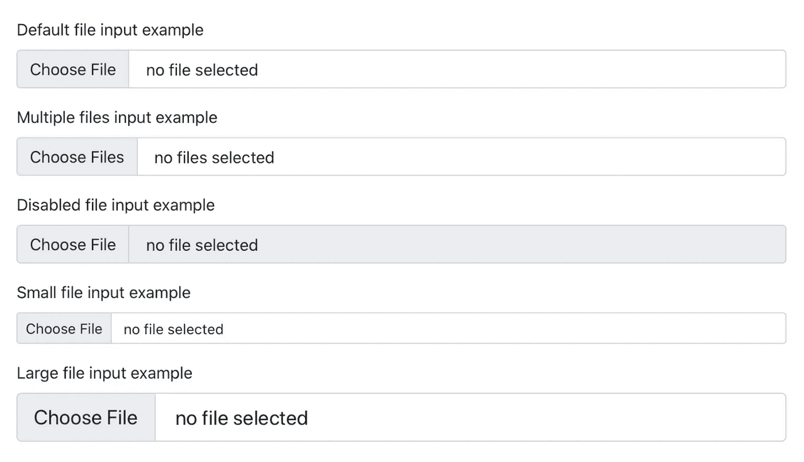

# 关于最新 Bootstrap 版本的一切| Bootstrap 5

> 原文：<https://levelup.gitconnected.com/everything-about-the-latest-bootstrap-release-bootstrap-5-b62676437d46>

Bootstrap 5 来了！


你可以从 https://getbootstrap.com 获得最新的引导版本，或者直接进行 npm 安装。

```
npm i bootstrap
```

# 主要变化摘要

## 1.jQuery 已删除

Bootstrap 在 Bootstrap 版本 4 之前一直在幕后使用 jQuery，但是从版本 5 开始，它已经被完全删除了。虽然这种变化不会影响最终用户，但它仍然是一个重大的变化。

## 2.新的标志/图标和全面改造的工具

Bootstrap 版本 5 的最大变化之一是引入了重新设计的徽标和几个新图标，避免了使用额外的库，如字体 Awesome 等。此外，他们还更新了他们的文档设计，并投资为 Bootstrap 添加更多的实用程序，以及跨项目管理它们的新方法。用他们自己的话说，“还是一样的 Bootstrap，只是稍微精致了一点。”

## 3.新断点:xxl

断点是可自定义的宽度，它决定了您的响应布局在 Bootstrap 中跨设备或视口大小的行为。Bootstrap 版本 5 中引入了一个新的断点，即 *extra extra large(xxl)* 用于为大屏幕、投影仪和大型显示器渲染。


截图来自[https://getbootstrap.com/docs/5.0/layout/breakpoints/](https://getbootstrap.com/docs/5.0/layout/breakpoints/)

## 4.RTL

Bootstrap 现在也支持从右向左书写的语言，比如阿拉伯语。

通过引导启用 RTL 有两个严格的要求:

从那里开始，需要包含一个 RTL 版本的 CSS。这里有一个例子。

```
<!doctype html>
<html lang="ar" dir="rtl">

  <head>
    <!-- Required meta tags -->
    <meta charset="utf-8">
    <meta name="viewport" content="width=device-width, initial-scale=1">

    <!-- Bootstrap CSS -->
    <link rel="stylesheet" href="https://cdn.jsdelivr.net/npm/bootstrap@5.0.1/dist/css/bootstrap.rtl.min.css" integrity="sha384-LPvXVVAlyPoBSGkX8UddpctDks+1P4HG8MhT7/YwqHtJ40bstjzCqjj+VVVDhsCo" crossorigin="anonymous">

    <title>مرحبا بالعالم!</title>
  </head>

  <body>
    <h1>مرحبا بالعالم!</h1>
  </body>

</html>
```

## 5.画布外组件

它类似于一个侧边栏组件，可以使用 JavaScript 进行切换，以从视口的左边缘、右边缘或下边缘显示。

默认情况下，offcanvas 组件没有位置。因此，可以添加下面列出的一个修饰符类别:

*   `.offcanvas-start`将画布置于视口的左侧
*   `.offcanvas-end`将 offcanvas 放置在视口的右侧
*   `.offcanvas-top`在视口顶部放置画布
*   `.offcanvas-bottom`在视口底部放置画布

```
<div class="offcanvas offcanvas-start" tabindex="-1" id="offcanvas" aria-labelledby="offcanvasLabel">

  <div class="offcanvas-header">
    <h5 class="offcanvas-title" id="offcanvasLabel">Offcanvas</h5>
    <button type="button" class="btn-close text-reset" data-bs-dismiss="offcanvas" aria-label="Close"></button>
  </div>

  <div class="offcanvas-body">
    Content for the offcanvas goes here. You can place just about any Bootstrap component or custom elements here.
  </div>

</div>
```

## 6.手风琴

`.card`手风琴组件现已被替换为新的`.accordion`组件。新的 accordion 仍然在内部使用*折叠 JavaScript 插件*，但是有定制的 HTML 和 CSS 来支持它，这使得它比以往任何时候都更好用、更容易使用。

新的 accordion 包括引导图标，例如表示状态和可点击性的 v 形图标。

## 7.更新的表单

Bootstrap 现在已经将所有的表单样式整合到一个新的表单部分(包括输入组组件)中，以给予它们应有的重视。

*   浮动标签
*   复选框、单选、选择、文件、范围等的可定制外观。
*   新文件输入



截图自[https://blog . get bootstrap . com/2021/05/05/bootstrap-5/# new-accordion](https://blog.getbootstrap.com/2021/05/05/bootstrap-5/#new-accordion)

> 如果您仍在使用 Bootstrap 3，我建议您首先转到 Bootstrap 4，而不是直接跳到 Bootstrap 5。查看他们的[移民指南](https://getbootstrap.com/docs/4.0/migration/)了解更多细节。要了解更多细节，请查看 Bootstrap 版本 5 的[官方文档。](https://blog.getbootstrap.com/2021/05/05/bootstrap-5/)

感谢阅读这篇文章，希望它是值得的时间。继续学习！

*原载于*[*https://www.theimmigrantprogrammers.com*](https://www.theimmigrantprogrammers.com/p/everything-about-the-latest-bootstrap)*。*