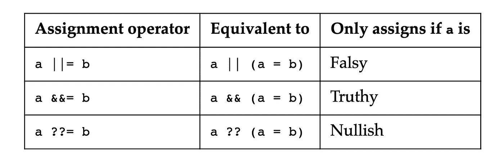

# 最新 ECMAScript 版本的所有信息| ECMAScript 2021

> 原文：<https://levelup.gitconnected.com/everything-about-the-latest-ecmascript-release-ecmascript-2021-c011e817f41a>

在本文中，我们将通过一些编码示例来介绍 ECMAScript 2021 最新版本中的新特性。


# 新功能

## 1.String.replaceAll()

用所需字符串替换目标字符串的所有实例。

```
const fact = "Javascript is the best web scripting language. Javascript can be used for both front end and backend";

console.log(fact.replaceAll("Javascript", "Typescript"));

Result:
"Typescript is the best web scripting language. Typescript can be used for both front end and backend";
```

相比之下，前面的 replace()方法只将目标字符串的第一个匹配项替换为所需的字符串。

```
const fact = "Javascript is the best web scripting language. Javascript can be used for both front end and backend";

console.log(fact.replace("Javascript", "Typescript"));

Result:
"Typescript is the best web scripting language. Javascript can be used for both front end and backend";
```

## 2.Promise.any()

`Promise.any()`在所提供的承诺中的任何一个被解决时就解决，不像`promise.all()`等待所有的承诺都解决。基本上和`Promise.all().`相反

如果 ***一个承诺兑现了*** 就会发生这种情况:

```
**const** promises = [   
          **Promise**.reject('ERROR A'),           
          **Promise**.reject('ERROR B'),   
          **Promise**.resolve('result'), 
]; 

**Promise** .any(promises)
  .then((result) **=>** assert.equal(result, 'result')); //true
```

如果 ***所有的承诺都被*** ***拒绝*** 会是这样:

```
**const** promises = [   
          **Promise**.reject('ERROR A'),  
          **Promise**.reject('ERROR B'),   
          **Promise**.reject('ERROR C'), 
]; 

**Promise** .any(promises)   
  .catch((aggregateError) **=>** {
            assert.deepEqual(aggregateError.errors, 
            ['ERROR A', 'ERROR B', 'ERROR C']); //true
   });
```

## 3.逻辑赋值运算符



来源:[https://exploring js . com/心急-js/ch _ operators . html # logical-assignment-operators](https://exploringjs.com/impatient-js/ch_operators.html#logical-assignment-operators)

`**a ||= b**`相当于`**a || (a = b). (Short-circuiting).**`

为什么不是这个表情？`**a = a || b**`

因为对于前一个表达式，只有当`a`的值为`false`时，赋值才会被计算。因此，只有在必要时才执行分配。相反，后一个表达式总是执行赋值。

示例`**a ||= b:**`

```
var a = 1;  
var b = 2;  

a ||= b;   

console.log(a); // 1
```

示例`**a &&= b:**`

```
var a = 1; 
var b = 2; 

a &&= b; 

console.log(a); // 2
```

示例`**a ??= b:**`

```
var a;  
var b = 2;   

a ??= b;   

console.log(a); // 2
```

## 4.数字分隔符

我们现在可以在数字文字和 bigInt 文字中使用 ***下划线(***`***_***` ***)***作为分隔符。它将帮助开发人员使他们的数字文字更具可读性，因为当我们在日常生活中书写数字时，*下划线*将基本上充当*逗号(使用*来分隔不同的数字组)。

```
let budget = 1000000000000 //can be written as the following..

let budget = 1_000_000_000_000; 

console.log(budget); //printed as regular numeric literal.

result:
1000000000000
```

我希望这篇文章能帮助您理解最新的 ECMAScript 版本。感谢阅读。如果您有任何问题，请随时发表评论。

资源:

*   [https://dev . to/faithfulojebiyi/new-features-in-ecmascript-2021-with-code-examples-302h](https://dev.to/faithfulojebiyi/new-features-in-ecmascript-2021-with-code-examples-302h)
*   https://2ality.com/2020/09/ecmascript-2021.html

【https://www.theimmigrantprogrammers.com】最初发表于[](https://www.theimmigrantprogrammers.com/p/everything-about-the-latest-ecmascript)**。**