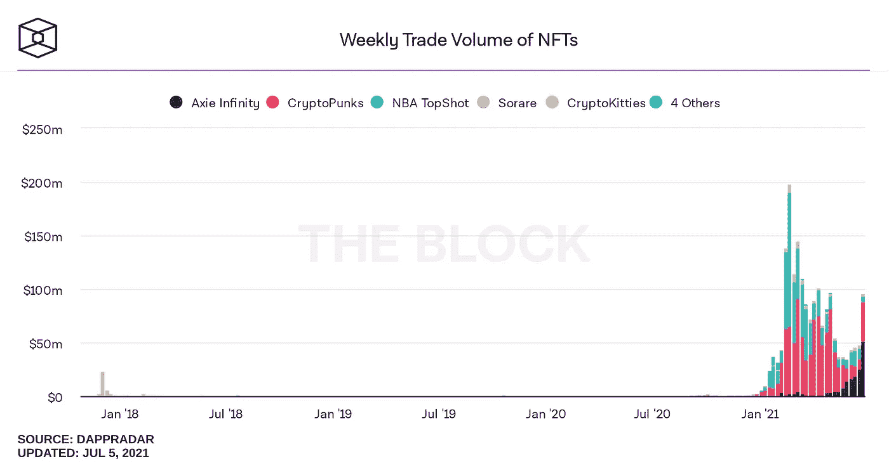

# 任何东西都有它的价格——一个代表互联网源代码的 NFT 已经卖到了 540 万美元

> 原文：<https://levelup.gitconnected.com/everything-has-its-price-an-nft-representing-the-internets-source-code-has-sold-for-5-4-million-21b24d3caabd>

## 利用区块链技术拥有历史瞬间

图片来源: [Shutterstock](https://www.shutterstock.com/image-photo/modern-girl-laptop-tablet-computer-free-1534707374)

6 月 30 日，苏富比[举行了一场网上拍卖，提供了一件代表](https://www.theguardian.com/technology/2021/jun/30/world-wide-web-nft-sold)互联网原始源代码的 NFT，由英国计算机科学家蒂姆·伯纳斯·李撰写。

构成最初万维网的大约 9500 行计算机代码在区块链作为不可替代的象征(NFT)而永垂不朽。这与 30 分钟的代码动画可视化、代码的数字海报以及伯纳斯-李在 2021 年 6 月写的反映他的发明的数字信件一起出售。

NFT 的底价仅为 1000 美元，最终以 540 万美元的高价售出。支付的价格代表了 NFT 的新主人可能对互联网出现的那一刻在概念上“拥有”的溢价。

NFT 技术的各种使用案例不断涌现。互联网源代码《NFT》的销售展示了区块链的另一种用途——无可辩驳且永恒地记录时间瞬间。NFT 可以用来使这些时刻不朽，作为纪念品，然后可以作为理想的收藏品和身份象征进行买卖。

# NFTs 的兴起

2021 年将会因为许多事情而被记住——在区块链计算界，这是 NFTs 进入公众意识的一年。

*   今年 3 月，艺术家[比普尔以 6930 万美元的价格卖出了一幅 NFT](/what-makes-a-digital-image-file-worth-69-million-4d49a9eabcb7) ，这相当于一幅由 5000 幅图像组成的数字拼贴画。
*   推特创始人杰克·多西以 290 万美元拍卖了代表他第一条推特的 NFT
*   今年 4 月，来自北卡罗莱纳州的 21 岁的佐伊·罗斯出售了一件在区块链上铸造的 NFT，这件作品是基于一个互联网文化基因，上面有一张她小时候站在炉火前的照片。以模因为基础的 NFT 被称为“灾难女孩”，以 47.3 万美元的价格售出，并还清了她的学生债务。

这三个例子仅仅触及了迄今为止使用 NFT 的各种方式的表面。

来源:[推特](https://twitter.com/thehill/status/1388144137279524865?s=20)

自从读到了 Beeple 的出售，我觉得有必要一头扎进 NFT 的世界，以便更好地理解它们:

我试图理解他们在艺术界的地位。
我推测了他们可以用来测试[一个人的职业生涯](/how-you-could-benefit-from-using-nfts-to-manage-your-career-e7cf0f8a6372)作为工作报酬的各种方式。
我甚至走得更远[自己创造了一个 NFT](/the-exact-process-i-used-to-create-and-sell-my-own-nft-art-on-the-ethereum-blockchain-698d9c59a2fe)——我在一个中型故事中记录了这个过程，这个故事和我写过的任何其他故事一样吸引了人们的兴趣([NFT 尚未出售](https://opensea.io/assets/0x495f947276749ce646f68ac8c248420045cb7b5e/7617488058710117402786806328745209336955427580034910121800737432753127030785))。

随着因特网源代码作为 NFT 出售，该技术的潜在效用再次显示出来。它大概对那些寻求与“拥有”某个时刻相关的地位的人有吸引力。

# 你和 NFT 有什么关系？

NFT 给了主人什么作为支付价格的回报，这个概念很难概念化。如上所述，伯纳斯-李 NFT 包括各种相关的数字文物。

同样，当我在以太坊区块链(Ethereum Blockchain)上铸造我自己的 NFT——一个代表我拍摄的数码照片的令牌——时，我的意图是成功的买家也将获得原始图像文件。不过，需要注意的关键是，只有令牌本身*确定保持唯一和不可变。*

伯纳斯-李的 NFT 的买家理论上可以制作多份数字海报，并在网上大量发布。买了我的数码照片的人也可以这么做。在每一种情况下，NFT 本身永远是一对一的。

因此，NFT 本身与其说是关于*这个‘东西’*的所有权，不如说是来自与这个‘东西’相关联的 NFT *的所有权的地位和荣誉被无可辩驳地永远记录在区块链中。*

事实上，当非功能性测试被用于标记物理项目或真实世界体验时，NFT 可能无法保证插件的未来可用性。

*   摇滚乐队[利昂之王(Kings of Leon)很早就参加了 NFT 派对](https://www.rollingstone.com/pro/news/kings-of-leon-when-you-see-yourself-album-nft-crypto-1135192/)，向他们的超级粉丝出售了一系列 NFT。他们的 NFT 各种各样，包括他们最新唱片的特别压制和其他额外待遇，如未来音乐会的前排门票。虽然他们的非物质文化遗产将随着所有权的变化被写入区块链记录而永远留在区块链，但随着时间的推移，实物物品本身可能会丢失或毁坏。乐队可能会解散，从而剥夺 NFT 老板观看他们演奏的机会。*但 NFT 依然存在。*
*   一位[有事业心的房地产经纪人试图出售加州千橡市一处房产的数字渲染图](/the-2-million-nft-that-comes-with-a-house-selling-real-world-goods-on-the-blockchain-b8aec8939ee9)的 NFT——实物房产本身就包含在图像的拍卖价格中。虽然 NFT 和数字艺术将永远存在于区块链，但房子本身可能会在未来被烧毁，或者被开发商夷为平地。但是 NFT 依然存在。

NFT 技术及其各种应用的这些方面可能被视为贬损者或限制，但在赋予时间和历史瞬间的概念所有权的情况下，它们似乎证明了效用。如果为它们支付的价格说明了什么的话，那就是合适的非功能性食物也是某些买家想要的。

# 拥有一个瞬间

以杰克·多西的推特为例。买家可以无可辩驳地证明，他们是那个时刻的合法所有者 Twitter 创始人第一次使用他的创作与外部世界交流的时刻。他铸造了 NFT，卖给新主人的交易记录在区块链。

但这并不能阻止我或其他任何人复制这条推文——以下是:

来源:[推特](https://twitter.com/jack/status/20?s=20)

虽然实际的*“东西”*本身是很容易复制的，但这并不与 NFT 相关——NFT 带来了原件的地位和不可辩驳的所有权，尽管这可能是名义上的。这和传统的“现实世界”艺术是一样的。

以《蒙娜丽莎》为例——原作归卢浮宫美术馆所有并在那里展出(至少，我们被引导着相信展出的是原作)。“东西”本身很容易被复制，并且已经多次出现在印刷品、徽章、海报、茶巾和许多其他物品上。

在这种情况下，与原作所有权相关的地位来自于画廊对实物的占有。必须对其进行物理和安全保护。于是，NFT 就成了*‘东西’*所有权的体现，这些东西不一定有物理形态，也不能被锁和钥匙持有、触摸或储存。

正是因为这个原因，NFT 在记录、记录和保护数字和虚拟媒体的所有权方面特别通用和有用，无论是图像文件、音频、电影还是像蒂姆·伯纳斯·李互联网 NFT 这样的计算机代码。它不会阻止项目被复制，而是充当所有权的分类帐，并维护唯一性和不可替代性。

# 表征历史的伦理

20 世纪 90 年代早期启动互联网引擎的代码所代表的关键时刻的名义销售也引发了一些担忧。Berners-Lee 一直热衷于指出，他的 NFT 不会以任何方式损害作为互联网基础的开源理念——事实上，实际的原始源代码本身并不包含在 NFT 中。

在《连线》杂志最近一篇题为“ [NFTs 和 AI 正在颠覆历史的概念](https://www.wired.com/story/nfts-and-ai-are-unsettling-the-very-concept-of-history/)”的文章中，作家 Rick Prelinger 提出:

> "对档案馆来说，没有什么比 NFTs 更大的文化和道德冲击了."

他继续认为，通过铸造具有历史意义的藏品及其相关艺术品作为 NFT 来实现货币化，理论上可能会使系谱学家和其他学者更难获得重要文件，因为他们无法获得购买或访问相关 NFT 所需的资金。

这在多大程度上成为一个问题还有待观察，并且很可能取决于创作者在多大程度上寻求将历史时刻作为金钱利益的非功能性传播来永垂不朽。虽然一些机会主义者可能会将伯纳斯-李 NFT 法案视为创建和销售自己的非功能性交易的一个契机，但真正重要的是长期趋势。

每周 NFT 交易量——来源:theblockcrypto.com

来自 theblockcrypto.com[的数据](https://www.theblockcrypto.com/data/nft-non-fungible-tokens/nft-overview/weekly-trade-volume-of-nfts)显示，在大规模出售期间，人们对 NFT 的兴趣和相应的交易量激增，但在 2021 年 3 月之后，随着炒作逐渐平息，交易量再次逐渐下降。它在 6 月底再次飙升，但我们可以合理地预计，在伯纳斯-李出售后，交易量将再次下降。

# 接下来会发生什么？

如上图所示，自 2021 年初以来，NFT 交易量呈抛物线增长，这表明市场仍处于初级阶段。炒作和热情也可能吸引创作者铸造自己的 NFT，就像 FOMO 推动买家进入 NFT 所有权一样，也是出于对其潜在价值的真正相信。

事情如何发展还有待观察，但历史上肯定有一些时刻无疑会吸引潜在买家的极大兴趣:

*   Satoshi 挖掘出第一枚比特币的那一刻
*   发送的第一封电子邮件
*   第一次有人“喜欢”脸书邮报
*   第一次导致结婚的网上约会“眨眼”

时间会告诉我们，有多少这样的时刻会被区块链铭记，有多少买家愿意为拥有它们付出代价！

如果你喜欢阅读这样的故事，并且愿意支持 Medium 上的作家，考虑注册成为 Medium 会员。一个月 5 美元，给你无限的故事。如果你注册使用我的链接，我会赚一小笔佣金。

 [## 阅读托比·黑兹伍德(以及媒体上成千上万的其他作家)的每一个故事

### 作为一个媒体会员，你的会员费的一部分会给你阅读的作家，你可以完全接触到每一个故事…

tobyhazlewood.medium.com](https://tobyhazlewood.medium.com/membership) 

注:*本文仅供参考。不应将其视为财务或法律建议。在做任何重大财务决定之前，先咨询财务专家。*

## [如果你喜欢这篇文章，我希望你加入我的电子邮件列表。](http://bit.ly/TobyHazlewoodList)