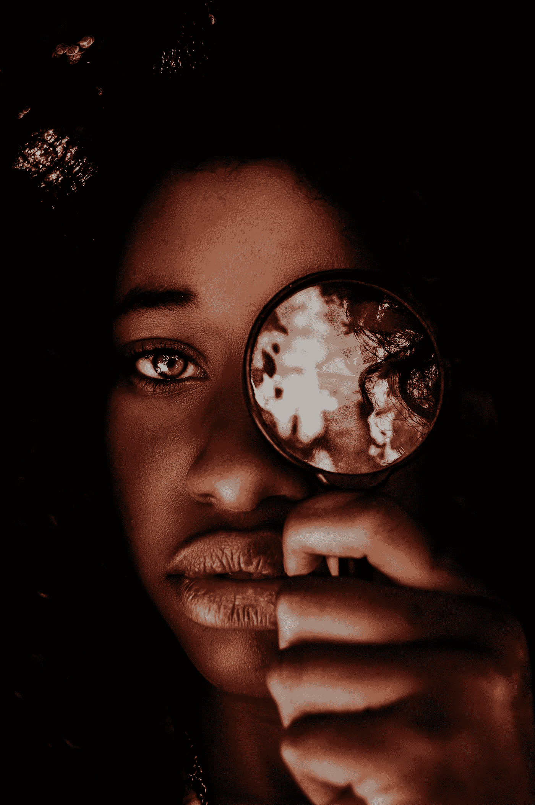
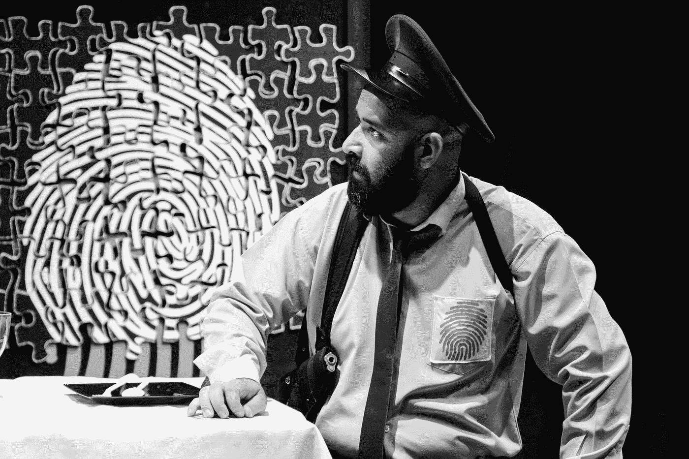

# 面部识别软件的所有问题和必须考虑的 3 个基本道德问题

> 原文：<https://levelup.gitconnected.com/everything-wrong-with-facial-recognition-software-and-3-essential-ethical-considerations-that-must-915eb225a77c>

## 伦理在一个由技术推动的世界中的重要性

在 [Unsplash](https://unsplash.com?utm_source=medium&utm_medium=referral) 上由 [Houcine Ncib](https://unsplash.com/@houcinencibphotography?utm_source=medium&utm_medium=referral) 拍摄的照片

20 世纪 60 年代，数学家伍德罗·布莱索(Woodroe Bledsoe)和计算机科学家海伦·陈·沃尔夫(Helen Chan Wolf)首次提出面部识别，多年来，面部识别技术取得了长足的进步，现在许多人都把它放在口袋里。手机和笔记本电脑可以只对用户的脸开放，零售公司(无论道德上如何)现在可以观察顾客，并使用面部识别向每个人发送定制的广告。

随着面部识别成为如此受欢迎的工具，应用如此广泛，是什么出了这么大的问题，以至于德克萨斯州不得不干涉 Meta 的做法？发生了什么事，使得一个人被判犯了他没有犯的罪？一项技术怎么会引发这么多问题？

在这篇文章中，我们将看看面部识别软件出错的臭名昭著的例子，并由此得出必须考虑的伦理问题，以避免这种基于人工智能的技术出现问题。

# 案例研究 1:德克萨斯州起诉 Meta 滥用面部识别软件

照片由[海萨姆·纳巴维](https://unsplash.com/@hessamnbv?utm_source=medium&utm_medium=referral)在 [Unsplash](https://unsplash.com?utm_source=medium&utm_medium=referral) 拍摄

得克萨斯州总检察长肯·帕克斯顿(Ken Paxton)对 Meta 的脸书提起诉讼，称该公司非法存储了数百万得克萨斯人的生物特征数据——如面部对称性等数据，可用于单独识别他们中的每一个人。

肯·帕克斯顿声称，脸书未能获得此类敏感数据所需的知情同意。对他来说，这不过是“大型科技公司欺诈行为”的又一个例子，他对此非常担心。

> 这是你的个人信息，一旦公开，一旦他们分享，一旦他们披露，魔鬼就从瓶子里出来了。你拿不回来了。——肯·帕克斯顿在福克斯新闻频道获得的关于 Meta 滥用面部识别软件的声明中

对 Meta 的指控听起来可能令人震惊。然而，这种问题以前出现过多次，不仅 Meta 被美国伊利诺伊州指控 1 . 65 亿美元，其他几家公司也可能被指控。

**你购物的几家零售店——甚至是你当地的杂货店——可能会存储你面部对称的生物数据**,以确定你对哪些产品感兴趣，从而制作有效的广告来增加利润。

 [## 你可能会去的零售店使用面部识别技术

### 全国各地的零售商店都在商店中使用面部识别系统，这导致了一些团体的抵制…

www.businessinsider.com](https://www.businessinsider.com/retail-stores-that-use-facial-recognition-technology-macys-2021-7#:~:text=According%20to%20the%20advocacy%20campaign%27s,use%20facial%20recognition%20in%20stores) 

# 基本伦理考虑 1:隐私

这第一个案例确实突出了对面部识别软件的用户和受益者的隐私给予特别关注的必要性。

政府对存储数据如此严格有一个很好的原因:不仅存储的数据可能泄露，证明是灾难性的(就像[的许多名人，如赛琳娜·戈麦斯和贾斯汀·比弗](https://opendatasecurity.co.uk/en/hacked-celebrities-a-list-of-the-most-famous-cases/)的个人生活和私人照片被泄露一样)，而且还会自动化我们自己的生活，控制我们的行为。

肖莎娜·祖博夫在她的畅销书*监控资本主义时代:*中清楚地论证了这一点

> “将关于我们的信息流自动化已经不够了；现在的目标是让我们实现自动化。”肖莎娜·祖博夫

# 案例研究 2:涉及面部识别的算法导致错误逮捕

[韦斯利·麦克拉克伦](https://unsplash.com/@wesmac5?utm_source=medium&utm_medium=referral)在 [Unsplash](https://unsplash.com?utm_source=medium&utm_medium=referral) 上拍摄的照片

美国密歇根州韦恩县使用的一种算法[错误地将罗伯特·朱利安·博查克·威廉姆斯(Robert Julian-Borchak Williams)认定为被通缉的商店扒手，](https://www.nytimes.com/2020/06/24/technology/facial-recognition-arrest.html)将其关押一夜。

这种混乱背后的原因是什么？数据偏差。

当面部识别软件被训练来识别人脸时，所使用的数据主要来自开发人员，他们在统计上是年轻的白人男性。正因为如此，面部识别软件通常无法正确处理有色人种的面部细节，从而产生不准确的结果。

数据偏见不仅是种族主义的原因，也是基于人工智能的算法经常表现出的性别歧视和年龄歧视的原因。

关于种族偏见如何泄露到面部识别和更多案例研究的更多信息，可以考虑观看网飞纪录片*编码偏见(2020)。*

编码偏见的预告片，一部关于面部识别中种族偏见的纪录片

# 基本伦理考虑 2:数据集的多样性

由于面部识别软件中的偏见源于用来训练算法的数据集的不足，因此数据集变得更加多样化非常重要。

为了实现这一点，公司可以考虑寻找数据志愿者，他们可以帮助使数据集更加多样化。他们还应该加大努力，促进科技行业的多元化。

# 基本伦理考虑 3:算法透明性

照片由 [Cytonn 摄影](https://unsplash.com/@cytonn_photography?utm_source=medium&utm_medium=referral)在 [Unsplash](https://unsplash.com?utm_source=medium&utm_medium=referral) 上拍摄

为了在技术产品的创造者和用户之间建立信任，并确保在渎职的情况下追究责任，透明度是一个道德考虑因素，当我们查看上述两个案例研究时，我们可以看到这是至关重要的。

# 摘要

*   面部识别软件可能会侵犯用户和受益人的隐私
*   面部识别软件往往体现了对科技行业边缘化群体的系统性偏见
*   为了最大限度地减少面部识别软件的负面影响，必须对用户隐私、数据集多样性和算法透明性进行伦理考量。

感谢您的阅读。如需更多基于新闻的文章，请考虑访问以下链接:

 [## 人工智能可以很快从你的 DNA 中认出你的脸

### 自动面部识别最早是由数学家伍德罗·布莱索和计算机科学家在 20 世纪 60 年代开创的…

medium.com](https://medium.com/@thecoderhaven/ai-could-soon-recognize-your-face-from-just-your-dna-8672f2d27d36)  [## 科技时代的爱情:人工智能现在可以调情了

### 你不擅长调情吗？你的担心可能很快就会过去。

medium.com](https://medium.com/codex/love-in-the-age-of-technology-ai-can-now-flirt-fb83937259cc)  [## 小心开发者:DeepMind AI 现在可以像普通程序员一样编写代码

### 在不久的将来，编程工作可能会减少。

medium.com](https://medium.com/@thecoderhaven/watch-out-developers-deepmind-ai-can-now-write-code-as-well-as-the-average-programmer-48001c0c6e73)