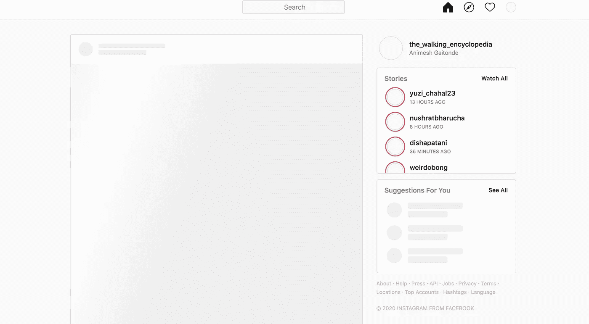
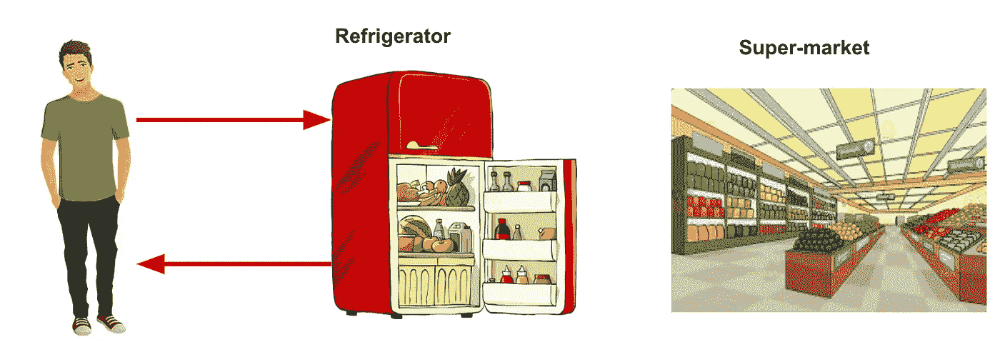
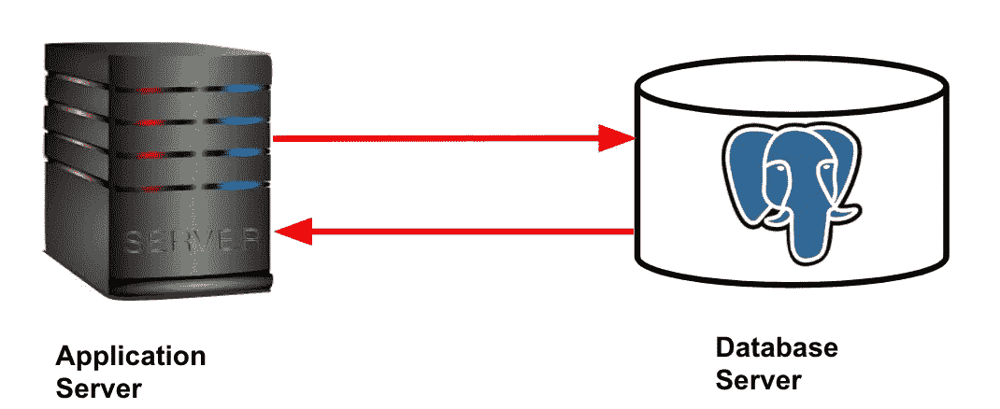
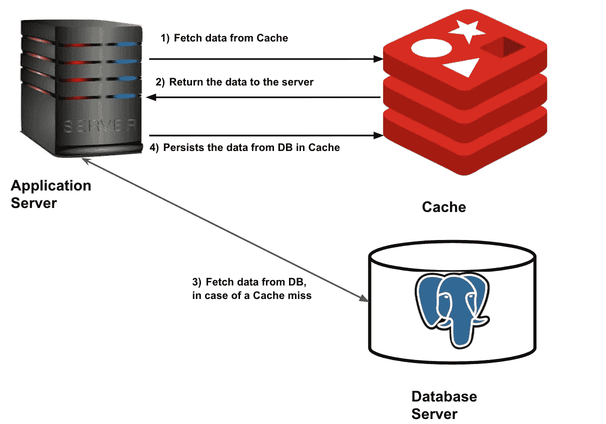
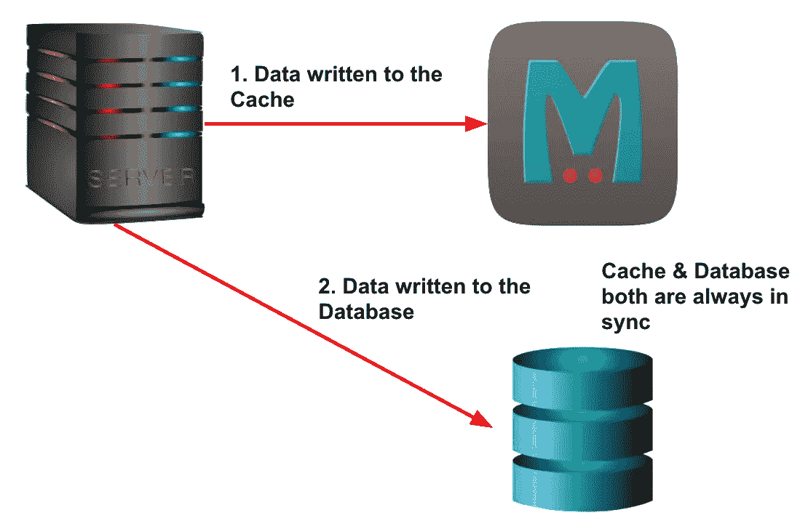
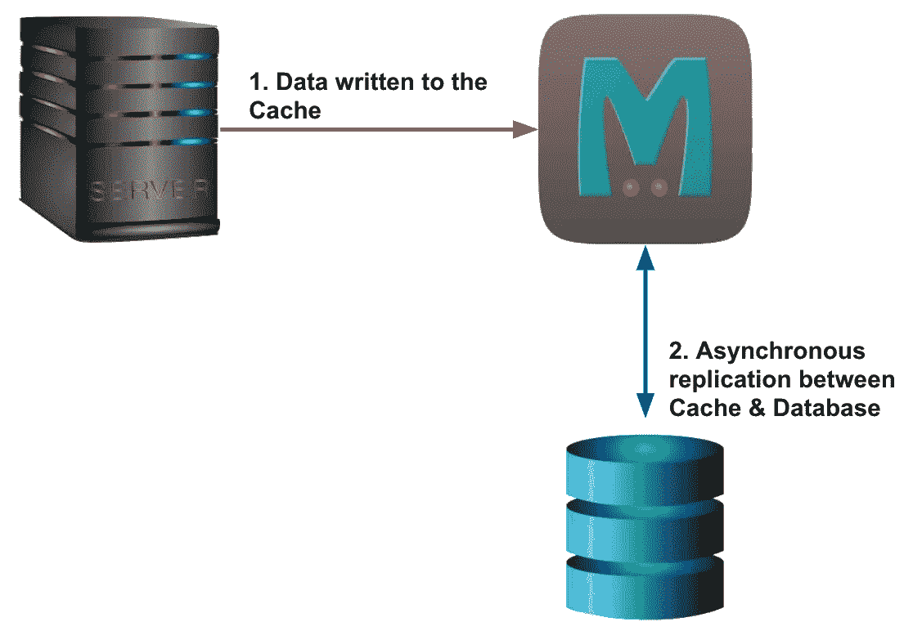
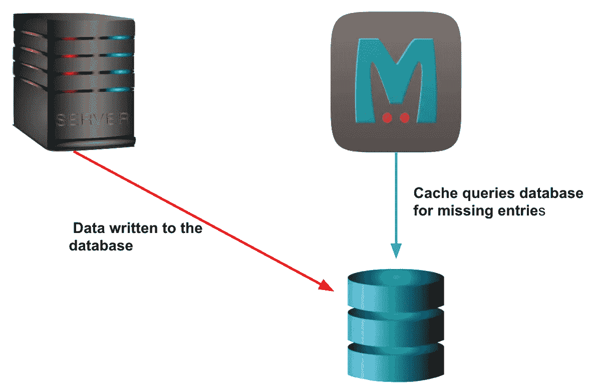

# 关于缓存您需要知道的一切—系统设计

> 原文：<https://levelup.gitconnected.com/everything-you-need-to-know-about-caching-system-design-932a6bdf3334>

介绍、用例、策略和缓存数据的策略

**数据中心**

# 介绍

你有没有注意到，如果你在一个慢速的互联网连接上浏览一个网站，文本在任何高质量的图像之前被加载？但是，在您随后访问同一网站时，您会发现页面呈现速度很快。当你访问一个全新的网站时，它比脸书或亚马逊等经常访问的网站需要更多的时间来加载。你知道为什么会这样吗？答案是 ***缓存*** 。

**慢速互联网连接上的 Instagram 页面**

上图是我的 Instagram 页面在慢速互联网连接下的样子。如您所见，显示了文本数据，而您看不到图像，因为页面仍在呈现。

重要的是向用户提供最佳体验，以提高保留率和参与度。在当今竞争激烈的世界中，企业会因为糟糕的用户体验而受到影响。想象一下，你正在任何视频流媒体网站上观看你最喜欢的电视剧，但视频一直在缓冲。你会留下来继续订阅这样的网站吗？

***缓存*** 的工作原理是“*引用局部性*”。缓存充当数据的本地存储，以加速查找或检索。缓存的主要目标是减少读取延迟并提高任何应用程序的吞吐量。让我们在下一节看一个真实世界的类比。

# 缓存的真实模拟

假设你每天做晚饭。准备食物需要不同的配料、蔬菜、香料等。但是你每天都去超市买这个吗？那太麻烦和费时了。所以，你先检查一下你的厨房或冰箱，以防你已经堆积了你的杂货。这样可以避免去超市的无聊之旅。

**冰箱充当了蔬菜的储藏室**

在这里，你的冰箱就像一个 ***储藏室*** 或者是你蔬菜的本地商店。使用缓存的最大好处是节省时间，你可以快速准备食物。

# 缓存是如何工作的？

后端应用程序通常将数据存储在数据库中。当客户机获取任何数据时，应用程序查询数据库，获取数据，并将其返回给用户。数据库服务器作为一个单独的进程运行，可以在不同于应用服务器的计算机上运行。

**应用服务器从数据库获取数据**

从数据库中读取数据非常耗时，因为它需要一个网络调用和一个 IO 操作来从文件系统中获取数据。如果数据存储在缓存中，读取操作将会非常快。当客户端重复请求相同的数据时，从缓存中获取数据比从数据库中获取数据更有意义。

举个例子:如果一条推文被广泛传播，所有的客户端都会试图获取同一条推文的数据。由于 twitter 拥有数百万用户，使用缓存将节省数百万次数据库调用。

此外，缓存还减少了数据库的负载。如果在缓存中找到数据，将会保存一个数据库调用，从而减轻数据库的压力。简而言之，您可以将缓存视为存储键值对的哈希表。

下图说明了从缓存中读取数据的过程:

**从缓存中读取的过程**

# 缓存的核心概念

## 生存时间

缓存中可以存储的数据量是有限制的。必须清除缓存中应用服务器不再需要的条目。

在网飞的情况下，服务器将在缓存中缓存最常观看或最热门的节目。它不需要存储观众人数随着时间减少的节目。

例如:缓存像《T4 金钱大劫案》这样的电视节目比缓存像《印第安纳琼斯》这样的电影更有意义。

## 驱逐政策

根据应用程序访问数据的方式，缓存可能会在某个时间点变满。因此，我们需要想出一种策略来从缓存中删除数据，并用将来更有可能被访问的数据来替换它。

有多种缓存回收策略，如 LRU(最近最少使用)、LFU(最少使用)、MRU(最近最常使用)。这些策略使用预定义的逻辑从缓存中清除数据。我们将在下一节讨论上述每一个问题。

# LRU(最近最少使用)

该策略从缓存中删除最近最少使用的条目。一旦缓存变满，最近最少使用的条目就会被清除&最近使用的条目会被添加到缓存中。

你可以想象脸书将名人的照片储存在缓存中。追随者的数据访问模式使得他们对最近的照片感兴趣。当缓存变满时，它会将最近最少添加的照片踢出缓存。

# LFU(最不常用)

LFU 跟踪数据项被访问的频率或次数。如果缓存大小超过给定的阈值，它将驱逐频率最低的条目。

当你在发短信的时候输入任何单词，你的手机会开始向你推荐多个单词供你选择，而不是输入整个单词。在内部，你的手机软件保存了你输入的所有单词及其频率的缓存。

**手机软件推荐词语完成**

高速缓存稍后会驱逐出现频率最低的单词。在多个单词之间出现平局的情况下，则最近最少使用的单词被驱逐。在上面的电话例子中，如果你开始使用单词“*特征*”、“*特征*”、“*羽毛*”等，它将停止向你建议单词“壮举”(因为那将被从缓存中驱逐)。

**MRU(最近使用)**

在 MRU 中，最近使用的条目将被删除，而较旧的条目将被优先保留在缓存中。如果数据访问模式使得用户不太可能查看最近的条目，则该策略用于驱逐。让我们看一个例子。

**Tinder 左/右滑动使用 MRU 策略**

像 Tinder 这样的约会应用通常会缓存用户的所有潜在匹配。当用户左刷或右刷一个配置文件时，应用程序不应该再次向用户推荐相同的配置文件。如果出现这种情况，会导致用户体验不佳。

有必要清除最近被观察到的条目。应用程序必须删除被向右或向左滑动的配置文件的缓存条目。

# 缓存类型

# **直写缓存**

顾名思义，数据首先写入缓存，然后写入数据库。这确保了缓存和数据库中数据的一致性。在缓存上完成的每次读取都在最近一次写入之后。

**直写缓存**

然而，这种方法的缺点是应用程序写入延迟增加。这种方法不适合写操作繁重的系统。这对于在数据保存到数据库后频繁重新读取数据的应用程序非常有用。写入延迟可能会受到影响，但较低的读取延迟和一致性可以弥补这一影响。

# **回写缓存**

如上所述，直写式缓存不适用于写入密集型系统，因为延迟可能会激增。另一种方法是首先将数据写入缓存&将数据标记为已修改(稍后在 DB 中更新)。

**回写缓存**

异步作业可以定期读取缓存中所有修改过的条目，并更新它们在数据库中的相应值。这种方法既不会影响读取延迟，也不会影响写入延迟。唯一的缺点是缓存和数据库之间的数据同步会有延迟。由于数据库是事实的来源，任何从数据库中读取的应用程序都会读取陈旧的条目。

Youtube 等网站使用回写缓存来存储任何视频的观看次数。为一个病毒式视频的每一次观看更新数据库将是昂贵的。将数据写入缓存，然后在数据库中同步是一个更好的解决方案。回写高速缓存的使用确保了低读/写延迟。

# **写缓存**

很少有后端应用程序不会频繁地重新读取最新的数据。在这种情况下，使用写回缓存。

**写绕缓存**

在此策略中，数据库在不写入缓存的情况下进行更新。这不会给缓存加载不会被重新读取的数据。如果应用程序开始查询最新数据，将会导致缓存未命中。

# **分布式系统中使用的缓存示例**

以下是开源内存缓存产品列表

*   雷迪斯
*   Memcached
*   VoltDB
*   气塞式 DBS
*   Apache Ignite

# **参考文献**

*   [内存数据库列表](https://en.wikipedia.org/wiki/List_of_in-memory_databases)
*   [什么是缓存？](https://www.cloudflare.com/learning/cdn/what-is-caching/)
*   [分布式缓存](https://en.wikipedia.org/wiki/Distributed_cache)
*   [缓存类型](https://www.geeksforgeeks.org/write-through-and-write-back-in-cache/)
*   [火绒图像](https://www.google.com/url?sa=i&url=http%3A%2F%2Fthebethgold.com%2Fblog%2F%2F14-reasons-i-swipe-left-on-tinder&psig=AOvVaw1GZprwy2qqSSTJlkgkt94E&ust=1586277895582000&source=images&cd=vfe&ved=0CAIQjRxqFwoTCMjEi7Wg1OgCFQAAAAAdAAAAABAD)
*   [封面图片](https://www.arup.com/-/media/arup/images/perspectives/themes/energy/the-data-centre-power-crux/server_computers-istock507748296_2000x1125.jpeg)