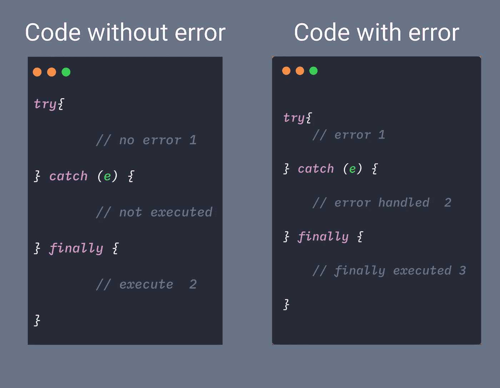

# 关于 Javascript 中的错误处理，您需要知道的一切

> 原文：<https://levelup.gitconnected.com/everything-you-need-to-know-about-error-handling-in-javascript-caa6c066274d>

了解如何在 Javascript 中处理异常。

异常处理是我们可以防止程序在运行时由于某种异常而异常终止的方法。例如

在上述情况下，我们可以通过`**try…catch**`块来处理，而不是终止程序。

*   `try`块内的任何错误都不会导致程序终止。
*   如果在`try`模块内部出现错误，则执行控制转移到`catch`模块。
*   简单来说，`try`检查任何错误，当错误发生时`catch`接收执行控制并能够处理它。之后，程序正常恢复。
*   如果没有错误发生，则跳过`catch`块。

**举例:**

在上面的例子中，如果我们没有通过`**name**`，那么它会导致一个异常，然后这个异常在`catch`块中被处理。

当我们调用函数`**checkName()**` 而不传递`**name**`时:

*   计算长度时出现异常。
*   当异常发生时，不执行`try`块中当前行下的剩余代码。
*   当异常发生时，`catch`模块接收一个错误对象，该对象包含错误的详细信息。

## `**try…catch…finally**`

即使`try`块内没有错误，也总是执行`finally`块。

我们也可以用`try…finally`代替`try..catch`，比如:

**例子**

## 自定义错误

自定义错误意味着抛出我们自己的错误。

`**throw**`操作器产生一个自定义错误。为此，我们需要创建一个错误对象，然后我们可以抛出那个`ErrorObject`。

在 MDN 上阅读 Javascript [中所有可用的`Errors`。](https://developer.mozilla.org/en-US/docs/Web/JavaScript/Reference/Global_Objects/Error)

创建用于引发自定义异常的自定义异常类:

## 再次抛出错误

我们也可以重新抛出在`catch`块中捕获的错误。

想想看，

*   我们用了一个`try…catch`滑轮来抓住`TypeError`
*   但是在类型块内部还发生了另一个程序员不知道的错误。
*   为了处理这种情况，我们可以在`catch`块中重新抛出不期望的错误

## ES10 通过可选的 Catch 绑定修改了错误处理

可选的 catch 绑定允许开发人员在 catch 块中不使用 error 参数的情况下使用 try/catch。

ES2019 之前:

在 ES2019 中:

`try…catch`的一些趣事

1.  无论您在`try`或`catch`块中声明什么变量，外部都无法访问。

2.`try..catch` 同步工作，

如果`setTimeout`中出现异常，那么`try..catch`将不起作用。

上述代码可以转移到

写得这么酷😎文章，我🤷🏻‍♂️referred `MDN`、`Javascript.Info`和`alligator.io`，谢谢🙏对他们来说。

— — — — — - — — — — — — — — — — — — — — — — — — — — — — — -

**在这里学习如何用 Javascript** [截屏](https://medium.com/@jagathishsaravanan/take-screenshot-with-javascript-28e434bded2)

— — — — — — — — — — — — — — — — — — — — — — — — — — — — —

如果你发现这个有用的惊喜🎁我这里[T22](https://www.paypal.me/jagathishSaravanan?source=post_page---------------------------)**。**

如果你觉得快乐，就分享吧😃 😆 🙂。

**跟随** [**Javascript Jeep🚙**](https://medium.com/u/f9ffc26e7e69?source=post_page---------------------------) **如果你觉得值得。**

 [## 学习 JavaScript -最佳 JavaScript 教程(2019) | gitconnected

### JavaScript 是世界上最流行的编程语言之一——它随处可见。JavaScript 是一种…

gitconnected.com](https://gitconnected.com/learn/javascript)