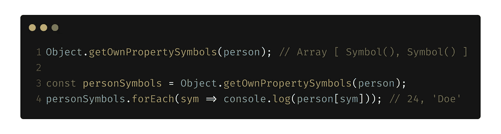

# 关于 JavaScript 符号你需要知道的一切

> 原文：<https://levelup.gitconnected.com/everything-you-need-to-know-about-javascript-symbols-24650a163038>

一个 **JavaScript 符号**是一个相对较新的 JavaScript“特性”。它于 2015 年作为 [ES6](http://es6-features.org) 的一部分推出。在本文中，我将介绍:

1.  JavaScript 符号到底是什么
2.  将数据类型添加到语言中的动机
3.  数据类型是否成功地解决了它应该解决的问题
4.  与其他语言中符号数据类型的区别，例如 Ruby
5.  众所周知的 JavaScript 符号
6.  受益于数据类型

# JavaScript 符号

2015 年，JavaScript 中的原始数据类型阵容中增加了符号。它是 ES6 规范的一部分，其唯一目的是充当对象属性的**唯一标识符，即它可以用作对象中的**键**。你可以**认为**符号是大数字，每次你创建一个符号，一个新的随机数就会产生 *(uuid)* 。您可以使用符号*(随机大数字)*作为对象中的键。**

通过调用 symbol 函数来创建符号，该函数采用一个可选的参数字符串，该字符串仅用于调试目的，并作为符号的描述。Symbol 函数返回唯一的符号值。

注意，符号不是构造函数，不能用 **new** 调用**。**

****

**也可以创建分配给**全局符号注册表**的符号。方法`**Symbol.for()**`和`**Symbol.keyFor()**`帮助创建和读取全局符号注册表中的符号。`**Symbol.for()**`方法在全局符号注册表中查找，并根据是否找到来检索或初始化符号。**

****

**并且`**Symbol.keyFor()**`方法在全局符号注册表中查找符号，如果找到则返回它的键，否则返回`undefined`。可以将全局符号注册表看作一个全局对象，其中键是传递给`**Symbol.for()**`的字符串，值是符号。**

****

**注册到全局符号注册表的符号不仅可以在所有范围内访问，甚至可以跨领域访问。**

# **添加新数据类型的动机**

**添加数据类型的原因之一是在 JavaScript 中启用私有属性。在符号之前，隐私或不变性是通过闭包、代理和其他变通方法解决的。但是所有的解决方案都过于冗长，需要大量的代码和逻辑来实现它们的目的。**

**让我们看看这个符号是如何解决这个问题的。从 symbol 函数返回的每个符号值都是唯一的，可以用作对象属性标识符。这是这个符号的主要目的。**

****

**因为每个符号都是唯一的，而且两个符号不可能彼此相等，所以如果某个符号被用作属性标识符，并且在某个范围内不可用，则不能从该范围访问该属性。**

********

**在全局符号注册表中定义的符号可以用`**Symbol.for()**` 访问，并且将是相同的。**

****

**好吧，所以符号很酷。它们帮助我们制造永远不会重复的独特值，并用它们来*隐藏*属性。但是它们真的解决了隐私问题吗？**

# **符号是否实现了财产隐私？**

**JavaScript 符号**不**实现财产隐私。你不能依靠符号来对你的牌库使用者隐藏某些东西。在名为`**Object.getOwnPropertySymbols()**`的对象类上定义了一个方法，该方法将一个对象作为参数，并返回参数对象的属性符号数组。**

****

**此外，如果将该符号分配给全局符号注册表，则没有任何东西可以停止访问该符号及其属性值。**

# **计算机程序设计中的符号**

**如果你熟悉其他编程语言，你会知道它们也有符号。事实上，即使数据类型的名称相同，它们之间也有相当大的区别。**

**现在让我们从总体上谈谈编程中的符号。维基百科中符号的定义如下:**

> **计算机编程中的符号是一种原始数据类型，其实例具有独特的人可读形式。**

**在 JavaScript 中，symbol 是一种基本的数据类型，虽然该语言并不强制您使实例可读，但是您可以为该符号提供一个调试描述属性。**

**鉴于此，我们应该知道 **JS** 符号和其他语言中的符号有一些区别。让我们来看看 [**红宝石符号**](https://ruby-doc.org/core-2.2.0/Symbol.html) 。在 Ruby 中，通常使用符号对象来表示一些字符串。它们是使用冒号语法生成的，也是通过使用`**to_sym**`方法的类型转换生成的。**

****

**如果你注意到了，我们从来没有把“创建”符号赋给一个变量。如果我们在 Ruby 程序中使用 *(generate)* 一个符号，它将在程序的整个执行过程中一直保持不变，不管它的创建上下文是什么。**

****

**在 JavaScript 中，我们可以通过在全局符号注册表中创建一个符号来复制这种行为。**

**这两种语言中符号的一个主要区别是，在 Ruby 中，符号可以用来代替字符串，事实上，在很多情况下，它们会自动转换成字符串。字符串对象上可用的方法在符号上也可用，正如我们看到的，字符串可以使用`**to_sym**`方法转换成符号。**

**我们已经看到了在 JavaScript 中添加符号的原因和动机，现在让我们看看它们在 Ruby 中的目的是什么。在 Ruby 中，我们可以把符号看作是不可变的字符串，仅此一点就可以带来很多使用它们的好处。它们可以用作对象属性标识符，通常也是如此。**

****

**符号也比字符串有性能优势。每次使用字符串表示法时，都会在内存中创建一个新的对象，而符号总是相同的。**

****

**现在假设我们使用一个字符串作为属性标识符，并创建 100 个该对象。Ruby 还必须创建 100 个不同的字符串对象。这可以通过使用符号来避免。**

**符号的另一个用途是显示状态。例如，函数返回一个符号是一个很好的实践，指示成功状态，如( **:ok** ， **:error** )和结果。**

**在 [Rails](https://rubyonrails.org/) *(一个著名的 Ruby web-app 框架)*中，几乎所有的 [HTTP 状态代码都可以和符号](https://gist.github.com/mlanett/a31c340b132ddefa9cca)一起使用。您可以发送状态 **:ok** 、 **:internal_server_error** 或 **:not_found、**，框架会用正确的状态代码和消息替换它们。**

**最后，我们可以说，在所有编程语言中，符号并不相同，也不具有相同的目的，作为一个已经熟悉 Ruby 符号的人，对我来说，JavaScript 符号和它们的动机有点令人困惑。**

***注:在一些编程语言中(*[*Erlang*](https://www.erlang.org/)*，*[*elixir*](https://elixir-lang.org/)*)，符号被称为一个* [*原子*](https://elixir-lang.org/getting-started/basic-types.html#atoms) *。***

# **众所周知的 JavaScript 符号**

**JavaScript 有一些内置的符号，允许开发者访问一些在符号引入语言之前没有公开的属性。**

**下面是一些众所周知的用于迭代、正则表达式等的 JavaScript 符号。**

## **符号迭代器**

**这个符号允许开发者访问对象的默认迭代器。在`**for…of**`中使用，其值应该是一个发生器函数。**

********

> **`function*() {}`是定义**生成器函数的语法。**生成器函数返回一个生成器对象。**
> 
> **`yield`是用于暂停和恢复发生器功能的关键字。**
> 
> **查看更多关于[发电机功能](https://developer.mozilla.org/en-US/docs/Web/JavaScript/Reference/Statements/function*)和[产量](https://developer.mozilla.org/en-US/docs/Web/JavaScript/Reference/Operators/yield)的信息。**

**对于异步迭代，有 **Symbol.asyncIterator** 供`**for await…of**`循环使用。**

## **符号匹配**

**众所周知，像`**String.prototype.startsWith(), String.prototype.endsWith()**`这样的函数将一个字符串作为它们的第一个参数。**

****

**让我们尝试传递一个正则表达式而不是一个字符串给函数，我们得到一个类型错误。**

****

**实际上，函数会专门检查传递的参数是否是 regexp。我们可以说，通过将一个对象的`**Symbol.match**`属性设置为 **false** 或另一个 false 值，该对象不打算用作 regexp。**

****

**注:老实说，我不知道你为什么要这么做。上面的代码是一个演示如何使用 `*Symbol.match*` *的例子。这看起来像一个黑客，如果像这样使用会有问题，因为它改变了经常使用的函数的行为。我想不出任何使用这个的真实用例。***

# **受益于 JavaScript 符号**

**虽然 JS 符号没有被广泛使用，也没有解决财产隐私问题，但我们仍然可以从中受益。**

**我们可以使用符号在对象上定义一些**元数据**。例如，我们想要创建一个字典，我们将通过向对象添加单词和定义对来实现该字典，出于某些计算原因，我们想要跟踪字典中的单词数。这种情况下的字数可以被认为是元数据。对于用户来说，这并不是一条真正有价值的信息，用户可能不希望在迭代对象时看到它。**

****

**我们可以通过用一个符号来保持单词计数属性来解决这个问题。在这种情况下，我们避免了用户意外访问它的问题。**

****

**使用最多的符号可能是属性名冲突。有时我们在迭代对象属性时获取并设置它们，或者我们使用一个动态值来访问属性*(使用****obj[key]****符号)*结果，意外地改变了我们不想要的属性。所以我们可以通过使用符号作为属性标识符来解决这个问题。在这种情况下，当迭代对象或使用动态值时，我们永远不能停留在那个键上。迭代案例不会发生，因为我们在用`**for…in**`迭代的时候永远不能停留在它们上面**

****

**动态值键的情况不会发生，因为除了某个符号之外，没有其他值等于该符号。**

**当然，像`**Symbol.iterator**`或`**Symbol.asyncIterator**`这样众所周知的符号可以有有趣的用例。**

****

**我介绍了理解 JavaScript 符号概念所需的重要概念和实践。当然，还有更多的内容需要介绍，比如其他众所周知的符号，或者跨领域使用符号的用例，但是我将省略一些有用的材料，介绍 JavaScript 符号的这些和其他部分。**

## **附加材料**

> **[JavaScript 符号 MDN](https://developer.mozilla.org/en-US/docs/Web/JavaScript/Reference/Global_Objects/Symbol)**
> 
> **[ES6 符号 tc39wiki](http://tc39wiki.calculist.org/es6/symbols/)**
> 
> **[JS 符号 exploringjs.com](https://exploringjs.com/es6/ch_symbols.html)**
> 
> **[JS 领域堆栈溢出](https://stackoverflow.com/questions/49832187/how-to-understand-js-realms)**
> 
> **[符号(编程)百科](https://en.wikipedia.org/wiki/Symbol_(programming))**
> 
> **[红宝石符号](https://ruby-doc.org/core-2.2.0/Symbol.html)**